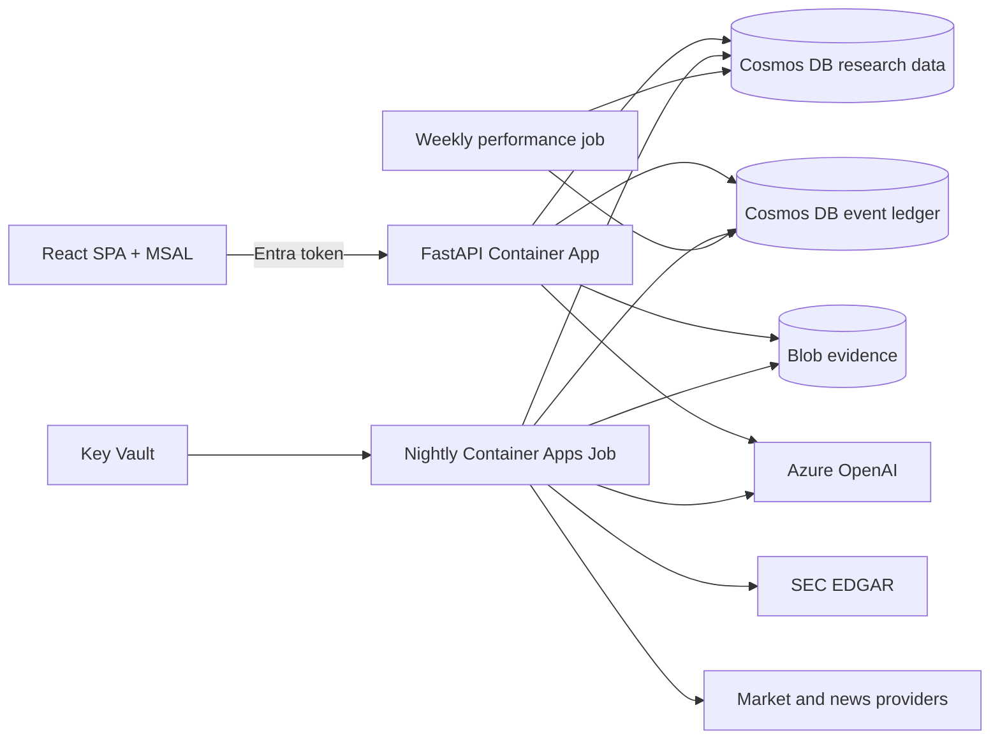

# Auspex

> **AI reads. Deterministic code scores and applies policy. AI explains. A human decides.**

Auspex is a Microsoft technology MVP that demonstrates how generative AI can
support financial research in a highly regulated environment without giving the
model control of scoring, portfolio policy, or trade execution.

It is a reference implementation, not a Microsoft product, broker, investment
service, or guarantee of performance. It produces directional research for a
single authenticated owner. It never connects to a broker and never executes a
trade.

## Why this MVP matters

Banks and regulated firms need more than a capable model. They need evidence,
repeatability, access control, auditability, policy enforcement and clear human
accountability. Auspex separates those responsibilities:

1. **AI reads** filings and news into constrained, versioned evidence.
2. **Code scores** six deterministic research legs using point-in-time data.
3. **Policy gates** decide whether a research signal is actionable for the
   current portfolio and investor profile.
4. **AI explains** stored facts, scores and policy traces with citations.
5. **The user acts** outside Auspex.

This design makes the model useful without making it the system of record or
the decision authority.

## What Auspex does

- Maintains a configured research universe of 104 securities and peer cohorts.
- Ingests prices, SEC filings, XBRL/IFRS facts, Form 4 transactions and news.
- Stores 36 months of raw history and extracts/scores an 18-month window.
- Computes a peer-relative Auspex Score from six deterministic legs.
- Applies investor, portfolio, coverage, valuation, cost and cash-reserve gates.
- Produces portfolio-aware BUY, ADD, TRIM and SELL suggestions when every
  required gate passes.
- Keeps an append-only, event-sourced portfolio ledger with correction and void
  events.
- Provides grounded company analysis, evidence, filings, news and conversation.
- Measures score and recommendation performance over time.

## Research logic

### Six scoring legs

| Leg | What it measures |
| --- | --- |
| Thesis Linkage | Whether current evidence supports configured investment themes |
| Attention Acceleration | Whether material company evidence is increasing |
| Narrative Premium | Whether the narrative is improving faster than fundamentals |
| Smart Money | Qualifying insider buying and selling for domestic filers |
| Fundamental Health | Growth, margin, cash generation, balance sheet and ROIC |
| Valuation Brake | Relative EV/Sales, EV/EBITDA and FCF yield pressure |

The **Auspex Score (0–100)** is a percentile rank inside the active peer scope.
It is not a probability and it is not an absolute valuation.

### Score versus action

A high score creates a research candidate. An action appears only after
deterministic gates check:

- data coverage and freshness;
- peer-group confidence;
- valuation and score direction;
- investor risk profile;
- current position and target weight;
- CHF cash reserve;
- minimum executable trade and estimated costs.

`HOLD_NO_ACTION` is not presented as a trade recommendation.

## Architecture



| Concern | Implementation |
| --- | --- |
| Web/API | React, TypeScript and FastAPI in one immutable container |
| Scheduled compute | Azure Container Apps Jobs |
| Operational state | Azure Cosmos DB for NoSQL |
| Portfolio source of truth | Separate event-ledger Cosmos account by default |
| Raw evidence | Azure Blob Storage |
| AI | Azure OpenAI GPT-4.1-mini and GPT-4.1 deployments |
| Identity | Microsoft Entra single-tenant SPA/API registration |
| Workload access | System-assigned managed identities and data-plane RBAC |
| Network | Private endpoints for data, Key Vault and Azure OpenAI |
| Observability | Log Analytics, Application Insights, alerts and budget |
| Infrastructure | Bicep orchestrated by Azure Developer CLI |

The detailed current-state design is in
[doc/auspex-arc42.md](doc/auspex-arc42.md).

## Repository layout

```text
config/             Universe, cohorts, scoring, policy, fees and ledger mapping
doc/                Current Arc42 architecture and bank-readiness guidance
infra/              Tenant-neutral Bicep modules and AZD parameter mapping
prompts/            Versioned extraction, narrative, planning and answer prompts
scripts/            AZD setup and post-provision Entra configuration
src/auspex/         Python domain, pipeline, persistence and API
tests/              Unit, integration, property and golden tests
web/                React/TypeScript/Vite frontend
azure.yaml          Azure Developer CLI project definition
Dockerfile          Reproducible API/job image
```

## Prerequisites

- Python 3.12
- Node.js 22
- Docker
- Azure CLI
- Azure Developer CLI (`azd`)
- An Azure subscription where you can create role assignments, private
  endpoints, Cosmos DB, Container Apps, Key Vault and Azure OpenAI deployments
- Microsoft Graph permission to create/update your own app registration
- Alpha Vantage and Finnhub API keys
- GPT-4.1-mini and GPT-4.1 model availability/quota in the selected region

## Deploy to your Azure tenant

### 1. Sign in

```powershell
az login
azd auth login
```

### 2. Configure an AZD environment

PowerShell:

```powershell
.\scripts\configure-azd.ps1 -EnvironmentName dev
```

macOS/Linux:

```bash
sh ./scripts/configure-azd.sh dev
```

The setup script:

- creates or reuses a single-tenant Entra app registration;
- records the signed-in user's object ID as the portfolio owner;
- stores deployment values in the ignored AZD environment;
- prompts securely for provider API keys;
- configures safe capacity and budget defaults.

Public PyPI is the default package source. Microsoft-managed devices can use the
approved Central Feed Services proxy without changing repository defaults:

```powershell
.\scripts\configure-azd.ps1 `
  -EnvironmentName dev `
  -PypiIndexUrl https://packagefeedproxy.microsoft.io/pypi/simple
```

The value is passed to Docker as `PIP_INDEX_URL`. It affects only that AZD
environment; other users continue to use `https://pypi.org/simple`.

Review the values before provisioning:

```powershell
azd env get-values
```

### 3. Provision and deploy

```powershell
azd up
```

`azd up` provisions the Bicep architecture, builds the Docker image, deploys the
API and jobs, and adds the deployed HTTPS URL to the Entra SPA redirect URIs.

### 4. Run the one-time bootstrap

The safety gate is deliberately two-phase. Start once without confirmation; it
logs the mapped sample and binding summary, then exits before ingestion:

```powershell
$resourceGroup = azd env get-value AZURE_RESOURCE_GROUP
$job = azd env get-value SERVICE_PIPELINE_NAME

az containerapp job start `
  --resource-group $resourceGroup `
  --name $job `
  --args bootstrap
```

Review that failed execution's logs. Confirm only when owner, holdings, cash and
unmapped-ticker results are correct:

```powershell
az containerapp job update `
  --resource-group $resourceGroup `
  --name $job `
  --set-env-vars AUSPEX_CONFIRM_PORTFOLIO_BINDING=true

try {
  az containerapp job start `
    --resource-group $resourceGroup `
    --name $job `
    --args bootstrap
}
finally {
  az containerapp job update `
    --resource-group $resourceGroup `
    --name $job `
    --remove-env-vars AUSPEX_CONFIRM_PORTFOLIO_BINDING
}
```

The bootstrap is idempotent and resumable. At a 200K TPM extraction quota it
normally takes several hours.

### Reusing existing resources

The default creates a new Key Vault and event-ledger Cosmos account. Advanced
deployments can set these AZD values before `azd up`:

```powershell
azd env set AUSPEX_EXISTING_KEY_VAULT_NAME <vault-name>
azd env set AUSPEX_EXISTING_KEY_VAULT_RESOURCE_GROUP <resource-group>
azd env set AUSPEX_EXISTING_LEDGER_ACCOUNT_NAME <cosmos-account>
azd env set AUSPEX_EXISTING_LEDGER_RESOURCE_GROUP <resource-group>
azd env set AUSPEX_LEDGER_DATABASE_NAME <database>
```

An existing Key Vault must have `enableRbacAuthorization=true`. Access-policy
vaults are rejected by the post-provision check because workload access is
defined exclusively through least-privilege Azure RBAC.

The external ledger must contain:

- `portfolio_transactions`, partitioned by `/owner_user_sk`;
- optionally `app_users`, partitioned by `/id`, for imported identity mappings.

For non-interactive GitHub deployments, the workflow authenticates both Azure
CLI and Azure Developer CLI. The federated deployment identity must
be allowed to update the configured Entra application (for example through app
ownership or an approved Microsoft Graph application-management permission).
This is required so the post-provision hook can register the deployed HTTPS
redirect URI. Set `AUSPEX_MANAGE_ENTRA_REDIRECT_URI=false` only when the URI is
managed by a separate identity-governance process. Historical bootstrap is
intentionally a separate, reviewed operation; the deployment workflow never
sets the portfolio-binding confirmation automatically.

## Local development

### Backend

```powershell
python -m venv .venv
.\.venv\Scripts\Activate.ps1
python -m pip install --upgrade pip
pip install -e ".[dev]"
python -m pytest
python -m auspex serve --host 127.0.0.1 --port 8080
```

### Frontend

```powershell
npm ci --prefix web
npm run lint --prefix web
npm run build --prefix web
npm run dev --prefix web
```

For isolated UI work only:

```powershell
$env:VITE_DEV_BYPASS_AUTH = "true"
npm run dev --prefix web
```

The backend development bypass must never be enabled in a deployed environment.

## Validation

```powershell
python -m pytest
python -m ruff check src tests
npm run lint --prefix web
npm run build --prefix web
az bicep build --file infra\main.bicep
az bicep lint --file infra\main.bicep
docker build -t auspex:local .
```

## Security and data handling

- Only `/healthz` and `/auth-config.json` are unauthenticated.
- Every `/api/*` route validates issuer, audience and signature.
- Azure services use managed identity; local authentication is disabled.
- Provider keys are Key Vault secrets and never application settings.
- Data and AI services use private endpoints.
- The portfolio ledger is append-only; edits and deletes are correction/void
  events.
- LLM output cannot directly set numeric scores, policy thresholds or trades.
- Prompts, taxonomies, weights and model deployments are versioned.
- Conversation history expires after 15 days.

## Regulatory boundary

Auspex is an MVP for directional research and human decision support. A bank
must complete its own legal classification, model risk, suitability, privacy,
outsourcing, resilience and supervisory controls before production use. The
high-level production gap is documented in the final section of
[doc/auspex-arc42.md](doc/auspex-arc42.md).

## License

MIT. See [LICENSE](LICENSE).
