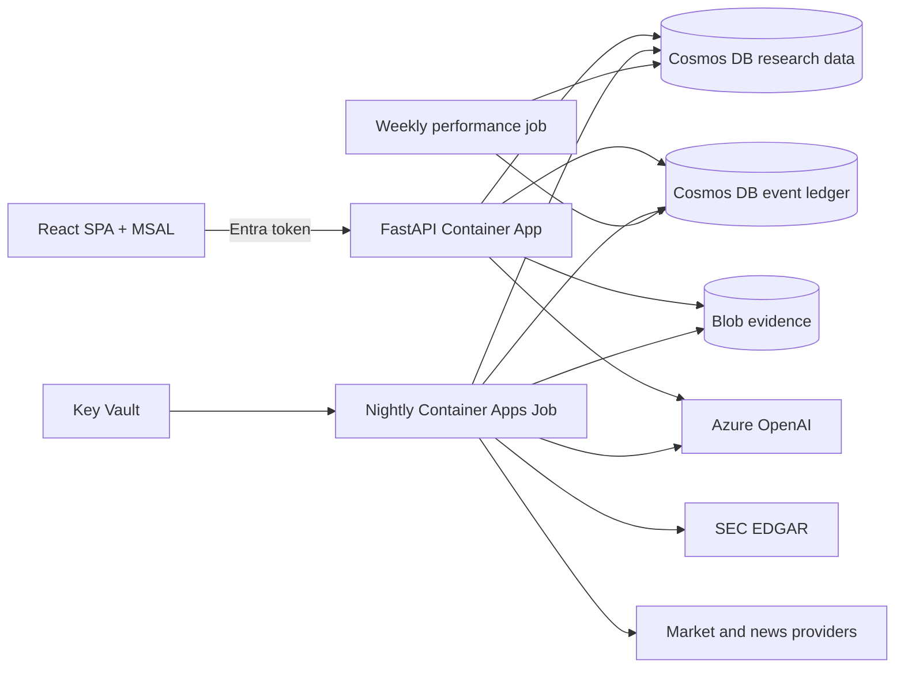

# Auspex

> **AI reads. Deterministic code scores and applies policy. AI explains. A human decides.**

Auspex is a Microsoft technology MVP that demonstrates how generative AI can
support financial research in a highly regulated environment without giving the
model control of scoring, portfolio policy, or trade execution.

It is a reference implementation, not a Microsoft product, broker, investment
service, or guarantee of performance. It produces directional research for
approved, individually partitioned users. It never connects to a broker and
never executes a trade.

## Why this MVP matters

Banks and regulated firms need more than a capable model. They need evidence,
repeatability, access control, auditability, policy enforcement and clear human
accountability. Auspex separates those responsibilities:

1. **AI reads** filings and news into constrained, versioned evidence.
2. **Code scores** six deterministic research legs using point-in-time data.
3. **Policy gates** decide whether a research signal is actionable for the
   current portfolio and investor profile.
4. **AI explains** stored facts, scores and policy traces with citations.
5. **The user acts** outside Auspex.

This design makes the model useful without making it the system of record or
the decision authority.

## What Auspex does

- Maintains a configured research universe of 104 securities and peer cohorts.
- Ingests prices, SEC filings, XBRL/IFRS facts, Form 4 transactions and news.
- Validates corporate actions and quarantines unjustified adjusted-price
  discontinuities before they can enter scores or performance labels.
- Stores 36 months of raw history and extracts/scores an 18-month window.
- Computes a peer-relative Auspex Score from six deterministic legs.
- Applies investor, portfolio, coverage, valuation, cost and cash-reserve gates.
- Produces portfolio-aware BUY, ADD, TRIM and SELL suggestions when every
  required gate passes.
- Keeps an append-only, event-sourced portfolio ledger with correction and void
  events.
- Provides grounded company analysis, evidence, filings, news and conversation.
- Measures score and recommendation performance over time.
- Reports confidence intervals, effective sample size, robust/cost-adjusted
  spreads, turnover, drawdown, and benchmark comparisons.

## Research logic

### Six scoring legs

| Leg | What it measures |
| --- | --- |
| Thesis Linkage | Whether current evidence supports configured investment themes |
| Attention Acceleration | Whether material company evidence is increasing |
| Narrative Premium | Whether the narrative is improving faster than fundamentals |
| Smart Money | Qualifying insider buying and selling for domestic filers |
| Fundamental Health | Growth, margin, cash generation, balance sheet and ROIC |
| Valuation Brake | Relative EV/Sales, EV/EBITDA and FCF yield pressure |

Fundamental sub-metrics are normalized before combination, attention counts one
event per source document, missing applicable legs contribute a neutral zero
with confidence reported separately, and small cohorts shrink continuously
toward their parent/universe rather than switching populations abruptly.
Non-USD valuation uses only authoritative point-in-time FX; when a rate is
unavailable the leg is structurally excluded instead of penalizing coverage.

The **Auspex Score (0–100)** is a midpoint percentile rank inside the blended
peer scope. It is not a probability and it is not an absolute valuation.

### Score versus action

A high score creates a research candidate. An action appears only after
deterministic gates check:

- data coverage and freshness;
- peer-group confidence;
- valuation and score direction;
- investor risk profile;
- current position and target weight;
- one shared executable cash budget across every BUY/ADD candidate;
- CHF cash reserve;
- minimum executable trade and estimated costs.

`HOLD_NO_ACTION` is not presented as a trade recommendation.

Candidate actions are evaluated first, then BUY/ADD candidates share one CHF
cash budget so the published set is jointly executable. A fuller risk-aware
allocation evaluates horizon, objective, position/cohort concentration,
date-aligned correlation, volatility, liquidity and turnover limits. That
allocation is stored privately as a shadow challenger; it cannot replace the
production allocation until held-out, point-in-time, post-cost promotion gates
pass.

### Market-data repair and shadow validation

Before replaying a new scoring version:

```powershell
python -m auspex engine-baseline-export --label v4.1.0
python -m auspex market-data-diagnose --json
python -m auspex market-data-repair --dry-run --json
python -m auspex market-data-repair --json
python -m auspex bootstrap-recover --replay-all
python -m auspex shadow
```

Repair manifests are append-only in `config_versions`. Raw provider OHLCV,
split and dividend observations are not rewritten; only derived adjustment
fields and quarantine metadata can change. `shadow` is read-only unless
`--publish` is explicitly supplied.

## Architecture



| Concern | Implementation |
| --- | --- |
| Web/API | React, TypeScript and FastAPI in one immutable container |
| Scheduled compute | Azure Container Apps Jobs |
| Operational state | Azure Cosmos DB for NoSQL |
| Portfolio source of truth | Separate event-ledger Cosmos account by default |
| Raw evidence | Azure Blob Storage |
| AI | Azure OpenAI GPT-4.1-mini and GPT-4.1 deployments |
| Identity | Microsoft Entra workforce or External ID SPA/API registration |
| Workload access | System-assigned managed identities and data-plane RBAC |
| Network | Private endpoints for data, Key Vault and Azure OpenAI |
| Observability | Log Analytics, Application Insights, alerts and budget |
| Infrastructure | Bicep orchestrated by Azure Developer CLI |

The detailed current-state design is in
[doc/auspex-arc42.md](doc/auspex-arc42.md).

Private API requests, onboarding/registration writes, administrator lifecycle
mutations, per-user nightly work and private weekly attribution hold an
ETag-protected lease on the authoritative user record. Account deletion
acquires that same lease before switching the user to `DELETION_PENDING`, so
no in-flight request or job can recreate data after the verified purge.
Long-running work renews the lease with ETag compare-and-swap and is cancelled
fail-closed if ownership or renewal is lost.
Administrator-removal operations are independently serialized through the
singleton authority record, preserving the last-admin invariant across
multiple API replicas.

## Repository layout

```text
config/             Universe, cohorts, scoring, policy, fees and ledger mapping
doc/                Current Arc42 architecture and bank-readiness guidance
infra/              Tenant-neutral Bicep modules and AZD parameter mapping
prompts/            Versioned extraction, narrative, planning and answer prompts
scripts/            AZD setup and post-provision Entra configuration
src/auspex/         Python domain, pipeline, persistence and API
tests/              Unit, integration, property and golden tests
web/                React/TypeScript/Vite frontend
azure.yaml          Azure Developer CLI project definition
Dockerfile          Reproducible API/job image
```

## Prerequisites

- Python 3.12
- Node.js 22
- Docker
- Azure CLI
- Azure Developer CLI (`azd`)
- An Azure subscription where you can create role assignments, private
  endpoints, Cosmos DB, Container Apps, Key Vault and Azure OpenAI deployments
- Microsoft Graph permission to create/update your own app registration
- Alpha Vantage and Finnhub API keys
- GPT-4.1-mini and GPT-4.1 model availability/quota in the selected region

## Deploy to your Azure tenant

### 1. Sign in

```powershell
az login
azd auth login
```

### 2. Configure an AZD environment

PowerShell:

```powershell
.\scripts\configure-azd.ps1 -EnvironmentName dev
```

macOS/Linux:

```bash
sh ./scripts/configure-azd.sh dev
```

The setup script:

- creates or reuses a single-tenant Entra app registration;
- records the signed-in user's object ID as the pre-existing portfolio owner,
  which pins that owner's historical ledger partition;
- stores deployment values in the ignored AZD environment;
- prompts securely for provider API keys;
- configures safe capacity and budget defaults.

### Identity: who can sign in

Auspex authenticates against a Microsoft Entra tenant. **Which kind of tenant
you point it at decides who can ever have an account.**

| | Workforce tenant (default) | External tenant (Microsoft Entra External ID) |
| --- | --- | --- |
| Who can sign in | Members and B2B guests of your organisation | Anyone, via self-service sign-up |
| Personal Gmail / Outlook | Only by inviting each person as a guest | Yes — that is the point |
| Authority host | `login.microsoftonline.com` | `<subdomain>.ciamlogin.com` |
| Created by | Your existing Azure AD tenant | A separate directory you create once |

If friends are going to sign up with personal addresses, **use an external
tenant**. A workforce tenant technically works via B2B guest invitations, but
every person must be invited individually and appears as a guest object in
your organisation's directory.

#### External tenant setup (one-time, outside this repo)

An external tenant is a *directory*, not an ARM resource, so it cannot be
created by Bicep or `azd` — Bicep here only consumes the resulting IDs. Do
this once in the Microsoft Entra admin center:

1. **Create the external tenant.** Entra admin center → *Identity* → *Overview*
   → *Manage tenants* → *Create* → choose **External**. Note its **tenant ID**
   and **subdomain** (the `contoso` in `contoso.ciamlogin.com`).
2. **Register the app** *in that tenant*: *App registrations* → *New
   registration* → single-page application, redirect URI
   `http://localhost:5173`. Note the **application (client) ID**. Add the
   deployed API URL as a second SPA redirect URI after the first `azd up`.
3. **Create a sign-up/sign-in user flow**: *External Identities* → *User
   flows* → *New user flow*. Add **Email with password** and/or **Email
   one-time passcode**, then **associate the application** with the flow.
   Without this association, sign-up silently fails.
4. **Enable the identity providers you want**: email one-time passcode covers
   any address including Gmail; add **Google** federation if you want the
   Google button. (Google federation requires a Google client ID/secret
   configured in the tenant.)
5. **Return the email claim**: in the user flow's *User attributes*, ensure
   **Email Address** is collected. For the configured trusted CIAM issuer,
   Auspex accepts that sign-up identity as the first-admin email proof; a
   workforce tenant instead bootstraps by immutable owner object ID.

Then point the environment at it:

```powershell
.\scripts\configure-azd.ps1 -EnvironmentName dev -AuthTenantType external
# prompts for tenant ID, subdomain and client ID
```

or set them directly:

```powershell
azd env set AUSPEX_AUTH_TENANT_TYPE external
azd env set AUSPEX_AUTH_TENANT_ID <external-tenant-id>
azd env set AUSPEX_AUTH_TENANT_SUBDOMAIN <subdomain>
azd env set AUSPEX_AUTH_CLIENT_ID <client-id-registered-in-that-tenant>
```

The API derives the authority, issuer, JWKS and OpenID metadata URL from
those three values, and at runtime reads the **authoritative** issuer and
signing keys from the tenant's own OpenID configuration document — so a
tenant that issues the `.onmicrosoft.com` authority form instead of the
tenant-id form still works without any change. Every derived value can also
be overridden if needed:

| Variable | Purpose |
| --- | --- |
| `AUSPEX_AUTH_AUTHORITY` | Explicit authority URL |
| `AUSPEX_AUTH_ISSUER` | Explicit `iss` value to trust |
| `AUSPEX_AUTH_JWKS_URL` | Explicit signing-key endpoint |
| `AUSPEX_AUTH_OPENID_CONFIGURATION_URL` | Explicit metadata document |
| `AUSPEX_AUTH_API_SCOPE` | Scope the SPA requests, e.g. `api://<client-id>/Auspex.Access` |

The SPA needs no rebuild: `/auth-config.json` serves the client ID, authority,
`known_authorities` (required for MSAL to accept a `ciamlogin.com` host) and
the API scope at runtime.

#### Migrating an existing deployment to an external tenant

Moving tenants changes the token issuer *and* gives each person a new object
ID in the new directory. Two settings make that survivable:

```powershell
# Keep the previous owner's tokens valid during the cutover. Every issuer is
# bound to its own signing keys and audience. Clear all legacy values when the
# move is done.
azd env set AUSPEX_AUTH_LEGACY_ISSUER https://login.microsoftonline.com/<old-tenant-id>/v2.0
azd env set AUSPEX_AUTH_LEGACY_JWKS_URL https://login.microsoftonline.com/<old-tenant-id>/discovery/v2.0/keys
azd env set AUSPEX_AUTH_LEGACY_AUDIENCE <old-application-client-id>
azd env set AUSPEX_OWNER_LEGACY_OBJECT_ID <owner-object-id-in-the-OLD-tenant>
```

Tokens are always verified against the keys and audience of *their own*
issuer, so a legacy issuer can never be used to accept a token minted
elsewhere. Only the configured old owner object ID aliases to the new owner
account; all other users must re-register under their new immutable identity.

Because a user's data partition is derived from their Entra object ID, the
pre-existing production owner would otherwise land on an empty ledger under
their new identity. Pin their historical partition once:

```powershell
azd env set AUSPEX_OWNER_OBJECT_ID <the-owner-object-id-in-the-NEW-tenant>
azd env set AUSPEX_OWNER_LEDGER_PARTITION_KEY <the-existing-owner_user_sk>
```

The override applies only to that one principal, at registration, and only
when their object ID matches `AUSPEX_OWNER_OBJECT_ID`; everyone else is
partitioned by their own derived ID.

Before enabling the multi-user lifecycle on an existing single-owner
deployment, seed that owner as the active administrator with the new image:

```powershell
python -m auspex migrate-multi-user
```

The command is idempotent, requires both owner settings above plus
`AUSPEX_INITIAL_ADMIN_EMAIL`, and refuses to activate a different principal.

### First administrator

`AUSPEX_INITIAL_ADMIN_EMAIL` is required and names the first administrator so a
new deployment has somebody who can approve everyone else. For this deployment,
set it to `fsodano79@gmail.com`.

It is consulted **only while no administrator exists**. The first principal to
register with that verified email becomes an administrator, and authority is
then bound permanently to their immutable Entra object ID — changing the
setting afterwards grants nothing. Every other principal registers as
`PENDING_APPROVAL` and can reach nothing but their own status until an
administrator approves them.

Public PyPI is the default package source. Microsoft-managed devices can use the
approved Central Feed Services proxy without changing repository defaults:

```powershell
.\scripts\configure-azd.ps1 `
  -EnvironmentName dev `
  -PypiIndexUrl https://packagefeedproxy.microsoft.io/pypi/simple
```

The value is passed to Docker as `PIP_INDEX_URL`. It affects only that AZD
environment; other users continue to use `https://pypi.org/simple`.

Review the values before provisioning:

```powershell
azd env get-values
```

### 3. Provision and deploy

```powershell
azd up
```

`azd up` provisions the Bicep architecture, builds the Docker image, deploys the
API and jobs, and adds the deployed HTTPS URL to the Entra SPA redirect URIs.

### 4. Run the one-time bootstrap

The safety gate is deliberately two-phase. Start once without confirmation; it
logs the mapped sample and binding summary, then exits before ingestion:

```powershell
$resourceGroup = azd env get-value AZURE_RESOURCE_GROUP
$job = azd env get-value SERVICE_PIPELINE_NAME

az containerapp job start `
  --resource-group $resourceGroup `
  --name $job `
  --args bootstrap
```

Review that failed execution's logs. Confirm only when owner, holdings, cash and
unmapped-ticker results are correct:

```powershell
az containerapp job update `
  --resource-group $resourceGroup `
  --name $job `
  --set-env-vars AUSPEX_CONFIRM_PORTFOLIO_BINDING=true

try {
  az containerapp job start `
    --resource-group $resourceGroup `
    --name $job `
    --args bootstrap
}
finally {
  az containerapp job update `
    --resource-group $resourceGroup `
    --name $job `
    --remove-env-vars AUSPEX_CONFIRM_PORTFOLIO_BINDING
}
```

The bootstrap is idempotent and resumable. At a 200K TPM extraction quota it
normally takes several hours.

### Reusing existing resources

The default creates a new Key Vault and event-ledger Cosmos account. Advanced
deployments can set these AZD values before `azd up`:

```powershell
azd env set AUSPEX_EXISTING_KEY_VAULT_NAME <vault-name>
azd env set AUSPEX_EXISTING_KEY_VAULT_RESOURCE_GROUP <resource-group>
azd env set AUSPEX_EXISTING_LEDGER_ACCOUNT_NAME <cosmos-account>
azd env set AUSPEX_EXISTING_LEDGER_RESOURCE_GROUP <resource-group>
azd env set AUSPEX_LEDGER_DATABASE_NAME <database>
```

An existing Key Vault must have `enableRbacAuthorization=true`. Access-policy
vaults are rejected by the post-provision check because workload access is
defined exclusively through least-privilege Azure RBAC.

An in-place upgrade can also preserve the names and managed identities of an
earlier Auspex deployment. Set the legacy-name switch and explicitly identify
the four environment-derived resources before `azd up`:

```powershell
azd env set AUSPEX_PRESERVE_LEGACY_RESOURCE_NAMES true
azd env set AUSPEX_PRIMARY_COSMOS_ACCOUNT_NAME <primary-cosmos-account>
azd env set AUSPEX_STORAGE_ACCOUNT_NAME <blob-storage-account>
azd env set AUSPEX_REGISTRY_NAME <container-registry>
azd env set AUSPEX_OPENAI_ACCOUNT_NAME <azure-openai-account>
```

Fresh deployments leave these values empty and use environment-qualified
resource names. Explicit overrides prevent an upgrade from accidentally
creating parallel data, registry or model resources when an older deployment
used a different suffix formula.

The external ledger must contain:

- `portfolio_transactions`, partitioned by `/owner_user_sk`;
- optionally `app_users`, partitioned by `/id`, for imported identity mappings.

For non-interactive GitHub deployments, the workflow authenticates both Azure
CLI and Azure Developer CLI. The federated deployment identity must
be allowed to update the configured Entra application (for example through app
ownership or an approved Microsoft Graph application-management permission).
This is required so the post-provision hook can register the deployed HTTPS
redirect URI. Set `AUSPEX_MANAGE_ENTRA_REDIRECT_URI=false` only when the URI is
managed by a separate identity-governance process. Historical bootstrap is
intentionally a separate, reviewed operation; the deployment workflow never
sets the portfolio-binding confirmation automatically.

## Local development

### Backend

```powershell
python -m venv .venv
.\.venv\Scripts\Activate.ps1
python -m pip install --upgrade pip
pip install -e ".[dev]"
python -m pytest
python -m auspex serve --host 127.0.0.1 --port 8080
```

### Frontend

```powershell
npm ci --prefix web
npm run lint --prefix web
npm run build --prefix web
npm run dev --prefix web
```

For isolated UI work only:

```powershell
$env:VITE_DEV_BYPASS_AUTH = "true"
npm run dev --prefix web
```

The backend development bypass must never be enabled in a deployed environment.

## Validation

```powershell
python -m pytest
python -m ruff check src tests
npm run lint --prefix web
npm run build --prefix web
az bicep build --file infra\main.bicep
az bicep lint --file infra\main.bicep
docker build -t auspex:local .
```

## Security and data handling

- Only `/healthz` and `/auth-config.json` are unauthenticated.
- Every `/api/*` route validates issuer, audience and signature.
- Azure services use managed identity; local authentication is disabled.
- Provider keys are Key Vault secrets and never application settings.
- Data and AI services use private endpoints.
- The portfolio ledger is append-only; edits and deletes are correction/void
  events.
- LLM output cannot directly set numeric scores, policy thresholds or trades.
- Prompts, taxonomies, weights and model deployments are versioned.
- Conversation history expires after 15 days.

## Regulatory boundary

Auspex is an MVP for directional research and human decision support. A bank
must complete its own legal classification, model risk, suitability, privacy,
outsourcing, resilience and supervisory controls before production use. The
high-level production gap is documented in the final section of
[doc/auspex-arc42.md](doc/auspex-arc42.md).

## License

MIT. See [LICENSE](LICENSE).
