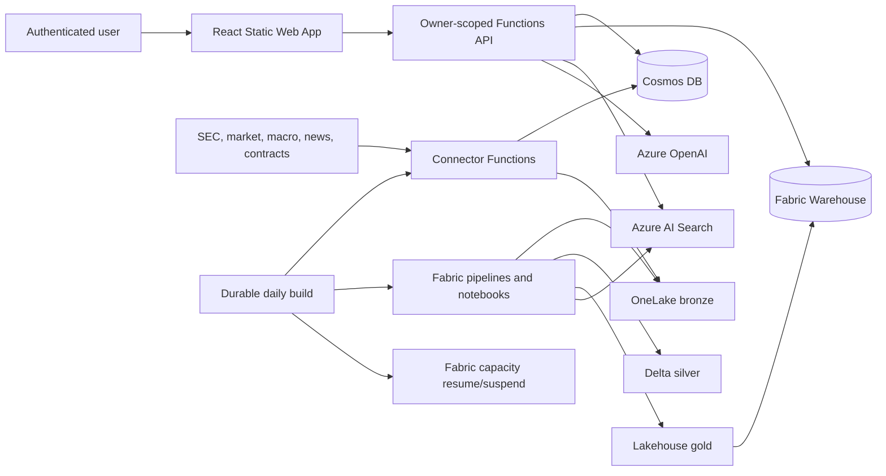
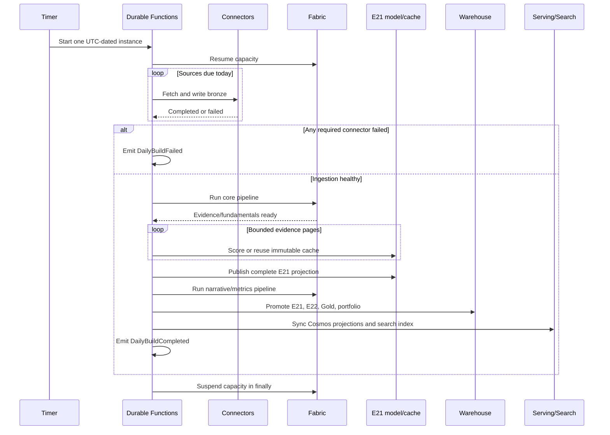
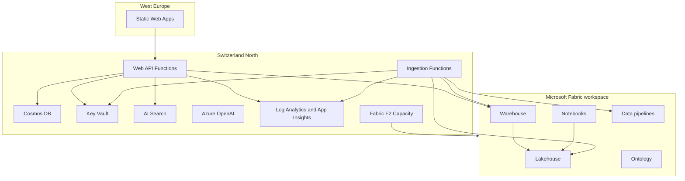

# Auspex Architecture

This document follows the arc42 structure and describes the deployable system represented by this repository. Deployment-specific identifiers, hostnames, credentials, run evidence, and local operating state are intentionally excluded.

## 1. Introduction And Goals

Auspex is a multi-user personal financial research application for stocks and ETFs. It collects public market and regulatory information, produces point-in-time quantitative and narrative features, ranks opportunities, values a manual portfolio in a configurable **base currency (default USD)**, and presents evidence-backed advisory actions.

Auspex is advisory only. It does not execute trades, connect to brokers or banks, hold funds, or move money.

### Quality goals

1. **Point-in-time correctness:** no feature or recommendation may use information unavailable at its requested as-of date.
2. **Owner isolation:** one user cannot read or mutate another user's profile, ledger, portfolio, discussion, or recommendation state.
3. **Replay convergence:** rerunning ingestion, transformation, or publication produces the same effective state without duplicate business facts.
4. **Evidence grounding:** every explanation links to retrievable evidence and communicates coverage gaps.
5. **Operational cost control:** Microsoft Fabric F2 capacity is active only around scheduled builds and deployments.
6. **Portable deployment:** tracked source contains no tenant, subscription, workspace, item, endpoint, user, or secret binding.

### Stakeholders

- Individual investors use the application for research and manual portfolio tracking.
- Operators provision Azure/Fabric, configure sources, monitor builds, and handle recovery.
- Developers add connectors, transformations, metrics, policies, and user workflows.
- Security and compliance reviewers verify isolation, identity, data retention, and advisory boundaries.

## 2. Constraints

- Azure first-party services only.
- Microsoft Fabric is the analytical data platform.
- Azure resources use Switzerland North where the service is available.
- Processing is scheduled batch only; no streaming is required.
- Azure infrastructure is Bicep; Fabric items use Fabric Git definitions and REST deployment.
- Python 3.12 is used for Functions and domain services; PySpark for Fabric transforms; T-SQL for Warehouse; React and TypeScript for the SPA.
- Raw records are preserved as NDJSON in bronze, normalized to Delta in silver, and served as Warehouse star-schema tables/views in gold.
- Timestamps are UTC. Monetary analytics normalize through `fact_fx_rate`; portfolio valuation defaults to USD while retaining other supported base currencies.
- SEC 13F `knowledge_date` is the filing date, never the reporting quarter end.

## 3. Context And Scope



### External interfaces

- SEC EDGAR: Form 4, 13F, 13D/G, 8-K, S-1, company facts, and N-PORT.
- Market and news providers: prices, benchmark prices, fundamentals, FX, ETF holdings, and company news.
- Public macro/contract sources: official macro series and USASpending contract awards.
- Microsoft identity platform: personal Microsoft account authentication through Static Web Apps custom authentication.
- Azure management and Fabric REST APIs: capacity operations, item deployment, job scheduling, and workspace role assignment.

## 4. Solution Strategy

### Medallion and control planes

The data plane is `bronze -> silver -> gold`. The operational control plane in Cosmos DB stores source configuration, watermarks, run logs, deduplication markers, model caches, serving projections, and owner-scoped application data.

Each connector implements a common contract: read watermark, fetch a bounded source window, calculate a schema-versioned deterministic batch ID, check deduplication, write the untouched raw envelope to bronze, record the run, and advance the watermark only after the write succeeds.

### Deterministic analytics

PySpark notebooks parse and deduplicate source records, resolve securities/entities, enforce data-quality gates, calculate factors, and publish immutable snapshot manifests. Warehouse stored procedures validate row counts/fingerprints and replace serving snapshots transactionally.

Recommendation policy is deterministic. Azure OpenAI extracts bounded narrative features and generates grounded explanations, but it does not control ranking, suitability, transaction state, or execution.

### Isolation by construction

The API resolves the authenticated principal to an immutable `owner_user_sk`. Per-user repositories expose only methods that require owner scope. Cosmos ledger rows share an owner partition key so parent transactions and linked cost rows can be committed atomically. Shared market/evidence data remains outside owner partitions.

## 5. Building Blocks

### 5.1 Ingestion Functions

`connectors/` contains one connector per source and shared infrastructure for HTTP retry, source registry, watermarking, envelope creation, bronze writes, and deterministic identity. Azure Functions expose bounded manual triggers and the Durable daily orchestration.

The daily schedule selects sources by declared cadence. Daily Alpha Vantage work uses `news_daily` and `macro_daily`; weekly and quarterly profiles run only when due. A failed required connector aborts downstream publication.

### 5.2 OneLake And Fabric Notebooks

The canonical bronze path is:

```text
bronze/{source_id}/{yyyy}/{mm}/{dd}/{batch_id}.ndjson
```

Silver Delta tables include insider transactions, prices, filings, ownership events, contracts, macro data, fundamentals, FX, ETF holdings, and owner-scoped portfolio projections. Delta `MERGE` operations use natural keys and correction semantics.

Gold uses dimensions (`dim_security`, `dim_date`, `dim_entity`, `dim_source`) and facts/views for market features, evidence, fundamental anchors, narrative intensity/premium, opportunity scores, and portfolio state.

### 5.3 Warehouse

`fabric/warehouse/` defines serving dimensions, facts, metric views, metadata, and promotion procedures. Promotion contracts reconcile completed Lakehouse manifests before making a snapshot visible. E22 release promotion combines narrative premium and full Gold promotion under one audited transaction; portfolio promotion is replay-safe and owner preserving.

### 5.4 Ledger v5

A logical broker event is an atomic bundle:

- One parent row for deposit, withdrawal, buy, sell, dividend, interest, tax, fee, split, transfer, or correction.
- Zero or more linked `FEE` rows categorized as broker commission, transaction tax, withholding tax, VAT, custody fee, account fee, or other fee.
- Source/listing currency, settlement currency, source amount, gross settlement amount, actual FX rate, and signed net cash are retained separately.
- Imported opening acquisition costs can affect tax basis without debiting current cash.
- Corrections append replacement state and cascade to linked children; history is never rewritten.

Cosmos transactional batches enforce bundle atomicity and a ledger revision document provides optimistic concurrency.

### 5.5 Web API

`api/` exposes authenticated profile, universe, ledger, portfolio, recommendation, evidence, and discussion operations. It reads shared analytical state from Warehouse/Search and owner state from Cosmos. Every mutation validates owner scope, payload bounds, currencies, transaction relationships, and correction rules.

### 5.6 Web Application

`web/` is a React SPA deployed to Azure Static Web Apps. It provides candidate ranking, evidence, portfolio summaries, a broker-style ledger editor, recommendations, settings, and grounded discussion. The ledger UI supports settlement/source FX and repeatable categorized costs on both buys and sells.

### 5.7 Search And Agent

`search/` builds a hybrid/vector evidence index with deterministic document IDs and revisions. E21 uses a versioned prompt and immutable Cosmos cache to extract sentiment, relevance, forward-promise ratio, hype density, themes, and supporting excerpts. The extraction projection must reconcile every current news document before publication.

`agent/` retrieves point-in-time evidence and narrates deterministic policy output. Missing or failed evidence produces an explicit degraded response rather than an unsupported claim.

### 5.8 Infrastructure And Delivery

`infra/` provisions resource groups, Functions Flex Consumption apps, Cosmos DB serverless, Key Vault, Azure AI Search, Azure OpenAI, monitoring, networking, Static Web Apps, and Fabric F2 capacity. Managed identities and least-privilege roles replace account keys.

`.github/workflows/ci.yml` validates Python, frontend, and Bicep. `.github/workflows/deploy.yml` uses GitHub workload identity federation, grants the ingestion identity Fabric Contributor access, deploys all application/Fabric/Warehouse layers, narrows Cosmos roles, and guards capacity with an always-run suspension step.

## 6. Runtime View

### Daily build



The state machine serializes publication boundaries. Pipeline polling uses Durable timers, not blocking sleeps. Narrative page cursors must advance. Warehouse release IDs are deterministic by date and an existing successful release is treated as idempotent completion.

### Ledger write

1. API resolves the authenticated owner and validates the parent plus cost components.
2. Deterministic component IDs are derived from the parent ID and ordinal.
3. Repository validates projected cash, units, correction relationships, and ledger revision.
4. Cosmos commits parent, children, and revision in one owner-partition transactional batch.
5. Fabric derives effective rows and excludes superseded parent/children during the next publication.

### Point-in-time query

1. Caller supplies or receives a bounded as-of date.
2. Shared facts filter `event_date <= as_of` and `knowledge_date <= as_of`.
3. Snapshot manifests select only completed generations.
4. Owner facts additionally filter `owner_user_sk`.
5. Evidence retrieval uses the same security/date scope as the deterministic recommendation.

## 7. Deployment View



Fabric workspace, Lakehouse, and Warehouse are tenant items and therefore deployment prerequisites. Tracked definitions carry public placeholders; deployment injects workspace/Lakehouse bindings and the SEC contact. Local overrides are ignored by Git.

## 8. Cross-Cutting Concepts

### Identity and secrets

- Functions use system-assigned managed identities.
- GitHub Actions uses OIDC federation; no Azure client secret is required.
- Source credentials and the Static Web Apps auth secret are Key Vault-backed.
- Fabric workspace roles are assigned through the Fabric REST API; capacity control uses Azure RBAC.
- Cosmos data-plane roles are narrowed separately for ingestion and web identities.

### PIT and knowledge time

`event_date` answers when an event happened. `knowledge_date` answers when Auspex could first know it. Both are mandatory where the distinction matters. Corrections and amended filings preserve their own knowledge time. Feature and recommendation queries never select a row with future knowledge.

### Idempotency and immutable identity

Bronze batch IDs include schema version. Silver uses natural-key `MERGE`. Model cache keys include document revision, model version, and prompt version. Serving generations include deterministic fingerprints. Warehouse promotion audit IDs prevent duplicate releases while allowing safe retry after a lost response.

### Data quality

Parse errors and semantic violations enter explicit quarantine/audit tables. Required-source freshness and completeness gates run before destructive publication. Missing prices, FX, evidence, or narrative coverage produces pending/partial/withheld states rather than fabricated values.

### Observability

Functions send traces and exceptions to Application Insights. Daily activities emit `CapacityResumed`, `CapacitySuspended`, `DailyBuildCompleted`, `DailyBuildFailed`, and `RequiredConnectorFailed` messages. Alerts detect failure, a missing UTC completion, and capacity remaining active beyond four hours.

### Currency

Cash and portfolio values preserve transaction currency and actual settlement conversion. Shared analytics use USD normalization through `fact_fx_rate`. User profile base currency supports USD, CHF, and EUR; USD is the default. Unsupported or missing FX produces an explicit incomplete valuation.

## 9. Architecture Decisions

| Decision | Rationale | Consequence |
| --- | --- | --- |
| Fabric medallion architecture | Native Azure analytical platform and auditable batch lineage | Fabric workspace items require a separate deployment API |
| Durable Functions orchestration | Replay-safe long-running workflow and nonblocking polling | Orchestrator code must remain deterministic |
| Cosmos owner partition | Atomic ledger bundles and structural tenant isolation | Cross-owner operations are intentionally absent |
| Append-only ledger corrections | Auditability and broker-style history | Effective-state derivation is required downstream |
| Deterministic policy plus model narration | Recommendations remain testable and bounded | Generated prose cannot override policy |
| Explicit knowledge time | Prevents look-ahead in filings and delayed data | Every transform/query must preserve PIT fields |
| Pausable F2 capacity | Controls MVP cost | Build and deployment paths must guarantee suspension |
| Deployment-time Fabric binding | Public repository remains reusable | Deployment requires workspace/Lakehouse identifiers and access |

## 10. Quality Requirements

- Replaying a successful connector window does not create a second business batch.
- A failed bronze write does not advance its watermark.
- A failed required connector cannot trigger serving publication.
- Capacity suspension is requested after resume failure and after every downstream failure.
- A user-scoped repository cannot be called without `owner_user_sk`.
- Parent and linked ledger costs either all commit or none commit.
- Corrected rows and their linked children are excluded from effective position/cash state.
- Recommendation and explanation evidence is PIT-safe and revision matched.
- A Warehouse promotion reconciles manifest fingerprints and source/target counts before commit.
- The complete Python suite, frontend lint/build/audit, and Bicep compile must pass before deployment.

## 11. Risks And Technical Debt

- Market/news free tiers have licensing and rate limits; commercial use requires provider review and potentially paid plans.
- Yahoo price fallback is unofficial and disabled by default.
- Fabric workspace creation is not covered by Bicep and remains a prerequisite.
- Static Web Apps is outside Switzerland North because of regional availability.
- Private endpoints and WAF are outside MVP scope; production exposure must be reviewed against organizational policy.
- Ledger data must be populated by users or an approved import process; Auspex does not infer broker history.
- A second authenticated-user acceptance run is required before declaring a particular production tenant's isolation configuration operationally accepted.

## 12. Glossary

| Term | Meaning |
| --- | --- |
| PIT | Point in time; state constrained by event and knowledge dates |
| RAGS | Risk-adjusted growth score used by deterministic ranking |
| E21 | Immutable narrative feature extraction and intensity stage |
| E22 | Narrative premium, evidence decision log, and release stage |
| Serving projection | Versioned JSON projection synchronized into Cosmos or Search |
| Ledger bundle | One parent transaction plus zero or more linked categorized cost rows |
| Promotion | Validated replacement of a completed Lakehouse snapshot in Warehouse |
