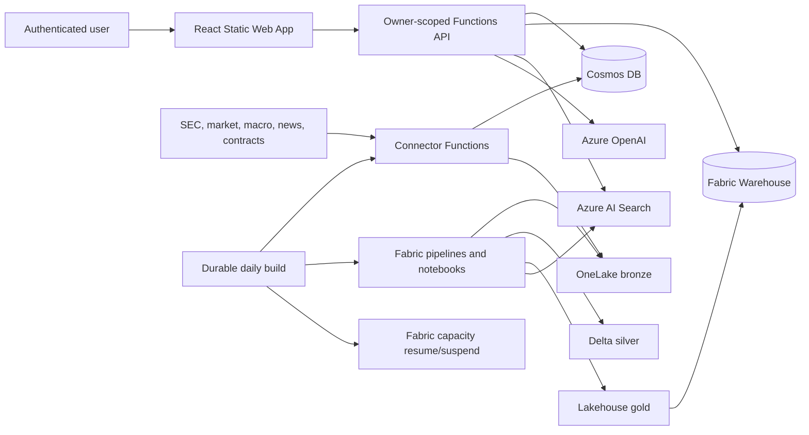
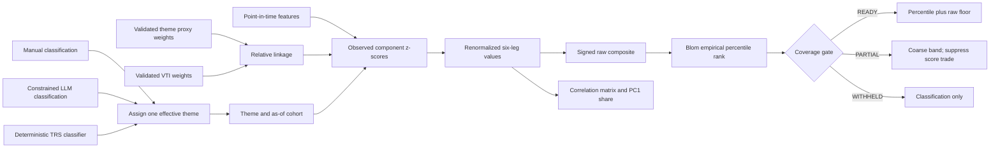
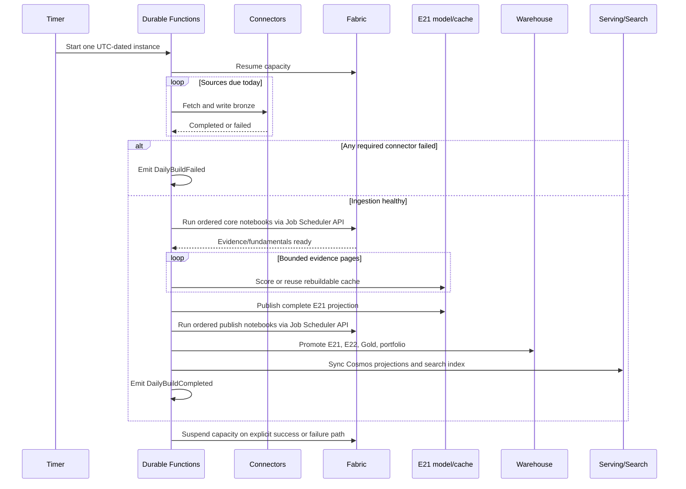
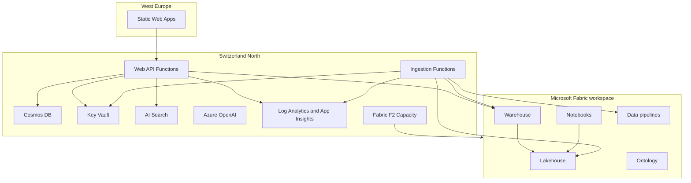

# Auspex Architecture

This document follows the arc42 structure and defines the target architecture for the engine rework. `doc/engine-incongruences.md` records where the pre-rework implementation differs and what Phase 2 replaces. Deployment-specific identifiers, hostnames, credentials, run evidence, and local operating state are intentionally excluded.

## 1. Introduction And Goals

Auspex is a multi-user MVP financial research application for stocks and ETFs. It collects public market and regulatory information, produces point-in-time quantitative and narrative features, ranks securities relative to thematic peer cohorts, values a manual portfolio in a configurable **base currency (default USD)**, and presents evidence-backed advisory actions.

Auspex is advisory only. It does not execute trades, connect to brokers or banks, hold funds, or move money.

The Opportunity Score is a peer-relative percentile paired with a signed raw composite. It is not an absolute estimate of quality, fair value, probability of success, or expected return. A value such as `90` means that the six-leg composite ranks at approximately the 90th percentile of the assigned theme cohort on that as-of date. It does not mean a 90% return probability. Recommendation policy additionally requires a positive raw composite, so a weak cohort can produce no score-driven increases even when it still has high percentile ranks.

### Quality goals

1. **Point-in-time correctness:** no feature or recommendation may use information unavailable at its requested as-of date.
2. **Owner isolation:** one user cannot read or mutate another user's profile, ledger, portfolio, discussion, or recommendation state.
3. **Rebuildability:** Bronze is retained, current Silver/Gold state is regenerable, and rerunning publication converges without duplicate business facts.
4. **Evidence grounding:** every explanation links to retrievable evidence and communicates coverage gaps.
5. **Operational cost control:** Microsoft Fabric F2 capacity is active only around scheduled builds and deployments.
6. **Portable deployment:** tracked source contains no tenant, subscription, workspace, item, endpoint, user, or secret binding.

### Stakeholders

- Individual investors use the application for research and manual portfolio tracking.
- Operators provision Azure/Fabric, configure sources, monitor builds, and handle recovery.
- Developers add connectors, transformations, metrics, policies, and user workflows.
- Security and compliance reviewers verify isolation, identity, data handling, and advisory boundaries.

## 2. Constraints

- Azure first-party services only.
- Microsoft Fabric is the analytical data platform.
- Azure resources use Switzerland North where the service is available.
- Processing is scheduled batch only; no streaming is required.
- The old Opportunity Score is replaced in place. No compatibility shim, dual score path, feature flag, or version-gated fallback is permitted.
- Bronze NDJSON is retained. Silver and Gold may be dropped and rebuilt without migrations. Cosmos owner-scoped ledger data must not be changed or lost.
- Immutable score history, longitudinal model ledgers, replay-identical historical score facts, and audit-only analytical machinery are not requirements.
- Point-in-time correctness, owner isolation, deterministic policy, connector watermarking, and guaranteed Fabric suspension remain requirements.
- Azure infrastructure is Bicep; Fabric items use Fabric Git definitions and REST deployment.
- Python 3.12 is used for Functions and domain services; PySpark for Fabric transforms; T-SQL for Warehouse; React and TypeScript for the SPA.
- Raw records are preserved as NDJSON in bronze, normalized to Delta in silver, and served as Warehouse star-schema tables/views in gold.
- Timestamps are UTC. Monetary analytics normalize through `fact_fx_rate`; portfolio valuation defaults to USD while retaining other supported base currencies.
- SEC 13F `knowledge_date` is the filing date, never the reporting quarter end.

## 3. Context And Scope



### External interfaces

- SEC EDGAR: Form 4, 13F, 13D/G, 8-K, S-1, company facts, and N-PORT.
- Market and news providers: prices, benchmark prices, fundamentals, FX, ETF holdings, and company news.
- Public macro/contract sources: official macro series and USASpending contract awards.
- Microsoft identity platform: personal Microsoft account authentication through Static Web Apps custom authentication.
- Azure management and Fabric REST APIs: capacity operations, item deployment, job scheduling, and workspace role assignment.

## 4. Solution Strategy

### Medallion and control planes

The data plane is `bronze -> silver -> gold`. The operational control plane in Cosmos DB stores source configuration, watermarks, run logs, deduplication markers, model caches, serving projections, and owner-scoped application data.

Each connector implements a common contract: read watermark, fetch a bounded source window, calculate a schema-versioned deterministic batch ID, check deduplication, write the untouched raw envelope to bronze, record the run, and advance the watermark only after the write succeeds.

### Deterministic analytics

PySpark notebooks parse and deduplicate source records, resolve securities/entities, enforce data-quality gates, and calculate factors. Warehouse stored procedures validate the current build and replace serving snapshots transactionally. Bronze is the rebuild source; Silver and Gold do not form an immutable historical ledger.

Recommendation policy is deterministic. Azure OpenAI extracts bounded narrative features and generates grounded explanations, but it does not control ranking, suitability, transaction state, or execution.

Theme classification has three explicit provenance levels. Point-in-time manual classifications have first priority, constrained LLM classifications have second priority, and a deterministic TRS classifier is the fallback. Classification assigns exactly one cohort; it does not create, delete, or substitute a quantitative linkage observation. Linkage is measured independently from validated theme-proxy and broad-market holdings for manual, LLM, and TRS classifications alike. LLM classifications are sensors rather than authoritative decisions: they use an allowlisted theme catalog, are capped at `0.85` confidence, record provenance, and cannot override a manual row.

### Isolation by construction

The API resolves the authenticated principal to an immutable `owner_user_sk`. Per-user repositories expose only methods that require owner scope. Cosmos ledger rows share an owner partition key so parent transactions and linked cost rows can be committed atomically. Shared market/evidence data remains outside owner partitions.

## 5. Building Blocks

### 5.1 Ingestion Functions

`connectors/` contains one connector per source and shared infrastructure for HTTP retry, source registry, watermarking, envelope creation, bronze writes, and deterministic identity. Azure Functions expose bounded manual triggers and the Durable daily orchestration. The ordered notebook sequences are mirrored in `connectors/shared/notebook_pipelines.json`; tests require exact parity with the deployable Fabric pipeline manifest.

The daily schedule selects sources by declared cadence. Daily Alpha Vantage work uses `news_daily` and `macro_daily`; weekly and quarterly profiles run only when due. Alpha Vantage profile limits are promoted to Durable page checkpoints. Price and SEC Company Facts ingestion are paged at 50 symbols; SEC archive enrichment is paged at 50 filings. Durable checkpoints between pages; the watermark advances only after the final complete page. A short or provider-error page fails closed. A failed required connector aborts downstream publication.

### 5.2 OneLake And Fabric Notebooks

The canonical bronze path is:

```text
bronze/{source_id}/{yyyy}/{mm}/{dd}/{batch_id}.ndjson
```

Silver Delta tables include insider transactions, prices, filings, ownership events, contracts, macro data, fundamentals, FX, ETF holdings, and owner-scoped portfolio projections. Delta `MERGE` operations use natural keys and correction semantics.

Gold uses dimensions (`dim_security`, `dim_date`, `dim_entity`, `dim_source`) and facts/views for market features, evidence, fundamental anchors, narrative intensity/premium, opportunity scores, and portfolio state.

#### 5.2.1 Theme classification, cohort construction, and linkage

The scoring unit is `(theme_id, security_sk, as_of)`. A security is assigned to exactly one effective theme before scoring. The target theme catalog and proxy ETFs are:

| Theme | Proxy or blend | Purpose |
| --- | --- | --- |
| `ai_compute_semiconductors` | SMH | AI compute and semiconductor supply chain |
| `enterprise_technology` | XLK | Broad enterprise technology |
| `energy_security_producers` | XLE | Energy security and producers |
| `healthcare` | XLV | Healthcare |
| `data_center_buildout` | 50% DTCR, 25% PAVE, 25% GRID | Data-center facilities, power, cooling, connectivity, and construction |
| `quantum_computing` | QTUM | Quantum computing hardware, software, and enabling systems |

VTI is the configured broad-market reference for linkage normalization. QTUM, VTI, and the other proxy holdings use the governed `etf_holdings` source on its weekly cadence. Proxy and reference holdings are source observations, not semantic truth sets. Notebook 05 validates complete component snapshots, resolves constituent tickers point in time, normalizes weights within each ETF, applies configured theme blends, and publishes `fact_theme_membership` plus a distinct broad-reference membership. Cash, futures, unresolved instruments, incomplete snapshots, and conflicting weights are excluded or quarantined. The latest complete snapshot known by the score date is eligible only while it meets the source-registry freshness contract. An incomplete current snapshot never replaces the last complete one; if no fresh complete snapshot exists, required-source validation fails the build rather than silently shrinking the cohort.

`security_theme_classification` stores `classification_id`, `security_sk`, `theme_id`, `provenance`, `confidence`, `rationale`, effective dates, version, and update time. For each security/date, Notebook 04 selects one active classification in this order:

1. `manual`, then highest confidence, newest update, and deterministic ID.
2. `llm`, then highest confidence, newest update, and deterministic ID.
3. A deterministic TRS classification if no active manual or LLM row exists. It selects the strongest normalized proxy membership. Equal weights are resolved by ascending lexicographic `theme_id`. This assignment happens before scoring and cannot depend on an Opportunity Score outcome.

The selected classification determines cohort membership only. Explicit classification does not remove ETF observations and does not force linkage to null. After assignment, the thesis-linkage leg independently looks up the security in the assigned theme blend and VTI reference. The current `manual_v1` seed classifies the ten portfolio holdings with confidence `1.0` and a recorded rationale. It is effective from 4 August 2026. A new classification is required when the business model or taxonomy changes; historical classification retention is not a score-history requirement.

| Ticker | Manual theme | Recorded rationale |
| --- | --- | --- |
| AMD | `data_center_buildout` | Compute accelerators used in data-center infrastructure |
| AVGO | `data_center_buildout` | Networking and custom silicon used in data centers |
| CAMT | `ai_compute_semiconductors` | Semiconductor inspection and metrology equipment |
| COHR | `data_center_buildout` | Optical communications components used in data-center interconnects |
| INTC | `data_center_buildout` | Data-center processors, accelerators, and platform infrastructure |
| MRVL | `data_center_buildout` | Data-center connectivity, switching, and custom silicon |
| NVDA | `ai_compute_semiconductors` | AI accelerators and compute platforms |
| PLTR | `enterprise_technology` | Enterprise data and software platform |
| RGTI | `quantum_computing` | Quantum processors and cloud quantum-computing systems |
| VRT | `data_center_buildout` | Power, cooling, and infrastructure for data centers |

The six themes in the table above are the complete classifier allowlist. The second classifier path operates only for portfolio securities without an active manual or valid LLM classification. It obtains the latest SEC 10-K Item 1 or 20-F Item 4 business section, sends only that bounded text and the allowlist to Azure OpenAI, validates an exact JSON schema, and caps model-reported confidence at `0.85` before persistence. It records the annual filing accession and description hash in Bronze and writes `provenance = llm`. Invalid output, unsupported themes, short/unextractable descriptions, missing filings, or source errors result in no LLM classification rather than a guess. A persisted confidence above `0.85` is invalid and fails promotion. Notebook 05 revalidates security identity, theme allowlist, confidence, dates, and provenance before Gold merge.

This design separates **classification**, **linkage**, and **score coverage**. A security can display a theme while linkage is missing or its numeric score is withheld. Manual or LLM provenance does not itself prevent `READY`: a manually classified security with both proxy and reference weights can be complete. A classification with no measurable linkage is `PARTIAL`; a cohort below the minimum is `WITHHELD`. Registering QTUM as the quantum TRS proxy is required so quantum classifications are not permanently confined to a one-security cohort.

#### 5.2.2 Fundamental anchor and narrative models

The E20 fundamental anchor estimates whether valuation multiples are stretched relative to sector peers after controlling for business fundamentals. It considers positive EV/Sales, EV/EBITDA, and price/free-cash-flow multiples. For each as-of date and sector:

- Inputs are winsorized at the 1st and 99th percentiles.
- Regressors are revenue growth, gross margin, profit margin, net debt/EBITDA, free-cash-flow yield, and cash-burn flag.
- Missing regressors are median-imputed and recorded in `imputed_flags`.
- With enough peers and residual degrees of freedom, a Huber robust regression is fitted. Otherwise a peer-percentile fallback is used.
- Standardized residuals from available multiples are averaged into `anchor_residual`, then standardized across the as-of population as `fundamental_anchor_z`.
- A positive anchor means valuation is richer than the fitted peer expectation. The Opportunity Score reverses its direction in the valuation-brake leg, so richer valuation lowers the composite.

The E21 narrative model is separate from the six-leg score. Azure OpenAI extracts bounded JSON from evidence excerpts: sentiment, relevance, forward-promise ratio, hype density, up to five normalized themes, and exact evidence indexes. A revision/model/prompt cache avoids repeated extraction but may be rebuilt from retained evidence.

Narrative intensity is deterministic after extraction. Its supported components and weights are sentiment strength `10%`, sentiment-velocity strength `10%`, theme concentration `15%`, forward-promise ratio `25%`, hype density `20%`, news attention `15%`, and insider divergence `5%`. Available weights are renormalized. Intensity is withheld with fewer than three extracted documents or less than `0.50` available weight. Unsupported management-reality-gap, revision-dispersion, and options-skew inputs are disclosed as coverage reasons rather than silently synthesized.

E22 narrative premium asks a different question: whether narrative intensity covaries with the fundamental anchor across an eligible cohort. It requires at least eight eligible securities, a common component mask, nonzero intensity and anchor variance, and a positive fitted beta. It publishes the fitted premium, unexplained residual, divergence state, evidence pack, and current fit context. Narrative premium is visible beside Opportunity Score but is not one of the six Opportunity Score contributions.

#### 5.2.3 Opportunity Score: target six-leg method

The sole target engine contract is `opportunity_v1` with current weight set `balanced_v1`. It replaces `e6b_v2` and `e6b_balanced_v1` outright; those retired identifiers are not compatibility contracts. The identifiers describe the current build configuration and never select an old code path. The target keeps the six interpretable leg names and provisional allocation below until a separate backtest justifies changing weights. Financing remains a policy filter rather than being squeezed into the existing 100%. The minimum cohort is eight securities.



| Leg | Weight | Target inputs | Direction and interpretation |
| --- | ---: | --- | --- |
| Thesis linkage | 20% | $\log(w_{theme}/w_{VTI})$ for positive, point-in-time weights | Higher theme weight relative to broad-market weight means stronger size-neutral linkage. Classification provenance does not alter the measurement. Missing either weight makes the leg unavailable. |
| Attention acceleration | 15% | Current 30-day news count versus the immediately preceding 30 days | Higher within-security attention change raises the leg after cohort standardization. It measures change, not absolute coverage or sentiment. |
| Smart money | 20% | 90-day insider net-buy ratio, 30-day insider cluster buys, quarter-over-quarter institutional flow, new institutional initiations, log-transformed trailing 90-day contract awards, activist 13D flag | Available ownership and award signals are combined with renormalized weights. Missing observations are not zero activity. |
| Fundamental health | 20% | Profit margin, year-over-year revenue growth, free-cash-flow yield, inverse net debt/EBITDA | Higher profitability, growth, cash generation, and lower leverage raise the leg. |
| Valuation brake | 15% | Inverse `fundamental_anchor_z` | Richer-than-expected peer valuation lowers the composite. |
| Crowding and positioning | 10% | Inverse quarter-over-quarter change in institutional holder count | A decline in distinct active institutional holders raises the under-recognition leg. The level of holder count and news volume are not reused here. |

The target calculation is:

1. Preserve nulls from source through the engine. Absence is not converted to numeric zero or `false`.
2. Apply the documented direction and transform to observed values. Winsorize observed cohort values at the 1st and 99th percentiles and calculate a sample z-score from observed values only.
3. Each multi-input leg has configured subcomponent weights. For security $i$, sum the weights of observed components and require at least `0.50` of the configured total. Renormalize observed weights to one. Below `0.50`, drop the leg and add named coverage reasons.
4. Use that observed-component weighted average directly as the leg value. Do not apply a second cross-sectional standardization that would let peer missingness move an otherwise unchanged contribution.
5. Apply the configured leg weights for complete legs. A partial observation retains the variance scale $\sqrt{\sum_l w_l^2 / \sum_{l \in A_i} w_l^2}$, where $A_i$ is its available-leg set; unavailable legs contribute nothing and remain named as missing.

For security $i$, the signed raw composite is:

$$
R_i = \sqrt{\frac{\sum_l w_l^2}{\sum_{l \in A_i} w_l^2}}
      \sum_{l \in A_i} w_l z_{i,l}
$$

The consumer score is not a logistic transform of $R_i$. It is an empirical percentile rank using average ranks and the Blom plotting position:

$$
\operatorname{Score}_i = 100 \times \frac{r_i - 3/8}{N + 1/4}
$$

where $r_i$ is the one-based average rank of $R_i$ in the assigned theme cohort. This avoids exact 0 and 100 endpoints and treats ties symmetrically. If all raw composites are equal, every score is `50`.

Coverage is explicit:

| Status | Rule | Product behavior |
| --- | --- | --- |
| `READY` | Cohort has at least eight securities and all six legs meet their observed-weight contracts, including independently measured linkage | Numeric score and raw composite may enter deterministic policy. Classification may be `TRS`, `MANUAL`, or `LLM`; provenance remains visible. |
| `PARTIAL` | Cohort is large enough and a composite is computable, but one or more legs are unavailable | Numeric result is retained in the analytical fact, UI shows a coarse band and named missing legs, and policy suppresses score-driven trades. |
| `WITHHELD` | Cohort has fewer than eight securities or no defensible composite can be computed | No numeric score or contribution is published. Classification may still be displayed. |

The current score fact stores `classification_provenance`, cohort identity/count, six leg values and contributions, signed raw composite, percentile, coverage reasons, and maximum knowledge date. Current publication validates PIT, row counts, status counts, and one effective row per security/date before atomic replacement. It does not require immutable score history, content-addressed longitudinal manifests, or replay-identical historical model facts.

Each completed build also emits, per cohort/date, a pairwise-complete 6x6 leg-correlation matrix, pair sample counts, and the variance share of PC1. These diagnostics accompany `DailyBuildCompleted`; they never alter weights dynamically.

Day-over-day score movement is split into two terms. Evaluate the current raw composite against the prior cohort distribution: that counterfactual minus the prior score is the own-composite effect. The current score minus the counterfactual is the cohort effect. The two terms must reconcile to the displayed score delta, subject only to display rounding.

#### 5.2.4 How to interpret score distributions

High percentiles still exist by construction, but they no longer imply automatic recommendations. Score-driven increases require a positive raw composite as well as the percentile threshold, so an all-negative cohort produces zero increases.

Scores from different themes share a 0-100 display scale but do not share one fitted distribution. A 90 in healthcare and a 90 in data-center buildout each means top-decile within its assigned cohort; it does not prove equal expected return, risk, valuation, or evidence quality. The model is a relative ranking instrument and **not a calibrated return model**.

Blom positions make granularity explicit without pinning endpoints. The UI shows whole points when adjacent cohort positions are at least one point apart and at most one decimal otherwise. It also shows cohort size or rank context; it never displays precision finer than the cohort step supports.

Every security/date has one effective cohort assignment before scoring. The target removes the old **max-of-themes selection bias**: serving rejects duplicate effective score rows instead of retaining whichever theme happens to have the highest or last-read score.

Operators should inspect the assigned theme, classification provenance, cohort size, coverage, raw-floor state, six contributions, and source features before interpreting an extreme score. The signed raw composite is a policy input and diagnostic, not a second consumer score and not comparable across themes or dates.

#### 5.2.5 Deterministic recommendation policy

Recommendation policy consumes one effective score row; it does not recompute the six legs. Only `READY` coverage can create a score-driven buy, add, sell, or trim. `PARTIAL` and `WITHHELD` are suppressed with reason `coverage`. An overweight position may still be trimmed to its risk-policy cap independently of score coverage.

A buy or add requires both `opportunity_score_raw > 0` and the percentile mapping below. A non-positive raw composite adds suppression reason `absolute_floor`. The raw floor does not itself force a sale.

| Score percentile | Proposed target before portfolio constraints |
| ---: | --- |
| `>= 80` | 100% of the profile maximum position weight |
| `>= 70` | 75% of the profile maximum position weight |
| `>= 60` | 50% of the profile maximum position weight |
| `< 60` | No score-driven increase |
| `< 45` for an existing READY holding | Proposed exit to zero |

The policy never reduces an existing position merely because the positive target mapping is below its current weight; only the `<45` exit rule or maximum-position cap proposes a reduction.

Before score-to-target mapping, policy evaluates a PIT-safe financing-risk record with these raw fields:

- `diluted_share_growth_yoy`: latest XBRL diluted weighted-average shares divided by the same-duration comparable prior-year period, minus one. Non-comparable durations are missing.
- `cash_runway_years`: latest cash and equivalents divided by the absolute TTM operating cash-flow burn. `is_burning_cash` is false and runway is not adverse when TTM operating cash flow is nonnegative; missing quarters make runway unavailable.
- `days_since_shelf_filing`, `shelf_form`, and `shelf_accession`: elapsed days since the latest PIT S-3, S-3ASR, or 424B* filing and its evidence identity.

An active financing veto suppresses score-driven increases with reason `financing`; it is not a seventh leg and does not override a mandatory cap trim. Maximum diluted-share growth, minimum runway, and maximum shelf age are required current policy configuration supplied by a separate backtest/calibration decision. No defaults are embedded in the engine. Missing configuration or a missing required financing record fails closed for score-driven recommendations; this rework does not invent threshold values.

| Risk profile | Maximum position | Cash buffer | Minimum trade in base currency |
| --- | ---: | ---: | ---: |
| Conservative | 6% | 20% | 750 |
| Balanced | 10% | 12% | 500 |
| Growth | 13% | 8% | 400 |
| Aggressive | 16% | 5% | 300 |

Available cash is cash above the profile buffer. A buy/add is capped by available cash. Estimated transaction cost is brokerage `max(5, 0.05% of notional)`, bid/ask spread from the serving projection, and Swiss stamp duty `0.075%` for Swiss securities or `0.15%` otherwise. A proposed trade becomes HOLD if it is below the minimum trade or estimated cost is not lower than the policy's heuristic expected edge.

The expected-edge heuristic is `10% of notional` for an overweight trim, `(score - 60)% of notional` for buys/adds, and `(50 - score)% of notional` for sells/trims, floored at zero. This is a policy gate, not a forecast or backtested alpha estimate. Confidence is LOW for non-READY coverage, HIGH for READY scores at least 75 or at most 35, and MEDIUM otherwise. Twenty-four or more projected annual trades adds a Swiss professional-securities-dealer review flag; it is not tax advice.

Recommendation identity remains deterministic for retry convergence. User acceptance and dismissal remain owner-scoped application data and must not be lost; they are not an immutable model-audit ledger. No action places a trade.

### 5.3 Warehouse

`fabric/warehouse/` defines serving dimensions, facts, metric views, metadata, and promotion procedures. The current analytical release is the atomic boundary: score, attribution, financing, diagnostics, narrative, and dependent serving tables validate first and commit in one Warehouse transaction. Any validation or write failure rolls back the whole release, leaving the previous release visible. Cosmos and Search synchronization starts only after that commit and converges their current-generation marker before the API selects it. Portfolio promotion is retry-safe and owner preserving but remains separate because its source is unrecoverable owner data.

### 5.4 Ledger v5

A logical broker event is an atomic bundle:

- One parent row for deposit, withdrawal, buy, sell, dividend, interest, tax, fee, split, transfer, or correction.
- Zero or more linked `FEE` rows categorized as broker commission, transaction tax, withholding tax, VAT, custody fee, account fee, or other fee.
- Source/listing currency, settlement currency, source amount, gross settlement amount, actual FX rate, and signed net cash are retained separately.
- Imported opening acquisition costs can affect tax basis without debiting current cash.
- Corrections append replacement state and cascade to linked children; history is never rewritten.

Cosmos transactional batches enforce bundle atomicity and a ledger revision document provides optimistic concurrency.

### 5.5 Web API

`api/` exposes authenticated profile, universe, ledger, portfolio, recommendation, evidence, and discussion operations. It reads shared analytical state from Warehouse/Search and owner state from Cosmos. Every mutation validates owner scope, payload bounds, currencies, transaction relationships, and correction rules.

### 5.6 Web Application

`web/` is a React SPA deployed to Azure Static Web Apps. It provides candidate ranking, evidence, portfolio summaries, a broker-style ledger editor, recommendations, settings, and grounded discussion. The ledger UI supports settlement/source FX and repeatable categorized costs on both buys and sells.

### 5.7 Search And Agent

`search/` builds a hybrid/vector evidence index with deterministic document IDs and revisions. E21 uses a bounded prompt and a rebuildable Cosmos cache to extract sentiment, relevance, forward-promise ratio, hype density, themes, and supporting excerpts. Daily E21 eligibility is bounded to the three newest current news documents per security in the active portfolio/theme universe; publication reconciles that bounded cohort while the evidence store retains older documents.

`agent/` retrieves point-in-time evidence and narrates deterministic policy output. Missing or failed evidence produces an explicit degraded response rather than an unsupported claim. The web application identifies direct AI interaction and marks generated explanations and discussion turns in the DOM.

### 5.8 Infrastructure And Delivery

`infra/bootstrap-fabric.bicep` creates the deterministic data resource group and F2 capacity needed before tenant-side Fabric items can be created. `infra/main.bicep` provisions the full resource groups, Functions Flex Consumption apps, Cosmos DB serverless, private Key Vault, Azure AI Search, Azure OpenAI, monitoring, networking, Static Web Apps, and Fabric F2 capacity. Managed identities and scoped roles replace account keys. Enabled-source credentials enter Key Vault through secure deployment parameters.

`.github/workflows/ci.yml` validates Python, frontend, and both Bicep entry points. `.github/workflows/deploy.yml` uses GitHub workload identity federation, grants the ingestion identity Fabric Contributor access, deploys all application/Fabric/Warehouse layers through the generic deployers, narrows Cosmos roles, and guards capacity with an always-run suspension step.

## 6. Runtime View

### Daily build



The state machine serializes publication boundaries. Each notebook is started and monitored through the Fabric Job Scheduler API, with a Durable checkpoint between notebooks and Durable timers for polling. The tracked Fabric Data Pipeline remains a deployable/manual representation of the same order, but unattended execution does not invoke it: Fabric pipeline notebook activities run under the pipeline's last modified user and can fail when a managed-identity caller cannot acquire that user's token. Direct Notebook Job Scheduler execution is the supported service-principal/managed-identity boundary. This identity distinction follows Microsoft's [Fabric notebook security-context guidance](https://learn.microsoft.com/fabric/data-engineering/how-to-use-notebook#security-context-of-running-notebook). Narrative page cursors must advance. Warehouse release IDs are deterministic by date and an existing successful release is treated as idempotent completion. The timer uses one deterministic instance ID per UTC date. Failed, canceled, or terminated instances are purged and restarted at the next configured window; running or completed instances are not duplicated. Current windows are 01:00, 04:00, and 07:00 UTC. The build date is knowledge time: a 5 August build normally ingests the completed 4 August market session.

### Ledger write

1. API resolves the authenticated owner and validates the parent plus cost components.
2. Deterministic component IDs are derived from the parent ID and ordinal.
3. Repository validates projected cash, units, correction relationships, and ledger revision.
4. Cosmos commits parent, children, and revision in one owner-partition transactional batch.
5. Fabric derives effective rows and excludes superseded parent/children during the next publication.

### Point-in-time query

1. Caller supplies or receives a bounded as-of date.
2. Shared facts filter `event_date <= as_of` and `knowledge_date <= as_of`.
3. The current publication marker selects only a fully reconciled generation.
4. Owner facts additionally filter `owner_user_sk`.
5. Evidence retrieval uses the same security/date scope as the deterministic recommendation.

## 7. Deployment View



Fabric workspace, Lakehouse, and Warehouse are tenant items created after the capacity bootstrap and before the full deployment. Tracked definitions carry public placeholders; deployment injects workspace/Lakehouse bindings and the SEC contact. Local overrides are ignored by Git.

## 8. Cross-Cutting Concepts

### Identity and secrets

- Functions use system-assigned managed identities.
- GitHub Actions uses OIDC federation; no Azure client secret is required.
- Source credentials and the Static Web Apps auth secret are Key Vault-backed.
- Fabric workspace roles are assigned through the Fabric REST API; capacity control uses Azure RBAC.
- Cosmos data-plane roles are narrowed separately for ingestion and web identities.

### PIT and knowledge time

`event_date` answers when an event happened. `knowledge_date` answers when Auspex could first know it. Both are mandatory where the distinction matters. Corrections and amended filings preserve their own knowledge time. Feature and recommendation queries never select a row with future knowledge.

### Idempotency and rebuildability

Bronze batch IDs include schema version and connector watermarks advance only after successful writes. Silver uses natural-key `MERGE`; current serving replacement is atomic and safe to retry after a lost response. Model cache keys may include document revision, model version, and prompt version as cost/idempotency optimizations, but caches and analytical score history are not immutable records. Silver and Gold may be dropped and rebuilt from Bronze. Owner-scoped Cosmos ledger data is excluded from that rebuild boundary.

### Data quality

Parse errors and semantic violations enter explicit quarantine and quality tables. Required-source freshness and completeness gates run before destructive publication. Missing prices, FX, evidence, or narrative coverage produces pending/partial/withheld states rather than fabricated values.

Score publication is fail-closed. The current build must reconcile row count, READY/PARTIAL/WITHHELD counts, one effective score per security/date, PIT bounds, and required policy inputs before atomic replacement. Warehouse promotion repeats source/target row-count and current-generation checks inside a transaction. Manual and LLM classifications retain provenance, confidence, rationale, effective dates, and version. LLM confidence above `0.85`, unsupported provenance, invalid dates, duplicate effective classifications, unsupported themes, or unresolved securities fail ingestion or promotion.

### Observability

Functions send traces and exceptions to Application Insights. Daily activities emit `CapacityResumed`, `CapacitySuspended`, `DailyBuildCompleted`, `DailyBuildFailed`, `RequiredConnectorFailed`, and `OptionalConnectorFailed` messages. Full per-cohort leg-correlation matrices, pair counts, and PC1 variance shares are stored in the current Gold diagnostics table; `DailyBuildCompleted` emits their release identity and summary values to Application Insights. Diagnostics do not trigger automatic weight changes or calibrated alerts. Required failure blocks publication and alerts; optional classifier failure records degraded classification coverage but does not block market/Fabric publication. Alerts detect failure, a missing UTC completion, and capacity remaining active beyond four hours.

### Currency

Cash and portfolio values preserve transaction currency and actual settlement conversion. Shared analytics use USD normalization through `fact_fx_rate`. User profile base currency supports USD, CHF, and EUR; USD is the default. Unsupported or missing FX produces an explicit incomplete valuation.

### Regulatory boundary

Auspex has no trade execution, broker integration, custody, credit, insurance, or legal-effect decision path. Personalized suggestions remain an MVP capability and do not implement a complete MiFID II or FinSA suitability journey. The implemented controls include a documented AI/model inventory, deterministic recommendation policy, evidence validation, owner isolation, generated-output disclosure, owner-scoped user decisions, and operational telemetry. Privacy operations, regulated-advice governance, formal model validation, organizational resilience, outsourcing approval, and jurisdiction-specific legal documents remain deployment-owner or production gates documented in `doc/compliance-mvp.md`.

## 9. Architecture Decisions

| Decision | Rationale | Consequence |
| --- | --- | --- |
| Fabric medallion architecture | Native Azure analytical platform and traceable batch lineage | Fabric workspace items require a separate deployment API |
| Durable Functions plus Notebook Job Scheduler | Replay-safe unattended workflow without a pipeline last-modified-user token dependency | Orchestrator code and mirrored notebook order must remain deterministic |
| Cosmos owner partition | Atomic ledger bundles and structural tenant isolation | Cross-owner operations are intentionally absent |
| Append-only owner ledger corrections | User-entered ledger state is unrecoverable and corrections must preserve financial meaning | Effective-state derivation is required downstream; engine rebuilds must not touch this schema |
| Deterministic policy plus model narration | Recommendations remain testable and bounded | Generated prose cannot override policy |
| One assigned cohort plus independent linkage | Separates semantic classification from measured exposure and removes max-of-themes selection | Classification and linkage can disagree and both must be shown |
| Size-neutral six-leg score | Makes thematic ranking inspectable without rewarding ETF constituent size directly | Scores remain relative and cross-theme comparison is limited |
| Observed-only component aggregation | Missing evidence must not become neutral numeric activity | Component masks vary; minimum available-weight gates can produce partial legs |
| Blom empirical percentile | Treats ties symmetrically and avoids pinned 0/100 endpoints | Display precision depends on cohort granularity |
| Percentile plus raw policy floor | Weak cohorts should not force score-driven increases | Raw composite becomes a required internal policy input but not a consumer score |
| Financing pre-policy filter | Dilution, runway, and shelf evidence can invalidate an otherwise high rank | Thresholds require separate calibration and fail-closed versioned configuration |
| Explicit knowledge time | Prevents look-ahead in filings and delayed data | Every transform/query must preserve PIT fields |
| Pausable F2 capacity | Controls MVP cost | Build and deployment paths must guarantee suspension |
| Deployment-time Fabric binding | Public repository remains reusable | Deployment requires workspace/Lakehouse identifiers and access |
| Rebuild current analytics from Bronze | The system is pre-production and analytical history is regenerable | No Silver/Gold migrations or immutable score ledger; Cosmos owner data is preserved separately |

## 10. Quality Requirements

- Replaying a successful connector window does not create a second business batch.
- A failed bronze write does not advance its watermark.
- A failed required connector cannot trigger serving publication.
- Capacity suspension is requested after resume failure and after every downstream failure.
- A user-scoped repository cannot be called without `owner_user_sk`.
- Parent and linked ledger costs either all commit or none commit.
- Corrected rows and their linked children are excluded from effective position/cash state.
- Recommendation and explanation evidence is PIT-safe and revision matched.
- Every score fact is tied to one assigned theme/date cohort, classification provenance, current feature set, and maximum knowledge date.
- Classification and linkage are independent. A manual/LLM-classified security with measured theme/reference weights can be `READY`; one without linkage is `PARTIAL`; cohorts below eight are `WITHHELD`.
- A classified security may remain visibly unscored. The API never substitutes a classification for a score.
- Missing subcomponents are renormalized only when at least `0.50` of configured subcomponent weight is observed; missing values are never zero-filled before scoring.
- An all-negative raw-composite cohort produces no score-driven increases.
- Percentiles use average-rank Blom positions and UI precision does not exceed cohort granularity.
- One effective score row exists per security/date; duplicate theme rows fail publication.
- A financing veto suppresses score-driven increases with reason `financing` and never blocks a mandatory cap trim.
- Daily build telemetry publishes leg dependence and own-versus-cohort score movement attribution.
- A Warehouse promotion reconciles the current generation and source/target counts before commit.
- Silver and Gold can be rebuilt from Bronze without a migration; Cosmos owner ledger data remains unchanged.
- The complete Python suite, frontend lint/build/audit, and Bicep compile must pass before deployment.

## 11. Risks And Technical Debt

- Market/news free tiers have licensing and rate limits; commercial use requires provider review and potentially paid plans.
- Yahoo price fallback is unofficial and disabled by default.
- Fabric workspace creation is not covered by Bicep and remains a prerequisite.
- Static Web Apps is outside Switzerland North because of regional availability.
- Private endpoints and WAF are outside MVP scope; production exposure must be reviewed against organizational policy.
- Ledger data must be populated by users or an approved import process; Auspex does not infer broker history.
- ETF holdings are investable-product definitions, not a complete economic taxonomy. Provider lag, ETF methodology, turnover, caps, liquidity screens, and blend overlap can omit economically relevant companies or include weakly related ones. Broad-reference normalization removes direct size loading but does not turn ETF weights into revenue attribution.
- Manual classifications are a governed cohort assignment, currently seeded for ten portfolio holdings. They require review when business models, tickers, or taxonomy change.
- The LLM classifier reads bounded annual-filing business text and an allowlist. It does not estimate revenue exposure, multi-theme percentages, or causal relevance. It can be wrong even with high self-reported confidence; confidence is capped and visible.
- One effective theme is necessary for deterministic ranking, so conglomerates lose multi-theme information. Classification must not be interpreted as a probability or revenue-share vector.
- Opportunity Score remains a peer rank, not a calibrated return model. The positive raw floor prevents weak cohorts from forcing increases but is not a calibrated expected-return threshold.
- Leg correlation remains model risk. Per-cohort matrix/PC1 telemetry exposes concentration, but weights remain fixed until a separate backtest supports a change.
- Partial-composite variance scaling assumes stable leg variances and does not model predictive uncertainty. Partial scores remain bands and cannot drive score-based trades.
- Institutional filings arrive quarterly and with reporting lag, so the crowding leg can be stale or partial between comparable holder snapshots. The engine must not fall back to news volume or holder-count level.
- Financing data can be stale, incomplete, or ambiguous. Suppression thresholds require an approved backtest and versioned configuration; absent configuration fails closed rather than guessing.
- The fundamental anchor is a relative multiple model, not discounted cash flow. Young, cyclical, capital-intensive, negative-FCF, or rapidly changing companies can receive severe valuation/fundamental penalties despite strong thematic growth.
- Recommendation thresholds (`80`, `70`, `60`, and `45`) operate on cohort percentiles. They have not been calibrated to realized forward returns, drawdowns, or probability of outperformance.
- A second authenticated-user acceptance run is required before declaring a particular production tenant's isolation configuration operationally accepted.
- The repository is not a legal certification. External or production use requires the deploying entity's privacy, AI-governance, financial-services, resilience, outsourcing, complaint, and regulatory approvals.

## 12. Glossary

| Term | Meaning |
| --- | --- |
| PIT | Point in time; state constrained by event and knowledge dates |
| Opportunity Score | Blom-positioned 0-100 within-theme rank of the weighted six-leg composite; not a forecast |
| Raw composite | Signed weighted six-leg value used by attribution and the recommendation absolute floor; not a consumer score |
| Fundamental anchor | Peer-relative residual valuation model used as the valuation brake |
| TRS | Thematic reference set derived from validated proxy ETF constituent snapshots and used for fallback classification/cohort construction |
| Theme linkage | Size-neutral log ratio of assigned-theme proxy weight to broad-market reference weight |
| READY | Complete six-leg coverage that may enter recommendation policy regardless of classification provenance |
| PARTIAL | Computable score with at least one unavailable leg, shown as a band and suppressed by policy |
| WITHHELD | No numeric score because the cohort or required model contract is insufficient |
| Classification provenance | `manual`, `llm`, or `trs` origin stored as `classification_provenance` and used to assign a security to one theme |
| Financing veto | Pre-policy suppression from diluted-share growth, cash runway, and S-3/424B evidence |
| E21 | Narrative feature extraction and intensity stage |
| E22 | Narrative premium, evidence decision log, and release stage |
| Serving projection | Current JSON projection synchronized into Cosmos or Search |
| Ledger bundle | One parent transaction plus zero or more linked categorized cost rows |
| Promotion | Validated replacement of a completed Lakehouse snapshot in Warehouse |
