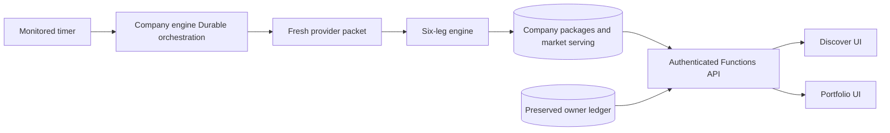
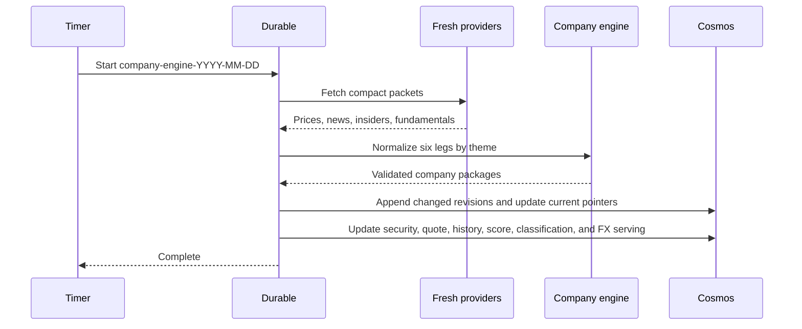

# Auspex Architecture

## 1. Goals

Auspex is a non-production company research and manual portfolio application. The current engine is `company_opportunity_v1` with weights `fresh_balanced_v1`. It produces a 90-day directional company outlook from six evidence-backed legs and ranks each company inside its assigned theme cohort.

The engine does not forecast a return, execute trades, connect to a broker, or move money. `ACCELERATING`, `STABLE`, `DETERIORATING`, and `UNCERTAIN` are research classifications based on current evidence.

Quality goals:

1. Fresh information only: compact active windows, no daily full-history rebuild.
2. Evidence lineage: every directional leg resolves to retained source identity and excerpt.
3. Portfolio independence: every eligible research-universe company is scored; holdings are only an override.
4. Owner preservation: app profile and portfolio ledger survive destructive engine rebuilds.
5. Fail closed: missing evidence produces `PARTIAL`, `WITHHELD`, or `UNCERTAIN`.
6. Operational simplicity: Azure Functions and Cosmos are the critical path; Fabric, Warehouse, and Search are not required for daily completion.

## 2. Constraints

- Preserve only Cosmos `app_users` and `portfolio_transactions` during the one-time destructive reset.
- Delete all legacy analytical, evidence, recommendation, cache, serving, OneLake, Warehouse, Search, notebook, pipeline, and ontology state.
- No compatibility layer or old-engine migration is permitted.
- Python 3.12 Azure Functions run the engine; Cosmos stores current and content-addressed package revisions.
- Azure services use managed identity and TLS. Secrets remain Key Vault-backed settings.
- The deploying entity remains responsible for FINMA, FinSA, MiFID, FADP/GDPR, DORA, retention, suitability, and outsourcing approval.

## 3. Context

No Fabric capacity, notebook, Warehouse promotion, or Search synchronization is needed for a successful daily engine run.

## 4. Research Universe

`connectors/company_engine/research_universe.json` is the versioned initial universe. It contains companies across:

- AI compute and semiconductors;
- data-center buildout;
- enterprise technology;
- energy security and producers;
- healthcare;
- quantum computing.

Eligibility is independent of portfolio holdings. A held ticker reuses the security ID already stored in the owner ledger. Non-held eligible companies are scored and visible in Discover. Missing price coverage or invalid identity is explicit, never silent exclusion.

## 5. Fresh Data Packet

Each company refresh fetches only:

| Source | Active data |
| --- | --- |
| Prices | Latest 30 sessions |
| News | Current and previous 30-day windows |
| Insider transactions | Latest 90 days |
| Fundamentals | Current overview/TTM metrics |
| Classification | Current curated theme and keywords |
| FX | Current USD/CHF, USD/EUR, and EUR/CHF rates |

The package retains source cursors and revision hashes. Replaying identical data converges on the same package fingerprint. A changed package creates one immutable revision and updates one `current` pointer.

## 6. Six-Leg Engine

| Leg | Weight | Fresh interpretation |
| --- | ---: | --- |
| Thesis linkage | 20% | Current company description against curated theme keywords |
| Attention acceleration | 15% | Current 30-day news count versus the previous 30 days |
| Smart money | 20% | Net acquisition/disposal direction from fresh insider transactions |
| Fundamental health | 20% | Current revenue growth, margins, and return on equity |
| Valuation brake | 15% | Current earnings/valuation yields versus theme peers |
| Crowding and positioning | 10% | Recent volume acceleration and realized price variability |

Raw leg values are normalized only within the assigned current theme. Minimum theme size is 3 companies. Available leg weights must total at least 50%.

- `READY`: all six legs available.
- `PARTIAL`: score available but one or more legs unavailable.
- `WITHHELD`: cohort or available-weight gate failed.

The weighted raw composite is mapped to an empirical theme percentile. Positive raw composite is `ACCELERATING`, negative is `DETERIORATING`, zero is `STABLE`, and withheld is `UNCERTAIN`.

Every non-neutral leg requires at least one evidence reference. Evidence references contain source type, source ID, revision hash, event date, knowledge date, retention class, and an excerpt. Future knowledge is rejected.

## 7. Company Package

`company_opportunity_v1` contains:

- security and company identity;
- assigned theme and classification identity;
- as-of and maximum knowledge date;
- 90-day direction;
- theme percentile and signed raw composite;
- six normalized legs and contributions;
- coverage and missing reasons;
- source cursors;
- exact evidence references;
- package fingerprint;
- deterministic cited narrative.

Cosmos `company_packages` is partitioned by `security_sk`. Immutable revisions use `package:<fingerprint>` and the serving document uses `current`. The ingestion identity writes; the web identity reads.

## 8. Narrative

The initial company narrative is deterministic and citation-bound. It summarizes the strongest positive and negative leg contributions and states coverage uncertainty. It cannot alter the deterministic direction or horizon.

The structured AI narrative contract remains available for a later governed model call. Any future AI narrative must use only package evidence, preserve model/prompt/package identities, reject unknown citations, and be visibly labeled AI-generated.

## 9. API And Frontend

Authenticated routes:

- `GET /api/opportunities`
- `GET /api/opportunities/{security_sk}`

The list supports bounded theme, coverage, and direction filters and orders companies by current score. It returns current packages only, never revision history by default.

The Discover UI shows:

- all eligible held and non-held companies;
- direction and theme filters;
- score, cohort size, coverage, and freshness;
- company narrative;
- all six leg contributions;
- evidence excerpts and knowledge dates;
- research-only disclosure.

Portfolio valuation continues to read preserved ledger transactions plus newly published security, quote, history, classification, score, and FX documents.

## 10. Runtime

The scheduled path has one activity: `refresh_company_engine`. No unchanged legacy connector, Fabric, Warehouse, or Search work is scheduled.

## 11. Destructive Reset

`scripts/reset_legacy_engine.py` defaults to dry-run. Apply requires the exact token `DELETE-LEGACY-AUSPEX-ENGINE`.

Before deletion it exports and hashes exactly:

- `app_users`;
- `portfolio_transactions`.

It then deletes:

- documents in every other Cosmos container;
- all OneLake Files and Tables;
- all Warehouse user views, procedures, functions, and tables;
- every Azure AI Search index;
- Fabric notebooks, pipelines, and ontology items while retaining empty Lakehouse and Warehouse items.

After deletion it verifies every legacy scope is empty and re-hashes the preserved owner data. Any mismatch fails the operation.

## 12. Compliance Boundary

The architecture provides data lineage, PIT checks, deterministic output, generated-output separation, access control, and owner isolation. These are engineering controls, not a compliance certificate.

A deploying financial institution must define and approve:

- intended purpose and accountable AI/model owner;
- source licence and records-retention schedule;
- privacy notice, ROPA/DPIA, access/export/correction/erasure handling;
- model change, monitoring, fallback, incident, and independent validation processes;
- FINMA outsourcing/resilience and DORA controls where applicable;
- FinSA/MiFID client classification, suitability, disclosures, conflicts, records, complaints, and adviser competence before personalized advice is enabled.

Discover is company research. Any portfolio-specific `BUY`, `ADD`, `TRIM`, or `SELL` overlay remains a separate regulated-policy boundary.
