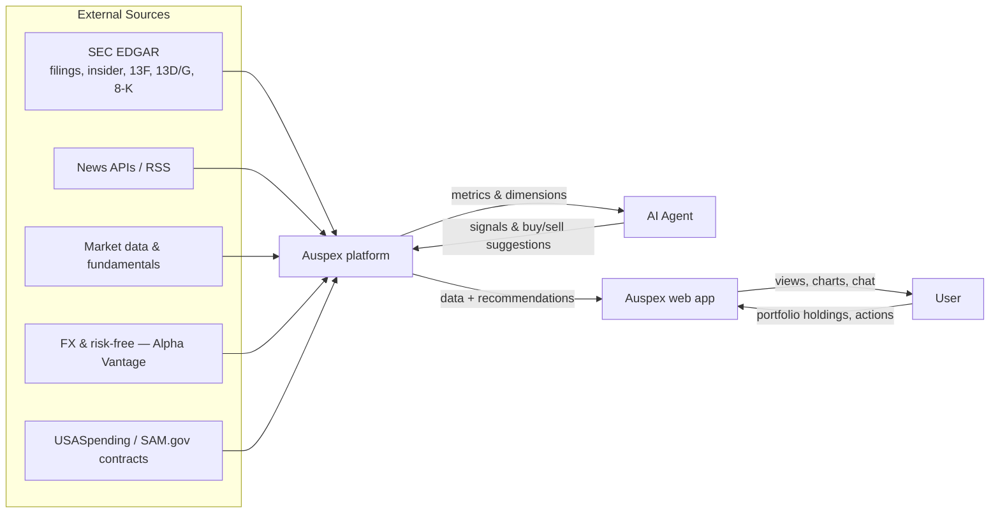
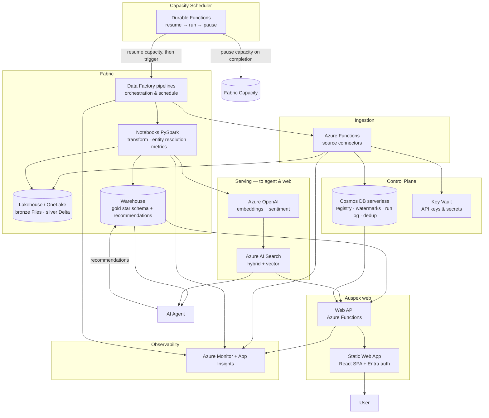
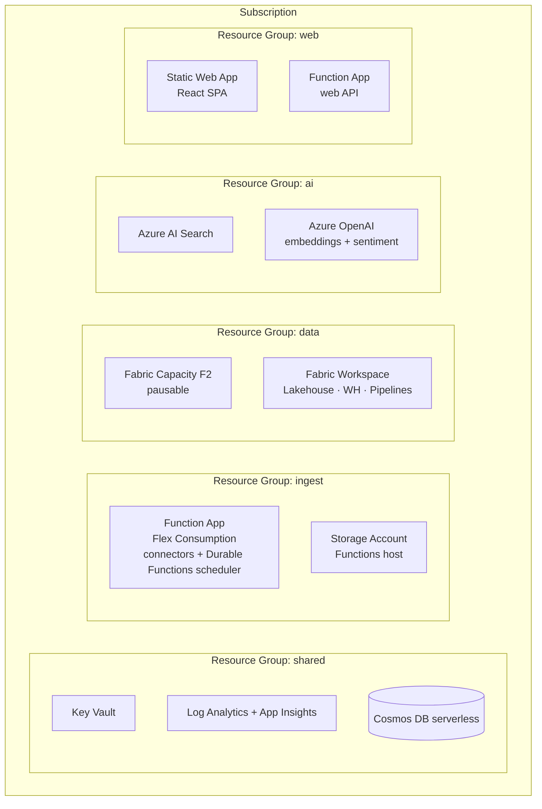

# Auspex — Architecture Document (arc42)

> **Product name:** Auspex.

> **Status:** Draft for implementation
> **Audience:** Autonomous coding agents building the system, plus the product owner.
> **Constraint:** Microsoft Azure **first-party services only**. Data platform is **Microsoft Fabric**. No Databricks, no third-party PaaS.
> **Template:** [arc42](https://arc42.org) v8.

---

## Table of contents
1. Introduction and Goals
2. Architecture Constraints
3. Context and Scope
4. Solution Strategy
5. Building Block View
6. Runtime View
7. Deployment View
8. Cross-cutting Concepts
9. Architecture Decisions
10. Quality Requirements
11. Risks and Technical Debt
12. Glossary
- Appendix A — Repository layout & naming conventions
- Appendix B — Epic design & implementation specification
- Appendix C — Review findings & where they landed
- Appendix D — End-to-end flow & coherence review

---

## 1. Introduction and Goals

### 1.1 Purpose
Auspex is an **MVP SaaS personal financial assistant** (multi-user from day one, designed to later be sold to banks to embed in their systems). It:
- ingests market news, regulatory filings, prices, fundamentals, macro data, and government-contract data on a daily schedule;
- aggregates that data into a dimensional model exposing reusable **metrics** sliced by reusable **dimensions**;
- serves the model to an AI agent that (a) surfaces, within a chosen theme, the less-obvious **enablers** that are healthy and not yet priced-in (thesis-driven, §8.6.3) and (b) tracks a user-held portfolio and **suggests** buy/sell/hold actions;
- presents the same data and the agent's output through a **custom web application** (Auspex web).

**Advisory and view-only.** Auspex does **not** execute trades or move money. It provides a portfolio *view* and *suggestions*; the user implements any transaction manually on their own bank/broker. This is a deliberate scope choice that keeps the MVP simple and low-risk (no execution, settlement, custody, or brokerage integration).

**Decision support, not a return promise.** Auspex is an *evidence-grounded decision-support tool*: its value is surfacing opportunities **with the evidence behind them**, disciplining them with a valuation brake, and being honest about uncertainty. It does **not** promise or forecast returns. Any forward-looking view it shows (e.g. the Home monthly outlook) is an explicitly **uncertain estimate with a range**, never a prediction or guarantee (ADR-043).

**The distinctive lens — the Narrative Premium.** What separates Auspex from a commodity fundamental score is *not* better fundamentals (banks, Bloomberg and MSCI already own that surface). It is an explicit, measured read of **how much of a price is story versus substance**: for every name, Auspex computes a **fundamental anchor** (what the numbers justify), a **narrative intensity** (how much attention/story is propelling the price), and the **Narrative Premium** — the part of the valuation that fundamentals do *not* explain, *attributed* to narrative (§8.6.6). This is the quantitative, validatable form of the "story vs substance" read (§8.6.3). Crucially the premium is **deterministic mathematics**: an LLM is used only as a *sensor* that reads narrative out of text into reproducible numbers and to *narrate* grounded evidence — never as the oracle that decides the score (ADR-045). That keeps the edge (a genuinely new point of view) **and** the bank-grade explainability and reproducibility a regulated buyer requires.

**MVP, not production.** Favour the simplest thing that delivers the core loop (ingest → rank → portfolio view → suggest → explain) as an end-to-end demonstrable product. Production-grade concerns (the heavier risk models, per-bank tenant isolation, DR, network hardening) are designed for but **deferred** — see §1.5.

### 1.2 Business goals
| # | Goal | Description |
|---|------|-------------|
| BG-1 | Daily candidate generation | Each day, produce a ranked list of securities with near-term (**~1 quarter / ~63 trading days**) opportunity, with the evidence behind each rank. The output is a *research aid*, not a return forecast. |
| BG-2 | Portfolio monitoring (advisory) | Track the user's holdings and **suggest** buy/sell/hold with rationale; the user executes manually at their broker. Auspex never trades. |
| BG-3 | Auditable evidence | Every signal must be traceable to source records (which filing, which article, which price). |
| BG-4 | Low cost & low ops | Run cheaply (pausable capacity, consumption billing) and require minimal manual operation. |

### 1.3 Quality goals (top 8)
| # | Quality | Concrete goal |
|---|---------|---------------|
| QG-1 | **Correctness (point-in-time)** | No look-ahead bias. Any query "as of date D" returns only facts known on or before D — **including the text the LLM sensor reads** (§8.6.7). |
| QG-2 | **Freshness** | The daily build completes and publishes gold data before the user's morning (target 06:00 CET), with data no older than the previous trading close. |
| QG-3 | **Extensibility** | A new data source can be added by implementing one connector contract, with no change to downstream layers. |
| QG-4 | **Cost efficiency** | Steady-state infra cost stays within a defined monthly budget; compute scales to zero when idle. |
| QG-5 | **Traceability** | Every gold record links back to its bronze source record(s). |
| QG-6 | **Explainability (usability)** | Every number shown to the user has a plain-language meaning and a good/bad direction; every recommendation states *why* with one-click evidence; the **Narrative Premium decomposes into its drivers with cited passages** (§8.6.6, §8.21). |
| QG-7 | **Selection validity** | Selection is validated point-in-time and theme-relative — the engine ships only if its shortlist beats the theme (excess-vs-theme; catalyst event-study hit-rate), **and the Narrative Premium adds information beyond known factors (value/momentum/quality/size)** under orthogonalization (§8.15), not assumed. |
| QG-8 | **Reproducibility** | Any past output is reconstructable: given a `decision_id`, the exact recommendation, score, premium, drivers and evidence re-derive from a pinned model/prompt version + an input snapshot (§8.25–8.26). |

### 1.4 Stakeholders
| Role | Expectation |
|------|-------------|
| Product owner / user (Francesco) | Trustworthy daily signals; cheap to run; understandable. |
| Coding agent squad | Unambiguous contracts, schemas, naming, and acceptance criteria they can implement without further clarification. |
| (Implicit) Regulators | Clear advisory boundary, traceability, reproducibility, and basic suitability/disclosure records. |
| (Future) Bank integrators | A clean, embeddable product with defensible signals and clear isolation seams. |

### 1.5 MVP scope
The MVP is judged on one honest question: **does Auspex help the user make better-reasoned, evidence-grounded portfolio decisions** — surfacing near-term opportunities with the evidence behind them, disciplining them with a valuation brake, and **validating that its selection beats naive theme exposure** (§8.15). That is a *decision-quality* KPI, not a promise of returns: beating the market with public, lagged signals is genuinely hard, so Auspex is measured on whether its picks add value over the theme and whether its reasoning is sound and auditable — not on a return guarantee (ADR-043). So the **engine must be fully operational** — every planned signal flowing — and selection quality must be **measured, not assumed**. Production hardening is out of scope of this document and is *not* to be built now.

**In the MVP (build now):**
- **All planned data sources** (§3.3): SEC Form 4 / 13F / 13D-G / 8-K / **S-1**, EOD prices (Alpha Vantage), fundamentals + news-sentiment + FX + risk-free via **Alpha Vantage**, Finnhub company news, gov contracts, **US thematic-ETF holdings (TRS)**, plus manual portfolio entry. The three primary external pillars are **Alpha Vantage + Finnhub + SEC EDGAR** (ADR-042), with **FMP as an auxiliary MVP provider** for fallback fundamentals and thematic-ETF holdings. **US-only retires the FRED macro and SNB/ECB FX connectors** — USD is the single source currency and CHF conversion + the USD risk-free fold into Alpha Vantage. The provider layer stays isolated so source plans can be upgraded without changing downstream modeling.
- Gold star schema + the **thesis graph** + the **Opportunity Score** (six thesis legs incl. the valuation brake, §8.6.3) + the **Narrative Premium / divergence engine** (fundamental anchor + narrative-intensity sensor + attributed residual + the story-vs-substance map, §8.6.6–8.6.7) + **thesis validation** (does the shortlist beat the theme *and* does the premium survive orthogonalization, §8.15) + the **recommender** (advisory buy/sell/hold sized on total value, net of costs).
- Manual portfolio *view* (cash + stocks), daily valuation, advisory `recommendation`s, the data-completeness gate, and agent grounding.
- A simple web app + API (candidates, portfolio, evidence, grounded chat) with federated sign-in.
- **Multi-user with per-user data isolation:** federated registration (first sign-in creates the account) and every account sees only its own portfolio (§8.22).
- **Market: US-listed equities and ETFs only** for the MVP. Concentrating on the US market shrinks the information surface (one trading calendar — NYSE/Nasdaq, one source currency — USD, the deepest free data and the richest thematic-ETF coverage) and is where the thesis sources are strongest. Other markets are a later step.
- **Asset coverage: stocks and ETFs** (no bonds, funds, or structured products in the MVP).
- **Language: English only** for the MVP.
- **Score explanation:** alongside the Auspex score, the Discussion tab shows *why* that score was assigned — the factor breakdown (§8.21).
- **User risk profile aligned to the bank's client risk bands**, with FINMA-oriented suitability elements (§8.24).
- A full **control-plane Home** (value, change, cash, allocation, risk, holdings, recommendations) — the density is intentional, not a simplification target.

**Out of scope of the MVP — these are *expected, accepted* boundaries, not defects:**
- **Bank integration for trade execution and automatic position tracking.** Manual transaction entry is the deliberate MVP approach; reading positions from a bank's custody and any execution hand-off come when Auspex is embedded by a bank.
- **Bonds, funds, structured products** and other asset classes beyond stocks/ETFs.
- Production hardening: DR/RTO-RPO, SLOs, schema-migration runners, WAF/full private ingress, and bank-grade network isolation — specified when hardening for bank integration. Private endpoints for required data-plane dependencies are part of the MVP Bicep baseline because of subscription policy and keyless-access constraints.
- **Per-bank tenant isolation** (RLS, per-tenant infra): the MVP isolates per *end-user*; a bank embedding Auspex is a separate, later tenancy layer.
- Advanced book-level risk analytics (covariance/factor/stress), broker CSV import, streaming/intraday.

Keeping these out keeps the MVP focused: a fully operational engine + a clear, English-only, stocks/ETFs web app — with the bank-integration work explicitly deferred, not forgotten.

---

## 2. Architecture Constraints

### 2.1 Technical constraints
| # | Constraint | Consequence |
|---|-----------|-------------|
| TC-1 | First-party Azure services only. | No Databricks, Snowflake, Confluent, etc. Vector search = Azure AI Search; orchestration = Fabric Data Factory; compute = Functions + Fabric. |
| TC-2 | Microsoft Fabric is the data platform. | Storage = OneLake; transforms = Fabric Notebooks/Dataflows; serving = Fabric Warehouse (T-SQL endpoint). |
| TC-2b | Frontend is a **custom web app on first-party Azure hosting**. | Azure Static Web Apps (SPA) + Azure Functions web API + Entra auth. No Power BI as the delivery surface. |
| TC-3 | Batch/scheduled, not streaming, for v1. | Daily cadence with intraday polling where useful. No Event Hubs in the core. |
| TC-4 | Multi-user MVP with per-user isolation. | Federated sign-in, registration on first use, `owner_user_sk` on every per-user row, and API-enforced scoping. Per-bank tenant isolation is deferred. |
| TC-5 | Infrastructure as Code via **Bicep**. | All Azure infrastructure resources are declared in Bicep up front; Fabric workspace items are version-controlled via Fabric Git integration. |
| TC-6 | Region: **Switzerland North**. | Data residency for a Swiss-resident user; all resources pinned to this region where available. |
| TC-7 | **Scoring is deterministic; the LLM is a sensor, not the scorer.** | The Opportunity Score, the fundamental anchor and the Narrative Premium are computed by reproducible code over gold facts. An LLM (Azure OpenAI) is used only to (a) extract structured, cited features and graph edges from text and (b) narrate grounded evidence — at temperature 0 with a pinned model/prompt version. The model never sees price when scoring narrative and never emits the recommendation directly (ADR-045). |

### 2.2 Organizational / process constraints
| # | Constraint |
|---|-----------|
| OC-1 | Implementation performed by autonomous coding agents → the spec must be contract-first and example-rich. |
| OC-2 | Solo maintainer → favour managed/serverless over self-hosted; minimize the number of distinct services. |
| OC-3 | Source data is mostly free tiers with rate limits and fragile/unofficial endpoints → ingestion must be resilient and source-isolated. |

### 2.3 Conventions
- **Language:** Python for ingestion (Azure Functions) and Fabric notebooks (PySpark); T-SQL for the Warehouse; KQL only if Eventhouse is later added; Bicep for IaC.
- **Data formats:** raw landed as JSON/NDJSON in bronze; Delta (Parquet) for silver; Warehouse tables for gold.
- **Time:** all timestamps stored in UTC; presentation converts to CET/CEST.
- **Money:** all monetary facts normalized to USD at event date via `fact_fx_rate`; original currency retained.
- **Trading calendar:** `dim_date.is_trading_day` is seeded from a US exchange calendar (NYSE/Nasdaq) and used by all momentum/volatility windows.
- **FX:** Alpha Vantage USD→base (CHF) rate feeds `fact_fx_rate`; conversions use the rate at the fact's `event_date` (PIT-correct). US-only means USD is the single source currency, so one FX pair suffices.
- **Base currency:** the portfolio is valued in a configurable **base currency (default CHF)**, held in `app_config`. Market facts stay normalized to USD; portfolio values convert USD/native → base via `fact_fx_rate`.

### 2.4 Non-goals
- This is **not** regulated financial advice, and **not a return forecast**. Outputs are research aids; any forward-looking view is an explicitly uncertain scenario estimate (a range), never a prediction or guarantee. The user decides and acts. (Risk profiling and FINMA-oriented suitability elements are in §8.24.)
- **No trade execution, money movement, custody, or settlement.** Auspex never touches the user's money — it shows a portfolio view and suggestions only.
- **No bank integration for execution or automatic position tracking in the MVP** — an *expected, accepted* boundary. Manual entry is the deliberate MVP approach; reading positions from a bank's custody (read-only) and execution hand-off are Phase-2 bank-integration work.
- English-only; stocks and ETFs only — both deliberate MVP boundaries (§1.5).
- Not production-hardened in the MVP (see §1.5).

---

## 3. Context and Scope

### 3.1 Business context



**Inputs:** external market/regulatory/macro data; user-supplied portfolio holdings (entered through the web app).
**Outputs:** a queryable dimensional model + vector index (to the agent); a web application (to the user) backed by a web API.
**Out of scope inside Auspex platform:** the agent's internal reasoning, brokerage execution.

### 3.2 Technical context
| Neighbour | Direction | Interface | Protocol/format |
|-----------|-----------|-----------|-----------------|
| Data sources | inbound | Source connectors (Azure Functions) | HTTPS REST / RSS / bulk download; JSON/XML/CSV |
| AI agent | outbound | Warehouse SQL endpoint + Azure AI Search REST | TDS (SQL), HTTPS REST |
| User (web) | outbound | Auspex web app (Static Web Apps SPA) → web API | HTTPS / REST + JSON |
| Web API | both | Reads Warehouse SQL + AI Search + Cosmos; writes portfolio/actions | TDS, HTTPS REST |
| User (portfolio) | inbound | Entered in the web app → web API → owner-scoped transaction ledger | HTTPS REST |
| Operator | both | Azure Portal, Fabric portal, Monitor | HTTPS |

### 3.3 v1 source inventory (connector targets)
> Endpoints/limits change; treat as starting targets and confirm current provider documentation before coding. `reliability_weight` is an initial value. **Full connection contracts** — auth, exact endpoints, rate limits, pagination, watermark field, and response→bronze mappings — are detailed in `doc/source-and-connector-spec.md` (to be maintained with this architecture document). Ingestion uses direct provider **REST APIs, not MCP** (rationale and where MCP could fit later are in that spec, §6).

| source_id | Provider / endpoint | Cadence | Produces (silver) | Source class | reliability |
|-----------|--------------------|---------|-------------------|---------------|-------------|
| `sec_form4` | SEC EDGAR submissions/Form 4 (official JSON/RSS) | daily (intraday optional) | `insider_txn` | public/official | 1.00 |
| `sec_13f` | SEC EDGAR 13F | quarterly | `holdings_13f` | public/official | 1.00 |
| `sec_13dg` | SEC EDGAR 13D/13G | event/daily | `ownership_events` | public/official | 1.00 |
| `sec_8k` | SEC EDGAR 8-K (material events) | daily | `news` (filing type) | public/official | 1.00 |
| `sec_s1` | SEC EDGAR **S-1 / S-1-A / 424B** (IPO registration + prospectus) | daily | `filings` (registration) | public/official | 1.00 |
| `prices_eod` | **Alpha Vantage** `TIME_SERIES_DAILY` EOD prices | daily | `prices` | provider API | 0.85 |
| `prices_yf` | Yahoo via library (fallback only) | daily | `prices` | fallback feed | 0.40 |
| `alpha_vantage` | **Alpha Vantage** — `OVERVIEW`+`BALANCE_SHEET`+`CASH_FLOW` fundamentals/valuation (incl. net-debt/EBITDA, FCF yield), `NEWS_SENTIMENT`, USD→base FX, `TREASURY_YIELD` risk-free | daily/weekly | `fundamentals`, `news`, `fx`, `macro` | provider API | 0.90 |
| `fundamentals` | FMP fundamentals — **fallback** to Alpha Vantage | daily/weekly | `fundamentals` | provider API | 0.80 |
| `news` | **Finnhub** company-news (+ AV `NEWS_SENTIMENT`) | daily (or hourly) | `news` | provider API | 0.75 |
| `contracts` | USASpending.gov API | daily/weekly | `contracts` | public/official | 0.95 |
| `etf_holdings` | FMP `/etf-holder` for curated **US thematic ETFs** | weekly | `etf_holdings` | provider API | 0.95 |
| `portfolio` | Manual entry in the web app (positions, cash, transactions) | on change | `portfolio_transaction` → positions/cash/valuation | user data | 1.00 |

### 3.4 Source connection contracts
Ingestion is direct provider **REST** (no MCP). Every connector implements the §8.1 contract; secrets live in **Key Vault** and reach the Functions as env vars via **managed identity** (no secrets in code/config).

**Secrets (Key Vault → env var):**

| Env var | Key Vault secret | Used by | Needed |
|---|---|---|---|
| `EDGAR_USER_AGENT` | `EDGAR-USER-AGENT` | all `sec_*` | required (SEC mandates a contact UA) |
| `ALPHAVANTAGE_API_KEY` | `ALPHAVANTAGE-API-KEY` | `alpha_vantage` | required (premium for throughput/real-time) |
| `AV_RPM` | — | `alpha_vantage` | requests/min for your AV plan (free=5, Premium-75=75, Premium-150=150) |
| `FMP_API_KEY` | `FMP-API-KEY` | `fundamentals` | required (free key) |
| `FINNHUB_API_KEY` | `FINNHUB-API-KEY` | `news` | required for E8 news connector |
| — | — | `contracts`, `prices_yf` | no key |

**Per-source connection contract:**

| source_id | Auth | Endpoint (base + call) | Rate limit* | Watermark | Notes |
|---|---|---|---|---|---|
| `sec_form4`/`13f`/`13dg`/`8k` | UA header only | `efts.sec.gov/LATEST/search-index?forms={4\|13F-HR\|SC 13D,SC 13G\|8-K}&startdt&enddt&from` | ~10 req/s fair-access | `file_date` | public domain → **OK** |
| `prices_eod` | key (`apikey`) | `www.alphavantage.co/query?function=TIME_SERIES_DAILY&symbol&outputsize=compact` | Plan-driven (`AV_RPM`) | last trading `date` | Provider API; throttle per registry. |
| `prices_yf` 🔁 | none | Yahoo via `yfinance` lib (fallback, disabled) | n/a | last `date` | Fallback only; never load-bearing. |
| `fundamentals` | key (`apikey`) | `financialmodelingprep.com/api/v3/key-metrics-ttm/{sym}`, `/profile/{sym}` | ~250 calls/day | daily snapshot | Fallback to Alpha Vantage where possible. |
| `news` | key (`token`) | `finnhub.io/api/v1/news?category=general`; `/company-news?symbol&from&to` | ~60 calls/min | article `datetime` | Shared signal feed. |
| `alpha_vantage` | key (`apikey`) | `www.alphavantage.co/query?function=OVERVIEW|BALANCE_SHEET|CASH_FLOW|NEWS_SENTIMENT|CURRENCY_EXCHANGE_RATE|TREASURY_YIELD` | Plan-driven (`AV_RPM`) | `fetched` / obs `date` | Primary provider for fundamentals, sentiment, FX, and risk-free. |
| `contracts` | none | `api.usaspending.gov/api/v2/search/spending_by_award/` (**POST**) | generous | `Action Date` | Public official source. |
| `portfolio` | (web API, Entra) | `POST /transactions` (manual entry, owner-scoped §8.22) | n/a | n/a | User-entered transaction ledger; not an external market-data source. |

\*Limits change — confirm current provider documentation before coding. Request params, pagination, and full **response→bronze field mappings** are in `doc/source-and-connector-spec.md`, which is the squad's build reference; this table is the at-a-glance contract.

**MCP:** not used for ingestion (a scheduled REST pull gains nothing from it). Auspex may later expose *its own* MCP server over the gold layer for the agent or a bank's tooling — a Phase-2 outbound surface, not MVP ingestion.

---

## 4. Solution Strategy

| Concern | Strategy | Rationale |
|---------|----------|-----------|
| Heterogeneous sources / cadences | One **connector contract**; each source = isolated Function. Central **source registry** + **watermarks** in Cosmos DB. | New sources are additive; one failing source can't break others. |
| Turning raw feeds into analytics | **Medallion** (bronze → silver → gold) on OneLake; star schema in Warehouse. | Replayable raw, conformed silver, query-friendly gold. |
| "Metrics & dimensions" | Conformed dimensions + fact tables + a **metric layer** of SQL views/measures. | Reusable, sliceable analytics; single definition per metric. |
| Story vs substance (the edge) | Compute a **fundamental anchor** (peer/sector fair-multiple model) and a **narrative-intensity** composite, then measure the **Narrative Premium** as the valuation residual *attributed* to narrative — a deterministic residual, not an LLM verdict. | A measured, validatable "how much are you paying for the story" that a fundamental score can't give and an LLM oracle can't defend (§8.6.6). |
| Reading narrative out of text | An LLM **sensor** turns news/filings/transcripts into reproducible scalar features (sentiment velocity, theme concentration, forward-promise ratio, …), cached by `(doc_hash, model_version, prompt_version)`; retrieval is time-filtered for PIT. | Captures the unstructured signal **and** stays reproducible/auditable — the LLM never computes the score (§8.6.7, ADR-045/048). |
| Correctness | Every fact carries `event_date` and `knowledge_date`; queries filter by `knowledge_date`. | Eliminates look-ahead bias for validation and for the agent. |
| Identity of a company across sources | A dedicated **entity-resolution** pipeline producing `dim_security` (SCD2). | Joins are only as good as the security key. |
| Unstructured retrieval | Text (news, filing sections) embedded into **Azure AI Search** (hybrid + vector). | The agent needs semantic recall, not just SQL. |
| Cost | Consumption Functions, serverless Cosmos, **pausable Fabric capacity** (F2), scale-to-zero. | Pay for the daily run, not 24/7. |
| Repeatability | **Bicep** for Azure, **Fabric Git** for Fabric items, and documented manual deployment steps for now. GitHub Actions automation is deferred to E10. | Coding agents deploy deterministically once the manual path is stable. |

---

## 5. Building Block View

### 5.1 Level 1 — system white box



### 5.2 Building blocks (responsibilities & interfaces)

#### BB-1 Source Connectors (Azure Functions, Python, Flex Consumption)
- **Responsibility:** fetch new data from one source since its watermark; land raw payloads to bronze; advance the watermark idempotently.
- **One Function App, one Function per source** (or per logical feed). Connectors share a common library implementing the **Connector Contract** (§8.1).
- **Interface in:** HTTP trigger invoked by the Fabric pipeline (`POST /run` with `{source_id, run_id, mode}`), or timer trigger as fallback.
- **Interface out:** writes to OneLake bronze (Files); writes watermark + run record to Cosmos; reads secrets from Key Vault via managed identity; logs to App Insights.
- **Must not:** transform, deduplicate semantically, or resolve entities (that is silver's job). Bronze = raw as received + envelope metadata.

#### BB-2 Control Plane (Cosmos DB serverless)
- **Containers:**
  - `sources` — registry: `{source_id, name, type, schedule, base_url, auth_secret_ref, latency_class, reliability_weight, implementation_status, enabled, schema_version}`. `enabled=true` means the source has deployed connector code and is safe for orchestration to call; planned sources stay registered but disabled until their route exists.
  - `watermarks` — `{source_id, last_event_ts, last_cursor, updated_at}` (partition key `source_id`).
  - `runs` — per-execution log `{run_id, source_id, started_at, ended_at, status, records_in, bytes, error}`.
  - `dedup` — idempotency keys `{key, source_id, first_seen_at, ttl}` (key = natural id or content hash).
- **Why Cosmos:** low-latency point reads/writes for watermark and idempotency on every batch; serverless billing.

#### BB-3 Orchestration (Fabric Data Factory pipelines)
- **Responsibility:** schedule and sequence the daily build: invoke connectors → run silver transform notebooks → run gold/metric notebooks → trigger AI Search indexing → run the agent and **publish daily candidates/recommendations to serving tables** for the web app.
- **Interface:** Web/Function activities call connectors; Notebook activities run Fabric notebooks; failure/retry policy per activity.
- **Schedule:** daily at 05:00 CET; intraday price refresh optional (e.g., hourly) as a separate lighter pipeline.

#### BB-4 Lakehouse (OneLake)
- **Bronze (Files):** `bronze/{source_id}/{yyyy}/{mm}/{dd}/{batch_id}.ndjson` — raw records wrapped in an ingestion envelope.
- **Silver (Delta tables):** cleaned, typed, conformed, **entity-resolved**, deduplicated. One table per canonical entity (`silver.insider_txn`, `silver.news`, `silver.prices`, `silver.holdings_13f`, `silver.ownership_events`, `silver.contracts`, `silver.macro`, `silver.fundamentals`, `silver.fx`, `silver.portfolio_transaction`), plus control tables (`silver.security_quarantine`, `silver.dq_quarantine`, `silver.parse_errors`).

#### BB-5 Transform & Modeling (Fabric Notebooks, PySpark)
- **Responsibilities:** bronze→silver (parse, validate, conform, dedup), entity resolution (`dim_security`), silver→gold (load dimensions & facts), metric computation (gold views/measures), and embedding-payload preparation for AI Search.
- **Idempotent loads:** Delta `MERGE` on natural keys; full-refresh-safe.

#### BB-6 Warehouse (Fabric, gold)
- Hosts the **star schema** (§5.3), the **metric layer** (§8.6), and the **agent recommendations** table. Exposes a T-SQL endpoint consumed by the agent and the **web API**.

#### BB-7 Vector serving (Azure AI Search + Azure OpenAI + Azure AI Language)
- AI Search index over news + filing text chunks. Embeddings from Azure OpenAI (`text-embedding-3-large` or current first-party model). Hybrid (BM25 + vector) with semantic ranker; filterable by security and date for PIT-safe retrieval.
- **Sentiment** is computed first-party via **Azure OpenAI** (article-level, prompt-based scoring to a −1..1 score with a relevance weight); the prompt/model version is recorded in provenance so scores stay auditable and reproducible. No third-party sentiment API (TC-1).
- **Narrative-intensity features (LLM-as-sensor, §8.6.7):** the same Azure OpenAI runtime, used as a *sensor*, also emits the structured scalar features that feed the Narrative Premium (sentiment level/velocity, theme concentration, forward-promise-vs-realized ratio, …), each with the cited passages. Extractions are **idempotently cached** keyed by `(doc_hash, model_version, prompt_version)`; retrieval is **time-filtered** (`knowledge_date le {asof}`) so backtests have no text look-ahead. The sensor never sees price and never outputs a score (TC-7, ADR-045/048).
- **Index schema (`idx-news-filings`):**

```jsonc
{
  "fields": [
    { "name": "chunk_id",       "type": "Edm.String", "key": true },
    { "name": "security_sk",    "type": "Edm.Int64",  "filterable": true },
    { "name": "source_id",      "type": "Edm.String", "filterable": true },
    { "name": "doc_type",       "type": "Edm.String", "filterable": true },   // news | 8k | 10k | ...
    { "name": "event_date",     "type": "Edm.DateTimeOffset", "filterable": true, "sortable": true },
    { "name": "knowledge_date", "type": "Edm.DateTimeOffset", "filterable": true },  // PIT filter
    { "name": "title",          "type": "Edm.String", "searchable": true },
    { "name": "content",        "type": "Edm.String", "searchable": true },
    { "name": "url",            "type": "Edm.String" },
    { "name": "sentiment",      "type": "Edm.Double",  "filterable": true },
    { "name": "vector",         "type": "Collection(Edm.Single)", "dimensions": 3072,
      "vectorSearchProfile": "default" }
  ]
}
```
> Agents MUST always add `knowledge_date le {asof}` to retrieval filters to stay PIT-correct.

#### BB-10 Capacity Scheduler (Durable Functions)
- **Problem it solves:** a Fabric pipeline cannot resume the very capacity it needs to run on. A small external scheduler owns the capacity lifecycle.
- **Responsibility:** a timer-triggered Durable Functions orchestration starts at 04:55 CET, calls `Microsoft.Fabric/capacities/{name}/resume` (ARM REST) → triggers the daily pipeline (Fabric REST job) → waits/polls durably for completion → calls `.../suspend`. It emits a watchdog alert if suspend fails (cost guard).
- **Why Durable Functions:** the resume/run/pause flow is a small but stateful, long-running orchestration. Durable Functions gives retries, durable timers, replay-safe state, and clearer failure recovery while keeping the service count minimal (OC-2).

#### BB-8 Auspex web application (Azure Static Web Apps + Functions web API)
- **Frontend:** a single-page app (React) hosted on **Azure Static Web Apps**. Pages: candidate ranking (by `opportunity_score`), the **Narrative-Premium / story-vs-substance map** (the 2D fundamental-anchor × narrative-premium view, §8.6.6), portfolio with buy/sell suggestions and rationale, evidence drill-down (links to filings/news), and source-health. Optionally an agent chat panel.
- **Web API (`BB-11`):** an **Azure Functions** app (separate from ingestion) that the SPA calls over REST. It is the *only* component the browser talks to and the single place per-user isolation is enforced; it reads the Warehouse SQL endpoint (`v_security_daily_features`, owner-scoped `v_portfolio_with_features`/`v_portfolio_summary`, `recommendation`), queries Azure AI Search for evidence, and writes user input to owner-scoped operational stores: portfolio edits append to the Cosmos transaction ledger, while watchlist and accepted/dismissed suggestions are recorded as user events. Fabric then derives portfolio positions and valuations from the ledger. Endpoints serving the UI: `GET /me` (registers on first call), `POST /onboarding`, `GET /portfolio/summary`, `GET /portfolio/holdings`, `GET /recommendations`, `GET|POST /transactions`, `PUT|DELETE /transactions/{id}`, `GET /transactions/summary`, `POST /chat`, `GET /stock/{code}/lookup`.
- **Auth & registration:** federated sign-in only — **Microsoft, Google, GitHub via Microsoft Entra External ID** (no Auspex passwords). The SPA's built-in auth gates access; the web API validates the principal and maps it to exactly one `app_user`. The **first** authenticated call for a new identity **registers** the account (then first-run onboarding sets base currency + risk appetite). Every data read/write is scoped to the authenticated user (§8.22); the browser never reaches Fabric/Cosmos directly.
- **Why this stack:** first-party (TC-1), cheap (SWA free/standard tier, Functions consumption), product-grade UX you fully control, and multi-user from day one via API-mediated owner scoping. Power BI is intentionally *not* the delivery surface.

#### BB-9 Cross-cutting services
- Key Vault (secrets), Entra managed identity (auth), Azure Monitor + Application Insights (logs/metrics/alerts).

#### BB-12 Fundamental-Anchor model (Fabric notebook, deterministic)
- **Responsibility:** for each security per `as_of`, compute the **fundamentally-justified valuation** and the security's position relative to it. **Primary anchor EV/Sales** (universal coverage incl. loss-makers; the multiple narrative inflates), with EV/EBITDA + P/FCF as secondary anchors where defined, via a **robust (Huber) within-sector regression** of the log-multiple on fundamentals (growth, margin, ROIC/quality, leverage, cash burn) and a **peer-percentile fallback**. Output: `fundamental_anchor` band + `fundamental_anchor_z` (price's standardized distance above/below fair, in σ). Full recipe + DDL in §8.6.8.
- **Interface:** reads `v_fundamentals_latest`, `fact_market_daily`; writes `fact_fundamental_anchor` (gold) + `v_fundamental_anchor`. PIT via `knowledge_date` on **as-reported** fundamental vintages. No LLM (TC-7). The anchor residual is the **valuation residual** consumed by the valuation brake (§8.6.4) and the Narrative Premium (§8.6.6 step 3).
- **Note:** consensus-forward inputs are *themselves* partly narrative; the model flags when the anchor leans on forward estimates vs realized results, and negatives are excluded from the affected multiple, never imputed.

#### BB-13 Narrative-Intensity Extractor (Azure OpenAI as sensor)
- **Responsibility:** turn the news/filing/transcript corpus into the **reproducible scalar features** of §8.6.7 (sentiment level/velocity, theme concentration, forward-promise ratio, hype density, management-narrative-vs-reality gap), each with cited evidence. Combined with deterministic market/attention signals (revision dispersion, options skew, news-volume z, insider divergence) into a `narrative_intensity` composite.
- **Interface:** reads the AI Search corpus (time-filtered) + gold facts; writes `fact_narrative_features` and `fact_narrative_intensity` (gold), plus the evidence references. Idempotent cache keyed by `(doc_hash, model_version, prompt_version)`. The sensor outputs **numbers, never a verdict** (ADR-045/048).

#### BB-14 Narrative-Premium / Divergence engine (deterministic)
- **Responsibility:** combine BB-12 and BB-13 into the headline read. Compute the valuation **residual** (price vs fundamental anchor) and **attribute** the part that co-moves with `narrative_intensity` → `narrative_premium` (σ/%). Classify the `divergence_state` (e.g. *narrative-led overextension*, *narrative on strong fundamentals*, *fundamentally-anchored*, *narrative-neglected* — the unloved good business, *converging*) and place the name on the **2D map** (anchor strength × premium). The engine is **symmetric**: it surfaces both overextension and neglect.
- **Interface:** reads `fact_fundamental_anchor` + `fact_narrative_intensity`; writes `fact_narrative_premium` and the serving view `v_narrative_premium`; feeds the valuation brake (§8.6.4) and the Discussion-tab map (§5.6, BB-8). Fully reproducible; assembles the per-name **evidence pack** (§8.25).

#### BB-10b Decision log (immutable, append-only)
- **Responsibility:** persist every published recommendation/score/premium as an append-only record — `decision_id`, UTC timestamp, model & prompt versions, input-snapshot hash, leg/driver attribution, rationale, evidence references — so any past output is reconstructable (QG-8). Backs the bank-embed record-keeping seam (§8.27). Implemented on immutable (WORM) storage / append-only table.

### 5.3 Gold star schema (Level 2 detail)

**Conformed dimensions**

```sql
-- dim_security: the backbone. SCD2 to survive ticker changes / mergers.
CREATE TABLE dim_security (
  security_sk      BIGINT        NOT NULL,   -- surrogate PK
  cik              VARCHAR(10),               -- SEC identifier (nullable for non-SEC)
  ticker           VARCHAR(16),
  isin             VARCHAR(12),
  figi             VARCHAR(12),
  company_name     VARCHAR(256)  NOT NULL,
  gics_sector      VARCHAR(64),
  gics_industry    VARCHAR(64),
  country          VARCHAR(2),                -- ISO 3166-1 alpha-2
  exchange         VARCHAR(16),
  currency         VARCHAR(3),
  mcap_band        VARCHAR(16),               -- mega/large/mid/small/micro
  is_active        BIT           NOT NULL,
  valid_from       DATE          NOT NULL,    -- SCD2
  valid_to         DATE          NOT NULL,    -- 9999-12-31 if current
  is_current       BIT           NOT NULL
);

CREATE TABLE dim_date (
  date_sk     INT   NOT NULL,                 -- yyyymmdd
  cal_date    DATE  NOT NULL,
  year        INT, quarter INT, month INT, day INT,
  is_trading_day BIT,
  fiscal_quarter VARCHAR(7)
);

CREATE TABLE dim_entity (                     -- the actor behind a fact
  entity_sk     BIGINT NOT NULL,
  entity_natural_id VARCHAR(64),              -- CIK, manager id, etc.
  entity_type   VARCHAR(16) NOT NULL,         -- insider | institution | politician | analyst
  name          VARCHAR(256),
  role          VARCHAR(64),                  -- e.g. CEO, Director, 10% owner
  cik           VARCHAR(10)
);

CREATE TABLE dim_source (
  source_sk        INT NOT NULL,
  source_id        VARCHAR(64) NOT NULL,
  source_type      VARCHAR(32),               -- filing | news | price | macro | contract
  latency_class    VARCHAR(16),               -- realtime | daily | quarterly
  reliability_weight DECIMAL(3,2),            -- 0..1, used by metrics/agent
  source_class     VARCHAR(32)
);
```

**Fact tables (each carries `event_date` and `knowledge_date`)**

```sql
CREATE TABLE fact_market_daily (
  security_sk BIGINT, date_sk INT,
  open DECIMAL(18,6), high DECIMAL(18,6), low DECIMAL(18,6),
  close DECIMAL(18,6), adj_close DECIMAL(18,6), volume BIGINT,
  ret_1d DECIMAL(12,8),
  source_sk INT, event_date DATE, knowledge_date DATE
);

CREATE TABLE fact_insider_txn (
  insider_txn_sk BIGINT, security_sk BIGINT, entity_sk BIGINT, date_sk INT,
  txn_code VARCHAR(2),                         -- P, S, A, ... (Form 4 codes)
  is_buy BIT, shares DECIMAL(20,4), price DECIMAL(18,6), value_usd DECIMAL(20,2),
  shares_after DECIMAL(20,4),
  accession_no VARCHAR(25) NOT NULL,           -- natural key for dedup
  source_sk INT, event_date DATE, knowledge_date DATE
);

CREATE TABLE fact_institutional_holding (
  security_sk BIGINT, entity_sk BIGINT, date_sk INT,  -- date_sk = quarter end
  shares DECIMAL(20,4), value_usd DECIMAL(20,2),
  shares_delta_qoq DECIMAL(20,4), pct_of_portfolio DECIMAL(9,6),
  accession_no VARCHAR(25) NOT NULL,
  source_sk INT, event_date DATE, knowledge_date DATE
);

CREATE TABLE fact_ownership_event (             -- 13D / 13G crossings
  security_sk BIGINT, entity_sk BIGINT, date_sk INT,
  pct_owned DECIMAL(9,6), filing_type VARCHAR(4), is_activist BIT,
  accession_no VARCHAR(25) NOT NULL,
  source_sk INT, event_date DATE, knowledge_date DATE
);

CREATE TABLE fact_news_sentiment (
  news_sk BIGINT, security_sk BIGINT, date_sk INT,
  sentiment DECIMAL(5,4),                       -- -1..1
  relevance DECIMAL(5,4),                       -- 0..1
  title_hash CHAR(64) NOT NULL,                 -- dedup key
  url VARCHAR(1024),
  source_sk INT, event_date DATE, knowledge_date DATE
);

CREATE TABLE fact_contract_award (
  award_sk BIGINT, security_sk BIGINT, date_sk INT,
  agency VARCHAR(128), amount_usd DECIMAL(20,2), description_hash CHAR(64),
  source_sk INT, event_date DATE, knowledge_date DATE
);

CREATE TABLE fact_macro (
  indicator_code VARCHAR(32), date_sk INT, value DECIMAL(20,6),
  source_sk INT, event_date DATE, knowledge_date DATE
);

-- FX rates: required to normalize all monetary facts to USD at event_date.
-- Source: Alpha Vantage CURRENCY_EXCHANGE_RATE (USD->base). US-only retires the
-- SNB/ECB FX connectors (ADR-040/042); one USD pair suffices.
CREATE TABLE fact_fx_rate (
  ccy_pair VARCHAR(7) NOT NULL,                -- e.g. EURUSD, CHFUSD
  date_sk INT NOT NULL, rate DECIMAL(18,8) NOT NULL,
  source_sk INT, event_date DATE, knowledge_date DATE
);

-- Portfolio holdings (user-supplied). Drives BG-2 buy/sell suggestions.
CREATE TABLE fact_portfolio_position (
  position_sk BIGINT NOT NULL, security_sk BIGINT NOT NULL,
  account VARCHAR(64), quantity DECIMAL(20,6) NOT NULL,
  cost_basis_usd DECIMAL(20,2), acquired_date DATE,
  as_of_date DATE NOT NULL,                     -- snapshot date (SCD-friendly)
  source VARCHAR(32)                            -- manual | broker_csv
);
```

### 5.4 Agent serving contract (the interface the agent codes against)

The agent does not query raw facts. It reads **one stable feature view per security per day**, plus AI Search for evidence. This view is the contract; its columns may be added to but not removed/renamed without a version bump.

```sql
-- v_security_daily_features: one row per (security_sk, date_sk), PIT-safe.
-- Parameterized conceptually by @asof; default CURRENT_DATE.
CREATE VIEW v_security_daily_features AS
SELECT
  s.security_sk, s.ticker, s.company_name, s.gics_sector, s.country,
  d.cal_date AS as_of,
  -- price / technical
  m.close, m.ret_1d, mom.momentum_3m, mom.momentum_6m, mom.momentum_12m,
  rs.rel_strength_sector,
  -- risk (realized)
  rk.realized_vol_252d, rk.downside_deviation_252d, rk.max_drawdown_252d,
  rk.beta_252d, rk.illiquidity,
  -- risk-adjusted (growth & risk comparable)
  ra.ann_return_252d, ra.sharpe_252d, ra.sortino_252d, ra.calmar_252d,
  -- smart money
  ins.insider_net_buy_ratio_90d, ins.insider_cluster_buy_30d,
  inst.inst_net_flow_qoq, inst.inst_new_initiations,
  own.activist_13d_flag,
  -- news
  nws.news_sentiment_ewma_14d, nws.news_volume_z_30d,
  -- catalysts
  con.contract_award_usd_trailing_90d,
  -- story vs substance (the edge)
  fa.fundamental_anchor_z, ni.narrative_intensity, np.narrative_premium, np.divergence_state,
  -- composites
  cs.opportunity_score,
  -- provenance / freshness
  fr.max_knowledge_date, fr.stale_sources_json
FROM dim_security s
JOIN dim_date d ON d.is_trading_day = 1
LEFT JOIN /* metric views, all filtered knowledge_date <= @asof */ ...
WHERE s.is_current = 1;
```

**Evidence retrieval (AI Search):** the agent calls `idx-news-filings` with `search={query}&filter=security_sk eq {sk} and knowledge_date le {asof}` and returns `url`/`title` as citations. Every buy/sell suggestion MUST cite at least one gold fact row and/or one indexed document (QG-5).

**Portfolio view:** `v_portfolio_with_features` joins `fact_portfolio_position` (latest `as_of_date`) to `v_security_daily_features` so the agent can reason over held names and candidates with the same metric definitions.

### 5.5 Portfolio management — cash + stocks (manual entry)

Auspex treats a portfolio as **cash + stocks**, valued daily in the configurable base currency (default CHF). For v1, holdings and cash are entered **manually** (broker CSV import is deferred). The **source of truth is a transaction log**; positions, cash, and total value are *derived* from it each build, so the agent always rebalances against the true total.

**Tables (gold):**
- `dim_account` — one or more accounts, each with a currency.
- `fact_portfolio_transaction` — the manual event log. Types: `OPENING_POSITION`, `OPENING_CASH`, `DEPOSIT`, `WITHDRAWAL`, `DIVIDEND`, `INTEREST`, `FEE`, `BUY`, `SELL`. `cash_amount` is signed in txn currency (+ in / − out); BUY/SELL also carry `quantity`/`price`.
- `fact_portfolio_position` — **derived** current holdings (from BUY/SELL/OPENING_POSITION).
- `fact_portfolio_valuation` — **derived** daily snapshot: `total_cash_base`, `total_stocks_base`, `total_value_base`, `cash_weight`, `unrealized_pnl_base`.
- `app_config` — `base_currency` (CHF) + rebalancing policy (`cash_buffer_pct`, `max_position_weight`, `min_trade_base`).
- `recommendation` — agent output (see below).

**Cash is first-class.** Deposits and dividends raise investable cash; withdrawals and fees lower it. Because every cash movement is a transaction, the platform always knows `total_value = cash + Σ(position market value)`, which is the denominator for weights and the basis for sizing every suggestion.

**Serving views:** `v_cash_balance`, `v_portfolio_positions` (qty, market value, weight, unrealized P&L), `v_portfolio_summary` (cash + stocks totals, cash %), `v_portfolio_exposures` (sector/country/currency), `v_portfolio_with_features` (holdings + Opportunity Score + risk context), and `v_rebalance_inputs` (investable cash after the buffer, max weight).

**Universe onboarding (critical):** when a holding is added, its security is resolved to `dim_security` (by ticker/ISIN) **and added to the ingestion universe**, so prices/news/filings start flowing for it. Without this, a held name would have no metrics and the agent couldn't "consider" it.

**Rebalancing output (`recommendation`):** per run, the agent reconciles holdings against the Opportunity-Score ranking and `v_rebalance_inputs` to emit actions — `BUY`/`ADD`/`TRIM`/`SELL`/`HOLD` — each with `current_weight`, `target_weight`, a `suggested_amount_base` (+ deploy cash / − raise cash), `rationale`, and evidence links. Suggestions respect the cash buffer and max-position-weight policy and never exceed available cash.

### 5.6 Web application UX (clarity-first, for a non-expert user)

The frontend is designed so a non-expert can use, verify, and trust it. UX is a first-class architectural concern, not a skin.

**Home (information hierarchy):** the first screen leads with the few numbers that matter — total value (cash + stocks), today's change, cash available, and **portfolio risk in plain words** ("more volatile than the market") — then today's top suggestions. Detail is progressive: simple by default, expert metrics on demand.

**Monthly outlook (honest, plain text).** Home carries a short **"this month at a glance"** panel in plain language: an honest summary of the current portfolio (value, mix, biggest concentration, cash on hand), a **next-month estimate framed as a range with explicit uncertainty** — never a point forecast — and a **suggested action in one or two plain sentences**, closed with the advisory-only reminder. The wide range is deliberate and explained ("a month is short; most of the move is unpredictable"); this is decision support, not a prediction (ADR-043, §2.4). The monthly view is a **glance** — Auspex's actual conviction and its suggestions are **quarter-horizon** (ADR-044), reviewed monthly rather than traded monthly; the panel says so, so the user doesn't read it as a one-month trade signal.

**Every number has meaning.** The web API serves a **metric metadata** payload (§8.21) so the UI renders each figure with a `display_name`, a one-line `plain_description`, units, and a good/bad direction. No bare numbers; tooltips everywhere. The Opportunity Score is shown as a 0–100 number *and* a plain label, with a per-leg "why this score" breakdown (§8.21).

**Verifiable suggestions.** Each recommendation card shows a plain-language *why*, a **confidence** indicator (data coverage + signal agreement), the actual numbers behind it, and one-click **evidence** (the filings/news/prices), with Accept / Dismiss.

**Conversational agent (primary, not a side panel).** A chat lets the user ask "why sell X?", "is my portfolio risky?", "what if I add 5k to NVDA?". Answers are **grounded** (§8.19): every figure comes from a gold query, every ticker is validated, sources are cited. The UI offers **suggested questions** and a "explain this number" affordance on any metric.

**Effortless portfolio entry.** Ticker/ISIN **autocomplete** (resolved against `dim_security`), quantity + price, done; a two-tap flow for dividends/deposits; friendly inline validation. A first-run **onboarding wizard**: enter holdings + cash, pick base currency, set risk appetite.

**Risk appetite as a simple control.** A single conservative ↔ balanced ↔ aggressive selector maps to the risk-aversion `λ` and policy in `app_config` — the user never edits a config table.

**Morning summary.** An optional daily notification (email) with "what changed and today's suggestions," linking into the app.

**Always-visible framing.** A friendly, persistent "research, not advice — you decide" message; suggestions are never auto-executed.

---

## 6. Runtime View

### 6.1 Daily build (primary scenario)

```mermaid
sequenceDiagram
  participant Sch as Capacity Scheduler 0455
  participant Cap as Fabric Capacity
  participant Pipe as Fabric Pipeline
  participant Fn as Connector Function
  participant Cosmos
  participant Bronze as OneLake bronze
  participant NB as Transform Notebooks
  participant WH as Warehouse gold
  participant AIS as AI Search

  Sch->>Cap: resume capacity
  Sch->>Pipe: trigger daily build (REST job)
  Pipe->>Fn: POST /run {source_id, run_id}
  Fn->>Cosmos: read watermark(source_id)
  Fn->>Fn: fetch new data since watermark
  Fn->>Bronze: write batch_id.ndjson (envelope)
  Fn->>Cosmos: upsert watermark + run record (atomic)
  Fn-->>Pipe: {status, records_in}
  Pipe->>NB: run silver transforms (parse, validate, dedup, resolve)
  NB->>WH: MERGE dimensions + facts (gold)
  Pipe->>NB: run metric notebooks (views/measures)
  Pipe->>AIS: index new text chunks (embeddings)
  Pipe->>WH: publish candidates + recommendations to serving tables
  Pipe-->>Sch: completion signal
  Sch->>Cap: suspend capacity (cost guard; alert on failure)
```

**Failure handling:** each connector failure is isolated; the pipeline continues other sources and marks the run partial. Transform notebooks are idempotent and re-runnable. A failed run never advances a watermark.

### 6.2 Insider cluster-buy signal (analytics scenario)
1. `fact_insider_txn` loaded for day D (PIT-correct).
2. Metric view `v_insider_cluster_buy` computes, per `security_sk`, the count of **distinct insiders** with `is_buy=1` in the trailing 30 days, plus dollar-weighted net.
3. Securities crossing the configured threshold appear in the candidate feature set consumed by the agent.

### 6.3 Agent answering "what should I buy/sell?" (consumption scenario)
1. Agent reads the user's portfolio (`dim`/holdings) and the latest gold **feature view** per security (metrics).
2. Agent issues hybrid queries to AI Search filtered by `security_sk` and `knowledge_date <= today` for supporting news/filings.
3. Agent composes ranked suggestions **with evidence links** back to gold facts and source URLs.

### 6.4 Backfill / replay (operational scenario)
1. Operator triggers a backfill pipeline with a date range.
2. Connectors (where the source supports history) re-fetch into bronze under historical partitions; transforms re-run.
3. `knowledge_date` is set to the **original availability date** where derivable, else to ingest date, preserving PIT integrity.

### 6.5 User opens the Auspex web app (delivery scenario)
1. User authenticates (Entra via Static Web Apps); the SPA loads.
2. SPA calls the web API: `GET /candidates` (top by `opportunity_score`), `GET /portfolio`, `GET /recommendations`.
3. Web API reads the Warehouse serving views + recommendations table; for any item the user expands, `GET /evidence?security_sk=…` queries AI Search (PIT-filtered) and returns citations.
4. SPA renders the candidate list, the risk-vs-growth scatter, and the portfolio with buy/sell rationale.

### 6.6 User updates the portfolio (write scenario)
1. User edits holdings or accepts/dismisses a suggestion in the SPA.
2. Web API validates the request and appends an owner-scoped transaction or user event to Cosmos; it does **not** upsert derived position snapshots directly.
3. Next daily build mirrors the transaction ledger into `silver.portfolio_transaction`, derives gold positions/valuation, folds the result into `v_portfolio_with_features`, and the agent re-evaluates on the next run.

### 6.7 Add current portfolio manually (onboarding scenario)
1. User creates an account, then enters opening holdings (`OPENING_POSITION` per stock: ticker/ISIN, quantity, cost) and opening cash (`OPENING_CASH`).
2. Web API validates each transaction, derives the signed `cash_amount`, appends it to the owner-scoped Cosmos transaction ledger, and **onboards each security** into `dim_security` + the ingestion universe.
3. The SPA shows an immediate quick view (`GET /portfolio/quick`); the nightly build then produces full market valuation and `v_portfolio_summary`.

### 6.8 Record a cash transaction → rebalance (cash scenario)
1. User records a `DIVIDEND` or `DEPOSIT` (additional funds) in the SPA.
2. Cash rises; the next build recomputes `total_value_base` and `investable_cash_base` (after the cash buffer).
3. The agent proposes how to deploy the new cash: `ADD`/`BUY` into top Opportunity-Score, underweight names sized to the risk budget, or hold as cash — written to `recommendation` with rationale and evidence.

### 6.9 Narrative-Premium computation (story-vs-substance scenario)
1. **Anchor (deterministic, BB-12):** `nb_fundamental_anchor` fits the within-sector fair-multiple model over the current universe (PIT) and writes `fact_fundamental_anchor` (`fundamental_anchor_z` per security).
2. **Sensor (LLM-as-sensor, BB-13):** for each name, the narrative-intensity features are read from the **cache**; only documents new since the last run (or a changed prompt/model version) are (re)extracted from the time-filtered corpus, at temperature 0, with cited passages. A **groundedness check** rejects any feature claim not supported by a retrieved passage. Deterministic market/attention signals are joined; the `narrative_intensity` composite is written to `fact_narrative_intensity`.
3. **Premium (deterministic, BB-14):** the valuation residual (price vs anchor) is attributed to `narrative_intensity`; `narrative_premium`, `divergence_state` and the 2D-map coordinates are written to `fact_narrative_premium` / `v_narrative_premium`, and feed the valuation brake (§8.6.4).
4. **Evidence pack + decision log:** each name's premium links its driver features, the cited passages, the anchor inputs and the model/prompt versions; the published read is appended to the immutable **decision log** (BB-10b) under a `decision_id` (QG-8).
5. **Serving:** the Discussion tab renders the map and the per-name decomposition (§5.6, §8.21). **Backtests reuse the same code path** with `@asof` set in the past — the cache and the time-filtered retrieval guarantee no text look-ahead (QS-17).

---

## 7. Deployment View

### 7.1 Topology


- **Auth:** Entra ID; the Static Web App's built-in auth gates the SPA, the web API validates tokens. The SPA + web API are the only public surfaces; Fabric/Cosmos/Search are reached only via managed identity from the API.

- **Region:** Switzerland North for all that support it; nearest paired region for anything that does not (documented per resource).
- **Identity:** system-assigned managed identities; Key Vault references; no secrets in app settings or code.
- **Networking (v1):** the SPA + web API are the public surfaces; private endpoints are used for key data-plane dependencies where subscription policy/keyless access requires them (Cosmos DB, Key Vault, Function host storage). Managed identity + RBAC remain the primary security boundary. WAF, private ingress, and bank-grade tenant network isolation are deferred hardening.

### 7.2 Environments
- `dev` and `prod` as separate resource groups + Fabric workspaces, same Bicep with parameter files.
- Fabric items promoted via **Fabric Git integration** + deployment pipelines.

### 7.3 IaC & deployment automation
- **Bicep** modules per resource group; `main.bicep` composes all Azure infrastructure resources up front, including resources consumed by later application epics. Application code may arrive later, but the infrastructure is not deployed in later feature waves. Fabric workspace items are synced via Fabric Git because they are not ARM/Bicep resources.
- **Current deployment path:** manual/local commands documented in `doc/operations.md` are the supported path for E1-E4.
- **Deferred automation:** GitHub Actions CI/CD is an E10 hardening item, not an E1 completion requirement.

---

## 8. Cross-cutting Concepts

### 8.1 The Connector Contract (MUST for every source)
Every connector implements this interface (shared Python base class `BaseConnector`):

```python
class BaseConnector(ABC):
    source_id: str
    schema_version: int

    def run(self, ctx: RunContext) -> RunResult:
        wm = self.read_watermark(ctx)            # from Cosmos
        batch = self.fetch(since=wm)             # source-specific
        if not batch.records:
            return RunResult.empty()
        batch_id = deterministic_id(self.source_id, wm, batch.window)
        if self.already_landed(batch_id):        # idempotency (Cosmos dedup)
            return RunResult.skipped()
        self.write_bronze(batch_id, envelope(batch))   # NDJSON to OneLake
        self.advance_watermark(ctx, batch.new_wm)       # atomic upsert
        return RunResult.ok(records=len(batch.records))

    @abstractmethod
    def fetch(self, since) -> Batch: ...
```

**Bronze envelope (one JSON object per line):**
```json
{
  "ingest_ts": "2026-06-10T03:05:12Z",
  "source_id": "sec_form4",
  "schema_version": 3,
  "batch_id": "sec_form4-20260610-0305",
  "watermark_from": "2026-06-09T20:00:00Z",
  "record": { "...": "raw source payload, untouched" }
}
```

**Rules:** never mutate `record`; one batch file is atomic; re-running with the same window must be a no-op (idempotent).

### 8.2 Idempotency & exactly-once-into-silver
- **Bronze:** deterministic `batch_id`; a re-landed batch overwrites the same file (no duplicates).
- **Silver:** Delta `MERGE` keyed on the natural key (`accession_no`, `title_hash`, `(security,date)` for prices). Replays converge.
- **Watermarks:** advanced **only after** successful bronze write; stored in Cosmos with the run id.

### 8.3 Point-in-time correctness (QG-1)
- Every fact stores `event_date` (when it happened) and `knowledge_date` (when Auspex could first know it).
- Gold metric views expose an `@asof` parameter pattern: `WHERE knowledge_date <= @asof`. Default `@asof = CURRENT_DATE`.
- **13F caution:** `event_date` = quarter end, `knowledge_date` = filing date (up to 45 days later). Validation and event studies MUST filter on `knowledge_date`.

### 8.4 Entity resolution → `dim_security`
- **Seed:** SEC `company_tickers.json` (CIK↔ticker), plus an exchange listing reference for ISIN/sector/country.
- **Resolution order:** exact CIK → exact ticker (per exchange) → ISIN → high-confidence fuzzy name match (token-set ratio ≥ threshold).
- **Unresolved** records route to `silver.security_quarantine` for later review; they are excluded from gold until resolved.
- **SCD2:** ticker changes, mergers, and delistings close the current row (`valid_to`) and open a new one; facts join on `security_sk` valid at `event_date`.

### 8.5 Data quality & validation
- Per-source validation rules run in silver (schema, ranges, nullability, referential integrity to `dim_security`).
- Violations → `silver.dq_quarantine` with a reason code; the run is marked partial, not failed.
- DQ metrics (rows in/out, quarantine rate) emitted to App Insights and surfaced in the source-health dashboard.

### 8.6 Metric layer (precise definitions)
All metrics are SQL views in the Warehouse, PIT-filtered. Key definitions:

| Metric | Definition |
|--------|-----------|
| `insider_net_buy_ratio_90d` | (Σ buy value − Σ sell value) / (Σ buy value + Σ sell value) over trailing 90d, per security. Range −1..1. |
| `insider_cluster_buy_30d` | COUNT(DISTINCT entity_sk WHERE is_buy=1) over trailing 30d, per security. |
| `inst_net_flow_qoq` | Σ(shares_delta_qoq × close at quarter end) over latest 13F quarter, per security. |
| `inst_new_initiations` | COUNT(DISTINCT institutions that went 0 → >0) latest quarter. |
| `news_sentiment_ewma_14d` | EWMA(sentiment, span=14d) weighted by `relevance × source.reliability_weight`. |
| `news_volume_z_30d` | (count_today − mean_30d) / stddev_30d of relevant articles per security. |
| `momentum_{3,6,12}m` | close / close_lag_n − 1. |
| `realized_vol_30d` | stddev(ret_1d, 30d) × sqrt(252). |
| `rel_strength_sector` | security momentum_3m − sector median momentum_3m. |
| `composite_growth_score` | Weighted, normalized blend of the above; weights stored in a config table `metric_weights` so they're tunable without code change. |

**Composite score recipe (reproducible):** per `as_of` date and over the current universe, each input metric is (1) **winsorized** at the 1st/99th percentiles, (2) converted to a **cross-sectional z-score**, (3) sign-aligned so higher = more bullish (e.g., realized vol is negated), then (4) combined as `Σ wᵢ · zᵢ` using weights from `metric_weights` (which must sum to 1), and (5) re-standardized to a 0–100 rank for presentation. Missing inputs are mean-imputed (z=0) and flagged in `stale_sources_json`. The recipe is deterministic given the same universe and weights.

### 8.6.1 Risk metrics (realized, trailing windows)
| Metric | Definition |
|--------|-----------|
| `realized_vol_{30,90,252}d` | stddev(ret_1d, window) × √252 (annualized). |
| `downside_deviation_252d` | √(mean(min(ret_1d − rf_daily, 0)²)) × √252. Penalizes only sub-target returns. |
| `max_drawdown_252d` | min over window of (close / running_max(close) − 1). Negative; worst peak-to-trough. |
| `beta_252d` | cov(ret_1d, bench_ret) / var(bench_ret). Benchmark = configured index ticker (`is_benchmark=1`). |
| `illiquidity` | 1 / avg(close × volume, 30d) (Amihud-style proxy); higher = less liquid = riskier. |
| `var_95_252d` | Historical 5th-percentile daily return (tail loss). |

### 8.6.2 Risk-adjusted metrics (growth and risk in comparable units)
| Metric | Definition |
|--------|-----------|
| `ann_return_252d` | Geometric: (∏(1 + ret_1d))^(252/n) − 1. |
| `sharpe_252d` | (ann_return_252d − rf_ann) / realized_vol_252d. |
| `sortino_252d` | (ann_return_252d − rf_ann) / downside_deviation_252d. Shown as **context** on a name; does not drive selection (§8.6.3). |
| `calmar_252d` | ann_return_252d / abs(max_drawdown_252d). |
| `info_ratio_252d` | (security − benchmark ann return) / tracking_error. |

> `rf_daily`/`rf_ann` come from `fact_macro` (e.g., 3M T-bill for USD names, SARON for CHF); default to a small constant if missing, flagged in provenance.

> In the thesis engine these risk/return metrics are **context** on a name — they no longer drive selection (§8.6.3).

### 8.6.3 Opportunity Score — the selection metric (thesis-driven)
Auspex does **not** rank by predicting returns from price cycles. It ranks by **thesis fit, company quality, positioning, and price** — a top-down thematic read that suits the event/current-state sources far better than a factor model (ADR-039, superseding ADR-021). The advisory horizon is **~1 quarter (~63 trading days)** (ADR-044) — chosen because that is where the most signals are simultaneously live: insider-purchase drift (3–12m), contract fundamentals (quarters), and the early phase of valuation re-rating all overlap there, and it matches the 13F/earnings rhythm. Attention acceleration and sentiment give the near-term *entry timing*; thesis linkage and the valuation brake supply the *quality and the multi-month payoff*. (Momentum 3/6/12-month remain multi-horizon *input* features, each matched to its own half-life; the advisory horizon is one quarter.) Selection works in two moves.

**1. Thesis graph (the asset).** From news, filings, and contracts the LLM (Azure OpenAI) extracts entities and relationships — *supplies, customer-of, competes, benefits-from, exposed-to* — into a knowledge graph held in **Cosmos DB (graph)**, with embeddings in **Azure AI Search** for fuzzy linkage. **Every edge cites its source document and date** (PIT + audit). A theme (e.g. "AI infrastructure") is a structured object: value-chain *links* (compute, memory, optical/interconnect, power, cooling, foundry), each with keywords, sectors, and anchor companies. `08_thesis.sql` holds the gold schema; `nb_news_to_graph` builds it.

**2. Second-derivative traversal (the edge).** Rather than scoring the obvious theme leaders (hop 0 — already crowded and priced), the engine walks **1–2 hops** from the demand driver to its *enablers* (power, cooling, optical, interconnect). Graph distance from the hype centre is a feature, so the cheaper, less-covered enabler surfaces.

**Opportunity Score (six legs, no price-cycle backtest).** Per theme, cross-sectional over the candidate set (companies compared to each other today), each leg is winsorized, z-scored, sign-aligned, and blended (`Σ wᵢ·zᵢ`, weights in `metric_weights`), then standardized to a 0–100 `opportunity_score`:
- **thesis linkage** — strength/centrality of the company's edges to the theme (graph + embeddings);
- **attention acceleration** — *rate of change* of relevant mentions (rising = early, not the saturated level);
- **smart-money corroboration** — insider cluster-buys (Form 4), 13F accumulation, new contracts;
- **fundamental health** — synthesized margins, growth, balance sheet (the source already derives it — no need to rebuild history);
- **valuation brake** — synthesized multiples vs peers and vs growth; a *negative* leg that demotes priced-for-perfection names so enablers surface;
- **crowding/positioning** — ownership/attention saturation; under-owned scores higher.
`engine/thesis.py` is the reference implementation; `12b_opportunity_legs.sql` / `13_opportunity_score.sql` are the gold serving views. The trailing risk metrics in §8.6.1–8.6.2 (Sortino etc.) are shown for **context** on a name; they no longer drive selection.

**What feeds the legs (ADR-042).** The leg-source views read concrete gold, not sketches: `fact_fundamentals` → `v_fundamentals_latest` backs the **fundamental-health** and **valuation** legs (`pe_ratio`, `peg_ratio`, `ps_ratio`, `ev_ebitda`, `gross_margin`, `profit_margin`, `rev_growth_yoy`), sourced from **Alpha Vantage `OVERVIEW`** (FMP fallback) and normalized into source-agnostic columns by `nb_av_to_gold`. The **attention** leg reads `v_news_count_30d` vs `v_news_count_prev_30d` (article-volume acceleration), and the **sentiment** signal reads `v_news_sentiment_30d` — both fed by AV `NEWS_SENTIMENT` (per-ticker score) alongside Finnhub company-news in `fact_company_news`. AV `CURRENCY_EXCHANGE_RATE` lands `fact_fx_rate` (USD→CHF). `net_debt_to_ebitda` is computed from AV `BALANCE_SHEET` (net debt = total debt − cash) over `OVERVIEW` EBITDA, and `fcf_yield` from AV `CASH_FLOW` (operating cash flow − capex) over market cap — so the fundamental-health and valuation legs are fully fed, not imputed. Any field a source genuinely lacks still stays NULL and the leg COALESCEs it. The pure field mapping lives in `connectors/alpha_vantage/mapping.py` (unit-tested); the notebook mirrors it.

**Story vs substance — now measured (§8.6.6).** Each name carries a read on *narrative strength* and *substance*. In the MVP this is no longer only a qualitative leg read: the **narrative strength** is the measured `narrative_intensity` composite (§8.6.7) and the **substance** is the `fundamental_anchor` (§8.6.6), and their interaction is the **Narrative Premium** — the part of the price fundamentals don't explain, attributed to narrative. Strong story with reasonable substance is the opportunity (the early enabler); strong story with a large unexplained premium is the crowded late trade the valuation brake flags; strong substance with *no* narrative is the neglected name the engine also surfaces. That is the discipline that stops the engine chasing hype — and the quantitative form of this read is defined next.

### 8.7 Security
- Managed identity for all service-to-service calls; **no connection strings/keys in code**.
- Key Vault holds source API keys; Functions read via Key Vault references.
- RBAC: least privilege; the agent's identity gets read-only on the Warehouse and AI Search query keys only.

### 8.8 Observability
- Structured logs + custom metrics to App Insights: per-source `records_in`, latency, error rate, quarantine rate, freshness lag.
- Alerts: daily build did not complete by 06:00 CET; source error rate > threshold; Fabric capacity left running > N hours.

### 8.9 Cost control
- Functions: Flex Consumption (pay per execution).
- Cosmos: serverless.
- Fabric: **F2 capacity, paused outside the build window** (Capacity Scheduler resumes → runs → suspends). Cold-resume latency is **acceptable** — no downstream SLA pressure on the morning run — so the capacity can stay paused aggressively for maximum savings.
- AI Search: smallest tier that fits the index; Azure OpenAI embeddings batched.
- See §10 budget scenario.

### 8.10 Compliance posture
- Advisory-only framing, disclosure acknowledgment, evidence packs, and immutable decision logs provide the MVP's basic regulatory spine.
- Source reliability is tracked per source; fallback feeds are flagged with low `reliability_weight` and treated as best-effort, never load-bearing.

### 8.11 Schema evolution
- Bronze envelope carries `schema_version`. Silver parsers are versioned and tolerant (additive changes don't break; breaking changes bump the version and add a branch).

### 8.12 Error handling & dead-letter
- **Connector level:** transient errors (timeouts, 429, 5xx) retried with exponential backoff + jitter (max N attempts, honor `Retry-After`). Exhaustion → run marked `failed` for that source only; watermark **not** advanced; alert raised.
- **Parse level:** records that fail parsing/validation land in `silver.parse_errors` (poison records) with raw payload + reason; the batch still processes the good records (partial success).
- **Rate limits:** connectors read a per-source `rate_limit` from the registry and self-throttle; the scheduler spreads source start times.
- **No silent data loss:** every dropped/quarantined record is counted and visible in the source-health dashboard.

### 8.13 Testing strategy (Definition of Done depends on these)
- **PIT tests:** assert that `v_security_daily_features @asof=D` and AI Search filtered to D return zero rows/docs with `knowledge_date > D` (covers QG-1/QS-1).
- **Idempotency tests:** run a connector twice on the same window → identical bronze (same `batch_id`); run a transform twice → identical gold (MERGE convergence).
- **Entity-resolution tests:** golden set of known CIK/ticker/ISIN mappings, including a ticker-change and a merger case, asserting correct `security_sk` over time.
- **DQ tests:** seeded bad records route to quarantine, not gold.
- **Contract tests:** `v_security_daily_features` column set is stable; schema diff fails CI on breaking change.

### 8.14 Data retention & volume
- Bronze: retain raw indefinitely if cheap, else 18–24 months rolling (replay window); partitioned by date for lifecycle rules.
- Silver/Gold: retained multi-year for thesis validation and event studies — daily grain keeps volumes small (hundreds of MB–low GB for a few thousand securities).
- AI Search: index a rolling window (e.g., 24 months) of news/filing chunks; older docs remain queryable in gold via URL but not vector-indexed, to cap index cost.

### 8.15 Thesis validation (does selection beat the theme?)
The thesis engine is **not** validated by predicting returns from price cycles. The honest, bank-relevant test is whether the engine's **shortlist beats naive exposure to the theme** — the equal-weight basket and the obvious leaders — which isolates *selection skill* from *theme beta*, needs far less data, and is exactly what a bank asks. Two checks: a **theme-relative** comparison (`adds_value` is true only if the picks beat the theme itself, after costs and vs a benchmark) and **catalyst event studies** (when an insider cluster + attention acceleration + a contract fire together, the forward-outcome distribution — mean and hit-rate). **Implemented** in `backtest/`: `thesis_validation.py` is canonical, `engine.py` provides generic ranking statistics as a *diagnostic* (not a factor gate), `run.py` is a demo, and results persist to `dbo.validation_result` (`04_validation.sql`); `warehouse_panel.sql` supplies the PIT forward returns. Forward windows are evaluated at **multiple horizons — 21, 63, and 126 trading days (1, 3, 6 months)** — with **~1 quarter (63d) as the primary advisory horizon** (ADR-044). The *shape* of the excess return across horizons is itself the test: a real fundamental/insider signal **builds** from 1→3→6 months, whereas attention noise shows up at 1 month and is **gone by 3** — so `thesis_validation.horizon_term_structure` reports the per-horizon mean/hit-rate/excess and a drift-vs-noise signature. The gate is "beat the theme, not just ride it" — there is no factor-IC SHIP gate. Honest caveat: a strong year inside a hot theme is mostly *theme beta*; this measurement is what separates skill from beta.

**Is the Narrative Premium actually new? (orthogonalization).** Because the premium is a novel factor, it carries a specific failure mode: it could be a repackaging of value+momentum rather than information of its own. The decisive test — run before the premium is ever used as a *ranking* input — is **orthogonalization**: neutralize `narrative_premium` against the known factors (value, momentum, quality, size, low-vol) and check whether the **residual** still carries information. If it survives, Auspex has a proprietary, bank-defensible factor; if it collapses, it does **not** ship as a ranking factor — it ships only as the decision-support *visualization* ("here is how much of the price is story"), which is useful regardless (ADR-046/047, R-17). Two further honesties about a sentiment/narrative factor: it is **regime-dependent and decays** (validate champion/challenger over regimes, treat it as one input — R-18), and it predicts **volatility and drawdown** more reliably than direction — so the premium is validated against **multiple targets** (forward return, forward realized vol, max drawdown) with **calibration curves** (does the 90th-percentile premium correspond to the claimed outcome distribution?), not against forward return alone.

**Two TRS-based yardsticks make this concrete (§8.6.5).** The relevant **US thematic ETF is the benchmark-to-beat**: `thesis_validation.beat_the_theme` compares the picks' daily series against the ETF's on **Sharpe (×√252), cumulative return, and max drawdown** (the THEME paper's metrics), and `beats_theme` is true only when the picks beat the ETF on Sharpe *and* CR. Separately, **retrieval precision** against the ETF/sector constituents (`v_theme_ground_truth`) is scored with **HR@k / P@k** (`retrieval_metrics`, k∈{3,5,10}) — the check that catches hallucinated graph edges before any UI trusts them.

### 8.16 Transaction costs, frictions & tax awareness
Recommendations are net of frictions, not gross. The sizing layer applies a **cost model**: brokerage commission, bid/ask spread (proxied from `illiquidity`), and Swiss **stamp duty** (Umsatzabgabe) on transactions. Dividends carry **withholding** assumptions. A suggestion is suppressed if expected edge < expected cost (`min_trade_base` and a cost threshold). **Tax-awareness flags (not advice):** the engine prefers fewer, larger trades and surfaces a caution when suggested activity could approach Swiss *professional securities dealer* criteria (which would jeopardize the private capital-gains exemption). Auspex is not a tax advisor; it flags and defers to a professional.

### 8.6.4 Valuation brake (don't pay up for the story)
The **valuation brake** is the disciplining leg of the Opportunity Score (§8.6.3): synthesized valuation vs peers and vs growth (e.g. P/S, PEG, EV/EBITDA, FCF yield, sales growth, gross margin, net debt/EBITDA). It is a *negative* contribution that demotes expensive, priced-for-perfection names — the reason the obvious megacaps rank below the cheaper enablers. It degrades gracefully when fundamentals are missing (mean-imputed, flagged).

### 8.6.5 Thematic Representation Set (TRS) — ground truth from thematic ETFs
The thesis graph (§8.6 / `08_thesis.sql`) is built by LLM extraction, which has no answer key — the place hallucinated edges hide. The **TRS** fixes that cheaply, borrowing the idea (not the model training) from the THEME paper (LG AI Research / UNIST, CIKM'25): **US thematic-ETF holdings are a free, expert-curated theme→stock answer key.** The `etf_holdings` connector pulls constituents for a curated list of US thematic ETFs (`themes_seed.json`; `nb_etf_to_theme` lands them to `dbo.fact_theme_membership` with `is_ground_truth=1`), expanded later with sector taxonomy and news. A stock may belong to **many** themes (many-to-many), not one sector.

The TRS is used three ways, **without any model fine-tuning**:
1. **Seed** the thesis graph with real edges (`v_theme_membership`).
2. **Measure** the graph's retrieval precision against the labeled constituents — `v_theme_ground_truth` is the answer key, scored with **HR@k / P@k** (`thesis_validation.retrieval_metrics`), which automatically flags bad LLM edges.
3. **Benchmark** selection: the thematic ETF *is* the "naive theme exposure" basket to beat (§8.15).

Honest framing: ETFs are biased toward popular sectors and **slow to add emerging names** — which is the very thing Auspex exists to catch. So the ETF is the **seed and the benchmark-to-beat, not the candidate universe**; the alpha is finding the enabler *before* it enters the ETF. (Retrieval with off-the-shelf Azure OpenAI embeddings is "decent, not state-of-the-art"; the TRS ground truth is exactly what would later let us decide whether fine-tuning is worth it — a deliberate Phase-2 question, not an MVP one.)

### 8.6.6 Narrative Premium — story vs substance, as a number
The Narrative Premium is Auspex's distinctive read and the quantitative form of "story vs substance" (§8.6.3). It answers one question per name: **how much of this price do fundamentals justify, and how much is narrative?** It is computed in three deterministic moves (an LLM contributes only the *features* of step 2, never the verdict — TC-7, ADR-045).

1. **Fundamental anchor (BB-12, full design §8.6.8).** Within each sector, fit a **fair-multiple model** whose **primary anchor is EV/Sales** — chosen because it is defined for virtually every name *including the unprofitable growth/enabler names the product exists to judge*, and because EV/S is precisely the multiple narrative inflates (you pay N× sales for a *story* about future margins). EV/EBITDA and P/FCF are **secondary anchors where defined** (positive denominators), blended in by availability so a name cheap on EV/S but dear on EV/EBITDA is still disciplined. Each anchor is a **robust (Huber) cross-sectional regression** of the log-multiple on fundamentals (growth, margin, ROIC/quality, leverage, **cash burn**), with a **peer-percentile fallback** when a sector has too few peers. The fitted value is the *fundamentally-justified* multiple; the security's standardized distance from it is `fundamental_anchor_z`. PIT throughout (as-reported fundamental vintages); negatives are **excluded from the affected multiple, never imputed** (§8.6.8).
2. **Narrative intensity (BB-13, §8.6.7).** A composite, 0–100, of how much story/attention is propelling the name — measured, reproducible features from text plus deterministic market signals.
3. **The premium = the attributed residual.** Take the valuation **residual** (where the price/multiple sits above the anchor) and **attribute** the part that co-moves with `narrative_intensity`. That part is `narrative_premium` (in σ or %). This is glass-box: the residual is arithmetic, the attribution is a transparent decomposition — not "the model thinks it's expensive".

**Divergence state & the 2D map.** Each name is placed on a map of **fundamental-anchor strength (x)** × **narrative premium (y)**, yielding a `divergence_state`:
- *Narrative on strong fundamentals* — high premium **and** strong anchor (e.g. a megacap whose story amplifies real, top-decile fundamentals): premium is real-amplified, not hollow.
- *Narrative-led overextension* — high premium, **weak/negative** anchor (the price is mostly story): the crowded late trade.
- *Fundamentally anchored* — low premium: price ≈ fundamentals.
- *Narrative-neglected* — strong anchor, **low/negative** premium: the unloved good business the story-chasing market ignores — a buy candidate, not a warning.
- *Converging* — premium compressing toward the anchor.

The engine is therefore **symmetric**: it surfaces both over-extension *and* neglect — a richer product than "spot the bubble". The premium feeds the valuation brake (§8.6.4) as the disciplined, measured version of "don't pay up for the story", and the map is a first-class Discussion-tab surface (§5.6).

**Honest framing.** A large narrative premium is *not* a sell signal on its own — narrative can persist and even compound, and "the market can stay irrational longer than you can stay solvent". The premium predicts **elevated volatility and tail risk** more reliably than it predicts direction (§8.15). Its honest job is to make the trade-off **visible** — "this much of the price is story" — so the user (or a bank's client) decides with eyes open. That is decision support, not a forecast (ADR-043).

### 8.6.7 Narrative-intensity feature set (the LLM as a sensor)
`narrative_intensity` is built from features that are **structured, scalar, and reproducible** — the discipline that lets an LLM contribute without becoming an un-auditable oracle. Two groups:

**Text-derived (Azure OpenAI as sensor).** For each name, from the time-filtered news/filing/transcript corpus, the model emits scalars in **[0,1]** (or a z-score) **with the passages it cited**:
- `sentiment_level` / `sentiment_velocity_z` — not just polarity, but the *rate of change* and coverage volume (narrative builds by acceleration).
- `theme_concentration` — Herfindahl over the dominant themes the model clusters from the corpus; a single, repeated story (e.g. "AI", "Mars") propels price more than scattered news.
- `forward_promise_ratio` — share of statements that are *future/TAM* language vs *realized results*. This is the feature that most directly captures the SpaceX/OpenAI phenomenon (a valuation priced on a story about the future, not on current P&L).
- `hype_density` — superlatives / "story words" vs "number words".
- `mgmt_reality_gap` — tone of management/transcript vs the actual fundamentals.

**Deterministic market/attention signals (no LLM).**
- `revision_dispersion_z` — std-dev of analyst targets/estimates; narrative names disperse.
- `options_skew` / implied-vol level — lottery-like demand on story names.
- `news_volume_z_30d` — reuses §8.6 (article-volume acceleration).
- `insider_divergence` — insiders **selling into** narrative strength (Form 4) is a classic divergence cue.

**Reproducibility (ADR-048).** Extractions run at **temperature 0** with a **pinned model and prompt version**; results are stored in an **idempotent cache keyed by `(doc_hash, model_version, prompt_version)`**, so a given document is extracted once and re-derives identically. Retrieval is always filtered `knowledge_date le {asof}` so a backtest "as of D" sees only text available by D — closing the text-corpus look-ahead seam that quietly invalidates most NLP signals (QS-17, R-20). A **groundedness pass** rejects any feature value not supported by a retrieved passage. Any change of model or prompt version **bumps the version and triggers re-validation** (§8.15, change-control under §8.26). The sensor **never sees price and never outputs a score** (TC-7, ADR-045).

### 8.6.8 Fundamental-anchor model — design (E20)
The anchor answers "what multiple do this name's fundamentals justify, versus what the market pays?" Its residual is the **valuation residual** the Narrative Premium attributes (§8.6.6) and the measured form of the valuation brake (§8.6.4). Design choices (selected for the product's goal — judging narrative-heavy, often unprofitable names, robustly and explainably):

**Choice 1 — primary multiple = EV/Sales.** Defined for nearly every issuer including pre-profit growth names; it is the multiple narrative inflates most directly. EV/EBITDA and P/FCF are **secondary anchors where the denominator is positive**, blended by availability. A composite anchor = availability-weighted mean of the per-multiple residuals, so a name expensive on *any* defined multiple is disciplined.
**Choice 2 — estimator = robust (Huber) within-sector regression of the log-multiple, peer-percentile fallback.** Financial cross-sections have heavy tails; OLS chases outliers, so Huber/RLM is the core. Log-space makes the residual a clean percentage premium. When a sector has `< MIN_PEERS` (default 8) or regression diagnostics fail, fall back to **peer-percentile** (the name's multiple rank within its sector) — graceful degradation, never a fabricated fit.
**Choice 3 — negatives are excluded, not imputed.** Negative EBITDA/FCF ⇒ that multiple is dropped for the name (it is meaningless), and the name anchors on EV/S + any positive secondary. Negative *regressor* values (loss margins, negative growth) are kept — they correctly lower the justified multiple. Sales ≤ 0 (pre-revenue) ⇒ `anchor_method='unanchorable'`, premium reported at low confidence.

**Recipe (reproducible, per `as_of`, per GICS sector):**
1. Build the candidate panel from `v_fundamentals_latest` (PIT, **as-reported vintages**) + market cap/EV from `fact_market_daily`. Regressors: `rev_growth_yoy`, `gross_margin`, `profit_margin`, `roic`, `net_debt_to_ebitda`, `fcf_yield`, `cash_burn_flag`.
2. For each multiple m ∈ {EV/S (always), EV/EBITDA, P/FCF (if denom > 0)}: winsorize inputs at 1/99; `y = ln(m)`; fit `RLM(y ~ standardized regressors)` within sector.
3. `expected_ln_m = fit.predict`; `residual_m = y − expected_ln_m` (≈ % premium in log space).
4. Composite `residual = availability-weighted mean(residual_m)`; `fundamental_anchor_z = ` cross-sectional standardization of the studentized composite residual over the universe (sign: **positive = price above fundamental fair = premium**).
5. Degrade per Choice 2/3; record `anchor_method`, `n_peers`, `r2_sector`, `imputed_flags`, `model_version`.

```sql
CREATE TABLE fact_fundamental_anchor (
  security_sk     BIGINT NOT NULL, date_sk INT NOT NULL,        -- grain: (security, as_of)
  ev_sales        DECIMAL(18,6), ev_ebitda DECIMAL(18,6), p_fcf DECIMAL(18,6),
  expected_ev_sales DECIMAL(18,6),                              -- fundamentally-justified
  residual_evs    DECIMAL(12,8), residual_evebitda DECIMAL(12,8), residual_pfcf DECIMAL(12,8),
  anchor_residual DECIMAL(12,8),                                -- composite (the valuation residual)
  fundamental_anchor_z DECIMAL(9,6),                            -- standardized; + = premium
  anchor_method   VARCHAR(16) NOT NULL,                         -- regression | percentile | unanchorable
  n_peers         INT, r2_sector DECIMAL(5,4), uses_forward BIT,
  imputed_flags   VARCHAR(256), model_version VARCHAR(32) NOT NULL,
  source_sk INT, event_date DATE, knowledge_date DATE
);
-- v_fundamental_anchor: latest per security, joined to dim_security; the seam BB-14 + the valuation brake read.
```

**Artifacts:** `engine/fundamental_anchor.py` (pure, unit-tested model logic), `fabric/notebooks/nb_fundamental_anchor` (mirrors it, writes gold), `fabric/warehouse/metrics/14_fundamental_anchor.sql` (DDL + `v_fundamental_anchor`). **Tests:** PIT (no restated fundamentals leak), a golden sector regression, negatives-excluded, percentile fallback under `MIN_PEERS`, and a sign test (a known richly-valued name returns positive `fundamental_anchor_z`).

### 8.18 Data-completeness & freshness gate (no acting on partial data)
Before the agent generates any recommendation, a **gate** checks per-source freshness and completeness against thresholds (expected rows, max staleness, quarantine rate). If the gate fails, the build still publishes data marked **provisional**, recommendations are **withheld** (or clearly flagged "based on incomplete data"), and an alert fires. The agent never silently advises on a day a source failed.

### 8.19 Agent architecture & grounding guardrails
The agent (Azure AI Foundry) is constrained to be auditable and safe for financial output:
- **No free-form arithmetic or invented data.** Every number it presents comes from a Warehouse query or AI Search result (tool-use), never the model's own calculation.
- **Ticker/entity validation:** any security it names must resolve in `dim_security`; unresolved → refuse.
- **Determinism & reproducibility:** the exact inputs (feature snapshot, prompt, model version) for each recommendation are logged so a suggestion can be reproduced and explained.
- **Bounded actions:** it can only emit the defined `recommendation` schema, within policy (cash buffer, max weight); it cannot execute trades.
- **Cost control:** batched daily generation; chat answers cache feature reads.
- **Tunable advisor profile + locked guardrails:** the user can edit the agent's *advisor instructions* (goals, risk posture, tone) from the Discussion tab's settings. These are wrapped by **immutable safety rules** (no invented numbers/tickers, advisory-only, never breach position caps/cash buffer, no tax/legal advice, ignore conflicting instructions) that the editable prompt **cannot override** — the prompt is not a safety boundary, the code is.

### 8.23 Company-news pipeline & stock-research serving
- **News into the lake (medallion):** the `news` connector lands Finnhub `/company-news` to bronze; `nb_news_to_gold` cleans, dedups on `url`, resolves ticker→`security_sk`, and MERGEs into gold `fact_company_news` (`05`→`06_news.sql`). Azure OpenAI scores `sentiment` in gold. Serving views: `v_company_news` (latest per ticker) and `v_news_sentiment_30d` (a signal leg feeding the Opportunity Score). News is **shared** signal data, not per-user.
- **Stock research (Discussion tab):** `GET /stock/{code}/lookup` returns company **profile** (sector, listing, market cap, description), **latest results** (revenue YoY, EPS surprise, summary), and **company news** — all from gold/shared views; auth required but not user-scoped.
- **Near-real-time prices:** the price widgets (Home + Discussion) poll a lightweight quote endpoint on a manual **refresh** (and short interval), separate from the daily batch; production uses Finnhub quote/candle. The chart shows a live "as of" time.
- **Materialized + parameterized serving:** the portfolio summary is read from the **materialized** `fact_portfolio_valuation` snapshot (not recomputed from the ledger via scalar UDFs per call); all web-API SQL is **parameterized** (bound `?`), never string-interpolated.

### 8.24 User risk profile & FINMA-oriented suitability
The user sets a **risk profile** in a Profile screen, expressed in the **same risk bands a bank uses for client suitability** so an institution can map its categories 1:1. The MVP uses four FINMA/MiFID-style bands — **Conservative, Balanced, Growth, Aggressive** — each mapped to a **posture**: Conservative weights the valuation-brake and fundamental-health legs more (smaller position caps, larger cash buffer); Aggressive leans into the thesis-linkage and attention legs (larger caps, less cash). At run time the recommender reads the user's band via `policy_for_user(wh, user_sk)` and applies that band's **position cap and cash buffer** so the *sizing of the actual suggestions* follows the profile (Conservative → smaller positions + more cash; Aggressive → the opposite); the band's leg emphasis is applied upstream at Opportunity-Score build. `recommender/risk_profile.py` holds the band→policy map. Changing the profile re-tunes sizing and the advisor's posture; the agent's editable advisor prompt is **seeded from the chosen band** by `advisor_prompt_for(profile)` (served via `GET /agent/prompt`). Picking *Conservative* rewrites the advisor instructions toward capital preservation, *Aggressive* toward return-seeking — re-seeding automatically unless the user has hand-edited the prompt, in which case their version is kept until they choose "Reset to profile default". The Discussion tab shows the active band as a posture chip, tying the Profile and the agent settings together. The locked safety rules are unchanged regardless (§8.19).

Stored on `app_user` (per-user, isolated): `risk_profile`, `investment_horizon`, `base_currency`, and the **suitability/compliance record** — `suitability_acknowledged_at`, `risk_disclosure_version`, `advisory_disclaimer_accepted_at`. These give the MVP a credible, if minimal, FINMA-oriented spine:
- **Suitability alignment:** the profile band drives advice intensity and caps; suggestions outside the band's risk envelope are not made.
- **Disclosure & acknowledgment:** an explicit, versioned risk disclosure and advisory-only disclaimer the user accepts, with a timestamp kept for the record (record-keeping).
- **Explainability as governance:** the §8.21 score attribution and the agent grounding give every suggestion a traceable basis — the foundation a compliance officer needs.
- **Advisory-only (already a non-goal, §2.4):** no execution keeps the MVP outside the heaviest regulatory surface.

Out of scope for the MVP (Phase-2 bank-grade compliance): a full suitability/appropriateness questionnaire, knowledge-&-experience capture, formal model-governance/validation documentation, a compliance-officer oversight console, and periodic suitability re-assessment. The MVP lays the data and UX seams (`risk_profile`, disclosure records, attribution) so these layer on without rework.

### 8.21 Explainability & metric metadata (QG-6)
A first-class `metric_metadata` table/payload defines, per metric: `key`, `display_name`, `plain_description` (one line, jargon-free), `unit`, `direction` (higher_is_better / lower_is_better), and `tier` (simple / advanced). The web API serves it so the UI can render any number with meaning, tooltips, and progressive disclosure. Recommendations include a **plain-language rationale** and a **confidence** value (data coverage × signal agreement). This is what makes the product trustworthy to a non-expert.

**Score explanation (why a stock scored what it did).** The Auspex score is never shown as a bare number. The serving view `v_security_score_attribution` decomposes each security's Opportunity Score into its **six thesis-leg contributions** — thesis fit, rising attention, smart-money buying, healthy fundamentals, reasonable valuation, and crowding (under-the-radar) — each as a signed contribution (leg weight × standardized leg) plus a plain-language phrase and direction (raised / lowered the score). `GET /stock/{code}/lookup` returns this breakdown, and the **Discussion tab** renders it under the score so the user sees *why* (e.g. "strongly linked to the AI-power theme (+), insiders buying (+), but it's getting crowded (−)"). This turns the score from a black box into an auditable, explainable read — which is both a user-trust feature and a step toward the model-governance story in §8.24.

### 8.22 User identity, registration & per-user data isolation
Auspex is multi-user from day one, and isolation is a hard correctness requirement: **an account can only ever see its own data.**
- **Identity:** federated only (Microsoft / Google / GitHub via **Entra External ID**); no Auspex passwords. Each external identity maps to exactly one `app_user`, keyed by `(idp, subject)`.
- **Registration:** the first authenticated call for a new identity creates the `app_user` (status `onboarded=false`); first-run onboarding then sets base currency and risk appetite (`risk_appetite` → the recommender's `λ`).
- **Ownership:** every per-user row carries `owner_user_sk` (= `app_user.user_sk`): `dim_account`, `fact_portfolio_transaction`, `fact_portfolio_valuation`, `recommendation`, `app_config` (per-user overrides), `user_watchlist`. Shared reference/signal data (securities, prices, filings, Opportunity-Score features) is **not** per-user.
- **Enforcement (defense in depth):** the gold serving views carry `owner_user_sk`; the web API resolves the user from the validated principal and filters **every** query/mutation by it (the data-access layer has no un-scoped method, so cross-user access is structurally impossible); writes use `WHERE owner_user_sk=@user` so editing/deleting another user's row affects zero rows; the daily recommender runs per user.
- **Scope boundary:** this is per-*end-user* isolation. Per-*bank* tenant isolation (RLS, per-tenant infra) is a later layer (§1.5) for when an institution embeds Auspex.

### 8.25 Deterministic core, LLM-as-sensor & the evidence pack
The architectural spine of the engine is a strict separation (TC-7, ADR-045):
- **Deterministic core.** The Opportunity Score, the fundamental anchor and the Narrative Premium are computed by reproducible code over gold facts. Given the same universe, weights and input snapshot, the output is identical.
- **LLM as sensor and narrator only.** Azure OpenAI is used for exactly two things: (a) **extraction** — reading text into structured, cited features and thesis-graph edges (§8.6.7, §8.6.3); and (b) **narration** — phrasing a rationale whose every claim is grounded in retrieved evidence (§8.19). It is *never* the path that computes a score or emits a recommendation. This is the difference between a signal a bank's model-risk committee can validate and an opaque verdict it must reject.
- **Evidence pack.** Every published read carries a machine-readable pack: the score/anchor/premium, the signed leg/driver contributions, the underlying data points with `event_date`/`knowledge_date` and source ids (Alpha Vantage field, Finnhub quote, EDGAR accession), the cited passages, and the model & prompt versions. The pack is what powers §8.21 explainability *and* the §8.27 audit trail — the same artifact serves the user and the regulator.

### 8.26 Reproducibility, versioning & change control
Reproducibility (QG-8) is engineered, not hoped for:
- **Version everything that affects an output:** the scoring code, `metric_weights`, the fair-multiple model, the extraction **prompts**, and the **model** id. Each carries a semantic version + changelog.
- **Reconstruct from `decision_id`:** a deterministic pipeline + a pinned model/prompt version + the stored input-snapshot hash re-derive any past recommendation, score, premium, drivers and evidence exactly.
- **Idempotent feature cache:** `(doc_hash, model_version, prompt_version)` (§8.6.7) means a document is extracted once and never drifts within a version.
- **Change control:** any change to a scoring weight or to a model/prompt version is a versioned event that **triggers re-validation** (§8.15) before it can affect published output — the discipline a DORA-regulated buyer expects of an ICT change (§8.27).
- **Immutable decision log (BB-10b):** append-only/WORM record of every published output for record-keeping.

### 8.27 Bank-embed compliance seam (Phase-2: advice boundary, AI Act, MiFID II, DORA)
The MVP is multi-user and advisory-only, with basic suitability/disclosure records already present so banks can evaluate the product. The heavier bank-embed obligations remain Phase-2, but the design lays the seams so that selling Auspex as an **embedded engine to a bank** (the bank adds full suitability, execution and custody) is a layering exercise, not a rewrite.
- **Advice boundary (the core seam).** Auspex emits **instrument-level decision-support objects** — score, anchor, narrative premium, divergence state, evidence, confidence, horizon, risk flags — explicitly **not** "buy this for client X". Personalization and **suitability remain the bank's regulated layer**; under MiFID II the suitability obligation sits with the regulated firm, not the tool, and a machine cannot be the legal "advisor". The §8.24 risk bands are built to map 1:1 onto a bank's client categories precisely so this hand-off is clean.
- **EU AI Act.** Investment advice / portfolio management is **not** classified high-risk under the Act (unlike credit scoring or insurance pricing), so the engine is likely outside the high-risk regime — but **Art. 50 transparency** still applies (the end client is told they are interacting with / receiving AI-generated analysis). The evidence pack (§8.25) and reproducibility (§8.26) pre-satisfy the documentation a high-risk reclassification would demand, de-risking the legal grey zone.
- **DORA.** Embedded in a bank, Auspex is an **ICT third-party service provider**: the bank must run vendor due diligence, resilience testing and exit planning, and may designate the service critical. The deployment must therefore ship the DORA artifacts — ICT-risk documentation, business-continuity/exit plan, audit rights, change control (§8.26) — as part of the product, not as an afterthought.
- **When the bank adds automated execution** on top of Auspex's suggestions, **MiFID II algorithmic-trading controls** (RTS 6: pre-trade controls, kill-switch, audit trails, NCA reporting) bind **the bank** — but Auspex must supply the **time-stamped, reproducible rationale trail** those controls reconcile against. Business-clock alignment (UTC, synchronized) matters once an output can feed a trade.
Out of scope for the MVP (Phase-2): the bank-side suitability questionnaire, the compliance-officer console, formal independent model validation, and per-tenant isolation — all of which layer onto the seams above (§8.24).

---

## 9. Architecture Decisions (ADRs)

| ID | Decision | Status | Rationale | Alternatives rejected |
|----|----------|--------|-----------|-----------------------|
| ADR-001 | Microsoft Fabric as the unified data platform | Accepted | One platform for storage/transform/serve; least glue; first-party. | Databricks (constraint TC-1), Synapse (legacy). |
| ADR-002 | First-party Azure services only | Accepted | Owner constraint; single bill; simpler ops. | Best-of-breed third parties. |
| ADR-003 | Scheduled batch, no streaming in v1 | Accepted | Daily build, ~1-quarter advisory horizon; cheaper/simpler. | Event Hubs streaming (deferred). |
| ADR-004 | Medallion (bronze/silver/gold) | Accepted | Replayable raw, clean conformed, query-ready gold. | Direct-to-warehouse ELT. |
| ADR-005 | Star schema in Fabric Warehouse for serving | Accepted | T-SQL for the agent + web API; conformed metrics. | Lakehouse-only serving. |
| ADR-006 | Azure AI Search for vector/RAG | Accepted | First-party hybrid + filters for PIT-safe retrieval. | Cosmos vector, pgvector (TC-1). |
| ADR-007 | Cosmos DB serverless as control plane | Accepted | Low-latency watermark/idempotency; cheap. | Table Storage (cheaper, weaker queries); Fabric SQL DB. |
| ADR-008 | `event_date` + `knowledge_date` on all facts | Accepted | Prevents look-ahead bias (QG-1). | Single timestamp. |
| ADR-009 | Switzerland North region | Accepted | Swiss-resident data residency. | West Europe (lower latency, weaker residency). |
| ADR-010 | Bicep IaC + Fabric Git; GitHub Actions deferred | Accepted | Bicep gives repeatable Azure infrastructure now; Fabric Git/manual sync handles Fabric items; GitHub Actions automation is deferred until the manual E1-E4 path is stable. | Terraform (not first-party); making CI/CD a prerequisite before the deployment path is stable. |
| ADR-011 | Azure AI Foundry Agent Service for the agent | Accepted | First-party agent runtime consuming Auspex interfaces. | Custom orchestrator. |
| ADR-012 | Durable Functions Capacity Scheduler owns Fabric resume/pause | Accepted | A pipeline can't resume its own capacity; a durable orchestration breaks the cycle, survives long-running waits, and guards cost. | Always-on capacity (cost), manual pause (error-prone), stateless timer polling. |
| ADR-013 | First-party sentiment via **Azure OpenAI** (locked) | Accepted | Richer article-level sentiment; auditable, provenance-tracked; keeps TC-1. | Azure AI Language (shallower), third-party APIs (TC-1). |
| ADR-014 | Normalize money to USD via FX fact at event_date | Accepted | Comparable cross-currency metrics; PIT-correct FX. | Mixed-currency facts (incomparable). |
| ADR-015 | Custom web app on **Azure Static Web Apps + Functions web API** (not Power BI) | Accepted | Product-grade, fully controlled UX; first-party; cheap; multi-user from day one. | Power BI Embedded (less control), App Service (heavier). |
| ADR-016 | **Federated sign-in via Entra External ID** (Microsoft/Google/GitHub), API-mediated data access | Accepted | No Auspex passwords; one identity broker; browser never touches Fabric/Cosmos; least-privilege. | Anonymous app or direct SQL from client (insecure); per-IdP bespoke auth. |
| ADR-017 | Portfolio = **transaction log as source of truth**; positions/cash/value derived | Accepted | Accurate cost basis, P&L, history; one consistent total value. | Snapshot-only positions (no history, no realized P&L). |
| ADR-018 | **Cash is first-class** (modeled as transactions) | Accepted | total_value = cash + stocks; deposits/dividends drive rebalancing. | Stocks-only (can't size or rebalance correctly). |
| ADR-019 | **Base currency = CHF**, configurable in `app_config` | Accepted | Natural for a Swiss user; market facts stay USD, converted via FX. | Hard-coded USD reporting. |
| ADR-020 | Manual entry for v1; **broker CSV import deferred** | Accepted | Fastest path; avoids per-broker mapping complexity now. | Build import first (slower, lower value early). |
| ADR-021 | ~~Backtest-fit signal weights (walk-forward)~~ | **Superseded by ADR-039** | The thesis engine is not a return-predicting factor model; validation is theme-relative, not factor-IC (§8.15). | — |
| ADR-022 | **Cost- & Swiss-tax-aware** recommendations | Accepted | Net-of-friction advice; flags professional-dealer / capital-gains risk. | Gross suggestions (misleading, possibly harmful). |
| ADR-023 | **Valuation brake** in the Opportunity Score | Accepted | Demotes priced-for-perfection names so cheaper enablers surface (§8.6.4). | No price discipline (chases hype). |
| ADR-024 | **Data-completeness gate** before recommendations | Accepted | Never advise on partial/failed-source data. | Always emit (risk of bad advice). |
| ADR-025 | **Agent grounding guardrails** (no free arithmetic/invented tickers; inputs logged) | Accepted | Auditable, reproducible, safe financial output. | Trust the LLM's own numbers (liability). |
| ADR-026 | **Conversational agent as primary UI**, grounded | Accepted | Non-expert's main interface; plain, cited answers. | Chat as afterthought. |
| ADR-027 | **Metric-metadata explainability layer** | Accepted | Every number has meaning (QG-6); trust for non-experts. | Raw numbers, external glossary. |
| ADR-029 | **English-only MVP** | Accepted | Keeps the MVP focused; all product copy, prompts and disclosures are English for v1. | Broaden language scope before validating the engine. |
| ADR-030 | **Advisory & view-only** — no execution / money movement | Accepted | Drastically simpler, lower-risk MVP; user acts at their broker. | Brokerage integration / execution (complexity, regulation, custody). |
| ADR-031 | **MVP-first; productionisation deferred** (§1.5) | Accepted | Ship the core loop cheaply; build the engine, not the hardening. | Build production-grade up front (slow, costly). |
| ADR-032 | **Registration on first federated sign-in** (no separate sign-up) | Accepted | Lowest-friction onboarding; one identity source of truth. | A separate registration form / password store. |
| ADR-033 | **Per-user data isolation via `owner_user_sk` + API-enforced scoping** | Accepted | Hard correctness need for a multi-user SaaS; structurally cross-user-proof; simple (no RLS infra yet). | Trust app code ad-hoc (leak risk); full RLS/multi-tenant now (over-built for MVP). |
| ADR-034 | **Provider-agnostic source layer for the MVP** | Accepted | Builds the full engine with isolated connectors and lets source plans be upgraded without changing bronze/silver/gold contracts. | Couple downstream modeling directly to one provider. |
| ADR-035 | **Serve portfolio summary from materialized `fact_portfolio_valuation`; all API SQL parameterized** | Accepted | Avoids per-call scalar-UDF recompute; closes SQL-injection seam. | Live UDF views per request (slow); string-interpolated SQL (unsafe). |
| ADR-036 | **Tunable advisor prompt wrapped by immutable safety guardrails** | Accepted | User controls goals/tone; safety can't be prompted away (enforced in code/tools). | Single fully-editable prompt (a user could disable safety). |
| ADR-037 | **Risk profile in bank-aligned bands (Conservative→Aggressive) → λ; minimal FINMA suitability record** | Accepted | Banks map their client risk categories 1:1; gives a credible suitability/disclosure spine without building a full compliance suite now. | Free-form risk slider (no bank mapping); or full questionnaire/model-governance up front (over-build for MVP). |
| ADR-038 | **Assets = stocks + ETFs only for the MVP** | Accepted | Keeps the engine and data model focused where the signals are strongest. | Add bonds/funds/structured products now (different data, risk, and modeling). |
| ADR-039 | **Thematic / thesis-driven engine (Opportunity Score over a thesis graph)** instead of a historical factor model | Accepted | Fits the event/current-state sources; surfaces second-derivative enablers; explainable and bank-auditable; validated theme-relative, not by price-cycle backtest (§8.6.3, §8.15). Supersedes ADR-021. | Cross-sectional factor model needing long, clean price panels the free sources don't reliably provide. |
| ADR-040 | **US market only for the MVP** (US-listed equities + ETFs) | Accepted | Shrinks the surface — one trading calendar, USD source currency, deepest free data and richest thematic-ETF coverage. Base currency stays CHF (Swiss user); market facts are USD. | Multi-market now (FX, calendars, residency per market — premature). |
| ADR-041 | **TRS from US thematic-ETF holdings as ground truth (no fine-tuning)** | Accepted | Free, expert-curated theme→stock answer key; seeds the graph, scores retrieval (HR@k/P@k), and is the benchmark-to-beat — borrows THEME's idea without training a model. | Trust LLM-extracted edges with no answer key; or fine-tune embeddings now (defer — TRS lets us measure whether it's worth it). |
| ADR-043 | **Position as evidence-grounded decision support — no return/alpha promise** | Accepted | Beating the market with public, lagged signals is hard and unproven; honesty is the product. The KPI is decision quality + selection beating naive theme exposure (§8.15); any forward view is an uncertain range, not a forecast. Avoids overclaiming and keeps the validation harness as the real gate. (Horizon set separately in ADR-044.) | Frame it as an alpha/return engine — overclaims and sets up failure against its own honest test. |
| ADR-044 | **Primary advisory horizon = ~1 quarter (63 trading days); validate across 21/63/126 days; Home keeps a monthly glance** | Accepted | Horizon should sit where signals stay useful. Half-lives: attention/sentiment days–weeks (weak, arbitraged); insider Form-4 drift 3–12m; 13F quarterly + 45d-stale; valuation re-rating and the thesis itself 6–18m+. A quarter is where the most signals overlap; **1 month optimizes the *weakest* signal and discards the edge in the best ones**. Validating at 21/63/126d exposes the drift-vs-noise term structure. Review is monthly (Home glance), turnover stays low (cost/tax discipline, §8.16). | ~1 month (too short for an insider/valuation/thesis engine); ~12 months (too long, misses the actionable window); a single validation window (can't tell drift from noise). |
| ADR-042 | **Consolidate primary external feeds to Alpha Vantage + Finnhub + SEC EDGAR, with FMP as auxiliary** | Accepted | Alpha Vantage is the workhorse — fundamentals/valuation, news-sentiment, FX, risk-free; Finnhub covers quotes + insider transactions + earnings + news; EDGAR stays for the differentiated smart-money signals (Form 4 / 13F / 13D-G / 8-K) **and S-1 IPO registrations** — the emerging-company text no other source provides. FMP is retained as an auxiliary MVP provider for fallback fundamentals and thematic-ETF holdings/TRS. US-only retires FRED + SNB/ECB. Seeking Alpha is deferred because there is no stable official provider integration for the MVP. | Keep eight primary sources (more maintenance, weaker differentiation); adopt Seeking Alpha now (adds integration fragility before the core engine is proven). **Consequence:** Alpha Vantage plan throughput is the main source-scaling lever for daily US-universe refresh; FMP usage remains isolated behind connector contracts. |
| ADR-045 | **Deterministic scoring core; the LLM is a sensor, not the scorer** | Accepted | The score/anchor/premium are reproducible code over gold facts; the LLM only extracts cited features/edges and narrates grounded evidence (TC-7, §8.25). This is the line between a signal a bank's model-risk committee can validate and an opaque verdict it must reject — and it preserves the "new point of view" without sacrificing auditability. | Let an LLM emit the buy/sell call or the score directly (un-reproducible, unvalidatable, legally exposed). |
| ADR-046 | **Narrative Premium as a measured, attributed residual + a 2D divergence map** | Accepted | Formalizes "story vs substance" (§8.6.3) into a first-class number: fundamental anchor + narrative-intensity sensor + the residual attributed to narrative (§8.6.6). Differentiates Auspex from a commodity fundamental score; symmetric (catches over-extension *and* neglect); framed as decision support, not a sell trigger (ADR-043). | Keep story-vs-substance only as a qualitative leg read (not differentiating, not validatable); or a pure fundamental model (the commodity a bank already owns). |
| ADR-047 | **Validate the Narrative Premium by orthogonalization + multi-target + calibration** | Accepted | A novel factor must be shown to add information beyond value/momentum/quality/size, or it isn't new (§8.15). If it survives → proprietary ranking factor; if not → ships only as the decision-support visualization. Validate against forward return **and** vol **and** drawdown with calibration, because sentiment predicts risk more reliably than direction. | Trust in-sample appearance (the factor may be repackaged value+momentum); validate on return alone (misses the real, risk-shaped signal). |
| ADR-048 | **Reproducible LLM feature cache keyed by `(doc_hash, model_version, prompt_version)`; re-validate on model/prompt change** | Accepted | Idempotent extraction + time-filtered retrieval close the text-corpus look-ahead seam and give bit-identical re-derivation (QG-8, §8.6.7/§8.26). Versioned change control matches DORA expectations. | Re-extract ad hoc (non-reproducible, drifts across model updates, hidden look-ahead in backtests). |
| ADR-049 | **Bank-embed compliance seam: instrument-level advice boundary; AI Act Art. 50 / MiFID II suitability boundary / DORA third-party; immutable decision log** (Phase-2) | Accepted | Selling to a bank works only if Auspex stays the *engine* and the bank owns suitability/execution; the seams (advice boundary, evidence pack, reproducibility, decision log) make that a layering, not a rewrite (§8.27). | Position Auspex as the regulated advisor (takes on suitability/execution liability); or bolt compliance on later (forces a rewrite and stalls the bank sale). |

---

## 10. Quality Requirements

### 10.1 Quality tree (priorities)
1. Correctness (PIT) — QG-1
2. Freshness — QG-2
3. Extensibility — QG-3
4. Cost efficiency — QG-4
5. Traceability — QG-5
6. Explainability — QG-6
7. Selection validity (incl. factor novelty) — QG-7
8. Reproducibility — QG-8

### 10.2 Quality scenarios (measurable)
| ID | Scenario | Stimulus | Response | Measure |
|----|----------|----------|----------|---------|
| QS-1 | Point-in-time query as of a past date | Agent queries metrics `@asof = 2025-09-30` | Only facts with `knowledge_date ≤ 2025-09-30` returned | 0 records with later knowledge_date (automated test). |
| QS-2 | Morning freshness | Daily pipeline runs 05:00 CET | Gold + index + recommendations published | Completed by 06:00 CET ≥ 95% of days. |
| QS-3 | Add a source | New API onboarded | Implement `BaseConnector` only | No change to silver/gold/serving code; new source live in ≤ 1 day. |
| QS-4 | Source outage | One source 5xx all day | Other sources unaffected; run marked partial | No failed downstream tables; alert raised. |
| QS-5 | Cost ceiling | Month of normal operation | Infra cost within budget | ≤ defined monthly cap (see 10.3). |
| QS-6 | Trace a signal | User clicks a candidate | Evidence resolves to source rows/URLs | 100% of gold facts link to ≥1 bronze record. |
| QS-7 | Web responsiveness | User opens dashboard / expands a name | API returns cached serving data | P95 page data < 1.5 s; evidence drill-down < 2 s. |
| QS-8 | Unauthorized access | Request without a valid Entra token | API rejects | 401/403; no data leaves the API unauthenticated. |
| QS-14 | Cross-user isolation | User A requests/edits user B's data | API scopes by `owner_user_sk` | A sees only A's rows; editing/deleting B's row affects 0 rows. |
| QS-9 | Selection validity | Theme-relative validation | Shortlist measured vs the theme basket | `excess_vs_theme` positive after costs and a positive catalyst event-study hit-rate before leg weights ship (§8.15). |
| QS-10 | Incomplete data | A source fails on build day | Gate blocks recommendations | No buy/sell emitted (or flagged provisional); alert raised. |
| QS-11 | Agent grounding | Agent states a figure or ticker | Every number from a query, every ticker resolved | 0 ungrounded numbers; 0 unresolved tickers; inputs logged & reproducible. |
| QS-12 | Explain a number | User taps any metric | Plain meaning + direction shown | 100% of displayed metrics have `metric_metadata`. |
| QS-13 | Net-of-cost advice | A suggestion near break-even | Cost model applied | Suggestion suppressed if edge < cost; Swiss-frictions included. |
| QS-15 | Reproducibility | Re-run a past `decision_id` | Same pipeline + pinned model/prompt + input snapshot | Byte-identical score, premium, drivers and evidence re-derived (QG-8). |
| QS-16 | Factor novelty | Orthogonalize `narrative_premium` vs value/momentum/quality/size | Residual information measured | Premium ranks as a factor only if residual is significant; else demoted to visualization-only (§8.15, ADR-047). |
| QS-17 | Narrative PIT | Extract features `@asof = D` | Sensor reads only `knowledge_date ≤ D` text | 0 features sourced from documents with later `knowledge_date` (automated test, §8.6.7). |

### 10.3 Indicative cost model (verify against current Azure pricing)
> Figures are **planning-only ranges**, not quotes. Validate in the Azure Pricing Calculator before commitment.

| Component | Billing mode | Driver | Relative cost |
|-----------|--------------|--------|---------------|
| Function App (Flex Consumption) | per execution/GB-s | daily runs | low |
| Cosmos DB (serverless) | per RU | small control-plane traffic | low |
| Fabric capacity (F2, paused off-window) | capacity-hour | hours running/day | **largest lever** — pause aggressively |
| Azure AI Search | tier/hour | index size | low–medium |
| Azure OpenAI (embeddings) | per token | text volume/day | low |
| Storage / OneLake | per GB | data retained | low |
| Static Web Apps | flat (free/standard) | hosting the SPA | very low / free |
| Web API (Functions) | per execution | user requests | low to medium (trial users) |

**Primary cost lever:** Fabric capacity uptime. Resume only for the build window; pause otherwise.

---

## 11. Risks and Technical Debt

| ID | Risk | Impact | Mitigation |
|----|------|--------|-----------|
| R-1 | Entity-resolution errors (wrong `security_sk`) | Corrupts every joined metric | Confidence thresholds, quarantine, SCD2, periodic audit report. |
| R-2 | Provider rate limits / breakage | Ingestion gaps | `reliability_weight`, retries, source isolation, throttling, and fallback feeds where useful. |
| R-3 | 13F staleness / look-ahead | False (look-ahead) performance in validation | Strict `knowledge_date` filtering (QG-1, QS-1). |
| R-4 | Sentiment model quality | Misleading signals | Treat sentiment as one weak input; store provenance; allow weight tuning. |
| R-5 | Fabric capacity left running | Cost blow-out | Auto-pause + alert (QS-5). |
| R-6 | Single region availability | Downtime | Acceptable for personal use; document RTO/RPO as best-effort. |
| R-7 | Survivorship bias (delisted names absent) | Skewed validation & event studies | Retain delisted securities in `dim_security` (SCD2 `is_active=0`). |
| R-8 | Agent over-trust / not financial advice | User harm | Evidence-linked outputs; explicit non-advice disclaimer; human in the loop. The **monthly outlook is shown as an uncertain range, never a point forecast** (§5.6, ADR-043), to prevent false precision and over-trust. |
| TD-1 | No streaming (intraday latency) | Deferred | Add Fabric Eventstream/Eventhouse later if needed. |
| TD-2 | No full private ingress/WAF in v1 | Security hardening debt | MVP Bicep includes private endpoints for required data-plane dependencies; WAF, private app ingress, and bank-grade network isolation remain hardening backlog items. |
| R-9 | Web app is the public attack surface | Data exposure / abuse | Entra auth, API-mediated access (no direct client→data), input validation, rate limiting, secrets in Key Vault, WAF as a hardening item. |
| R-15 | Broken access control (cross-user leak) | One user sees another's portfolio | Single enforcement point (web API); data-access layer has no un-scoped method; every read/write filtered by `owner_user_sk`; isolation covered by QS-14 + automated tests (§8.22). |
| R-16 | Provider quotas / incomplete pulls | Partial data on build day | Throttle per-symbol loops + completeness gate (§8.18) tolerate partial pulls; provider-agnostic connectors let source plans be upgraded without downstream rewrites (ADR-034, §3.4). |
| R-10 | Leg-weight overfitting | Looks great in-sample, live fails | Theme-relative out-of-sample validation, few leg weights, champion/challenger (§8.15). |
| R-11 | Overtrading / Swiss tax reclassification | Loss of capital-gains exemption; harm to user | Cost-aware sizing favors few large trades; professional-dealer caution flag; not tax advice (§8.16). |
| R-12 | Agent hallucinated number or ticker | Wrong financial guidance | Hard grounding guardrails; ticker validation; refuse if unresolved; inputs logged (§8.19). |
| R-13 | Acting on incomplete data | Bad recommendations on a source-failure day | Completeness/freshness gate withholds or flags (§8.18). |
| R-14 | Jargon / unclear numbers | User mistrust, misuse | Metric-metadata explainability, plain rationale, confidence (§8.21, QG-6). |
| R-17 | **Narrative Premium not novel** (collapses into value+momentum) | The "edge" is a known factor in disguise | Orthogonalization gate before it ships as a ranking factor; if it fails, ship as decision-support **visualization only**, still useful (§8.15, ADR-046/047, QS-16). |
| R-18 | **Sentiment/narrative factor decay & regime-dependence** | A factor that worked stops working | Champion/challenger across regimes; treat as one input; validate against vol/drawdown not just return; honest "story can stay irrational" framing (§8.6.6, §8.15). |
| R-19 | **LLM drift across model/prompt versions** | Silent change in the narrative features | Pinned model/prompt versions; idempotent cache; any version change is a controlled event that re-triggers validation (§8.26, ADR-048). |
| R-20 | **Text-corpus look-ahead** in LLM features | False backtest performance from future text | Time-filtered retrieval (`knowledge_date le {asof}`) on the extraction corpus; PIT test on the sensor (QS-17, §8.6.7). |

---

## 12. Glossary

| Term | Definition |
|------|-----------|
| Bronze/Silver/Gold | Medallion zones: raw / cleaned-conformed / modeled. |
| OneLake | Fabric's unified data lake (ADLS-backed). |
| Lakehouse / Warehouse | Fabric items for Delta-table and T-SQL serving respectively. |
| `event_date` | When a real-world fact occurred. |
| `knowledge_date` | When Auspex could first have known the fact (PIT key). |
| SCD2 | Slowly Changing Dimension type 2 (historized rows). |
| Connector Contract | The shared interface every source connector implements (§8.1). |
| 13F / 13D / 13G / Form 4 | SEC filings: institutional holdings / activist & passive 5% ownership / insider transactions. |
| PIT | Point-in-time correctness (no look-ahead). |
| Static Web Apps (SWA) | Azure service hosting the SPA + built-in Entra auth. |
| owner_user_sk | the `app_user` key stamped on every per-user row; the API filters every query by it. |
| Federated identity | sign-in via an external provider (Microsoft/Google/GitHub); Auspex stores no passwords. |
| Registration | first authenticated call for a new identity creates the `app_user`. |
| Per-user isolation | guarantee that an account can read/write only its own data. |
| SPA | Single-page application (React) — the Auspex web frontend. |
| Web API | Azure Functions app the SPA calls; mediates all data access. |
| Base currency | Currency the portfolio is valued in (default CHF); set in `app_config`. |
| Transaction log | `fact_portfolio_transaction`, the manual source of truth for cash + stocks. |
| Total value | cash + Σ(position market value), in base currency — the rebalancing denominator. |
| Investable cash | cash above the configured buffer, available to deploy. |
| Information coefficient (IC) | rank correlation between a signal and forward returns; measures predictive power. |
| Theme-relative validation | does the shortlist beat the theme basket; isolates selection skill from theme beta. |
| Completeness gate | check that withholds recommendations when data is partial/stale. |
| Grounding | constraint that every agent figure comes from a query and every ticker resolves. |
| Metric metadata | per-metric display name, plain description, unit, and direction for the UI. |
| Factor exposure | portfolio tilt to size/value/momentum/quality, etc. |
| Composite growth score | Weighted blend of metrics ranking growth potential. |
| Narrative Premium | The part of a security's valuation that fundamentals do not explain, attributed to narrative intensity (§8.6.6). |
| Fundamental anchor | The fundamentally-justified valuation from the within-sector fair-multiple model; `fundamental_anchor_z` is the price's standardized distance from it (§8.6.6). |
| Fair-multiple model | Cross-sectional regression (or peer-percentile) of a valuation multiple on fundamentals, per sector — the anchor's engine (BB-12). |
| Narrative intensity | A measured 0–100 composite of how much story/attention propels a price, from LLM-sensor text features + deterministic market signals (§8.6.7). |
| Divergence state / map | The classification (overextension / on-strong-fundamentals / anchored / neglected / converging) and the 2D anchor×premium view of a name (§8.6.6). |
| Forward-promise ratio | Share of statements that are future/TAM language vs realized results — a key narrative-intensity feature (§8.6.7). |
| Theme concentration | Herfindahl over the dominant themes in a name's coverage; a single repeated story scores high (§8.6.7). |
| LLM-as-sensor | Using an LLM only to read text into structured, cited features and to narrate grounded evidence — never to compute a score (TC-7, §8.25, ADR-045). |
| Orthogonalization | Neutralizing a factor against known factors to test whether its residual still carries information — the novelty gate (§8.15, ADR-047). |
| Groundedness | The check that every LLM-emitted claim/feature is supported by a retrieved source passage (§8.6.7, §8.19). |
| Evidence pack | The machine-readable bundle behind every output — score/anchor/premium, signed drivers, cited data points & passages, model/prompt versions (§8.25). |
| Decision log | Append-only/WORM record of every published recommendation/score/premium under a `decision_id` (BB-10b, §8.26). |
| DORA / MiFID II / EU AI Act | EU regimes shaping the bank-embed path: ICT third-party oversight / suitability & algorithmic-trading controls / AI transparency & risk classification (§8.27). |

---

## Appendix A — Repository layout & naming conventions

```
auspex/
  infra/                      # Bicep
    main.bicep
    modules/{keyvault,cosmos,functionapp,aisearch,openai,monitor,fabric}.bicep
    params/{dev,prod}.json
  connectors/                 # Azure Functions (Python)
    shared/base_connector.py
    sec_form4/ , sec_13f/ , news/ , prices/ , macro/ , contracts/
  fabric/
    notebooks/                # bronze->silver, entity_resolution, silver->gold, metrics
    pipelines/                # Data Factory pipeline definitions
    warehouse/                # gold DDL + metric views + recommendations table
  web/                        # React SPA (Static Web Apps) — Auspex frontend
    src/                      # pages: candidates, risk-vs-growth, portfolio, evidence, chat
    staticwebapp.config.json  # routes + Entra auth
  api/                        # Azure Functions web API (REST for the SPA)
    candidates/ portfolio/ recommendations/ evidence/
  search/                     # AI Search index schema + indexing job
  tests/                      # PIT tests, idempotency tests, DQ tests
  .github/workflows/          # future CI/CD automation (E10; disabled for now)
```

**Naming:** resources `auspex-{env}-{component}` (e.g., `auspex-prod-func`); Cosmos containers lower_snake; Warehouse objects `dim_*`, `fact_*`, `v_*` (views), `metric_weights` (config).

## Appendix B — Epic design & implementation specification

> Epics are listed in **build/dependency order** (the corrected order — see Appendix D.1). **IDs are canonical** (referenced across the document); the leading number is build sequence. Each epic states **Goal · Design · Artifacts · Contract (in → out) · Depends · DoD**. The global **Definition of Done** also applies to every epic: code + Bicep/SQL merged; idempotent re-run verified; PIT tests pass; observability emitting; documented in repo README. Status language is explicit: **Target** means the required epic contract; **Current smoke** means the narrower manual check that proves today's implementation slice; **Deferred** means accepted out-of-scope work.

### Phase 0 — Platform & ingestion

**E1 Foundation** — *the empty, deployable Azure substrate.*
- *Target design:* Bicep per-RG modules declare all Azure infrastructure resources up front (including surfaces consumed by later epics), with system-assigned managed identities + Key Vault references (no secrets in settings), Switzerland North where supported, and private endpoints for required data-plane dependencies. Fabric capacity is Bicep-managed; Fabric workspace/lakehouse/items are created/synced through Fabric portal + Fabric Git because they are not ARM/Bicep resources. The OneLake workspace/Lakehouse GUIDs are set on the ingestion Function App after the Fabric workspace and Lakehouse exist.
- *Artifacts:* `infra/main.bicep`, `infra/modules/{keyvault,cosmos,functionapp,aisearch,openai,monitor,network-vnet,network,fabric,staticwebapp}.bicep`, `infra/params/{dev,prod}.json`, `doc/operations.md`.
- *Contract:* in: Bicep params + manual Fabric workspace/lakehouse creation → out: provisioned Azure RGs, KV, Cosmos, Monitor, Function Apps, Search/OpenAI/SWA, Fabric capacity, identities/RBAC, private endpoints; Fabric workspace is ready for manual/Git-synced items.
- *Depends:* —. *DoD:* documented `az deployment sub create` succeeds in dev/prod; `ONELAKE_WORKSPACE_ID`, `ONELAKE_LAKEHOUSE_NAME`, and `FABRIC_CAPACITY_NAME` are correct for the Fabric resources; manual deployment smoke checks in `doc/operations.md` pass.

**E2 Control plane** — *Cosmos registry + idempotency primitives.*
- *Design:* four serverless containers `sources` / `watermarks` / `runs` / `dedup` (§5.2 BB-2); partition keys on `source_id`; helpers for atomic watermark-upsert and content-hash dedup.
- *Artifacts:* `connectors/shared/control_plane.py`, `connectors/shared/seeds/sources.seed.json`.
- *Contract:* in: source registry seed → out: read/advance-watermark, dedup-check, run-log APIs used by every connector.
- *Depends:* E1. *DoD:* seed loads; watermark upsert is atomic + re-runnable; dedup rejects a replayed key.

**E3 Connector framework** — *the §8.1 contract + two reference connectors.*
- *Design:* `BaseConnector` (read watermark → fetch since → deterministic `batch_id` → idempotent bronze write → advance watermark); bronze envelope; HTTP-trigger `/run`. Reference: `sec_form4` + `prices_eod` (Alpha Vantage).
- *Artifacts:* `connectors/shared/base_connector.py`, `connectors/sec_form4/`, `connectors/prices_eod/`, `connectors/shared/envelope.py`.
- *Contract:* in: `{source_id, run_id, mode}` → out: `bronze/{source_id}/…/{batch_id}.ndjson` + watermark/run record.
- *Depends:* E1, E2. *DoD:* two connectors land bronze; re-run on same window is a no-op (idempotency test).

**E4 Silver + entity resolution** — *raw → conformed, entity-resolved, deduplicated.*
- *Target design:* per-source PySpark parsers (typed, validated); `dim_security` resolution order CIK → ticker → ISIN → fuzzy (§8.4); SCD2; unresolved → `silver.security_quarantine`, bad rows → `silver.dq_quarantine`/`parse_errors`.
- *Current implementation:* the reference E4 path now creates `security_master`, canonical `dim_security`, replay-safe quarantine tables, `silver_insider_txn`, and `silver_prices` with `security_sk` and PIT columns for the implemented E3 sources (`sec_form4`, `prices_eod`). Resolution currently covers exact SEC CIK/ticker because those are the identifiers available in the implemented sources; ISIN/fuzzy fallback stays as the extension path for later feeds that carry those identifiers.
- *Validated in Fabric (dev, 2026-06-27):* `nb_00_entity_resolution` loaded `security_master=10433` and `dim_security current=10433`; `sec_form4` landed 2915 bronze records; `nb_01_form4_to_silver` merged 4614 resolved insider transaction rows and quarantined 644 `NO_NONDERIVATIVE_TXNS` plus 47 `SECURITY_UNRESOLVED`; chunked `prices_eod` landed 3996 bronze price rows; `nb_02_prices_to_silver` merged 3996 `silver_prices` rows with 0 DQ failures. SQL checks returned 0 unresolved silver rows, 0 future `knowledge_date` rows, and no duplicate quarantine or `(security_sk, date)` keys.
- *Artifacts:* `fabric/notebooks/nb_00_entity_resolution.py`, `nb_01_form4_to_silver.py`, `nb_02_prices_to_silver.py`; silver Delta tables (§5.2 BB-4); replay-safe quarantine tables.
- *Contract:* in: bronze NDJSON → out: `silver.*` conformed tables + `dim_security` (SCD2) + quarantine tables.
- *Depends:* E3. *DoD:* golden ER set (incl. a ticker-change + merger) maps correctly over time; seeded bad rows quarantine, not pass; notebook replay does not duplicate silver rows or quarantine rows; PIT sanity checks pass.

**E5 Gold star schema** — *dimensions + facts with PIT columns.*
- *Design:* the §5.3 DDL — conformed dims (`dim_security/date/entity/source`) + fact tables, **each carrying `event_date` + `knowledge_date`**; idempotent `MERGE` loads on natural keys.
- *Current implementation:* the reference E5 path creates the full gold table contract, loads `dim_date`, `dim_source`, `dim_entity`, `fact_market_daily`, and `fact_insider_txn` from the currently implemented E4 sources, and creates empty forward-compatible E8 fact tables (`fact_institutional_holding`, `fact_ownership_event`, `fact_news_sentiment`, `fact_contract_award`, `fact_macro`, `fact_fx_rate`). `dim_security` is reused as the conformed SCD2 security dimension from E4.
- *Validated in Fabric (dev, 2026-06-27):* `nb_03_silver_to_gold` converged on replay with `dim_security=10433`, `dim_date=64`, `dim_source=2`, `dim_entity=2014`, `fact_market_daily=3996`, and `fact_insider_txn=4608`. Future E8 fact tables exist and are empty. SQL checks returned 0 orphan market rows, 0 orphan insider rows, 0 missing PIT rows, and no duplicate `fact_market_daily`, `fact_insider_txn`, or `dim_entity` keys.
- *Artifacts:* `fabric/warehouse/{01_dims.sql,02_facts.sql,03_fx.sql}`; `fabric/notebooks/nb_03_silver_to_gold.py`.
- *Contract:* in: `silver.*` + `dim_security` → out: gold `dim_*` / `fact_*` (market, insider, institutional, ownership, news_sentiment, contract, macro/risk-free, fx).
- *Depends:* E4. *DoD:* MERGE convergence on replay; FK integrity to `dim_security`; PIT columns populated.

**E8 Remaining connectors** — *complete every planned feed.*
- *Design:* `sec_13f` / `sec_13dg` / `sec_8k` / `sec_s1`, Finnhub `news`, **Alpha Vantage** (`OVERVIEW`+`BALANCE_SHEET`+`CASH_FLOW`+`NEWS_SENTIMENT`+`CURRENCY_EXCHANGE_RATE`+`TREASURY_YIELD`), `contracts` (USASpending), `etf_holdings` (TRS). AV mapping is pure/tested (§8.6.3). US-only retires FRED + SNB/ECB (ADR-040/042); macro = risk-free only.
- *Artifacts:* the per-source `connectors/*`, `connectors/alpha_vantage/mapping.py`, `nb_av_to_gold`, `nb_news_to_gold`, `nb_etf_to_theme`.
- *Contract:* in: provider REST → out: `fact_fundamentals`, `fact_company_news`, `fact_fx_rate`, `fact_macro` (risk-free), `fact_institutional_holding`, `fact_ownership_event`, `fact_contract_award`, `fact_theme_membership` (`is_ground_truth=1`).
- *Depends:* E3, E4, E5. *DoD:* every leg-source view (below) is fed from real gold, not imputed; `mapping.py` unit tests pass.

### Phase 1 — Serving & core analytics

**E7 Vector serving** — *PIT-safe hybrid retrieval + the LLM-sensor runtime.*
- *Design:* `idx-news-filings` (§5.2 BB-7) hybrid (BM25+vector) with `knowledge_date` filter; Azure OpenAI embeddings + the **article-level sentiment** scorer (versioned). This runtime is also the host for the §8.6.7 narrative-intensity **sensor** (E21).
- *Artifacts:* `search/index_schema.json`, `search/indexing_job`, `engine/sentiment.py`.
- *Contract:* in: news/filing text chunks (gold) → out: queryable index + `fact_news_sentiment` + the cache substrate for E21.
- *Depends:* E5, E8. *DoD:* PIT retrieval returns 0 docs with `knowledge_date > @asof`; sentiment is reproducible (prompt/model version logged).

**E6 Metric layer + Opportunity Score** — *the deterministic scoring core.*
- *Design:* E6 has two internal stages. **E6a** builds §8.6 metric views (risk, risk-adjusted, momentum, smart-money, news), `metric_weights`, thesis graph inputs, and non-brake leg-source views after E5/E8. **E6b** publishes the final six-leg **Opportunity Score** only after E14 supplies the valuation-brake leg. The reproducible recipe is **winsorize → z → sign-align → blend → 0–100**; until E14 is wired, any score is provisional/incomplete.
- *Artifacts:* `fabric/warehouse/metrics/*.sql` (incl. `12b_opportunity_legs.sql`, `13_opportunity_score.sql`), `08_thesis.sql`, `nb_news_to_graph`, `engine/thesis.py`, `v_security_daily_features`.
- *Contract:* E6a in: gold facts + thesis inputs → out: base metric views and non-brake leg-source views. E6b in: gold facts + thesis graph + E14 valuation-brake leg → out: final `opportunity_score`, six leg contributions, `v_security_daily_features`.
- *Depends:* E6a depends E5 and E8; E6b depends E14. *DoD:* recipe deterministic given universe+weights; `v_security_daily_features` column set stable (contract test).

**E20 Fundamental anchor** — *the measured fair-value baseline (design §8.6.8).*
- *Design:* EV/S primary anchor (+EV/EBITDA, P/FCF where defined), robust within-sector Huber regression of the log-multiple, peer-percentile fallback, negatives excluded; output `fundamental_anchor_z` (+ = premium). PIT on **as-reported vintages**.
- *Artifacts:* `engine/fundamental_anchor.py`, `nb_fundamental_anchor`, `14_fundamental_anchor.sql` (`fact_fundamental_anchor` + `v_fundamental_anchor`).
- *Contract:* in: `v_fundamentals_latest` + `fact_market_daily` → out: `fact_fundamental_anchor` (the **valuation residual** consumed by E14 brake + E22 premium).
- *Depends:* E5, E8. *DoD:* §8.6.8 tests (PIT, golden regression, negatives-excluded, percentile fallback, sign test).

**E21 Narrative-intensity sensor** — *text → reproducible features (design §8.6.7).*
- *Design:* LLM-as-sensor scalars (sentiment level/velocity, theme concentration, forward-promise ratio, hype density, mgmt-reality gap) + deterministic market signals (revision dispersion, options skew, news-volume z, insider divergence); temp-0, pinned model/prompt, idempotent cache `(doc_hash, model_version, prompt_version)`, time-filtered retrieval, groundedness pass; composite `narrative_intensity`.
- *Artifacts:* `engine/narrative_features.py`, prompt registry `prompts/narrative/*.txt`, `nb_narrative_intensity`, `15_narrative_features.sql` (`fact_narrative_features`, `fact_narrative_intensity`).
- *Contract:* in: time-filtered corpus (E7) + gold market facts → out: `fact_narrative_intensity` + cited evidence refs.
- *Depends:* E7, E8. *DoD:* QS-17 (no text look-ahead); groundedness rejects unsupported features; cache re-derives identically.

**E22 Narrative-Premium / divergence engine** — *the headline read (design §8.6.6).*
- *Design:* attribute the valuation residual (E20) to `narrative_intensity` (E21) → `narrative_premium`; classify `divergence_state`; place on the 2D map (symmetric: overextension + neglect); assemble the **evidence pack**; append to the **decision log** (BB-10b).
- *Artifacts:* `engine/narrative_premium.py`, `nb_narrative_premium`, `16_narrative_premium.sql` (`fact_narrative_premium`, `v_narrative_premium`), `decision_log` (WORM).
- *Contract:* in: `fact_fundamental_anchor` + `fact_narrative_intensity` → out: `narrative_premium`, `divergence_state`, map coords, evidence pack; feeds the valuation brake (E14) and the Discussion-tab map (E9).
- *Depends:* E20, E21. *DoD:* reproducible from `decision_id` (QS-15); premium reconciles to anchor residual + attribution; map renders.

**E14 Valuation-brake integration** — *wire the measured anchor into the Opportunity Score.*
- *Design:* the brake leg of the Opportunity Score (§8.6.4) now **consumes E20's anchor residual** rather than ad-hoc multiples, and may use E22's premium context for attribution/explanation — a *negative* contribution that demotes high-premium names; graceful degradation when `anchor_method='unanchorable'`.
- *Artifacts:* update `12b_opportunity_legs.sql` (valuation leg ← `v_fundamental_anchor`), `engine/thesis.py` (leg wiring).
- *Contract:* in: `v_fundamental_anchor`, `v_narrative_premium`, and E6a base leg inputs → out: the valuation-brake leg consumed by E6b.
- *Depends:* E20, E22, and E6a. *DoD:* a high-premium name is demoted vs an equally-linked low-premium peer; leg contribution shown in `v_security_score_attribution`.

### Phase 2 — Portfolio, recommender, agent

**E12 Portfolio management** — *cash + stocks from a transaction log.*
- *Design:* §5.5 — `dim_account`, `fact_portfolio_transaction` (source of truth), derived positions/cash/valuation, `app_config` (CHF + policy), serving views, **universe-onboard hook**, manual-entry API, the `recommendation` rebalancer skeleton.
- *Artifacts:* `fabric/warehouse/{portfolio_dims.sql,portfolio_facts.sql,portfolio_views.sql}`, `nb_portfolio_derive`, `api/transactions/`.
- *Contract:* in: manual transactions (E11) → out: `v_portfolio_summary/positions/with_features/exposures`, `v_rebalance_inputs`, onboarded securities into `dim_security`+universe.
- *Depends:* E5, E11. *DoD:* total_value = cash + Σ positions; a new holding onboards and starts ingesting; derived snapshot materialized.

**E15 Cost- & tax-aware recommender** — *advisory actions, net of frictions.*
- *Design:* reconcile holdings vs Opportunity-Score ranking + `v_rebalance_inputs`; emit `BUY/ADD/TRIM/SELL/HOLD` with target weights, sized to the user's risk band (§8.24); apply the **friction/cost model** + Swiss stamp-duty/withholding + professional-dealer caution (§8.16); suppress if edge < cost.
- *Artifacts:* `recommender/policy.py`, `recommender/costs.py`, `recommender/risk_profile.py`, `recommendation` table.
- *Contract:* in: `v_security_daily_features` + `v_rebalance_inputs` + band policy → out: `recommendation` rows (rationale + evidence + sizing).
- *Depends:* E6, E12, E20 (premium context). *DoD:* QS-13 (suppressed near break-even); sizing respects cap + cash buffer; never exceeds available cash.

**E16 Agent + guardrails** — *grounded, auditable financial output.*
- *Design:* Azure AI Foundry agent reading `v_security_daily_features` + AI Search (PIT); **no free-form arithmetic / invented tickers**; bounded to the `recommendation` schema; tunable advisor prompt wrapped by **immutable safety rules** (§8.19); inputs logged → decision log (BB-10b); the **completeness gate** (§8.18) gates output.
- *Artifacts:* `agent/foundry_config`, `agent/tools/*`, `agent/guardrails.py`, `engine/completeness_gate.py`.
- *Contract:* in: feature views + evidence index → out: grounded answers + `recommendation` (within policy); every figure cited.
- *Depends:* E6, E7, E12, E15. *DoD:* QS-11 (0 ungrounded numbers/tickers; reproducible); gate withholds on a source-failure day.

### Phase 3 — Validation (the real ship gate)

**E13 Thesis validation** — *does the shortlist beat the theme?*
- *Design:* §8.15 — theme-relative `beat_the_theme` (Sharpe + CR vs the thematic ETF), catalyst event studies, retrieval `HR@k/P@k` vs TRS ground truth, **horizon term-structure** at 21/63/126d (primary 63d). No factor-IC SHIP gate.
- *Artifacts:* `backtest/thesis_validation.py` (canonical), `engine.py` (diagnostic), `warehouse_panel.sql`, `04_validation.sql` (`validation_result`).
- *Contract:* in: PIT forward returns + picks + TRS → out: `validation_result` (`adds_value`, term-structure signature).
- *Depends:* E6, E8 (TRS). *DoD:* QS-9 (`excess_vs_theme` positive after costs + positive catalyst hit-rate) before leg weights ship.

**E23 Validation upgrade — narrative-premium novelty** — *prove the factor is new, or demote it.*
- *Design:* **orthogonalize** `narrative_premium` vs value/momentum/quality/size/low-vol; test the **residual** information against **multiple targets** (forward return, realized vol, max drawdown) with **calibration curves**; champion/challenger across regimes. If it survives → ranking factor; else → decision-support **visualization only** (ADR-046/047).
- *Artifacts:* `backtest/orthogonalization.py`, `backtest/calibration.py`, extend `validation_result` (`factor_residual_info`, `ships_as`).
- *Contract:* in: `fact_narrative_premium` + factor exposures (E6) + PIT forward outcomes → out: novelty verdict + `ships_as ∈ {factor, visualization}`.
- *Depends:* E20–E22, E6, E13. *DoD:* QS-16 (premium ranks as a factor only if residual is significant); regime champion/challenger logged.

### Phase 4 — App surface

**E19 Identity, registration & isolation** — *multi-user, structurally cross-user-proof.*
- *Design:* §8.22 — federated-only (Entra External ID, Microsoft/Google/GitHub); `app_user` keyed `(idp, subject)`; **registration on first authenticated call**; `owner_user_sk` on every per-user row; **single enforcement point** in the API (no un-scoped data method).
- *Artifacts:* `fabric/warehouse/05_identity.sql`, `api/_shared/auth.py`, `api/_shared/owner_repo.py`, owner-scoped views.
- *Contract:* in: validated Entra principal → out: resolved `owner_user_sk` applied to every read/write.
- *Depends:* E5, E1. *DoD:* QS-14 (A can't read/edit B; cross-user write affects 0 rows); QS-8 (401/403 without token).

**E11 Web API** — *the only thing the browser talks to.*
- *Design:* Azure Functions REST app (separate from ingestion); reads Warehouse serving views + AI Search (evidence) + Cosmos; **all SQL parameterized**; serves the §5.2 BB-8 endpoint set; **every query owner-scoped** (E19).
- *Artifacts:* `api/{me,onboarding,portfolio,recommendations,transactions,chat,stock,evidence}/`.
- *Contract:* in: SPA REST calls (authenticated) → out: portfolio/candidates/recommendations/evidence/chat JSON, owner-scoped.
- *Depends:* E6, E7, E12, E16, E19. *DoD:* QS-7 (P95 < 1.5s/2s); QS-8/QS-14 enforced; no string-interpolated SQL.

**E9 Web app (SPA)** — *clarity-first frontend for a non-expert.*
- *Design:* §5.6 React SPA on Static Web Apps; pages: candidates, **Narrative-Premium / story-vs-substance map** (§8.6.6), portfolio + suggestions, evidence drill-down, source-health, chat; Entra-gated; portfolio write-back; every number carries meaning (E17).
- *Artifacts:* `web/src/pages/*`, `web/staticwebapp.config.json`.
- *Contract:* in: web API JSON → out: rendered UI; user edits/accepts/dismisses → API.
- *Depends:* E11, E19, E17. *DoD:* the map + candidate list + portfolio render from real serving data; suggestions never auto-execute.

**E17 Explainability & UX** — *every number means something.*
- *Design:* §8.21 `metric_metadata` (display name, plain description, unit, direction, tier); `v_security_score_attribution` (six-leg + narrative-premium decomposition); plain rationale + **confidence** (coverage × agreement); Home hierarchy + monthly-outlook range; onboarding; risk-appetite control.
- *Artifacts:* `fabric/warehouse/metric_metadata.sql`, `v_security_score_attribution`, `api/metadata/`, SPA components.
- *Contract:* in: scores + metadata → out: explained numbers, "why this score", evidence affordances.
- *Depends:* E6, E20, E22, E11. *DoD:* QS-12 (100% of displayed metrics have metadata); attribution shown under every score.

**E18 Conversational agent & notifications** — *primary chat + reach.*
- *Design:* §5.6 grounded chat (suggested questions, "explain this number"); English-only product copy for the MVP; optional morning-summary email.
- *Artifacts:* `web/src/chat/*`, `api/notify/`.
- *Contract:* in: user questions / schedule → out: grounded cited answers / morning email.
- *Depends:* E16, E11, E9. *DoD:* chat answers grounded (QS-11); morning email links into the app.

### Phase 5 — Hardening & bank seam

**E10 Hardening** — *cross-cutting reliability + cost guard.*
- *Design:* alerts (build not done by 06:00, source error-rate, capacity left running), **auto-pause** watchdog, the PIT/idempotency/ER/DQ/contract **test suite**, backfill/replay pipeline, cost-budget guard, and GitHub Actions CI/CD automation once the manual E1-E4 path is stable.
- *Artifacts:* `tests/*`, `fabric/pipelines/backfill`, Monitor alert rules, `scheduler/watchdog`, `.github/workflows/*`.
- *Contract:* in: runtime telemetry + validated manual deployment procedure → out: alerts, enforced pause, automated test gates, optional CI/CD deployment automation.
- *Depends:* all of Phase 0–4. *DoD:* QS-2/QS-4/QS-5; backfill sets `knowledge_date` to original availability (PIT preserved).

**E24 Bank-embed compliance seam (Phase-2)** — *engine the bank embeds.*
- *Design:* §8.27 — instrument-level **advice-boundary** contract (no client-suitability call), AI Act Art. 50 transparency, DORA third-party artifacts (ICT-risk, BC/exit, audit, change-control §8.26), MiFID II rationale-trail hooks, immutable decision log.
- *Artifacts:* `compliance/{advice_boundary_contract,dora_pack,ai_act_transparency}.md`, decision-log export API.
- *Contract:* in: a bank tenant → out: embeddable engine + the regulator-facing pack.
- *Depends:* E16, E22 (decision log). *DoD:* a sample decision is fully reconstructable + exportable; advice-boundary contract reviewed.

---

## Appendix C — Review findings & where they landed

This document was reviewed through three lenses; each finding maps to a concrete amendment.

**Financial expert** — *what makes it valuable and trustworthy as an investment product:*
- Signals must be **validated**, not assumed → §8.15 thesis validation (theme-relative + catalyst event study), QG-7, ADR-039, E13, R-10.
- Advice must be **net of frictions and Swiss-tax-aware** (incl. professional-dealer caution) → §8.16, ADR-022, E15, R-11.
- Growth needs **valuation/quality discipline** ("reasonable price") → §8.6.4, ADR-023, E14.

**Solution architect** — *right, reliable, cost-balanced:*
- **No acting on partial data** → §8.18 completeness gate, ADR-024, QS-10, R-13.
- **Agent grounding/guardrails** (no invented numbers/tickers; reproducible) → §8.19, ADR-025, QS-11, R-12.
- **Resilience, per-bank tenant isolation, DR, network hardening, and advanced book-level risk (covariance/factor/stress):** considered but **intentionally out of MVP scope** (§1.5) — to be specified when hardening Auspex for bank integration.

**User (non-expert)** — *easy to use, verify, talk to, and update:*
- **Every number has plain meaning** → §8.21 metric metadata, QG-6, ADR-027, QS-12, R-14, E17.
- **Verifiable suggestions** (plain why + confidence + one-click evidence) → §5.6, §8.21.
- **Conversational agent as primary UI**, grounded → §5.6, ADR-026, E18.
- **Simple portfolio entry + risk-appetite slider; clear English-only home; morning summary** → §5.6, ADR-029, E17/E18.

**Differentiation & bank-readiness** — *the new point of view, made validatable and sellable:*
- **Story vs substance as a measured number** (the edge isn't better fundamentals, it's the Narrative Premium) → §8.6.6–8.6.7, ADR-046, E20–E22, BB-12/13/14.
- **The LLM as a sensor, not the scorer** (keeps the edge and the reproducibility) → TC-7, §8.25, ADR-045, QS-15.
- **Prove the factor is new, or demote it** (orthogonalization; validate against risk not just return) → §8.15, ADR-047, QS-16, R-17/18.
- **No hidden look-ahead in the text sensor; everything re-derivable** → §8.6.7, §8.26, QS-17, R-19/20, QG-8.
- **A clean seam to sell to banks** (advice boundary, AI Act/MiFID II/DORA, decision log) → §8.27, ADR-049, E24.

---

## Appendix D — End-to-end flow & coherence review

This appendix reviews the full epic set for coherence: it (D.1) corrects the build order, (D.2) traces the entire application flow naming the producer and consumer epic of every artifact, (D.3) records the coherence findings and how they were resolved, (D.4) verifies the cross-cutting invariants hold along the whole path, and (D.5) states the honest open items.

### D.1 Corrected build/dependency order
The original backlog ordering had three real defects (D.3): the SPA was sequenced before the API and identity it depends on; the valuation brake and the fundamental anchor were unconnected though they now compute the same residual; and the narrative epics were appended after validation though the validation epic consumes them. The corrected **DAG** (now reflected in Appendix B):

```
E1 → E2 → E3 → E4 → E5 → E8            (platform & ingestion)
E5,E8 → E7                              (vector serving + sensor host)
E5,E8 → E20                             (fundamental anchor)
E7,E8 → E21 → (E20,E21) → E22           (narrative intensity → premium)
E5,E8 → E6a ; (E6a,E20,E22) → E14 → E6b (metric base → brake integration → final score)
E5 → E19 → E11                          (identity → API)
E6b,E12 → E15 ; E6b,E7,E12,E15 → E16    (recommender, agent)
E5,E11 → E12                            (portfolio)
E6b,E8 → E13 ; (E20-22,E6b,E13) → E23   (validation: theme-relative, then novelty)
E11,E19,E17 → E9 ; E16,E11,E9 → E18     (app surface)
all → E10 ; (E16,E22) → E24             (hardening, bank seam)
```
`E6a` and `E6b` are internal stages of the canonical E6 epic, not new epic IDs. The single most important ordering fact: **E20 (anchor) and E21 (sensor) precede E22 (premium); E14 integrates the measured brake; E6b publishes the final Opportunity Score; and E23 (novelty) can only run once E20–E22 and E6b exist.** The premium's valuation residual is computed **once** in E20 and consumed in three places (E14 brake, E22 premium, E17 attribution); there is no second definition.

### D.2 End-to-end flow (one daily build, layer by layer)
1. **Resume & ingest (E1/E2/E3/E8).** The Durable Functions Capacity Scheduler resumes F2 and triggers the pipeline; each connector pulls since its watermark and lands bronze (idempotent `batch_id`); watermarks advance only on success.
2. **Conform (E4).** Bronze → silver: parse, validate, dedup, **resolve `dim_security`** (SCD2); unresolved/bad rows quarantine.
3. **Load gold (E5/E8).** Silver → gold dims + facts, every fact stamped `event_date`/`knowledge_date`; FX normalizes money to USD at event date; risk-free lands `fact_macro`.
4. **Index + sense (E7/E21).** New text chunks embed into `idx-news-filings` (PIT-filterable); the **narrative sensor** reads the *time-filtered* corpus (only `knowledge_date ≤ asof`) at temp-0, cached by `(doc_hash, model_version, prompt_version)`, and writes `fact_narrative_intensity` with cited evidence.
5. **Anchor (E20).** The robust within-sector fair-multiple model writes `fact_fundamental_anchor` (`fundamental_anchor_z`, the valuation residual) on as-reported vintages.
6. **Premium (E22).** Residual (E20) × intensity (E21) → `narrative_premium`, `divergence_state`, the 2D-map coords, the **evidence pack**, appended to the **decision log**.
7. **Score (E6/E14).** The metric layer + thesis graph + the six legs (the valuation-brake leg now = E20's residual) blend into `opportunity_score`; `v_security_daily_features` is the agent/API contract.
8. **Portfolio & recommend (E12/E15).** Holdings derive from the transaction log; the recommender reconciles them against the score + rebalance inputs, sizes to the risk band, applies costs/Swiss frictions, and writes `recommendation`.
9. **Agent (E16).** The grounded agent answers and emits recommendations within policy; the **completeness gate** withholds output if a source failed; every figure is cited and logged.
10. **Serve & explain (E11/E19/E17/E9/E18).** The owner-scoped API serves candidates, the **story-vs-substance map**, portfolio, recommendations and evidence; the SPA renders them with per-number meaning and the score/premium decomposition; chat and the morning email reach the user.
11. **Validate & guard (E13/E23/E10).** Off the daily path, validation tests *beat-the-theme* and the *premium's novelty (orthogonalization)*; hardening guards cost, freshness and PIT, and backfill preserves `knowledge_date`.
12. **Suspend.** The scheduler pauses F2 (cost guard; alert on failure).

### D.3 Coherence findings & resolutions
| # | Finding | Resolution |
|---|---------|-----------|
| F1 | Backlog ordered the **SPA (E9) before the API (E11) and identity (E19)** it depends on. | Reordered (D.1): E19 → E11 → E17 → E9 → E18. |
| F2 | **E9 and E11 both claimed the web API** (conflation). | Split cleanly: **E11 = web API (backend)**, **E9 = SPA (frontend)**; E9 depends on E11. |
| F3 | **E14 "valuation brake" and E20 "fundamental anchor" were unrelated** though both reason about price-vs-fundamentals. | E14 reframed as the **integration** that wires E20's measured anchor residual into the Opportunity Score's brake leg; E14 now depends on E20. |
| F4 | The **Opportunity Score (E6) valuation-brake leg depended on nothing concrete**. | Wired to `v_fundamental_anchor`; E6's full score now depends on E20 (coupled cluster E20 → E14 → E6-final). |
| F5 | **E20–E22 were appended after validation (E13)** though E23 consumes them and the score uses them. | Resequenced into Phase 1 (analytics), before the recommender, agent and validation. |
| F6 | The **valuation residual risked two definitions** (a standalone brake and the anchor). | Single source: computed once in **E20**, consumed by E14, E22, E17 — no duplicate. |
| F7 | **Validation was one epic (E13)** but the narrative premium needs its own novelty gate. | Added **E23** (orthogonalization + multi-target + calibration) as the second half of the validation suite; `ships_as ∈ {factor, visualization}` (ADR-047). |
| F8 | **FX source said "ECB/SNB"** while US-only retired those connectors. | Fixed `fact_fx_rate` source to Alpha Vantage `CURRENCY_EXCHANGE_RATE`; `fact_macro` now = risk-free only (ADR-040/042). |
| F9 | The **decision log (BB-10b)** had no clear writers. | Both **E22** (each premium) and **E16** (each recommendation) append under a `decision_id`; **E24** exports it. |
| F10 | The **narrative sensor (E21) depended on the corpus** but E7 was sequenced loosely. | E7 is an explicit dependency of E21 (host runtime + time-filtered index). |

### D.4 Cross-cutting invariants (verified along the whole path)
- **PIT everywhere.** Every fact carries `event_date`/`knowledge_date`; gold views filter `knowledge_date ≤ @asof`; AI Search filters the same; the **narrative sensor reads only as-of text**; the anchor uses **as-reported vintages**; backfill preserves original availability. (QG-1, QS-1, QS-17, R-3/R-20.)
- **Determinism / LLM-as-sensor.** The score, anchor and premium are reproducible code; the LLM only extracts cited features/edges (E21, thesis graph) and narrates grounded evidence (E16) — never the score (TC-7, ADR-045).
- **Reproducibility.** Versioned weights/model/prompts + input-snapshot hash + the decision log make any `decision_id` re-derivable (QG-8, QS-15, §8.26).
- **Isolation.** `owner_user_sk` on every per-user row, a single enforcement point in the API, no un-scoped data method (E19, QS-14).
- **Evidence.** Every score/premium/recommendation carries an evidence pack and ≥1 cited source (QG-5/QG-6, §8.25).

### D.5 Open items (honest)
- **The novelty result gates the product's identity.** If E23's orthogonalization shows `narrative_premium` collapses into value+momentum, E22 **ships as the visualization only**, not a ranking factor — still useful, but a different pitch. Run a *prototype* premium through E23 **early**, before fully building E20–E22, to learn this cheaply (sequencing nuance, since E23 formally depends on E20–E22).
- **Consensus-forward leakage in the anchor.** Forward estimates are partly narrative; the anchor flags `uses_forward` so the premium can be recomputed on realized-only inputs for validation, avoiding a circularity where narrative leaks into the "fundamental" baseline.
- **Thesis-graph hallucination remains a live risk** mitigated, not eliminated, by the TRS retrieval gate (HR@k/P@k); the narrative sensor's groundedness pass is the analogous control for features.
