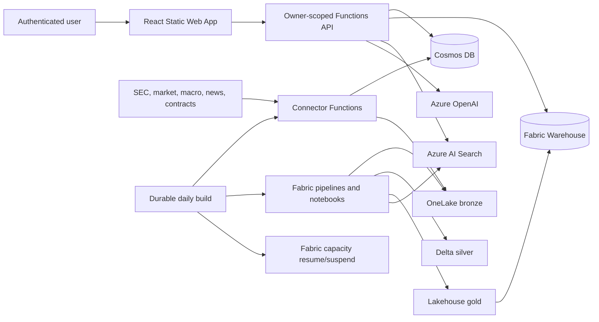
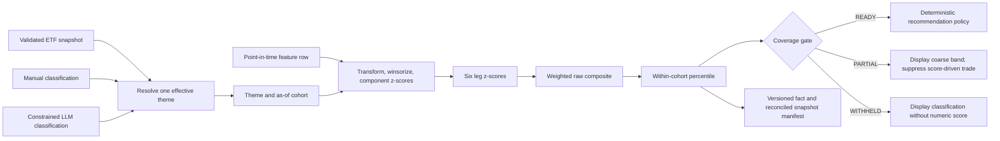
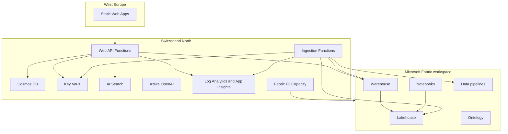

# Auspex Architecture

This document follows the arc42 structure and describes the deployable system represented by this repository. Deployment-specific identifiers, hostnames, credentials, run evidence, and local operating state are intentionally excluded.

## 1. Introduction And Goals

Auspex is a multi-user MVP financial research application for stocks and ETFs. It collects public market and regulatory information, produces point-in-time quantitative and narrative features, ranks securities relative to thematic peer cohorts, values a manual portfolio in a configurable **base currency (default USD)**, and presents evidence-backed advisory actions.

Auspex is advisory only. It does not execute trades, connect to brokers or banks, hold funds, or move money.

The Opportunity Score is a peer-relative percentile, not an absolute estimate of quality, fair value, probability of success, or expected return. A value such as `90` means that the current six-leg composite ranks at approximately the 90th percentile of the selected theme cohort on that as-of date. It does not mean a 90% return probability or that the company is objectively attractive.

### Quality goals

1. **Point-in-time correctness:** no feature or recommendation may use information unavailable at its requested as-of date.
2. **Owner isolation:** one user cannot read or mutate another user's profile, ledger, portfolio, discussion, or recommendation state.
3. **Replay convergence:** rerunning ingestion, transformation, or publication produces the same effective state without duplicate business facts.
4. **Evidence grounding:** every explanation links to retrievable evidence and communicates coverage gaps.
5. **Operational cost control:** Microsoft Fabric F2 capacity is active only around scheduled builds and deployments.
6. **Portable deployment:** tracked source contains no tenant, subscription, workspace, item, endpoint, user, or secret binding.

### Stakeholders

- Individual investors use the application for research and manual portfolio tracking.
- Operators provision Azure/Fabric, configure sources, monitor builds, and handle recovery.
- Developers add connectors, transformations, metrics, policies, and user workflows.
- Security and compliance reviewers verify isolation, identity, data retention, and advisory boundaries.

## 2. Constraints

- Azure first-party services only.
- Microsoft Fabric is the analytical data platform.
- Azure resources use Switzerland North where the service is available.
- Processing is scheduled batch only; no streaming is required.
- Azure infrastructure is Bicep; Fabric items use Fabric Git definitions and REST deployment.
- Python 3.12 is used for Functions and domain services; PySpark for Fabric transforms; T-SQL for Warehouse; React and TypeScript for the SPA.
- Raw records are preserved as NDJSON in bronze, normalized to Delta in silver, and served as Warehouse star-schema tables/views in gold.
- Timestamps are UTC. Monetary analytics normalize through `fact_fx_rate`; portfolio valuation defaults to USD while retaining other supported base currencies.
- SEC 13F `knowledge_date` is the filing date, never the reporting quarter end.

## 3. Context And Scope



### External interfaces

- SEC EDGAR: Form 4, 13F, 13D/G, 8-K, S-1, company facts, and N-PORT.
- Market and news providers: prices, benchmark prices, fundamentals, FX, ETF holdings, and company news.
- Public macro/contract sources: official macro series and USASpending contract awards.
- Microsoft identity platform: personal Microsoft account authentication through Static Web Apps custom authentication.
- Azure management and Fabric REST APIs: capacity operations, item deployment, job scheduling, and workspace role assignment.

## 4. Solution Strategy

### Medallion and control planes

The data plane is `bronze -> silver -> gold`. The operational control plane in Cosmos DB stores source configuration, watermarks, run logs, deduplication markers, model caches, serving projections, and owner-scoped application data.

Each connector implements a common contract: read watermark, fetch a bounded source window, calculate a schema-versioned deterministic batch ID, check deduplication, write the untouched raw envelope to bronze, record the run, and advance the watermark only after the write succeeds.

### Deterministic analytics

PySpark notebooks parse and deduplicate source records, resolve securities/entities, enforce data-quality gates, calculate factors, and publish versioned, content-addressed completed snapshot manifests. Warehouse stored procedures validate row counts/fingerprints and replace serving snapshots transactionally.

Recommendation policy is deterministic. Azure OpenAI extracts bounded narrative features and generates grounded explanations, but it does not control ranking, suitability, transaction state, or execution.

Theme classification has three explicit provenance levels. Point-in-time manual classifications have first priority, constrained LLM classifications have second priority, and tracked ETF membership is the default proxy. Manual and LLM classification establish cohort membership but do not manufacture quantitative ETF exposure, so their scores are five-of-six `PARTIAL` results. LLM classifications are sensors rather than authoritative decisions: they use an allowlisted theme catalog, are capped at `0.85` confidence, add a provenance coverage reason, and cannot override a manual row.

### Isolation by construction

The API resolves the authenticated principal to an immutable `owner_user_sk`. Per-user repositories expose only methods that require owner scope. Cosmos ledger rows share an owner partition key so parent transactions and linked cost rows can be committed atomically. Shared market/evidence data remains outside owner partitions.

## 5. Building Blocks

### 5.1 Ingestion Functions

`connectors/` contains one connector per source and shared infrastructure for HTTP retry, source registry, watermarking, envelope creation, bronze writes, and deterministic identity. Azure Functions expose bounded manual triggers and the Durable daily orchestration. The ordered notebook sequences are mirrored in `connectors/shared/notebook_pipelines.json`; tests require exact parity with the deployable Fabric pipeline manifest.

The daily schedule selects sources by declared cadence. Daily Alpha Vantage work uses `news_daily` and `macro_daily`; weekly and quarterly profiles run only when due. Alpha Vantage profile limits are promoted to Durable page checkpoints. Price and SEC Company Facts ingestion are paged at 50 symbols; SEC archive enrichment is paged at 50 filings. Durable checkpoints between pages; the watermark advances only after the final complete page. A short or provider-error page fails closed. A failed required connector aborts downstream publication.

### 5.2 OneLake And Fabric Notebooks

The canonical bronze path is:

```text
bronze/{source_id}/{yyyy}/{mm}/{dd}/{batch_id}.ndjson
```

Silver Delta tables include insider transactions, prices, filings, ownership events, contracts, macro data, fundamentals, FX, ETF holdings, and owner-scoped portfolio projections. Delta `MERGE` operations use natural keys and correction semantics.

Gold uses dimensions (`dim_security`, `dim_date`, `dim_entity`, `dim_source`) and facts/views for market features, evidence, fundamental anchors, narrative intensity/premium, opportunity scores, and portfolio state.

#### 5.2.1 Theme classification and cohort construction

The scoring unit is `(theme_id, security_sk, as_of)`. A security must first be assigned to a theme cohort. The current theme catalog and proxy ETFs are:

| Theme | Proxy or blend | Purpose |
| --- | --- | --- |
| `ai_compute_semiconductors` | SMH | AI compute and semiconductor supply chain |
| `enterprise_technology` | XLK | Broad enterprise technology |
| `energy_security_producers` | XLE | Energy security and producers |
| `healthcare` | XLV | Healthcare |
| `data_center_buildout` | 50% DTCR, 25% PAVE, 25% GRID | Data-center facilities, power, cooling, connectivity, and construction |
| `quantum_computing` | QTUM benchmark; no ETF-derived cohort yet | Explicit classification for quantum-computing businesses |

ETF holdings are source observations, not a semantic truth set. Notebook 05 validates complete component snapshots, resolves constituent tickers point in time, normalizes weights within each ETF, applies the configured blend, and publishes `fact_theme_membership`. Cash, futures, unresolved instruments, incomplete snapshots, and conflicting weights are excluded or quarantined. The latest completed snapshot known by the score date supplies the ETF cohort.

`security_theme_classification` provides an auditable override path with `classification_id`, `security_sk`, `theme_id`, `provenance`, `confidence`, `rationale`, effective dates, version, and update time. For each security/date, Notebook 04 selects one active classification in this order:

1. `manual`, then highest confidence, newest update, and deterministic ID.
2. `llm`, then highest confidence, newest update, and deterministic ID.
3. ETF membership if no active classification exists.

An explicit classification replaces all ETF memberships for that security on that date. This avoids choosing whichever of several ETF themes happens to produce the highest score. The current `manual_v1` seed classifies the ten portfolio holdings with confidence `1.0` and a recorded rationale. It is effective from 4 August 2026; its update timestamp is fixed to that decision boundary so replays converge. A new version is required when the portfolio, business model, or taxonomy changes.

| Ticker | Manual theme | Recorded rationale |
| --- | --- | --- |
| AMD | `data_center_buildout` | Compute accelerators used in data-center infrastructure |
| AVGO | `data_center_buildout` | Networking and custom silicon used in data centers |
| CAMT | `ai_compute_semiconductors` | Semiconductor inspection and metrology equipment |
| COHR | `data_center_buildout` | Optical communications components used in data-center interconnects |
| INTC | `data_center_buildout` | Data-center processors, accelerators, and platform infrastructure |
| MRVL | `data_center_buildout` | Data-center connectivity, switching, and custom silicon |
| NVDA | `ai_compute_semiconductors` | AI accelerators and compute platforms |
| PLTR | `enterprise_technology` | Enterprise data and software platform |
| RGTI | `quantum_computing` | Quantum processors and cloud quantum-computing systems |
| VRT | `data_center_buildout` | Power, cooling, and infrastructure for data centers |

The second classifier path operates only for portfolio securities without an existing classification document. It obtains the latest SEC 10-K Item 1 or 20-F Item 4 business section, sends only that bounded text and the allowlisted theme catalog to Azure OpenAI, validates an exact JSON schema, caps confidence at `0.85`, records the annual filing accession and description hash in Bronze, and writes `provenance = llm`. Invalid output, unsupported themes, short/unextractable descriptions, missing filings, or source errors result in no classification rather than a guess. Notebook 05 revalidates security identity, theme allowlist, confidence, dates, and provenance before Gold merge.

This design deliberately separates **classification coverage** from **score coverage**. A security can display a theme while its numeric score remains withheld. For example, a one-security quantum cohort is classified but cannot be ranked until the cohort contains at least eight securities.

#### 5.2.2 Fundamental anchor and narrative models

The E20 fundamental anchor estimates whether valuation multiples are stretched relative to sector peers after controlling for business fundamentals. It considers positive EV/Sales, EV/EBITDA, and price/free-cash-flow multiples. For each as-of date and sector:

- Inputs are winsorized at the 1st and 99th percentiles.
- Regressors are revenue growth, gross margin, profit margin, net debt/EBITDA, free-cash-flow yield, and cash-burn flag.
- Missing regressors are median-imputed and recorded in `imputed_flags`.
- With enough peers and residual degrees of freedom, a Huber robust regression is fitted. Otherwise a peer-percentile fallback is used.
- Standardized residuals from available multiples are averaged into `anchor_residual`, then standardized across the as-of population as `fundamental_anchor_z`.
- A positive anchor means valuation is richer than the fitted peer expectation. The Opportunity Score reverses its direction in the valuation-brake leg, so richer valuation lowers the composite.

The E21 narrative model is separate from the six-leg score. Azure OpenAI extracts bounded JSON from evidence excerpts: sentiment, relevance, forward-promise ratio, hype density, up to five normalized themes, and exact evidence indexes. Cache identity includes document revision, model version, prompt version, and prompt hash.

Narrative intensity is deterministic after extraction. Its supported components and weights are sentiment strength `10%`, sentiment-velocity strength `10%`, theme concentration `15%`, forward-promise ratio `25%`, hype density `20%`, news attention `15%`, and insider divergence `5%`. Available weights are renormalized. Intensity is withheld with fewer than three extracted documents or less than `0.50` available weight. Unsupported management-reality-gap, revision-dispersion, and options-skew inputs are disclosed as coverage reasons rather than silently synthesized.

E22 narrative premium asks a different question: whether narrative intensity covaries with the fundamental anchor across an eligible cohort. It requires at least eight eligible securities, a common component mask, nonzero intensity and anchor variance, and a positive fitted beta. It publishes the fitted premium, unexplained residual, divergence state, evidence pack, input hash, fit-context hash, and prior-state convergence test. Narrative premium is visible beside Opportunity Score but is not one of the six Opportunity Score contributions.

#### 5.2.3 Opportunity Score: exact six-leg method

The implemented model is `e6b_v2` with weight set `e6b_balanced_v1`. It is deterministic once its point-in-time inputs and cohort classification are fixed. The minimum cohort is eight securities.



| Leg | Weight | Raw inputs | Direction and interpretation |
| --- | ---: | --- | --- |
| Thesis linkage | 20% | ETF blended membership weight | Higher ETF weight means stronger measured linkage to the selected theme. Explicit manual/LLM classifications establish the cohort but do not fabricate economic exposure; this leg is missing for them. It is a proxy, not a revenue-attribution measure. |
| Attention acceleration | 15% | 30-day news-volume z-score | Higher recent attention raises the leg. It measures acceleration, not whether attention is favorable. |
| Smart money | 20% | 90-day insider net-buy ratio, 30-day insider cluster buys, quarter-over-quarter institutional flow, new institutional initiations, log-transformed trailing 90-day contract awards, activist 13D flag | The equally averaged subcomponents reward positive ownership/award signals. Missing subcomponents receive component z-score zero and make coverage partial, but the later leg re-standardization means their final contribution is not guaranteed to remain zero. |
| Fundamental health | 20% | Profit margin, year-over-year revenue growth, free-cash-flow yield, inverse net debt/EBITDA | Higher profitability, growth, cash generation, and lower leverage raise the leg. This leg can penalize a growing company if its margin, cash flow, or leverage ranks poorly versus the same cohort. |
| Valuation brake | 15% | Inverse `fundamental_anchor_z` | A richer-than-expected peer valuation lowers the score. It is deliberately a brake, so strong growth can coexist with a low score when valuation is especially stretched. |
| Crowding and positioning | 10% | Inverse 30-day news count and inverse institutional-holder count | Lower measured attention and ownership raise the leg as a proxy for under-recognition. It is a coarse crowding proxy, not market-position or short-interest analysis. |

For every raw component, the engine applies the following within the same theme/date cohort:

1. Transform direction where specified: contract awards use `log1p(max(value, 0))`; leverage, valuation anchor, news count, and holder count are sign-reversed.
2. Winsorize observed values at the 1st and 99th percentiles.
3. Calculate a sample z-score. A missing input removes its complete leg from that security and adds a `missing:<field>` coverage reason.
4. Equally average subcomponents within a multi-input leg.
5. Winsorize and z-score each resulting leg again, preventing a multi-input leg from having an arbitrary scale.
6. Apply the configured weights for available complete legs. For a partial observation, multiply by $\sqrt{\sum_l w_l^2 / \sum_{l \in A_i} w_l^2}$, where $A_i$ is its available-leg set. Under the simplifying assumption of independent unit-variance legs, this restores the full model's composite variance without pretending the missing leg was observed.

For security $i$ and leg $l$, the raw composite is:

$$
R_i = \sum_l w_l z_{i,l}, \qquad \sum_l w_l = 1
$$

The displayed score is not a logistic transform of $R_i$. It is the empirical percentile rank of $R_i$ in the theme cohort:

$$
\operatorname{Score}_i = 100 \times \frac{\operatorname{firstRank}(R_i)}{N-1}
$$

where rank is zero-based and ascending. Equal raw scores receive the first, therefore lower, tied rank. If all raw scores are equal, every score is `50`. A score of `1.4` in a 74-security cohort corresponds to rank 1 of 73 intervals: the second-lowest raw composite in that cohort. It does not by itself indicate missing data.

Coverage is explicit:

| Status | Rule | Product behavior |
| --- | --- | --- |
| `READY` | Cohort has at least eight securities, all required inputs are present, and classification uses quantitative ETF linkage | Numeric score may drive policy. UI shows one decimal. |
| `PARTIAL` | Score is computable but at least one complete leg is unavailable. Manual and LLM classifications both lack quantitative ETF linkage; LLM adds a provenance reason. | Variance-corrected numeric result is retained for audit, UI shows a coarse 10-point band, and recommendation policy suppresses score-driven trades. |
| `WITHHELD` | Cohort has fewer than eight securities | No numeric score or leg contribution is published. Classification may still be displayed. |

Every fact stores candidate source (`TRS`, `MANUAL`, or `LLM`), candidate snapshot identity/time, cohort count/hash, six z-scores and contributions, raw composite, percentile, reasons, maximum knowledge date, model version, and weight version. The current snapshot manifest stores generation, date, status counts, row count, sorted-score-ID fingerprint, creation/completion times, and version tuple. Classification updates, ETF snapshot updates, weight updates, or a model-version change invalidate the completed score date.

#### 5.2.4 How to interpret score distributions

High scores are expected by construction. In a sufficiently large cohort, approximately 10% of securities must be above the 90th percentile even when the whole theme is unattractive in absolute terms. A portfolio assembled from favored themes or previously selected winners is not a random cohort sample, so four holdings above 90 is possible and is not evidence of four independent high-conviction forecasts.

Scores from different themes share a 0-100 display scale but do not share one fitted distribution. A 90 in healthcare and a 90 in data-center buildout each means top-decile within its own cohort; it does not prove equal expected return, risk, valuation, or evidence quality. Cohort size also determines score granularity: an 18-name cohort advances in steps of about `5.9`, while a 99-name cohort advances in steps of about `1.0`.

ETF-derived securities can belong to more than one theme. Outside explicit classifications, serving currently selects the highest same-date score for a security. This creates a max-of-themes selection bias and can increase the number of extreme scores visible in a mixed portfolio. The manual single-theme classification for current holdings removes that effect for those holdings, but the general engine limitation remains.

The model is therefore a **relative ranking instrument**, not a calibrated return model. Operators and auditors should inspect the selected theme, cohort size, source provenance, coverage status, six contributions, and underlying raw features before interpreting an extreme score.

#### 5.2.5 Deterministic recommendation policy

The E15 recommendation policy consumes the selected per-security score; it does not recompute or reinterpret the six legs. Only `READY` coverage can create a score-driven buy, add, sell, or trim. `PARTIAL` and `WITHHELD` coverage are suppressed with reason `coverage`. An overweight position may still be trimmed to its risk-policy cap independently of score coverage.

Score-to-target mapping is:

| Score percentile | Proposed target before portfolio constraints |
| ---: | --- |
| `>= 80` | 100% of the profile maximum position weight |
| `>= 70` | 75% of the profile maximum position weight |
| `>= 60` | 50% of the profile maximum position weight |
| `< 60` | No score-driven increase |
| `< 45` for an existing READY holding | Proposed exit to zero |

The policy never reduces an existing position merely because the positive target mapping is below its current weight; only the `<45` exit rule or the maximum-position cap proposes a reduction.

| Risk profile | Maximum position | Cash buffer | Minimum trade in base currency |
| --- | ---: | ---: | ---: |
| Conservative | 6% | 20% | 750 |
| Balanced | 10% | 12% | 500 |
| Growth | 13% | 8% | 400 |
| Aggressive | 16% | 5% | 300 |

Available cash is cash above the profile buffer. A buy/add is capped by available cash. Estimated transaction cost is brokerage `max(5, 0.05% of notional)`, bid/ask spread from the serving projection, and Swiss stamp duty `0.075%` for Swiss securities or `0.15%` otherwise. A proposed trade becomes HOLD if it is below the minimum trade or estimated cost is not lower than the policy's heuristic expected edge.

The expected-edge heuristic is `10% of notional` for an overweight trim, `(score - 60)% of notional` for buys/adds, and `(50 - score)% of notional` for sells/trims, floored at zero. This is a policy gate, not a forecast or backtested alpha estimate. Confidence is LOW for non-READY coverage, HIGH for READY scores at least 75 or at most 35, and MEDIUM otherwise. Twenty-four or more projected annual trades adds a Swiss professional-securities-dealer review flag; it is not tax advice.

Recommendation identity hashes the security, action, current/target weight, signed amount, as-of date, and policy model version. User acceptance/dismissal is immutable application state; no action places a trade.

### 5.3 Warehouse

`fabric/warehouse/` defines serving dimensions, facts, metric views, metadata, and promotion procedures. Promotion contracts reconcile completed Lakehouse manifests before making a snapshot visible. E22 release promotion combines narrative premium and full Gold promotion under one audited transaction; portfolio promotion is replay-safe and owner preserving.

### 5.4 Ledger v5

A logical broker event is an atomic bundle:

- One parent row for deposit, withdrawal, buy, sell, dividend, interest, tax, fee, split, transfer, or correction.
- Zero or more linked `FEE` rows categorized as broker commission, transaction tax, withholding tax, VAT, custody fee, account fee, or other fee.
- Source/listing currency, settlement currency, source amount, gross settlement amount, actual FX rate, and signed net cash are retained separately.
- Imported opening acquisition costs can affect tax basis without debiting current cash.
- Corrections append replacement state and cascade to linked children; history is never rewritten.

Cosmos transactional batches enforce bundle atomicity and a ledger revision document provides optimistic concurrency.

### 5.5 Web API

`api/` exposes authenticated profile, universe, ledger, portfolio, recommendation, evidence, and discussion operations. It reads shared analytical state from Warehouse/Search and owner state from Cosmos. Every mutation validates owner scope, payload bounds, currencies, transaction relationships, and correction rules.

### 5.6 Web Application

`web/` is a React SPA deployed to Azure Static Web Apps. It provides candidate ranking, evidence, portfolio summaries, a broker-style ledger editor, recommendations, settings, and grounded discussion. The ledger UI supports settlement/source FX and repeatable categorized costs on both buys and sells.

### 5.7 Search And Agent

`search/` builds a hybrid/vector evidence index with deterministic document IDs and revisions. E21 uses a versioned prompt and immutable Cosmos cache to extract sentiment, relevance, forward-promise ratio, hype density, themes, and supporting excerpts. Daily E21 eligibility is bounded to the three newest current news documents per security in the active portfolio/theme universe; publication reconciles that bounded cohort while the evidence store retains older documents.

`agent/` retrieves point-in-time evidence and narrates deterministic policy output. Missing or failed evidence produces an explicit degraded response rather than an unsupported claim. The web application identifies direct AI interaction and marks generated explanations and discussion turns in the DOM.

### 5.8 Infrastructure And Delivery

`infra/bootstrap-fabric.bicep` creates the deterministic data resource group and F2 capacity needed before tenant-side Fabric items can be created. `infra/main.bicep` provisions the full resource groups, Functions Flex Consumption apps, Cosmos DB serverless, private Key Vault, Azure AI Search, Azure OpenAI, monitoring, networking, Static Web Apps, and Fabric F2 capacity. Managed identities and scoped roles replace account keys. Enabled-source credentials enter Key Vault through secure deployment parameters.

`.github/workflows/ci.yml` validates Python, frontend, and both Bicep entry points. `.github/workflows/deploy.yml` uses GitHub workload identity federation, grants the ingestion identity Fabric Contributor access, deploys all application/Fabric/Warehouse layers through the generic deployers, narrows Cosmos roles, and guards capacity with an always-run suspension step.

## 6. Runtime View

### Daily build


The state machine serializes publication boundaries. Each notebook is started and monitored through the Fabric Job Scheduler API, with a Durable checkpoint between notebooks and Durable timers for polling. The tracked Fabric Data Pipeline remains a deployable/manual representation of the same order, but unattended execution does not invoke it: Fabric pipeline notebook activities run under the pipeline's last modified user and can fail when a managed-identity caller cannot acquire that user's token. Direct Notebook Job Scheduler execution is the supported service-principal/managed-identity boundary. This identity distinction follows Microsoft's [Fabric notebook security-context guidance](https://learn.microsoft.com/fabric/data-engineering/how-to-use-notebook#security-context-of-running-notebook). Narrative page cursors must advance. Warehouse release IDs are deterministic by date and an existing successful release is treated as idempotent completion. The timer uses one deterministic instance ID per UTC date. Failed, canceled, or terminated instances are purged and restarted at the next configured window; running or completed instances are not duplicated. Current windows are 01:00, 04:00, and 07:00 UTC. The build date is knowledge time: a 5 August build normally ingests the completed 4 August market session.

### Ledger write

1. API resolves the authenticated owner and validates the parent plus cost components.
2. Deterministic component IDs are derived from the parent ID and ordinal.
3. Repository validates projected cash, units, correction relationships, and ledger revision.
4. Cosmos commits parent, children, and revision in one owner-partition transactional batch.
5. Fabric derives effective rows and excludes superseded parent/children during the next publication.

### Point-in-time query

1. Caller supplies or receives a bounded as-of date.
2. Shared facts filter `event_date <= as_of` and `knowledge_date <= as_of`.
3. Snapshot manifests select only completed generations.
4. Owner facts additionally filter `owner_user_sk`.
5. Evidence retrieval uses the same security/date scope as the deterministic recommendation.

## 7. Deployment View



Fabric workspace, Lakehouse, and Warehouse are tenant items created after the capacity bootstrap and before the full deployment. Tracked definitions carry public placeholders; deployment injects workspace/Lakehouse bindings and the SEC contact. Local overrides are ignored by Git.

## 8. Cross-Cutting Concepts

### Identity and secrets

- Functions use system-assigned managed identities.
- GitHub Actions uses OIDC federation; no Azure client secret is required.
- Source credentials and the Static Web Apps auth secret are Key Vault-backed.
- Fabric workspace roles are assigned through the Fabric REST API; capacity control uses Azure RBAC.
- Cosmos data-plane roles are narrowed separately for ingestion and web identities.

### PIT and knowledge time

`event_date` answers when an event happened. `knowledge_date` answers when Auspex could first know it. Both are mandatory where the distinction matters. Corrections and amended filings preserve their own knowledge time. Feature and recommendation queries never select a row with future knowledge.

### Idempotency and immutable identity

Bronze batch IDs include schema version. Silver uses natural-key `MERGE`. Model cache keys include document revision, model version, and prompt version. Serving generations include deterministic fingerprints. Warehouse promotion audit IDs prevent duplicate releases while allowing safe retry after a lost response.

### Data quality

Parse errors and semantic violations enter explicit quarantine/audit tables. Required-source freshness and completeness gates run before destructive publication. Missing prices, FX, evidence, or narrative coverage produces pending/partial/withheld states rather than fabricated values.

Score publication is fail-closed. A completed score manifest must reconcile its row count, READY/PARTIAL/WITHHELD counts, sorted score-ID fingerprint, model/weight versions, and fact rows. Warehouse promotion repeats source/target row-count and manifest checks inside a transaction. Manual and LLM classifications are promoted with their provenance, confidence, rationale, effective dates, and version. LLM confidence above `0.85`, unsupported provenance, invalid dates, duplicate classification IDs, unsupported themes, or unresolved securities fail ingestion or promotion.

### Observability

Functions send traces and exceptions to Application Insights. Daily activities emit `CapacityResumed`, `CapacitySuspended`, `DailyBuildCompleted`, `DailyBuildFailed`, `RequiredConnectorFailed`, and `OptionalConnectorFailed` messages. Required failure blocks publication and alerts; optional classifier failure records degraded classification coverage but does not block market/Fabric publication. Alerts detect failure, a missing UTC completion, and capacity remaining active beyond four hours.

### Currency

Cash and portfolio values preserve transaction currency and actual settlement conversion. Shared analytics use USD normalization through `fact_fx_rate`. User profile base currency supports USD, CHF, and EUR; USD is the default. Unsupported or missing FX produces an explicit incomplete valuation.

### Regulatory boundary

Auspex has no trade execution, broker integration, custody, credit, insurance, or legal-effect decision path. Personalized suggestions remain an MVP capability and do not implement a complete MiFID II or FinSA suitability journey. The implemented controls include versioned AI/model inventory, deterministic recommendation policy, evidence validation, owner isolation, generated-output disclosure, immutable decisions, and operational telemetry. Privacy operations, regulated-advice governance, formal model validation, organizational resilience, outsourcing approval, and jurisdiction-specific legal documents remain deployment-owner or production gates documented in `doc/compliance-mvp.md`.

## 9. Architecture Decisions

| Decision | Rationale | Consequence |
| --- | --- | --- |
| Fabric medallion architecture | Native Azure analytical platform and auditable batch lineage | Fabric workspace items require a separate deployment API |
| Durable Functions plus Notebook Job Scheduler | Replay-safe unattended workflow without a pipeline last-modified-user token dependency | Orchestrator code and mirrored notebook order must remain deterministic |
| Cosmos owner partition | Atomic ledger bundles and structural tenant isolation | Cross-owner operations are intentionally absent |
| Append-only ledger corrections | Auditability and broker-style history | Effective-state derivation is required downstream |
| Deterministic policy plus model narration | Recommendations remain testable and bounded | Generated prose cannot override policy |
| Peer-relative six-leg score | Makes thematic ranking inspectable and contribution-based | Scores are percentiles, not calibrated forecasts; cross-theme comparison is limited |
| Provenance-prioritized theme classification | Corrects ETF omissions without pretending all classifications are equivalent | Manual maintenance and LLM governance are required; explicit classifications remain five-of-six partial scores unless quantitative exposure is supplied |
| Explicit knowledge time | Prevents look-ahead in filings and delayed data | Every transform/query must preserve PIT fields |
| Pausable F2 capacity | Controls MVP cost | Build and deployment paths must guarantee suspension |
| Deployment-time Fabric binding | Public repository remains reusable | Deployment requires workspace/Lakehouse identifiers and access |

## 10. Quality Requirements

- Replaying a successful connector window does not create a second business batch.
- A failed bronze write does not advance its watermark.
- A failed required connector cannot trigger serving publication.
- Capacity suspension is requested after resume failure and after every downstream failure.
- A user-scoped repository cannot be called without `owner_user_sk`.
- Parent and linked ledger costs either all commit or none commit.
- Corrected rows and their linked children are excluded from effective position/cash state.
- Recommendation and explanation evidence is PIT-safe and revision matched.
- Every score fact is tied to one theme/date cohort, candidate source, cohort snapshot, model version, weight version, and completed manifest.
- Manual/LLM-classified securities cannot produce READY coverage without quantitative theme exposure; cohorts below eight cannot produce a numeric score.
- A classified security may remain visibly unscored. The API never substitutes a classification for a score.
- A Warehouse promotion reconciles manifest fingerprints and source/target counts before commit.
- The complete Python suite, frontend lint/build/audit, and Bicep compile must pass before deployment.

## 11. Risks And Technical Debt

- Market/news free tiers have licensing and rate limits; commercial use requires provider review and potentially paid plans.
- Yahoo price fallback is unofficial and disabled by default.
- Fabric workspace creation is not covered by Bicep and remains a prerequisite.
- Static Web Apps is outside Switzerland North because of regional availability.
- Private endpoints and WAF are outside MVP scope; production exposure must be reviewed against organizational policy.
- Ledger data must be populated by users or an approved import process; Auspex does not infer broker history.
- ETF holdings are investable-product definitions, not a complete economic taxonomy. Provider lag, ETF methodology, turnover, caps, liquidity screens, and blend overlap can omit economically relevant companies or include weakly related ones.
- Manual classifications are an explicit governed override, currently seeded for ten portfolio holdings. They require review when business models, tickers, taxonomy, or portfolio composition changes.
- The LLM classifier reads bounded annual-filing business text and an allowlist. It does not estimate revenue exposure, multi-theme percentages, or causal relevance. It can be wrong even with high self-reported confidence; confidence is capped and downstream coverage remains partial.
- The current taxonomy assigns one effective theme to explicitly classified securities. Conglomerates and multi-theme businesses lose information. A future model should represent theme exposure as a versioned probability or revenue-share vector rather than one label.
- The percentile transform forces extremes in every viable cohort and does not measure absolute opportunity. Cross-theme percentiles are not calibrated to a common return distribution.
- ETF securities with several memberships can surface their maximum theme score, creating selection bias. This should be replaced by an explicit primary-theme rule, multi-theme aggregation, or portfolio-level calibration.
- Several legs are statistically and economically correlated: news volume with news count, institutional flows with holder count, and growth/margins with the valuation anchor. Fixed weights do not eliminate double counting.
- Missing numeric inputs remove their complete leg and produce PARTIAL coverage. The remaining weighted composite is rescaled by the independent-leg variance ratio. This is more honest than neutral imputation but remains an approximation because the six legs are correlated. Partial scores are displayed as bands and cannot drive score-based trades; a future model should estimate covariance and predictive uncertainty explicitly.
- The fundamental anchor is a relative multiple model, not discounted cash flow. Young, cyclical, capital-intensive, negative-FCF, or rapidly changing companies can receive severe valuation/fundamental penalties despite strong thematic growth.
- Recommendation thresholds (`80`, `70`, `60`, and `45`) operate on cohort percentiles. They have not been calibrated to realized forward returns, drawdowns, or probability of outperformance.
- Notebook 04 currently replaces the Lakehouse score facts and score manifest before rebuilding the current bounded projection. Content identities are deterministic, but longitudinal score-manifest retention depends on Warehouse release/audit retention or an external archive; the Lakehouse table alone is not an immutable model-history ledger.
- A second authenticated-user acceptance run is required before declaring a particular production tenant's isolation configuration operationally accepted.
- The repository is not a legal certification. External or production use requires the deploying entity's privacy, AI-governance, financial-services, resilience, outsourcing, complaint, and regulatory approvals.

## 12. Glossary

| Term | Meaning |
| --- | --- |
| PIT | Point in time; state constrained by event and knowledge dates |
| RAGS | Risk-adjusted growth score used by deterministic ranking |
| Opportunity Score | 0-100 within-theme percentile of the weighted six-leg composite; not a forecast |
| Fundamental anchor | Peer-relative residual valuation model used as the valuation brake |
| TRS | Thematic reference set derived from validated ETF constituent snapshots |
| READY | Complete score coverage that may enter recommendation policy |
| PARTIAL | Variance-corrected computable score with at least one unavailable leg, shown as a band and suppressed by policy |
| WITHHELD | No numeric score because the cohort or required model contract is insufficient |
| Classification provenance | `manual`, `llm`, or ETF/TRS origin used to assign a security to a theme |
| E21 | Immutable narrative feature extraction and intensity stage |
| E22 | Narrative premium, evidence decision log, and release stage |
| Serving projection | Versioned JSON projection synchronized into Cosmos or Search |
| Ledger bundle | One parent transaction plus zero or more linked categorized cost rows |
| Promotion | Validated replacement of a completed Lakehouse snapshot in Warehouse |
