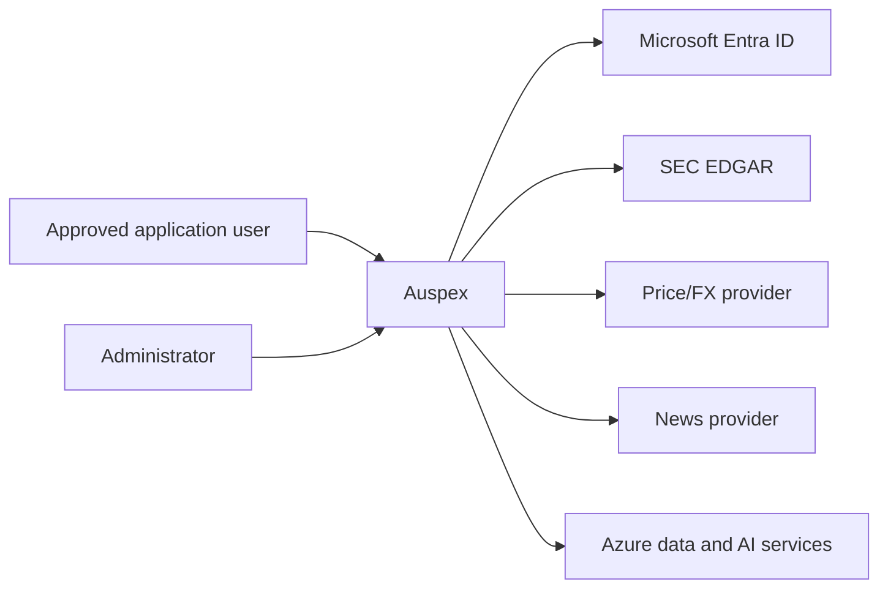

# Auspex architecture (Arc42)

**Status:** Current implementation
**Scope:** Approval-gated multi-user regulated-AI financial research MVP
**Platform:** Microsoft Azure

## 1. Introduction and goals

Auspex demonstrates how AI can be useful in financial research without making
the model the decision authority.

The system:

- ingests point-in-time market, regulatory and news evidence;
- uses constrained AI extraction to structure qualitative evidence;
- computes deterministic, reproducible scores and portfolio policy;
- explains stored facts, scores and gate traces conversationally;
- leaves every investment decision and trade outside the system.

The primary quality goals are:

1. **Auditability** — every score and suggestion is traceable to versioned data,
   configuration and policy gates.
2. **Determinism** — numeric scoring and action policy use `Decimal` arithmetic,
   not generative output.
3. **Grounding** — explanations use retrieved Auspex data and cited evidence.
4. **Security** — managed identity, least privilege, private data services and
   no broker credentials.
5. **Operability** — idempotent jobs, resumable bootstrap, health checks,
   telemetry and self-measurement.
6. **Human accountability** — Auspex is directional decision support only.

## 2. Constraints

- Python 3.12 backend and jobs.
- React/TypeScript frontend.
- One immutable image for API and jobs.
- Microsoft Entra authentication.
- Azure managed identity for workload access.
- Azure Cosmos DB for operational data.
- Azure Blob Storage for raw evidence.
- Azure OpenAI for extraction and grounded language generation.
- SEC EDGAR rate limits and identification requirements.
- A configured, bounded security universe.
- A single authenticated portfolio owner in the MVP.
- No broker integration or trade execution.

## 3. Context and scope

### 3.1 Users and external systems



Each user maintains their own transactions manually and sees only their own
portfolio, recommendations and conversations. An administrator manages who may
access the system, never what those users hold. External providers supply
research inputs only. Auspex does not submit orders.

### 3.2 Product boundary

Inside the boundary:

- evidence ingestion and retention;
- qualitative extraction;
- six-leg scoring and peer normalization;
- portfolio projection and policy;
- grounded analysis and conversation;
- recommendation disposition and performance measurement.

Outside the boundary:

- brokerage and execution;
- custody and settlement;
- suitability approval by a regulated institution;
- legal or tax advice;
- guaranteed outcomes.

## 4. Solution strategy

The governing pattern is:

> AI reads. Deterministic code decides. AI explains. A human acts.

AI is used where language understanding adds value:

- filing and news extraction;
- comparative filing digests;
- concise score narratives;
- grounded question answering.

AI is not used for:

- market prices or XBRL values;
- percentile normalization;
- six-leg arithmetic;
- policy thresholds;
- portfolio quantities;
- cash settlement;
- performance attribution.

This separation constrains model risk and makes core outcomes reproducible.

## 5. Building blocks

### 5.1 Frontend

The React SPA provides:

- Home briefing and actionable suggestions;
- Analysis for every configured ticker;
- live portfolio and append-only transaction CRUD;
- grounded Discussion with 15-day history;
- model Performance;
- investor profile, scope and acknowledgements.

MSAL configuration is loaded at runtime from `/auth-config.json`; no tenant or
client ID is compiled into the public bundle.

### 5.2 API

FastAPI:

- validates Entra issuer, audience and signature;
- gates every `/api` route on a database-backed application-user lifecycle,
  so a valid token alone grants nothing;
- scopes all data to the authenticated user, whose identity is always taken
  from the token and never from a request;
- serves the compiled SPA;
- joins score, evidence, portfolio and policy data;
- validates ledger writes and recommendation attribution;
- exposes only `/healthz` and `/auth-config.json` without authentication.

Three route groups exist under `/api`. Each lifecycle verb has exactly one
canonical spelling; the earlier `/api/registration*`, `/api/onboarding/portfolio`
and `/api/account/deletion-{status,request}` aliases have been removed and the
SPA calls the canonical routes.

| Group | Requires | Purpose |
| --- | --- | --- |
| `/api/session/*` | valid token | register, poll approval status |
| `/api/onboarding/*` | approved user | guided onboarding |
| `/api/account/deletion*` | registered user | request and follow erasure |
| everything else | `ACTIVE` user | the product surface |
| `/api/admin/users/*` | `ACTIVE` + `ADMIN` | manage access, never data |

The HTTP boundary is explicitly configured rather than left to defaults: an
allow-listed CORS origin set (empty in the deployed same-origin configuration),
a bounded JWT clock-skew allowance, and per-user sliding-window limits on
registration and chat. Those limits are counted in process, which is exact only
while the API runs a single replica — the pre-production deployment therefore
pins `maxReplicas: 1` and treats deterministic abuse limits as worth more than
horizontal scale until the counter moves to a shared store.

### 5.2.1 Application users

Users are records in `app_users`, partitioned by `user_id` (the stable
surrogate derived from the Entra object ID). Lifecycle:

`UNREGISTERED → PENDING_APPROVAL → APPROVED_NEEDS_ONBOARDING → ACTIVE`, with
`REJECTED`, `SUSPENDED`, `DELETION_PENDING` and `DELETED` as the exception
paths. Only `ACTIVE` reaches product data. `UNREGISTERED` is synthetic — it
describes an authenticated principal with no record yet.

Roles are `ADMIN` and `USER`. `AUSPEX_INITIAL_ADMIN_EMAIL` names the first
administrator so a new deployment has somebody who can approve everyone else;
for a trusted External ID/CIAM issuer, the sign-up email claim is the bootstrap
proof, while workforce deployments bind through the configured immutable owner
OID. It is consulted only while no administrator exists. The first administrator's
immutable Entra `oid` is then written to a singleton authority binding, and
the email setting becomes inert. The final administrator can never be
demoted, rejected, suspended or deleted.

The administrator roster lives in `app_user_index`, a small projection in one
logical partition (`registry`) holding only access-relevant attributes. This
keeps "list all users" a single-partition query instead of a cross-partition
scan of `app_users`, and keeps private user data out of the admin surface
entirely.

### 5.3 Ingestion and evidence

The nightly job collects:

- adjusted and raw daily prices;
- USD/CHF rates;
- SEC submissions and filing documents;
- US-GAAP, IFRS and DEI company facts;
- Form 4 insider transactions for domestic filers;
- licensed news.

Raw filing content is stored in Blob Storage. Section extraction normalizes
filing HTML, targets material annual/quarterly sections and rejects
table-of-contents duplicates.

### 5.4 AI extraction

Channel A emits constrained scoring labels and short evidence excerpts.
Channel B emits a plain-language summary, a prose digest, verbatim key quotes
and a comparative diff for user explanation.

Every quotation Channel B returns is checked against the exact section text the
model was given: an excerpt that is not a whitespace-normalized substring of
that source is dropped, and a plain summary left with no surviving evidence is
discarded with it. Only the excerpts are proven this way — the surrounding
prose is constrained, cited and bounded, but not entailment-proven against the
filing.

Cache keys include the security id, content hash, model, prompt, schema and
taxonomy versions. Including the security id makes the lookup a single-partition
read of that security's own extractions rather than a cross-partition scan.
Replaying unchanged evidence does not invoke the model again.

Malformed output degrades the affected document/security; it does not silently
become numeric input. A Channel A failure degrades that security's score
evidence; a Channel B failure degrades only its explanation.

### 5.5 Scoring

The six legs are:

1. Thesis Linkage
2. Attention Acceleration
3. Narrative Premium
4. Smart Money
5. Fundamental Health
6. Valuation Brake

Domestic filers use all six. Foreign private issuers exclude Smart Money and
redistribute its weight proportionally; `load_weights` validates that
redistribution on every load and refuses the bundle if it drifts, so an FPI can
never be scored on a quietly different model to its domestic peers under the
same `config_version_id`. Fundamental-health sub-metrics are standardized in
peer scope before equal-weight combination. Attention emits one event per
source document, with extraction materiality enriching rather than duplicating
that event.

A leg distinguishes three states. **No evidence at all** is `None`, not zero:
an issuer that published nothing linkable to a theme, or nothing at all inside
the 60-day attention window, is unevidenced rather than measured at the bottom
of its cohort. **Applicable but not computable** — including that unevidenced
case — contributes neutral standardized value zero to the numerator while
keeping its full weight in the denominator, and is excluded from coverage, so
coverage and confidence stay separate signals from the score. **Structurally
inapplicable** legs leave both the numerator and the denominator, and the
coverage denominator too. Native-currency valuation is converted only using
authoritative point-in-time FX at each fact period end; an unavailable rate
makes valuation structurally inapplicable rather than penalizing the issuer.

Scores are winsorized, weighted and midpoint-percentile-ranked. Cohort, parent
and universe statistics are continuously shrinkage-blended — for the leg
z-scores *and* for the composite percentile, so a cohort crossing a ladder
threshold moves a user's reported rank continuously instead of stepping it. The
cohort label and confidence remain separately auditable, and the two size
thresholds that define the ladder (12 cohort members, 8 parent members) are the
single source from which the confidence lambdas are derived.

Staleness, direction and weakening streaks are all measured in **observed
trading sessions**, reconstructed from non-quarantined price bars. A security
whose latest observed price is more than two sessions old is excluded from the
day's cross-sections; when no session calendar can be reconstructed at all the
rule is unevaluable and nothing is excluded on price age, because silently
emptying the universe is worse than scoring a thin day with honest coverage.
Evidence failures that genuinely degrade a score — an unrefreshable price, or a
Channel A extraction that raised — also exclude the security. A Channel B
failure does not: Channel B feeds narratives and digests and no leg, so it
costs the user an explanation, never a score.

Per-leg change is computed against the previous **observed session**, not
calendar yesterday, and is attributed rather than merely reported:
`own_evidence_effect + cohort_distribution_effect == delta_z` exactly, or both
are null with a reason. A score is relative research strength, not expected
return.

### 5.6 Policy

The policy engine evaluates deterministic gates in priority order:

- minimum coverage;
- peer confidence;
- score percentile and direction;
- thesis and valuation thresholds;
- position target and maximum;
- minimum trade;
- estimated cost;
- CHF cash reserve.

Risk profile selects entry/exit thresholds. Horizon and objective set
portfolio turnover, position and cohort risk limits.

Policy first produces per-security candidates. A second deterministic
allocation pass applies one shared CHF cash budget, minimum executable size,
position/cohort limits and stable priority. A risk-aware shadow allocation adds
60-session volatility, daily-value participation, correlation groups, and
objective/horizon turnover limits. The shadow notional is persisted for
measurement but is not presented as executable until promotion gates pass.

Only BUY, ADD, TRIM and SELL are treated as actionable. No-action states are
not recorded as followed recommendations.

### 5.7 Portfolio ledger

`portfolio_transactions` is the source of truth. Events include:

- opening cash and positions;
- deposits and withdrawals;
- buys and sells;
- dividends and interest;
- fees and taxes;
- correction and void events.

Broker commission, stamp duty, withholding tax and other costs are child
components of the parent transaction with their own source currency.

All cash effects settle once into a CHF cash bucket using the transaction FX
rate. Source amounts and currencies remain available for audit. Corrections
preserve child costs unless explicitly replaced.

Each user's events live in their own logical partition. A ledger adapter or
write service instance is bound to exactly one partition for its lifetime and
is constructed per request from the authenticated principal — never cached
process-wide, because a cached binding would serve the first caller's ledger
to everybody afterwards. The partition is normally the user's own `user_id`;
an imported single-owner deployment may pin a legacy `owner_user_sk` on that
user's record so their pre-existing events remain readable under their own
account.

### 5.7.1 Guided onboarding

An approved user completes three resumable, idempotent steps: preferences,
the five regulatory acknowledgements, and a declared initial portfolio. The
initial portfolio must be viable — opening CHF cash above zero, or at least
one position with a positive quantity — because a projection with neither
cannot produce a meaningful recommendation. Completion writes user settings,
seeds the declared opening balances into that user's ledger under
deterministic client request ids, and transitions the account to `ACTIVE`.

Preferences and acknowledgements may also be captured at *registration*, for
clients that present the disclosures during sign-up rather than after
approval. They are stored as the corresponding onboarding steps rather than
applied as live settings — a pending user has none — so an approved user
resumes at the first step they have not yet completed instead of being asked
to repeat one. Acknowledgements are all-or-nothing wherever they are
supplied: a partial or declined set is rejected, never half-stored. The
dedicated per-step endpoints remain the resumable path.

### 5.7.2 Dispositions and decision signatures

Every recommendation carries a versioned **decision signature**: a
fingerprint over the action, quantity, bucketed notional and target weight,
readiness, the pass/fail shape of the gate cascade, and a material-evidence
fingerprint (percentile decile, coverage band, cohort confidence,
direction). Money and weights are bucketed, and percentiles banded, so
ordinary price and score noise does not present the same ask as a new one.

A user's disposition is stored durably per `(user, security)`:

- `REJECTED` suppresses that exact signature indefinitely;
- `DEFERRED` suppresses it for `AUSPEX_DEFERRED_DISPOSITION_DAYS` (7 by
  default), after which it legitimately reappears;
- `ACCEPTED` suppresses nothing.

A materially different decision has a different signature and surfaces
normally without the user clearing anything. Suppressed rows are still
written so the run stays auditable; the API withholds them unless
`include_suppressed` is requested.

### 5.7.3 Account deletion

Deletion is irreversible, idempotent and verified. The account moves to
`DELETION_PENDING` before any data is touched, so gated routes stop serving
it immediately. Before that transition, deletion acquires the same
ETag-protected per-user operation lease held by every active API request,
onboarding write and per-user nightly stage. It therefore waits for in-flight
writers and prevents new ones from starting until the purge has finished.
The holder renews this lease with ETag compare-and-swap; losing ownership or
failing to renew before the last confirmed expiry cancels the work fail-closed
before it can persist another private row.
Each private partition — ledger events, settings,
recommendations, dispositions, projections, conversations, onboarding and
the user-scoped audit trail — is then hard-deleted and re-counted; a target
only completes once it reads back empty. Only when every target verifies
empty are the authoritative user and roster records hard-deleted last.

Shared research (securities, documents, extractions, digests, market data,
fundamentals, scores, leg changes, narratives, config versions, watermarks
and run manifests) is not personal data and is retained, so global score
performance survives. The Entra identity belongs to the identity provider and
is never deleted from here.

### 5.8 Performance

The weekly job computes:

- composite information coefficient;
- per-leg information coefficient;
- leg correlation;
- recommendation outcomes;
- followed/not-followed attribution;
- cohort dispersion and sample sizes.
- IC distribution and ICIR;
- effective non-overlapping sample size;
- Newey-West and seeded moving-block-bootstrap intervals;
- per-date, available-population leg IC/correlation;
- robust and cost-adjusted top-minus-bottom spread;
- turnover and maximum drawdown;
- equal-weight, momentum, and seeded-random benchmarks;
- coverage bias and multiple-testing-adjusted results.

Population score metrics are stored in the shared `performance` container,
partitioned by `/metric_type`. Suggestion hit rate and disposition outcomes are
stored in `user_performance`, partitioned by `/user_id`; a metric row carries
its own partition value — the owning `user_id` when the row is private,
otherwise the metric type — so a private row can never be written into, or read
from, a shared partition. The API reads only the caller's partition. Live
followed/not-followed counts are likewise derived only from the caller's
recommendations and ledger.

Benjamini–Hochberg false-discovery control is the single published
multiple-testing method; no second, differently-calibrated adjustment is
emitted alongside it. The momentum benchmark's trailing window and the
top-minus-bottom quantile are configuration (`config/fees.yaml`), fingerprinted
with the rest of the bundle, and the quantile is republished in the stored
metric detail.

This measures whether Auspex is informative; it does not rewrite history or
train on owner outcomes automatically.

`auspex shadow` evaluates a fingerprinted pre-registration against immutable
stored leg z-scores and returns promotion verdicts without changing production
weights. Publishing shadow metrics is opt-in. A challenger may be promoted
only when held-out, benchmark-relative, post-cost intervals exclude zero and
the result does not depend on one ticker, cohort, or regime.

### 5.9 Grounded conversation

The planner resolves ticker/company intent and retrieves bounded facts from:

- score and leg snapshots;
- fundamentals;
- evidence and filings;
- recent relevant news;
- portfolio state;
- recommendation and gate traces.

The answer model may summarize and reason over those facts. Citation validation
rejects unsupported source references. Conversation documents expire after
15 days.

## 6. Runtime views

### 6.1 Nightly run

The run is one shared research pass plus a bounded per-user fan-out.

Shared, once per night:

1. Load versioned configuration.
2. Collect prices, point-in-time FX pairs, filings, facts, insider data and
   news. Structurally invalid price bars are quarantined at ingest.
3. Extract uncached qualitative evidence.
4. Compute raw legs.
5. Assign peer scopes and normalize.
6. Write score and leg-change snapshots.
7. Generate cached narratives.
8. Validate assertions and persist the run manifest.

Per `ACTIVE` user, against that user's own ledger binding, in this order:

9. **`PROJECT_PORTFOLIO`** — read the live ledger once, join today's prices and
   FX, and persist the projection. The projection is a precondition of the
   gates, not a by-product of them, so it is produced and written before the
   cascade that consumes it and is cached for that cascade to reuse — one
   ledger read per user per night.
10. **`RUN_POLICY`** — apply candidate policy against that cached projection;
    allocate BUY/ADD candidates jointly under one CHF budget; compute and store
    the risk-aware shadow allocation; stamp decision signatures; apply active
    suppression; write recommendations.
11. **`ASSERT`** — run post-run assertions over the resulting action mix.

An operator runs `market-data-diagnose` and the idempotent
`market-data-repair` before a corrected historical replay. Raw provider fields
are immutable. Repairs rebuild only justified derived adjustments, quarantine
unexplained scale breaks, append a fingerprinted manifest, and emit targeted
recomputation ranges. `engine-baseline-export` preserves the prior score and
performance champion in Blob Storage before replay.

Steps 1–8 are identical for everyone and are the expensive parts (provider
quota, LLM tokens), so running them per user would multiply cost for no
information gain — which is also why global score performance stays a
shared, population-level measurement while recommendation attribution stays
private.

Fan-out is bounded by `AUSPEX_NIGHTLY_USER_CONCURRENCY` so a large roster
cannot exhaust request units or provider connections. One user's stage
failing is isolated: it is recorded, the run degrades rather than fails, and
every other user still receives their recommendations. Each user stage
re-reads the authoritative lifecycle record after shared research and holds
that user's durable operation lease for every private write. A deployment
with no roster yet falls back to the legacy single-owner binding.

Two timing budgets bound the night, both resolved from configuration rather
than a literal: a whole-run deadline and a ceiling on any *single* step. The
step ceiling is enforced inside each step, so one hung provider or model call
is cut off well within the run deadline instead of running to the container
job's own replica timeout. Per-user stages measure their share against the
shared run's start time, so the last user of an overrunning night is not handed
a budget the night no longer has. A timeout marks the run `TIMEOUT` and leaves
watermarks uncommitted.

### 6.2 Historical bootstrap

- 36 months: prices, filings, XBRL/IFRS and Form 4 raw history.
- 18 months: language extraction and chronological scoring replay.
- Acceptance: at least 85 securities scored on at least 370 sessions.
- Portfolio binding requires explicit operator confirmation.
- The run is idempotent, cache-aware and recoverable.

### 6.3 Transaction write

1. Authenticate the caller and derive their ledger partition from their own
   application-user record.
2. Validate type, ticker, values, costs and FX.
3. Replay effective ledger.
4. Check holdings and CHF cash sufficiency.
5. Append create/correction/void event.
6. Return current effective transactions and projection.

### 6.4 Registration and approval

1. A tenant principal signs in and calls `POST /api/session/register`.
2. The account is created `PENDING_APPROVAL` — unless it is the very first
   administrator, which is bootstrapped straight to onboarding.
3. An administrator approves, rejects or suspends from `/api/admin/users`.
4. An approved user completes onboarding and becomes `ACTIVE`.
5. Until then, every product route returns `403` with a machine-readable
   reason so the SPA can show the right screen.

### 6.5 Account deletion

1. The user types the confirmation phrase (``DELETE MY ACCOUNT`` or
   ``DELETE MY AUSPEX ACCOUNT``, matched case-insensitively so a user who
   types exactly what the prompt showed them is never refused) and
   acknowledges the consequences; token freshness (``auth_time``) is recorded
   when the provider supplies it.
2. Deletion waits for the user's durable operation lease, then moves the
   account to `DELETION_PENDING`; new API requests and nightly stages cannot
   enter that lease.
3. Every private partition is purged, then re-counted until it reads empty.
4. The deletion job, authoritative user record, and roster projection are
   hard-deleted last.
5. `GET /api/account/deletion` reports progress throughout; a failed purge is
   resumable and converges.

Administrator demotion, suspension, rejection and deletion additionally hold
an ETag-protected lease on the singleton admin-authority record. This
serializes final-admin checks across API replicas rather than relying on
eventually consistent roster counts.

### 6.6 Derived-state cleanup before a pre-production replay

`auspex derived-cleanup` clears only state the engine can deterministically
rebuild, so a corrected scoring version can be replayed from raw evidence
without carrying forward rows computed by the previous one.

The allowlist is explicit and closed — `digests`, `narratives`, `scores`,
`leg_changes`, `portfolio_projection`, `performance`, `runs`, and
`config_versions` *excluding* market-data repair manifests, which are an
append-only audit record. Everything else is untouched by construction:

| Kept | Why |
| --- | --- |
| `documents`, `extractions`, blob sections, `market_daily`, `fundamentals`, `watermarks` | raw and Channel A evidence — the inputs a replay reads |
| `app_users`, `app_user_index`, `user_settings`, `onboarding`, `conversations`, `audit_events`, `deletion_jobs` | identity, consent and account records |
| `recommendations`, `recommendation_dispositions`, `user_performance` | user decisions and the attribution that depends on them; a scoring replay does not recreate what a user accepted, rejected or deferred |
| the external `portfolio_transactions` ledger | a different Cosmos account entirely, never in scope |

The command is two-phase and read-only by default. Without `--apply` it plans
and reports per-container counts and deletes nothing. Both phases first resolve
every affected logical partition and validate every document id. `--apply`
then uses supported Cosmos transactional batches of at most 100 deletes inside
each partition. A missing partition key, missing id or malformed count aborts
the whole pass before any delete is issued. Each batch is atomic and the
operation is idempotently resumable if Azure interrupts a later batch. This
keeps the one-time cleanup bounded even when a container holds hundreds of
thousands of derived rows, without depending on the optional account-level
partition-delete feature.

The intended sequence around a replay is:

1. `engine-baseline-export --label <label>` — preserve the outgoing champion
   scores and performance metrics in Blob Storage.
2. `market-data-diagnose --json`, then `market-data-repair --dry-run --json`
   and `market-data-repair --json` — correct the raw series first, so the
   replay reads repaired inputs.
3. `derived-cleanup` (review the counts), then `derived-cleanup --apply`.
4. `bootstrap-recover --replay-all` — recompute extraction-cached scores across
   the 18-month window.
5. `performance`, then `shadow` — re-measure, and compare the new engine
   against the preserved baseline before anything is promoted.

## 7. Deployment view

The default `azd up` deployment creates:

- one resource group per AZD environment;
- virtual network and delegated Container Apps subnet;
- private endpoint subnet and private DNS zones;
- Container Apps environment;
- API/UI Container App;
- nightly and performance Container Apps Jobs;
- Azure Container Registry;
- primary Cosmos DB account;
- separate event-ledger Cosmos DB account;
- Blob Storage;
- Key Vault and provider secrets;
- Azure OpenAI account and pinned deployments;
- Log Analytics, Application Insights, alerts and budget;
- private endpoints and managed-identity RBAC.

An existing Key Vault or ledger account can be supplied through AZD environment
values. The public default contains no subscription, tenant, resource, email or
user identifiers.

The Entra tenant itself is **not** provisioned here. A tenant — particularly an
external (Microsoft Entra External ID) tenant and its sign-up/sign-in user flow
— is a directory object, not an ARM resource, so it is created once in the
Entra admin center and consumed by this deployment as parameters
(`authTenantType`, `authTenantId`, `authTenantSubdomain`, `authClientId`, plus
optional authority/issuer/JWKS overrides). See the README for the required app
registration and user-flow configuration.

## 8. Cross-cutting concepts

### 8.1 Identity and authorization

- Entra SPA/API registration, in either a **workforce** tenant
  (`login.microsoftonline.com`) or an **external** tenant — Microsoft Entra
  External ID, `<subdomain>.ciamlogin.com` — which is what allows self-service
  sign-up with personal Gmail/Outlook addresses. The tenant type is a
  deployment parameter; no code path assumes either.
- Runtime frontend auth configuration, including the `knownAuthorities` host
  MSAL requires before it will accept a `ciamlogin.com` authority.
- Token issuer, audience and signature validation. Issuer and signing keys are
  read from the tenant's own OpenID Connect metadata where available, because
  the two tenant types disagree on the issuer string and an external tenant may
  issue either the tenant-id or the `.onmicrosoft.com` authority form.
- A migration window may declare a legacy issuer/JWKS/audience tuple. Tokens
  are always verified against the keys and audience of their own issuer, and
  only the configured old owner object ID may alias to the new owner's account
  during cutover; other identities re-register in the new tenant.
- Stable per-user partition derived from the Entra object ID.
- Authentication proves identity only; authorization is a database-backed
  lifecycle decision, so an unapproved, rejected, suspended or deleting
  principal reaches nothing but their own status.
- Administrative authority binds to an immutable object ID, never to a
  mutable attribute such as an email address.
- System-assigned workload identities.
- Container-scoped ledger permissions.

### 8.2 Data integrity

- Point-in-time knowledge dates.
- Append-only ledger.
- Stable IDs and idempotent upserts.
- Versioned config and prompts.
- Continuous Cosmos backup and Blob versioning.
- No floating-point arithmetic in scoring or money.

### 8.3 Security

- Local authentication disabled on Azure data/AI services.
- Private endpoints for Cosmos, Blob, Key Vault and Azure OpenAI. The container
  registry is the deliberate exception: Container Apps image pulls over Private
  Link require a Premium registry, so the Basic registry stays publicly
  reachable with the admin user disabled and pull rights granted only to the
  three workload identities.
- No connection strings or API keys in application settings.
- Provider keys in Key Vault.
- Public ingress only on the API/UI, with an allow-listed CORS origin set
  (empty for the same-origin deployment), a bounded JWT clock-skew allowance,
  and per-user sliding-window limits on registration and chat.
- No broker credential or execution capability.

### 8.4 Observability

- Structured run manifests.
- Container console/system logs.
- Azure Monitor alerts for failed/degraded runs and provider error rates.
- Application Insights and Log Analytics.
- Monthly budget notifications.

## 9. Current architecture decisions

1. One image serves API, nightly, bootstrap and performance commands.
2. Cosmos DB is the operational system of record; Blob stores large evidence.
3. The ledger is separated from research data for least-privilege access.
4. Managed identity is mandatory for Azure service access.
5. Generative output is never accepted directly as a numeric score or action.
6. Prompts, model deployments and config are pinned and versioned.
7. Annual filing recaps prefer substantive 10-K/20-F digests and never arbitrary
   evidence fragments.
8. Native-currency ratios are allowed; cross-currency valuation requires an
   authoritative point-in-time FX rate and is never inferred or carried back
   from today.
9. The default deployment is tenant-local and reproducible with AZD.

## 10. Quality requirements

| Quality | Requirement |
| --- | --- |
| Security | No secret values in source, logs or images |
| Reproducibility | Stored data + config reproduce a historical score |
| Availability | API health probe and scheduled job retries |
| Performance | Bounded retrieval, cache reuse, and partition-local queries for every per-user and per-security read; the universe list and run history are deliberate, bounded cross-partition views |
| Explainability | Score legs, evidence, gate traces and leg-change attribution visible to the user |
| Privacy | Per-user partitioning, verified erasure and 15-day conversation TTL |
| Maintainability | Typed models, pure scoring functions and automated tests |

## 11. Known MVP limitations

Auspex remains a technical MVP. These are deliberate boundaries of the current
implementation, not defects awaiting a fix.

- Approval-gated multi-user, not open retail self-service.
- Fixed research universe, not arbitrary instruments.
- Provider coverage and licensing constrain news history.
- Corporate-action repair is bounded by authoritative provider split/dividend
  evidence. Uncorroborated discontinuities are quarantined and reported rather
  than converted into an invented split.
- The published allocator enforces joint cash feasibility and trade costs; the
  fuller horizon/objective, volatility, liquidity, concentration, correlation
  and turnover policy remains shadow-only until promotion gates pass.
- The current scored history is too short to claim a validated predictive edge
  for a learned challenger.
- Channel B's quotations are verified verbatim against the source sections, but
  the prose built around them is not entailment-proven; it is constrained,
  cited, bounded and cached, and it explains stored numbers rather than
  producing them.
- Per-user abuse limits are counted in the API process, so the deployment runs
  a single API replica. Horizontal scale needs a shared counter first.
- Two read surfaces are intentionally cross-partition: the universe list (the
  latest scored date, then that date's rows) and the run history. Both are
  bounded and read-only; everything per-user and per-security is
  partition-local.
- No suitability determination or broker execution.
- Single-region data plane.
- Model and provider quotas can extend bootstrap duration.
- A score is peer-relative and can be high while policy still blocks a trade.

## 12. Operations

- Use `azd up` for initial provision/deploy.
- Set `AUSPEX_INITIAL_ADMIN_EMAIL` before first sign-in; the first matching
  principal to register becomes the administrator and authority then binds to
  their object ID permanently.
- Run bootstrap once after validating the owner/ledger binding.
- Monitor Container Apps Job executions and the `runs` container; a nightly
  run that degrades with `RUN_POLICY ... failed=N` identifies which users'
  per-user stage failed. `DIFF` reports the session it compared against and how
  many leg deltas were attributed; `NARRATE` degrades the run when it had to
  explain a security on thinner Channel B evidence.
- Use `bootstrap-recover` for interrupted extraction/replay.
- Use `bootstrap-recover --replay-all` after deterministic scoring changes.
- Use `derived-cleanup` to clear rebuildable engine state before a
  pre-production replay (see §6.6).
- Rotate provider keys in Key Vault.
- Treat config, prompts and model versions as controlled changes.

## 13. Bank production and regulatory readiness

Auspex is a technical MVP, not a production-compliant banking service. A bank
would need a governed implementation program before offering it to employees or
customers.

### 13.1 Legal and conduct classification

- Determine whether each use case is research support, personal recommendation,
  investment advice or portfolio management under Swiss FinSA/FinSO.
- Define the regulated entity, service boundary, client segment and responsible
  human decision maker.
- Add suitability/appropriateness, product governance, conflicts, disclosure
  and recordkeeping controls where recommendations reach customers.
- Prevent marketing or UI language from overstating accuracy or independence.

### 13.2 FINMA governance

- Place the system in the bank's model and AI inventory.
- Assign accountable business, model, data, technology and compliance owners.
- Complete independent model validation, limitations, approval and periodic
  review.
- Establish human oversight, override, escalation and incident processes.
- Align operational risk and resilience controls with FINMA Circular 2023/1.
- Apply outsourcing and third-party risk controls to cloud, model and data
  providers, including audit rights, exit plans and concentration risk.

### 13.3 Privacy and banking secrecy

- Complete a Swiss FADP data-protection impact assessment.
- Apply purpose limitation, data minimization, retention, access and deletion.
- Keep client and portfolio data within approved locations and contractual
  boundaries.
- Assess cross-border access, support and telemetry.
- Separate tenants and clients cryptographically and operationally.

### 13.4 Technology and security

- Use bank-owned landing zones, policies, private connectivity, SIEM/SOC and
  privileged-access management.
- Add multi-region resilience, tested restore, continuity objectives and
  disaster recovery.
- Add customer-grade tenant isolation, entitlement models and segregation of
  duties.
- Operate software supply-chain controls, vulnerability management, penetration
  testing and signed artifacts/SBOMs.
- Add prompt-injection, data-exfiltration and model-abuse controls with ongoing
  red-team testing.

### 13.5 Data, model and outcome controls

- License and validate every market, news and reference dataset.
- Establish lineage, reconciliation, quality thresholds and exception handling.
- Benchmark models and deterministic policy across representative client and
  market scenarios.
- Monitor drift, hallucination, bias, stale evidence and unsuitable actions.
- Preserve immutable input, model, prompt, configuration, output, citation,
  approval and user-action records for the required retention period.

### 13.6 Customer operating model

- Start as an adviser/research copilot, not autonomous customer advice.
- Require qualified review for actionable outputs.
- Present rationale, uncertainty, limitations, fees, conflicts and source dates.
- Provide complaint, correction and redress processes.
- Roll out through controlled pilots with explicit risk appetite and stop
  criteria.

The exact obligations depend on the bank, client segment, distribution model
and legal classification. Swiss counsel, Compliance, Risk, Data Protection,
Security and FINMA supervisory engagement are required before production.

---

## Appendix A — Implementation reference

This appendix maps the architecture above onto the code as it exists on this
branch. Every statement below was read out of the referenced file. Paths are
repository-relative and use `/` for readability; on Windows they are the same
paths with `\`.

### A.1 Source map

| Area | Path | Notes |
| --- | --- | --- |
| Package root | `src/auspex/` | 166 Python modules; `py.typed` ships types |
| CLI | `src/auspex/cli/` | `main.py`, `bootstrap.py`, `market_data.py`, `shadow_cli.py`, `engine_baseline.py`, `derived_cleanup.py` |
| Process entry | `src/auspex/__main__.py` | `python -m auspex <command>` |
| HTTP API | `src/auspex/api/` | `app.py` factory, `routes/`, `auth.py`, `access.py`, `deps.py`, `rate_limit.py`, `explanations.py` |
| Frontend | `web/src/` | React 18 + Vite, built into `web/dist` |
| Nightly pipeline | `src/auspex/pipeline/` | `runner.py`, `fanout.py`, `steps.py`, `feature_builder.py`, `context.py`, `manifest.py`, `prompts.py`, `repo_access.py` |
| Scoring | `src/auspex/scoring/` | `legs.py`, `normalize.py`, `composite.py`, `coverage.py`, `sessions.py`, `engine.py` |
| Policy | `src/auspex/policy/` | `gates.py`, `engine.py`, `allocation.py`, `risk.py`, `cost.py`, `target_weight.py`, `signature.py`, `assertions.py` |
| Portfolio | `src/auspex/portfolio/` | `port.py`, `adapter.py`, `event_ledger.py`, `ledger_service.py`, `projection.py`, `mapping.py`, `validation.py` |
| Performance | `src/auspex/performance/` | 16 modules; see §A.15 |
| LLM boundary | `src/auspex/extraction/`, `src/auspex/narrative/`, `src/auspex/assistant/`, `prompts/` | see §A.17 |
| Ingestion | `src/auspex/collectors/`, `src/auspex/providers/` | see §A.6 |
| Market-data integrity | `src/auspex/marketdata/` | `detect.py`, `repair.py`, `policy.py`, `quarantine.py`, `recompute.py`, `service.py` |
| Money and FX | `src/auspex/currency/` | `money.py`, `fx.py`, `table.py`, `ast.py` |
| Persistence | `src/auspex/persistence/` | `cosmos_client.py`, `repositories.py`, `blob_client.py`, `memory.py` |
| Domain models | `src/auspex/models/` | Pydantic, `extra="forbid"` |
| Users | `src/auspex/users/` | `service.py`, `onboarding.py`, `deletion.py` |
| Identity | `src/auspex/identity.py` | deterministic `user_id` derivation |
| Settings | `src/auspex/settings.py` | every `AUSPEX_*` environment variable |
| Config | `config/*.yaml`, `src/auspex/config/loader.py` | versioned scoring bundle |
| Infrastructure | `infra/main.bicep`, `infra/modules/*.bicep` | see §A.21 |
| Tests | `tests/unit/`, `tests/integration/` | see §A.22 |

### A.2 Process model and entry points

One image (`Dockerfile`) serves three roles; each Container Apps resource pins
its own command in `infra/modules/containerapps.bicep`.

| Command | Implemented in | Purpose |
| --- | --- | --- |
| `auspex serve [--host --port]` | `src/auspex/cli/main.py` | FastAPI app + compiled SPA, default port 8080 |
| `auspex nightly [--date]` | `src/auspex/cli/main.py` | the 20-step run of §6.1 |
| `auspex performance [--date]` | `src/auspex/cli/main.py` | weekly self-measurement |
| `auspex bootstrap` | `src/auspex/cli/bootstrap.py` | 12-step cold start |
| `auspex bootstrap-recover [--replay-all]` | `src/auspex/cli/bootstrap.py` | resume missing extraction/score dates |
| `auspex bootstrap-audit` | `src/auspex/cli/bootstrap.py` | read-only coverage report |
| `auspex seed-edgar-watermarks` | `src/auspex/cli/main.py` | advance filing/Form 4 watermarks post-bootstrap |
| `auspex migrate-multi-user` | `src/auspex/cli/main.py` | seed the legacy owner as first active administrator |
| `auspex shadow [--date] [--publish]` | `src/auspex/cli/shadow_cli.py` | pre-registered champion/challenger study; dry-run unless `--publish` |
| `auspex engine-baseline-export --label` | `src/auspex/cli/engine_baseline.py` | preserve the champion score/performance set in Blob |
| `auspex derived-cleanup [--apply]` | `src/auspex/cli/derived_cleanup.py` | clear rebuildable engine state; read-only plan unless `--apply` |
| `auspex market-data-diagnose [--ticker] [--json]` | `src/auspex/cli/market_data.py` | read-only integrity report |
| `auspex market-data-repair [--ticker] [--dry-run] [--json]` | `src/auspex/cli/market_data.py` | idempotent repair + manifest |

The nightly step list is `PIPELINE_STEPS` in `src/auspex/models/run.py`, in
execution order:

```
START_RUN, COLLECT_PRICES, COLLECT_FX, COLLECT_FILINGS, COLLECT_INSIDERS,
COLLECT_NEWS, COLLECT_FUNDAMENTALS, EXTRACT_CHANNEL_A, EXTRACT_CHANNEL_B,
COMPUTE_RAW_LEGS, ASSIGN_COHORTS, NORMALISE, DIFF, WRITE_SNAPSHOT,
PROJECT_PORTFOLIO, RUN_POLICY, ASSERT, NARRATE, VALIDATE, END_RUN
```

`src/auspex/pipeline/fanout.py` slices that list into three contiguous phases:

- `SHARED_PRE_STEPS` — `START_RUN` … `WRITE_SNAPSHOT`;
- `PER_USER_STEPS` — `("PROJECT_PORTFOLIO", "RUN_POLICY", "ASSERT")`;
- `SHARED_POST_STEPS` — `NARRATE`, `VALIDATE`, `END_RUN`.

The per-user order is the order of effects. `step_project_portfolio` calls
`_get_portfolio_projection`, which reads the ledger once and caches the result
on the context; `step_run_policy` then reuses that cache, so projecting first
costs no extra ledger read (pinned by
`tests/unit/test_pipeline_step_order.py`). When no `portfolio_projection`
repository is configured the projection step skips and the policy step still
projects on demand.

`run_multi_user_pipeline` runs the shared prefix, calls
`prepare_market_risk_context` once (60-session volatility, average daily value
and correlation groups for the whole universe), fans out per user under
`asyncio.Semaphore(AUSPEX_NIGHTLY_USER_CONCURRENCY)`, records the fan-out on
the shared manifest through `_record_user_stage`, then runs the shared suffix.
A per-user failure is caught in `run_one`, recorded as
`users=N succeeded=N failed=N` and degrades the run instead of failing it.
`_adopt_representative_scratch` promotes one succeeded user's policy scratch
onto the shared context so `VALIDATE`/`END_RUN` have a concrete outcome to
describe.

`src/auspex/pipeline/runner.py` is the single-user path (`PipelineRunner.run`).
Both runners checkpoint through `src/auspex/pipeline/manifest.py` and resume
from `RunManifest.last_successful_step_index()`.

**Timeouts** are two nested budgets, both resolved from configuration by
`resolve_hard_timeout_minutes` / `resolve_step_timeout_minutes` in
`src/auspex/pipeline/context.py`. Precedence is: the `AUSPEX_`-prefixed
environment variable when an operator actually set it (read from
`Settings.model_fields_set`, so setting it *to* the default still wins), then
`config/policy.yaml`'s `pipeline.hard_timeout_minutes` /
`pipeline.step_timeout_minutes` (versioned and fingerprinted with the rest of
the bundle), then the `Settings` default — 45 and 15 minutes respectively.

`PipelineContext.step_budget_seconds(elapsed)` returns
`max(0, min(step_ceiling, run_remaining))`, and `run_step_bounded` wraps each
step in `asyncio.wait_for` with that budget, so the deadline is enforced
*within* a step and not only between steps. The per-user fan-out passes
`deadline_from=manifest.started_at` because each user checkpoints onto a
throwaway scratch manifest whose own `started_at` would restart the run clock.
A `TimeoutError` marks the run `TIMEOUT`, records the step failure, and leaves
`watermarks_committed = False`.

### A.3 Configuration and versioning

`src/auspex/config/loader.py` exposes eight cached loaders. Those loaders read
the seven scoring-bundle YAMLs plus `universe.yaml`; `load_universe` also reads
`exchanges.yaml`. `portfolio_mapping.yaml` is loaded separately by
`src/auspex/portfolio/mapping.py`.

| File | Key content (actual values) |
| --- | --- |
| `config/universe.yaml` | 104 securities: `ticker`, `cik`, `name`, `cohort`, `filer_profile`, `investable` |
| `config/cohorts.yaml` | 8 cohorts under 4 super-cohorts (`semiconductors`, `ai-infrastructure`, `ai-software-and-emerging`, `digital-platforms`) |
| `config/weights.yaml` | domestic 0.20/0.15/0.10/0.20/0.20/0.15; FPI 0.25/0.1875/0.125/0.25/0.1875; `recency_half_life_days: 90`; `roic_tax_rate: 0.21`; `winsorize_sigma: 2.5`; document authority 10-K/20-F 1.0, 10-Q 0.9, S-1 0.8, 8-K/6-K 0.7, news 0.4; `valuation_fx_pairs: [USDCHF, EURUSD]` |
| `config/policy.yaml` | gate thresholds, three risk profiles, allocation objective limits, horizon multipliers, assertions, pipeline timings (`hard_timeout_minutes: 45`, `step_timeout_minutes: 15`, `target_minutes: 25`, crons) |
| `config/label_mappings.yaml` | enum → numeric mappings the model never touches |
| `config/taxonomy.yaml` | `taxonomy_version: themes-2026-08`, 15 themes, risk categories, narrative claim types |
| `config/xbrl_concepts.yaml` | ranked alias lists per concept (first present wins) |
| `config/fees.yaml` | `commission: min(max(notional_usd*0.0010, 10), 100)`; `fx_conversion_spread: notional_usd*0.0015`; `performance_round_trip_cost_rate: 0.0050`; `performance_momentum_window_sessions: 63`; `performance_spread_quantile: 0.20`; custody 0.0015 p.a. |
| `config/exchanges.yaml` | ticker → exchange, consumed by `load_universe` |
| `config/portfolio_mapping.yaml` | ledger container/field names, `identity_mapping.container: app_users` |

Security ids are deterministic: `uuid5(NAMESPACE_DNS, "auspex.security.<ticker>")`
(`loader._security_id_for_ticker`), so ids never change across deployments.

`load_weights` validates the FPI redistribution on every load
(`_validate_fpi_redistribution`, raising `ConfigValidationError`): `fpi` must
carry no `smart_money` weight, must mirror the remaining `domestic` legs
exactly, and each value must equal `domestic[leg] / (1 - domestic.smart_money)`
quantized to the precision that value is written to — exact equality at that
precision, not a tolerance band. The committed values satisfy it (each domestic
weight divided by 0.80). This is what stops an FPI being scored on a quietly
different model to its domestic peers while both rows cite the same
`config_version_id`.

`build_config_version(version_id, created_at)` merges weights, policy, label
mappings, cohorts, taxonomy, XBRL concepts and fees into one bundle,
fingerprints it with `sha256(json.dumps(bundle, sort_keys=True, default=str))`
and writes a `ConfigVersion` row. Every `ScoreSnapshot` and `Recommendation`
carries `config_version_id`, which is what makes a historical score
reproducible.

Fee formulas are evaluated by `src/auspex/currency/ast.py`, an AST whitelist
that permits `+ - * /`, unary signs, `min`, `max`, variable lookup, integer
literals and *quoted* decimal literals, and raises `CurrencyExpressionError`
on a float literal, attribute access or any other call.

### A.4 Cosmos containers and partition keys

`CONTAINER_PARTITION_KEYS` in `src/auspex/persistence/cosmos_client.py` is the
authoritative list; `infra/modules/data.bicep` provisions exactly these.

| Container | Partition key | Document type | `id` |
| --- | --- | --- | --- |
| `securities` | `/security_id` | `Security` | `security_id` (uuid5 of ticker) |
| `documents` | `/security_id` | `Document` | uuid4 |
| `extractions` | `/security_id` | `ChannelAExtraction` | uuid4 |
| `digests` | `/security_id` | `ChannelBDigest` | uuid4 |
| `narratives` | `/cache_key` | untyped dict | `cache_key` |
| `market_daily` | `/security_id` | `PriceBar` and `FxRate` | `{security_id}:{session_date}` / `{pair}:{session_date}` |
| `fundamentals` | `/security_id` | `FundamentalSnapshot` | `{security_id}:{accn}` |
| `scores` | `/security_id` | `ScoreSnapshot` | `{security_id}:{as_of_date}` |
| `leg_changes` | `/security_id` | `LegChange` | `{security_id}:{as_of_date}:{leg}` |
| `recommendations` | `/user_id` | `Recommendation` | `{user_id}:{security_id}:{as_of_date}` |
| `recommendation_dispositions` | `/user_id` | `RecommendationDisposition` | `{user_id}:{security_id}` |
| `portfolio_projection` | `/user_id` | `PortfolioProjection` | `{user_id}:{as_of_date}` |
| `conversations` | `/user_id` | `ConversationTurn` | `turn_id` |
| `performance` | `/metric_type` | `PerformanceMetric` (shared) | `{metric_type}:{as_of_date}:{scope}` |
| `user_performance` | `/user_id` | `PerformanceMetric` (private) | `{user_id}:{metric_type}:{as_of_date}:{scope}` |
| `runs` | `/run_date` | `RunManifest` | `{run_date}:{run_type}` |
| `config_versions` | `/config_type` | `ConfigVersion`, `MarketDataRepairManifest` | version id / `market_data_repair:{revision:06d}` |
| `user_settings` | `/user_id` | `UserSettings` | `user_id` |
| `watermarks` | `/scope` | untyped dict | watermark key |
| `app_users` | `/user_id` | `AppUser` | `user_id` |
| `onboarding` | `/user_id` | `OnboardingState` | `user_id` |
| `deletion_jobs` | `/user_id` | `DeletionJob` | `user_id` |
| `audit_events` | `/user_id` | `UserAuditEvent` | uuid4 |
| `app_user_index` | `/scope` | `AppUserSummary`, `AdminAuthorityBinding` | `user_id` / `admin_authority_binding` |

`USER_PARTITIONED_CONTAINERS` (same file) is the declarative registry of the
ten containers holding one logical partition per user. Runtime deletion uses a
separate, explicit target list in
`src/auspex/api/routes/account_deletion.py::build_purge_targets`. The invariant
test `tests/unit/test_multi_user_invariants.py` compares that list with
`USER_PARTITIONED_CONTAINERS` after subtracting
`NON_PURGED_USER_CONTAINERS`; adding a user-partitioned container without
updating deletion therefore fails the test rather than silently becoming
covered.

One model backs both performance containers, and it carries its own partition
value: `PerformanceMetric.partition_key` returns `self.user_id or
self.metric_type`. A private row (which always has `user_id` set) therefore
partitions by user in `user_performance`, and a shared row partitions by metric
type in `performance` — the property agrees with each container's declared path
instead of being correct for only one of them. The performance CLI writes the
private copies with `id = "{user_id}:{original id}"` and `user_id` set; the API
reads them with `partition_key=user.user_id`.

TTL is set in infrastructure, not in code: `infra/modules/data.bicep` applies
`defaultTtl: 1296000` (15 days) to `conversations` only, and provisions
`narratives` with hash partition-key version 1 while every other container uses
version 2. Narrowed indexing policies are applied to `app_users`, `onboarding`,
`recommendation_dispositions`, `deletion_jobs`, `audit_events` and
`app_user_index`; everything else keeps index-all.

The separate, owner-owned event ledger is a *different* Cosmos account, reached
through `SourceLedgerCosmosContext` (`AUSPEX_PORTFOLIO_COSMOS_ENDPOINT` /
`AUSPEX_PORTFOLIO_COSMOS_DATABASE`). `infra/modules/ledger.bicep` provisions
`portfolio_transactions` (`/owner_user_sk`) and `app_users` (`/id`) there.

`src/auspex/persistence/repositories.py` provides one generic
`CosmosRepository[T]` with `upsert`, `get`, `get_with_etag`,
`replace_if_match` (ETag compare-and-swap; HTTP 412 → `False`), `query`,
`raw_query`, `partition_ids`, `count_partition`, `purge_partition`, `delete`
and `all`. Idempotency comes from deterministic ids plus `upsert_item`.
`_domain_document` strips Cosmos `_`-prefixed system properties before Pydantic
validation because every model sets `extra="forbid"`.

Blob layout (`src/auspex/persistence/blob_client.py`): `documents/{security_id}/{document_id}.{ext}`,
`sections/{security_id}/{document_id}/{item}.txt`, `exports/{user_id}/{upload_id}.{ext}`.
`Document.blob_path` is self-routing (`container/relative-path`).
`infra/modules/data.bicep` enables blob versioning and a 30-day delete
retention on the storage account; the client itself writes with
`overwrite=True`.

`src/auspex/persistence/memory.py` mirrors every sink with an in-memory
equivalent so the full pipeline runs in tests without Azure.

### A.5 Money, Decimal discipline and FX

`src/auspex/currency/money.py` defines `to_decimal` (routes `float` through
`str()` so binary float noise never enters), `quantize_money` (`ROUND_HALF_UP`
to cents) and `basis_points_to_rate`. Every monetary or scoring value is
persisted as a Decimal-as-string field, never as a JSON number.

`src/auspex/currency/table.py::PointInTimeFxTable` resolves a currency to USD
on a given date: it tries `<CCY>USD`, falls back to the inverse of `USD<CCY>`,
uses `bisect_right` to take the latest rate **on or before** the date, and
returns `None` when the newest rate is more than `max_staleness_days`
(default 7) old. Returning `None` is a first-class answer — see §A.8 leg 6.

Floats appear in exactly two scoring places, both deliberate and non-monetary:
`src/auspex/scoring/normalize.py::exponential_decay` (`math.exp` re-wrapped
through `str()`) and `src/auspex/scoring/legs.py::attention_acceleration`
(`math.log`).

### A.6 Ingestion: providers, collectors, watermarks

Providers (`src/auspex/providers/`) are thin, protocol-typed clients:

| Class | Service | Auth | Rate limit / retry |
| --- | --- | --- | --- |
| `AlphaVantageProvider` | prices, FX | Key Vault secret `ALPHAVANTAGE-API-KEY` | `TokenBucket(5/60)`; raises on throttle notice |
| `TiingoPriceProvider` | alternative prices | query-param key | none |
| `FinnhubNewsProvider` | company news | Key Vault secret `FINNHUB-API-KEY` | `TokenBucket(1.0/s)`, backoff base 1 s max 15 s, 4 retries |
| `EdgarClient` | SEC submissions, filings, Form 4, company facts | `User-Agent` only | `TokenBucket(8.0/s)` (SEC allows 10), backoff base 0.5 s max 30 s, 5 retries |
| `ExchangeRateFxProvider` | FX timeframe | query-param key | none |
| `AzureOpenAIClient` | Azure OpenAI | `DefaultAzureCredential` | token-budget `TokenBucket`, backoff, 5 retries |
| `SecretResolver` | Key Vault | managed identity | in-memory cache |

`build_default_providers` in `src/auspex/providers/factory.py` always
constructs the EDGAR
client and returns `None` for Alpha Vantage/Finnhub when their secret cannot be
resolved, so a missing key degrades rather than crashes.

Collectors (`src/auspex/collectors/`) each own a watermark key in the
`watermarks` container: `price:<security_id>`, `fx:<pair>`,
`filing:<security_id>` (last accession), `insider:<security_id>`,
`news:<security_id>` (latest `published_at`), and the fundamentals accession
watermark. Deduplication is by deterministic id plus `content_hash`;
`NewsCollector` enriches an existing body-less document instead of inserting a
duplicate; `FilingCollector` links amendments through `supersedes_id`. Every
collector catches its own exceptions, sets `result.degraded` and returns.

`Document.knowledge_date` is the point-in-time cutoff — `filed_date` for
filings and Form 4, `published_at.date()` for news — and is what every trailing
window in §A.8 measures against.

### A.7 Market-data integrity

`src/auspex/marketdata/policy.py` pins the thresholds under
`POLICY_VERSION = "market-data-integrity-1"`: `max_abs_daily_return 0.45`,
`extreme_abs_daily_return 5`, `max_abs_forward_return 10`,
`forward_return_horizons (21, 63, 126)`, `adjusted_tolerance 0.002`,
`factor_tolerance 0.002`, `convention_tolerance 0.01`,
`split_ratio_tolerance 0.05`, `min_split_ratio 1.9`,
`quarantine_history_before_scale_break False`.

`detect.py` is pure: duplicate bars, non-positive prices, impossible OHLC,
negative volume, non-positive adjusted/factor/split, negative dividend,
extreme daily and forward returns, adjusted-series and factor inconsistency,
and total-return-vs-split-only convention detection against a candidate split
ladder (2, 3, 4, 5, 6, 7, 8, 10, 15, 20, 25, 30, 40, 50, 100).

`repair.py` plans; `service.py` executes and appends a fingerprinted
`MarketDataRepairManifest` revision to `config_versions`. Raw provider fields
are never rewritten — only `close_adjusted` and `adjustment_factor`, and only
when an authoritative event explains the change. Anything unexplained is
quarantined (`quarantined=True`, `quarantine_codes`), and rows stay in Cosmos:
`quarantine.py::exclude_quarantined` filters them at read time.
`recompute.py::targets_from_manifest` widens each repaired range backwards by
the calendar equivalent of 126 trading sessions so every affected anchor date
is recomputed.

### A.8 The six legs

All six live in `src/auspex/scoring/legs.py` as pure `Decimal`-in /
`Decimal | None`-out functions. Their inputs are assembled by
`src/auspex/pipeline/feature_builder.py` and driven by
`step_compute_raw_legs` in `src/auspex/pipeline/steps.py`.

`None` is the uniform "no measurement" answer across all six. It is
deliberately distinct from a numerically neutral reading: `None` routes the leg
down the composite's `raw_value_missing` path, where it contributes a neutral
`z = 0` to the numerator but is excluded from coverage, so an unevidenced
security is not silently reported as an evidenced-but-average one.

**1. Thesis linkage** — `thesis_linkage(events, half_life_days=90)`

```
sum(theme_strength * document_authority * exp(-age_days / 90)) clipped to [0, 1]
```

Events are approved Channel A `theme_claims` from documents whose
`knowledge_date` is within a trailing 180 days
(`build_thesis_linkage_events`). `theme_strength` and `document_authority` come
from `config/weights.yaml`. An empty event list returns `None`, not `0`: an
empty sum is not a measurement, and "published nothing linkable to a theme"
must not read as "linked at the very bottom of the cohort".

**2. Attention acceleration** — `attention_acceleration(events)`

```
observed = events with 0 <= days_ago < ATTENTION_OBSERVATION_WINDOW_DAYS (60)
recent   = sum(weight) over observed with days_ago <  ATTENTION_RECENT_WINDOW_DAYS (30)
prior    = sum(weight) over observed with days_ago >= 30
ln((recent + 1) / (prior + 1)) clipped to [-1.5, +1.5]
```

where `weight = materiality_weight * document_authority`. When nothing at all
was published inside the 60-day observation window the leg is `None`:
`ln(1/1) == 0` is what an *unaccelerating* stream of disclosure looks like, not
what silence looks like. Events present only in the prior window are genuine
evidence of deceleration and are reported as such.

`build_attention_events` emits **exactly one event per source document** over a
trailing 60 days. A filing has baseline weight 1; a news item baseline 0. When
extractions exist for that document the weight becomes
`max(baseline, best extraction materiality)`, so extraction verbosity cannot
inflate the leg and a news item with no extraction still contributes nothing.

**3. Narrative premium** — `narrative_premium(events, revenue_growth_percentile)`

```
clip(narrative_claim_aggregate - revenue_growth_percentile/100, -1, +1)
narrative_claim_aggregate = clip(sum(strength * exp(-age/90)), 0, 1)
```

`revenue_growth_percentile` is the midpoint percentile of trailing YoY revenue
growth within the security's reported cohort scope, computed in
`step_compute_raw_legs`. If it is `None` the leg is `None` (not 0).

**4. Smart money** — `smart_money(events, market_cap_usd)`

```
sum(+/- shares * price_per_share * role_weight) / market_cap_usd
```

over Form 4 codes `P` and `S` only, within trailing 90 days; `+` for purchases,
`-` for sales. `role_weight` is 1.0 for an officer or director, 0.5 for a
ten-percent owner, 0 otherwise (such rows are skipped). Returns `None` when
market cap is missing or non-positive, and `Decimal(0)` when no qualifying
transaction exists. Not computed at all for FPIs — `step_compute_raw_legs`
only populates the key when `filer_profile == DOMESTIC`.

**5. Fundamental health** — `fundamental_health(...)`

Five sub-metrics, each with its own formula:

| Sub-metric | Formula |
| --- | --- |
| `revenue_growth_yoy` | `(rev_t - rev_{t-4q}) / rev_{t-4q}`, needs 5 distinct periods |
| `gross_margin_trend_slope` | OLS slope of gross margin over the trailing 4 quarters |
| `fcf_margin` | `(CFO - capex) / revenue` |
| `net_cash_ratio` | `(cash + short-term investments - total debt) / total assets` |
| `roic` | `operating_income * (1 - 0.21) / (equity + debt - cash)` |

Each sub-metric is **standardised first** via `blended_zscore` against the same
sub-metric across the security's cohort / parent / universe tiers, then
equal-weighted. Averaging raw units would let whichever series has the widest
natural dispersion dominate. Deterministic missing behaviour:

- a sub-metric that is absent or whose cross-section is degenerate contributes
  nothing to the numerator and is excluded from `available_sub_metrics`;
- fewer than `min_submetrics = 3` standardisable sub-metrics ⇒ the whole leg is
  `None` with `reason_not_computable = "too_few_sub_metrics"` (or
  `"no_standardisable_sub_metric"` when zero are usable);
- otherwise the value is `total / 5` — the denominator is always the full five,
  so a security cannot raise its leg by having fewer, better-looking metrics;
- `sub_metric_coverage` (`available / 5`) is reported separately.

All fundamentals are read at the issuer's own reporting currency
(`_reporting_currency` picks the most recent 3-letter revenue unit), so ratios
stay internally consistent without any FX.

**6. Valuation brake** — `valuation_brake(...)`

For each of `ev_sales`, `ev_ebitda`, `fcf_yield`: drop the metric if the
security's own value is `None` or `<= 0`, otherwise `blended_zscore` it against
positive peer values, then orient so cheap is high — `+z` for `fcf_yield`,
`-z` for the two multiples. The leg is the mean of the oriented z-scores, or
`None` when none survive.

`build_valuation_metrics` computes `EV = market_cap + total_debt - cash` in USD
(`market_cap = latest adjusted close x shares outstanding`, both point-in-time).
For a non-USD reporter every fundamental is converted at the rate authoritative
on **that fact's own period end**. If no `FxConverter` is supplied, or any
required rate is missing, the result is
`fx_unavailable=True, reason="fx_rate_unavailable"` and
`step_compute_raw_legs` puts `VALUATION_BRAKE` into
`SecurityScoringInput.not_applicable_legs` — a structural exclusion, not a
coverage penalty.

### A.9 Cohort scope and shrinkage

`src/auspex/scoring/normalize.py`.

`shrinkage_lambda(n, k=12) = n / (n + k)`. `COHORT_MIN_SIZE = 12` and
`PARENT_MIN_SIZE = 8` are the *single* authoritative thresholds;
`HIGH_CONFIDENCE_LAMBDA` and `MEDIUM_CONFIDENCE_LAMBDA` are derived from them by
`shrinkage_lambda`, so the ladder cannot drift from the sizes it documents.
`assign_cohort_scope` reports the three-level ladder label from those lambdas:

| Condition | Reported scope | Confidence |
| --- | --- | --- |
| `lambda_cohort >= shrinkage_lambda(12) = 0.5` | cohort name | `HIGH` |
| else `lambda_parent >= shrinkage_lambda(8) = 0.4` | parent name | `MEDIUM` |
| else | `"universe"` | `LOW` |

`shrinkage_tier_weights(lc, lp) = (lc, (1-lc)*lp, (1-lc)*(1-lp))`, always
summing to 1. `blended_zscore` computes a z-score per tier and combines them by
those weights, dropping any tier with fewer than `MIN_CROSS_SECTION = 2`
observations or a degenerate (zero-std) cross-section and rescaling the rest;
`None` when no tier is usable. `mean_std` uses the **population** standard
deviation (divide by N).

`percentile_rank_fraction` uses the midpoint (Hazen) convention
`(below + 0.5 * ties) / n`, so ties share a rank and the endpoints are never
0 % or 100 % — a three-member cohort spans 16.7 / 50 / 83.3.
`blended_percentile_rank` is the tier-blended equivalent.

`build_cohort_scopes` in `src/auspex/scoring/engine.py` builds one scope per
cohort per day from `config/cohorts.yaml`, using only non-stale members.

### A.10 Composite, coverage, direction

`src/auspex/scoring/composite.py::compute_security_composite` treats each leg
as three-state:

| State | Numerator | Denominator | `reason_not_computable` |
| --- | --- | --- | --- |
| applicable and computable | `weight * winsorise(z, 2.5)` | `weight` | — |
| applicable, raw missing | 0 | `weight` | `raw_value_missing` |
| applicable, degenerate cross-section | 0 | `weight` | `degenerate_cross_section` |
| not applicable (structural) | absent | absent | `not_applicable` |

```
composite = sum(weight_i * winsorise(z_i, 2.5)) / sum(weight over applicable legs)
```

and is `None` unless at least one leg was computable. `winsorise` clamps to
±`winsorize_sigma` (2.5 from `config/weights.yaml`).

`src/auspex/scoring/coverage.py` keeps availability a separate signal:
`coverage = computable applicable legs / applicable legs`, where
`APPLICABLE_LEGS` gives DOMESTIC all six and FPI five (no `SMART_MONEY`), minus
any structural exclusion.

Every `LegCompositeResult` also carries the `LegCrossSection` its `z` was
computed against — the exact cohort/parent/universe value tuples, the two
lambdas and the winsor sigma — so a later step can re-rank a *different* raw
value against the very same distribution. That is what makes leg-change
attribution an identity rather than an assertion (§A.10.1).

`compute_percentile` ranks the composite with the *same* shrinkage blend the
leg z-scores use: `score_universe` passes the security's cohort, parent and
universe composite populations plus the scope's lambdas to
`blended_percentile_rank`. A cohort crossing a ladder threshold therefore moves
the reported rank continuously instead of stepping it. When a scope carries no
explicit tier membership (hand-built scopes in replay fixtures) the cohort tier
falls back to everything sharing the reported label, mirroring the leg
cross-section fallback exactly, and the security is always inserted into its own
cohort population so it can be ranked there.

`classify_direction(delta)` returns `STRENGTHENING` above `+0.15`,
`WEAKENING` below `-0.15`, else `STABLE`. `step_write_snapshot` takes that
delta against `DIRECTION_LOOKBACK_SESSIONS = 5` trading sessions back
(`_prior_session_date`, falling back to 7 calendar days when no session
calendar is available).

`src/auspex/scoring/sessions.py` supplies the session arithmetic:
`normalise_calendar`, `latest_session_on_or_before`, `nth_prior_session`,
`prior_sessions`, `sessions_between` and `contiguous_weakening_streak`. The
streak walks back one session at a time and stops both at the first
non-`WEAKENING` session **and** at the first session with no score at all, so a
coverage gap can never be spliced into a longer streak. `sessions_between`
counts observed sessions strictly between two dates and returns `0` when
`end <= start`, so a bar dated in the future is never reported as negatively
stale.

The calendar is reconstructed in `steps.py::_session_calendar` from the union of
`SESSION_CALENDAR_SAMPLE_SIZE = 5` universe members' most recent
`SESSION_CALENDAR_LOOKBACK_BARS = 130` bars, excluding quarantined bars — a bar
the integrity pass rejected is not evidence the market was open. Five samples
rather than one because a single name can be halted or have a gap, and the
calendar now decides staleness as well as comparison dates. It is still a
small, bounded set of partition-local reads.

#### A.10.1 Staleness, prior session and leg-change attribution

`steps.py::_stale_security_ids` implements arc42 §5.5 "Staleness exclusion" in
observed sessions: for each security it takes the latest non-quarantined bar at
or before `as_of` (`_latest_price_bars`) and calls
`coverage.is_stale(bar.session_date, as_of, sessions_between(calendar, ...))`,
which is `True` above `MAX_STALE_SESSIONS = 2`. Two boundaries are explicit:
with no session calendar at all the rule is unevaluable and nothing is excluded
on price age; once the calendar shows the market did trade, a security with no
observed bar at all *is* stale, because its price age is unbounded.

`step_compute_raw_legs` marks a security stale when it is in that set **or** in
`ctx.degraded_securities`. That set is populated by exactly two conditions
(`steps.py`): price collection degraded and the newest cached bar is missing or
more than 4 calendar days old, or a Channel A extraction raised. Channel B
failures go to the separate `ctx.explanation_degraded_securities` and never
affect scoring; `step_narrate` counts them and marks the run degraded for the
right reason — a thinner explanation, not a lost score.

`step_diff` compares against `_previous_session_date(ctx)`, the most recent
observed session strictly before `as_of`. This is deliberately not
`nth_prior_session(..., 1)`: a run dated on a weekend compares against the
Friday that just closed rather than skipping back to Thursday. Calendar
yesterday is used only when no session calendar exists at all.

The delta is then attributed by
`src/auspex/scoring/composite.py::decompose_leg_delta`. Writing `z(x; D)` for
the winsorised blended z of raw value `x` against peer distribution `D`, with
reported endpoints `z_prior = z(x_p; D_p)` and `z_current = z(x_c; D_c)`, it
inserts the counterfactual `z† = z(x_p; D_c)` — this security's *prior* raw
value ranked against *today's* peers:

```
cohort_distribution_effect = z†        - z_prior     (peers moved, issuer held)
own_evidence_effect        = z_current - z†          (issuer moved, peers held)
```

which telescopes to `z_current - z_prior = delta_z`. Anchoring on the reported
prior z and re-ranking against today's cross-section puts every difference in
the peer group — values moving, members joining or leaving, the lambdas
shifting — into the distribution term, where it belongs; building the
counterfactual the other way round would charge that reconstruction error to
the issuer. Both terms are quantized to `ATTRIBUTION_QUANTUM = 1E-12` and the
distribution effect is emitted as the residual of the fixed-point delta, so the
three stored numbers reconcile exactly rather than to within a last-digit
`Decimal` rounding artefact.

There is no partial answer and no residual term. When the split cannot be
computed both effects are `null` and `LegChange.attribution_unavailable_reason`
records which of three distinct facts applied:

| Reason | Meaning |
| --- | --- |
| `no_current_leg_value` | the leg lost its evidence today; nothing to decompose |
| `no_prior_leg_value` | no prior z, or no prior raw — the leg's first observation |
| `prior_value_not_rankable_in_current_cross_section` | today's peer group cannot rank the prior value |

`DIFF` reports `leg_changes=N attributed=M prior_session=YYYY-MM-DD` on the run
manifest.

### A.11 Policy gates and cascade

Gates are pure predicates in `src/auspex/policy/gates.py`, each returning a
`GateResult(gate, passed, actual_value, threshold_value, detail)` so pass *and*
fail are recorded. `PolicyThresholds` (`src/auspex/policy/engine.py`) is loaded
from `config/policy.yaml` with the user's risk profile overriding the base
block, and `cash_reserve_chf` from the user's settings overriding the profile
default.

`evaluate_action` (same file):

1. `coverage_min` and `cohort_confidence_not_low`; failing either returns
   `HOLD_INSUFFICIENT_DATA` immediately — this is what distinguishes it from
   `HOLD_NO_ACTION`.
2. Not held → the BUY set: `not_held`, `percentile_min`, `coverage_min`,
   `cohort_confidence_min`, `valuation_brake_z_min`, `resulting_weight_max`,
   `cash_after_trade_min`, `cost_pct_max`, `trade_min`. All pass ⇒ `BUY`,
   otherwise `HOLD_NO_ACTION`.
3. Held → ADD set (`held`, `percentile_min`, `weight_gap_min`,
   `cash_after_trade_min`, `cost_pct_max`, `trade_min`) ⇒ `ADD`.
4. `weight_max` (overweight) ⇒ `TRIM`.
5. SELL set (`percentile_max`, `consecutive_weakening_min`,
   `thesis_linkage_z_max`) ⇒ `SELL`.
6. `percentile_max` (weakening band) **and** `direction_weakening` ⇒ `TRIM`.
7. Otherwise `HOLD_NO_ACTION`.

Configured values (`config/policy.yaml`), base then per risk profile:

| Threshold | Base | CONSERVATIVE | MODERATE | AGGRESSIVE |
| --- | --- | --- | --- | --- |
| BUY min percentile | 75 | 85 | 75 | 65 |
| BUY min coverage | 0.80 | 0.90 | 0.80 | 0.70 |
| Max resulting weight | 15 % | 10 % | 15 % | 20 % |
| Default cash reserve | 3 000 CHF | 5 000 | 3 000 | 1 000 |
| SELL max percentile | 25 | 30 | 25 | 20 |
| SELL min weakening sessions | 10 | 8 | 10 | 15 |

Other base values: BUY min cohort confidence `MEDIUM`, min valuation-brake z
`-1.0`, max cost 1 % of trade, min trade 2 000 CHF; ADD min percentile 70 and
min weight gap 3 pp; TRIM overweight above 15 % or percentile < 40 while
weakening; SELL max thesis-linkage z `-1.0`; target weight
`15 % * percentile/100` floored at 4 % (`src/auspex/policy/target_weight.py`).

Trade cost is `src/auspex/policy/cost.py`: commission plus FX-conversion spread,
both evaluated from `config/fees.yaml` through the Decimal-only AST.

`src/auspex/policy/assertions.py::run_post_run_assertions` checks three things
after the cascade — at least one actionable or eligible-but-no-cash row, the
`HOLD_INSUFFICIENT_DATA` fraction strictly below `0.30`, and at least
`min_scored_securities = 85` scored. Violations mark the run `DEGRADED`; they
never roll it back.

### A.12 Joint allocation and the risk-aware shadow arm

`src/auspex/policy/allocation.py::allocate_candidates` reduces BUY/ADD
notionals against one shared budget. SELL/TRIM rows pass through unchanged and
their net proceeds are added to `remaining_cash`. Ordering is deterministic:
descending percentile, `STRENGTHENING` first, `BUY` before `ADD`, then
`security_id`.

Each candidate's allocation is

```
allocated = min(requested * volatility_scale,
                cash_capacity, remaining_turnover,
                position_capacity, cohort_capacity,
                correlated_group_capacity, liquidity_capacity)
```

zeroed if it falls strictly between 0 and `min_trade_chf`. `volatility_scale`
is `min(median_peer_vol / own_vol, target_vol / own_vol)` clamped to
`[0.50, 1.25]`. Cost is scaled pro rata and also drawn from `remaining_cash`;
cohort and correlation weights are updated as each candidate is filled.
`allocation_gate_trace` emits one `GateResult` per binding reason
(`joint_cash_budget`, `position_risk_limit`, `cohort_risk_limit`,
`correlation_risk_limit`, `liquidity_participation_limit`, `turnover_budget`,
`allocated_trade_min`, plus an informational `volatility_scale`).

`step_run_policy` runs the allocator **twice**:

- **production** — `shared_cash_constraints` with `max_position_pct`,
  `max_cohort_pct`, `max_correlated_group_pct` and `max_buy_turnover_pct` all
  set to 100 and `max_daily_volume_participation = 1`, so only the shared CHF
  budget, per-trade cost and `min_trade_chf` actually bind. This is what
  becomes `allocation_mode = "JOINT_CASH"` and the published quantity;
- **shadow** — `preference_constraints(...)` derived from the user's horizon and
  objective, with real position/cohort/correlation/turnover/liquidity limits and
  a volatility target. Its output is persisted only as
  `Recommendation.shadow_suggested_trade_chf`.

Objective limits and horizon multipliers come from `config/policy.yaml`
(`CAPITAL_PRESERVATION` 8 %/20 %/18 %/4 % turnover/0.15 vol …
`CAPITAL_GROWTH` 20 %/35 %/25 %/10 %/0.40; horizon multipliers 1.00, 0.90,
0.75, 0.60, 0.50), with the same defaults hard-coded in `allocation.py` as a
fallback.

`src/auspex/policy/risk.py` supplies the inputs: close-to-close volatility
annualised by `sqrt(252)` over 60 sessions, average daily traded value in CHF,
and `correlation_groups` — union-find connected components over pairs whose
Pearson return correlation is `>= 0.85` with at least 20 shared observations,
labelled `corr:<first member id>`.

### A.13 Decision signatures and dispositions

`src/auspex/policy/signature.py`, `SIGNATURE_VERSION = "v2"`. The signature is
`"v2:<sha256>"` over:

```
version, security, action, ready, quantity, notional, target, gates, evidence
```

with `notional` bucketed to CHF 50, `target` to 0.5 pp, quantities exact below
10 units and otherwise banded to two significant figures, `gates` the
name-sorted `gate=1|0` shape of the whole cascade, and `evidence` the
`pct=<decile>|cov=<tenth>|conf=<cohort confidence>|dir=<direction>` fingerprint.
Bumping `SIGNATURE_VERSION` deliberately invalidates every stored suppression.

`RecommendationDisposition.suppresses` (`src/auspex/models/policy.py`) returns
`True` only for an exact signature match, indefinitely for `REJECTED` and until
`expires_at` for `DEFERRED` (`AUSPEX_DEFERRED_DISPOSITION_DAYS`, default 7).
`ACCEPTED` never suppresses. Suppressed rows are still written with
`suppressed=True` and a `suppression_reason`; `GET /api/recommendations`
withholds them unless `include_suppressed=true`.

### A.14 Portfolio ledger, projection and writes

The read port is `src/auspex/portfolio/port.py`: `Holding` requires only
`ticker` and `quantity` — every policy gate depends on nothing else —
with cost basis, open date, lot id and `fx_rate_at_open` as optional
enrichment. `PortfolioSnapshot` additionally requires `cash_chf`.

`src/auspex/portfolio/event_ledger.py` replays the append-only event stream:

- `effective_transactions` drops any transaction superseded by a later
  correction, follows correction chains to inherit child cost components unless
  the correction supplied its own, and tolerates a dangling correction rather
  than raising (this is read-side derivation, not the system of record);
- `derive_holdings` FIFO-matches `OPENING_POSITION`/`BUY` against `SELL`,
  ordered by `(event_date, is_sell, created_at, transaction_id)`; cost basis is
  populated only in USD or CHF and degrades to unavailable in any other
  currency rather than being misreported;
- `derive_cash_by_currency` sums `cash_amount` per settlement currency and
  subtracts explicit cost components, converting a component's currency with the
  transaction's own `fx_rate_to_base` and raising
  `CashCurrencyUnresolvedError` when no rate exists;
- `derive_cash_chf` reduces those balances to one CHF figure and raises rather
  than estimating, because `cash_chf` is a required input to the cash gates;
- `summarize_ledger_financials` derives contributed capital, dividends,
  expenses and withdrawals without double-counting fees.

`src/auspex/portfolio/projection.py::project_portfolio` joins today's prices and
FX onto that snapshot. A position with no price keeps `market_value=None` and
`weight=None` and records the gap in `degraded_fields`
(`market_value`, `cost_basis_chf`, `cost_basis_chf_current_fx`,
`unrealised_chf`, `fx_effect_chf`, `holding_period_days`) — never dropped,
never estimated. `fx_effect_chf` isolates the CHF move attributable purely to
the USD/CHF rate shifting since each lot opened.

Writes are isolated in `src/auspex/portfolio/ledger_service.py`. Allowed types
are `OPENING_POSITION`, `BUY`, `SELL`, `OPENING_CASH`, `DEPOSIT`, `DIVIDEND`,
`INTEREST`, `WITHDRAWAL`, `FEE`, `TAX`; supported currencies are `CHF` and
`USD`; child cost categories are `BROKER_COMMISSION`, `TRANSACTION_TAX`,
`WITHHOLDING_TAX`, `VAT`, `CUSTODY_FEE`, `ACCOUNT_FEE`, `OTHER_FEE`.
`STAMP_DUTY` normalises to `TRANSACTION_TAX`; bare `TAX` normalises to
`WITHHOLDING_TAX` for a dividend and `TRANSACTION_TAX` otherwise. Decimals are
validated for finiteness, sign and at most 8 decimal places. A service instance
is bound to exactly one ledger partition and `_owner()` derives it from the
authenticated `user_id` alone, so no request body can redirect a write.
`purge_owner_ledger` / `count_owner_ledger` back account deletion.

### A.15 Performance and statistical validation

`src/auspex/performance/`. `HORIZONS = (21, 63, 126)` trading sessions; the
engine is pure computation over caller-supplied `DateCrossSection` objects and
writes nothing itself.

| Metric (`metric_type`) | Module | Definition |
| --- | --- | --- |
| `composite_ic` | `correlation.py`, `ic.py` | Spearman rank IC of percentile vs forward return, tie-averaged ranks, needs `n >= 2` |
| `leg_ic` | `matching.py` | same, on the intersection of that leg's scored names with the return population |
| `leg_correlation` | `matching.py` | per-date Pearson of two legs' z-scores, then averaged across dates |
| `ic_distribution` | `distribution.py` | count, mean, sample std, min/q10/q25/median/q75/q90/max, positive fraction, ICIR = mean/std, t-stat and p-value |
| `ic_interval` | `intervals.py` | Newey–West and moving-block-bootstrap intervals |
| `spread` | `spread.py` | top-minus-bottom quintile spread, robust spread, turnover, drawdown |
| `benchmark` | `benchmarks.py` | equal-weight return, momentum IC, seeded random-ranking null |
| `coverage_bias` | `coverage_bias.py` | correlation of leg coverage with score and with return, plus high/low-coverage IC difference |
| `multiple_testing` | `multiple_testing.py` | Benjamini–Hochberg q-values over the composite + per-leg family |
| `cohort_quality` | `cohort_quality.py` | population std of trailing returns inside a cohort |
| `suggestion_hit_rate`, `disposition_outcome` | `hit_rate.py` | fraction beating the cohort median return |
| `shadow_comparison` | `shadow.py` | see §A.16 |

Statistical machinery, all in `Decimal`:

- **Newey–West** (`intervals.py`): Bartlett weights `w_k = 1 - k/(lag+1)` with
  `lag = max(horizon_days - 1, 0)` capped at `n-1`;
  `V = g0 + 2 * sum(w_k * g_k)`, `SE = sqrt(V/n)`.
- **Moving-block bootstrap**: block length `max(horizon_days, 1)`,
  `DEFAULT_BOOTSTRAP_REPLICATES = 1000`, percentile interval, seeded through
  `stats.py::seed_from_text` (SHA-256 → int64) driving a splitmix64
  `DeterministicRandom`. A rerun months later reproduces the identical interval.
- **Effective sample size**: `ESS = n / min(horizon, n)`, the Bartlett
  triangular inflation factor for exactly overlapping windows.
- **Confidence levels**: only 0.80, 0.90, 0.95 (default) and 0.99 are
  pre-registered; anything else raises. Normal CDF is the Abramowitz & Stegun
  7.1.26 approximation (`|error| < 1.5e-7`).
- **p-value gating**: `distribution.py` only publishes a p-value when
  `ESS >= 10`, so under-powered horizons never enter the multiple-testing family.
- **Spread**: quantile buckets; the fraction is configuration
  (`config/fees.yaml::performance_spread_quantile`, currently `0.20`) threaded
  through `compute_detailed_metrics(spread_quantile=...)` to `top_minus_bottom`
  and republished in the stored metric detail as `quantile_fraction`. Robust
  spread trims observations beyond 3 sample sigma; turnover is one-sided name
  rotation summed across the top and bottom buckets; `max_drawdown` runs on the
  **non-overlapping** subsequence only (dates at least `horizon` sessions apart).
- **Benchmarks**: equal-weight mean return; momentum IC on a trailing window
  taken from `config/fees.yaml::performance_momentum_window_sessions`
  (currently 63) and threaded through
  `compute_detailed_metrics(momentum_window_sessions=...)` — the same value is
  used to build the trailing-return cross-sections in
  `src/auspex/cli/bootstrap.py`, so signal and benchmark cannot disagree; a
  seeded random-ranking null with `DEFAULT_RANDOM_REPLICATES = 200` per date,
  reported as mean, std and `p95_absolute`, with
  `composite_clears_null = |mean IC| > p95_absolute`.
- **Multiple testing**: Benjamini–Hochberg only. `multiple_testing.py` defines
  exactly one correction procedure, and it is the sole method called by both the
  engine and the shadow study, so a stored `multiple_testing` row is
  unambiguously false-discovery-rate control at `DEFAULT_ALPHA = 0.05`.

Population metrics are written to `performance`; the CLI copies only
`suggestion_hit_rate` and `disposition_outcome` into `user_performance` with
`id = "{user_id}:{original id}"` and `user_id` set, under that user's operation
lease (`src/auspex/cli/main.py`). Because `PerformanceMetric.partition_key`
resolves to `user_id or metric_type`, those private rows partition by user and
the shared rows by metric type, each matching its container's declared path.
`GET /api/performance` reads the shared container for population metrics and the
caller's own partition for the two private ones.

### A.16 Shadow pre-registration and promotion

`src/auspex/performance/shadow.py` plus `src/auspex/cli/shadow_cli.py`.

A `PreRegistration` fixes `study_id`, `hypothesis`, `primary_metric`,
`decision_rule`, the variant set (which must include `CHAMPION`),
`registered_on`, horizons, `seed_text`, confidence,
`minimum_dates = 12` and `minimum_effective_observations = 10`. Its
`fingerprint` is a content hash of the canonical JSON of all of those,
published in `detail["fingerprint"]` on every emitted row.

The champion variant returns the **stored** composite unchanged; challengers
re-score from immutable stored leg z-scores in memory only. ICs are evaluated
on `common_ids_by_date` — securities scoreable by every variant that date — so
variants are never compared on different populations. The default standing
study is `shadow-v4.2-neutral-missing-v1` with primary metric
`mean_composite_ic_h126`.

`promotion_verdict` returns `"promote"` only when all of: the comparison is on
the primary horizon; the report is not under-powered; effective sample size
`>= 10`; `mean_difference > 0`; the Newey–West interval excludes zero; and the
Benjamini–Hochberg result is rejected at α = 0.05. Otherwise it returns
`"not_primary"`, `"insufficient_evidence"` or `"no_improvement"`. Nothing is
written unless `auspex shadow --publish` is passed, and nothing ever writes to
`scores` or mutates production weights.

### A.17 The LLM boundary

Prompts are configuration, loaded verbatim by
`src/auspex/pipeline/prompts.py::load_prompt` from `AUSPEX_PROMPTS_DIR`
through an explicit `prompt_version → filename` map:

| `prompt_version` | File | Used by |
| --- | --- | --- |
| `extract-a-v1` | `prompts/extract_channel_a_v1.md` | `ChannelAExtractor` |
| `digest-b-v2` | `prompts/extract_channel_b_v2.md` | `ChannelBExtractor` |
| `narrative-v2` | `prompts/narrative_v2.md` | `NarrativeGenerator` |
| `planner-v1` | `prompts/planner_v1.md` | `RetrievalPlanner` |
| `answer-v2` | `prompts/answer_v2.md` | `AnswerGenerator` |

The registry and `prompts/` hold exactly these five; the superseded `v1`
Channel B, narrative and answer prompts have been removed, so a
`prompt_version` in code always resolves to a file that exists and no
unreferenced prompt can drift.

**Section targeting** (`src/auspex/extraction/sections.py`) strips filing HTML
with a `HTMLParser` subclass that drops `script`/`style` and inserts newlines at
block tags, locates standard `Item` headings per form type by regex, terminates
each section at the next heading of any kind, and — because inline tables of
contents repeat every heading — keeps the **longest** bounded occurrence of each
item. 8-K and 6-K bypass targeting entirely (`WHOLE_DOCUMENT_FORMS`). Payloads
are truncated to `MAX_EXTRACTION_CHARS = 300_000` for Channel A and 150 000 for
Channel B by `bound_sections`.

**Channel A** (`src/auspex/extraction/channel_a.py`, `schema_version = "4.0"`)
emits only
enumerated labels and short verbatim excerpts. `parse_response` keeps only the
eight known domain fields, replaces any out-of-enum scalar with a safe default
(`Materiality.NONE`, `Sentiment.NEUTRAL`, `GuidanceDirection.NONE`,
`Novelty.ROUTINE`, `ExtractionConfidence.LOW`), and drops any claim whose enum
fields are invalid or whose keys are unknown. Numeric meaning is assigned later
from `config/label_mappings.yaml` and `config/weights.yaml`.

**Channel B** (`src/auspex/extraction/channel_b.py`) emits a headline, a plain
summary capped at `MAX_PLAIN_SUMMARY_CHARS = 420` with its own evidence list, a
prose digest, key quotes and a comparative diff against the prior comparable
filing; every list element missing a required key is dropped and every
out-of-enum shift is coerced to `UNCHANGED`.

`step_extract_channel_b` runs up to
`AUSPEX_EXTRACTION_CONCURRENCY` documents concurrently (8 in the deployed
Container Apps environment). All calls share the same token-based
`AzureOpenAIClient` bucket, so concurrency fills but cannot exceed the
configured TPM budget. Cache probes remain partition-local before source blobs
are read, and an interrupted refresh resumes from the completed v2 digests.

`_verify_source_grounding` then checks every quotation against the exact section
text the model was given. `_source_contains` collapses runs of whitespace on
both sides and requires the excerpt to be a substring of the source; anything
that is not is removed:

- `plain_summary_evidence` — non-matching excerpts dropped, and when none
  survive the `plain_summary` itself is set to `None`, so a summary is never
  served without at least one verified excerpt behind it;
- `key_quotes` — checked against the current sections;
- `comparative.risk_factors_added` — `verbatim` against the current sections;
- `comparative.risk_factors_removed` — `prior_verbatim` against the *prior*
  sections;
- `comparative.risk_factors_reworded` — `after` against current **and**
  `before` against prior.

This proves the *excerpts*. The surrounding prose — headline, plain summary and
digest — is constrained by schema, bounded in length, cached by content hash and
carried alongside verified evidence, but it is not entailment-proven against the
filing (§11).

**Cache keys** (`src/auspex/extraction/cache.py`):

```
channel A: security_id | content_hash | model | prompt | schema | taxonomy
channel B: security_id | content_hash | model | prompt
narrative: package_fingerprint | model | prompt
```

`ChannelAExtraction.cache_key` / `ChannelBDigest.cache_key` derive the same
strings from the stored row. Leading with `security_id` is what makes the
lookup partition-local: `CosmosChannelAExtractionSink.find_by_cache_key` and its
Channel B counterpart split the key back into component filters and pass
`partition_key=security_id`, so the extraction cache probe is a single-partition
query on that security's own rows instead of a cross-partition scan. The
pipeline probes the sink per document rather than pre-loading every extraction
in the container.

`compute_package_fingerprint` in `src/auspex/narrative/fingerprint.py` hashes
the canonical
JSON of the deterministic package and deliberately excludes the previous
narrative, so replaying a past date reproduces the same text.
`src/auspex/extraction/json_response.py::load_model_json` repairs invalid `\u`
escapes
rather than discarding a whole response.

**Conversation** is two-pass. `src/auspex/assistant/planner.py` converts the
question and
conversation state into a `RetrievalPlan` restricted to the twelve values in
`FIXED_DATA_CLASSES`; anything else the model emits is discarded.
`src/auspex/assistant/retrieval.py` executes that plan against Cosmos scoped to
`user_id`,
enforcing `MAX_BUDGET_TOKENS = 20_000` (≈4 characters per token) and
`MAX_VERBATIM_SECTIONS = 3`, and sets an explicit `truncated` flag rather than
silently dropping evidence. `src/auspex/api/chat_grounding.py` implements the
concrete
per-data-class fetches. `src/auspex/assistant/answer.py` streams the answer;
`src/auspex/assistant/grounding.py` then enforces three deterministic checks —
`check_citations_resolve` (every `[cite:doc_id]` marker resolves to a retrieved
document), `check_citations_present`, and `check_truncation_disclosed`. A
violation replaces the answer. `src/auspex/api/routes/conversation.py` re-reads
the caller's
lifecycle status before persisting a turn and discards it if they are no longer
`ACTIVE`; history is served for 15 days and `conversations` carries a matching
15-day container TTL.

**Deterministic explanation** (not LLM) lives in `src/auspex/api/explanations.py`:
`mover_summary` and `score_reasoning` translate already-computed snapshots into
plain language, consumed by `src/auspex/api/routes/briefing.py` and
`src/auspex/api/routes/securities.py`.

### A.18 API surface

`src/auspex/api/app.py` mounts, in order: `/healthz`, `/auth-config.json`, a
`/api` router gated only on `get_current_user` (session, onboarding, deletion),
a `/api` router gated on `require_active_user` (everything else), and finally
the SPA catch-all. The only middleware is `CORSMiddleware`, added when
`Settings.cors_origins` is non-empty, with `allow_credentials=False`, methods
`GET/POST/PUT/DELETE/OPTIONS` and headers `Authorization`/`Content-Type`. The
deployed configuration sets `AUSPEX_CORS_ALLOWED_ORIGINS` to the empty string —
production is same-origin and needs no entry — while the local default allows
the two Vite dev origins. No custom exception handler is registered.

Every lifecycle verb has exactly one spelling. The former `compat_router`
aliases (`/api/registration`, `/api/registration/status`,
`/api/onboarding/portfolio`, `/api/account/deletion-status`,
`/api/account/deletion-request`) have been deleted and the SPA calls the
canonical routes.

| Group | Guard | Routes |
| --- | --- | --- |
| public | none | `GET /healthz`, `GET /auth-config.json` |
| session | valid token | `GET /api/session`, `GET /api/session/status`, `POST /api/session/register` |
| onboarding | `APPROVED_NEEDS_ONBOARDING` | `GET /api/onboarding`, `PUT .../preferences`, `PUT .../acknowledgements`, `PUT .../initial-portfolio`, `POST .../complete` |
| deletion | any registered user | `GET`/`POST /api/account/deletion`, `POST /api/account/deletion/resume` |
| product | `ACTIVE` | `/api/health`, `/api/account/settings*`, `/api/scores/{ticker}/{as_of_date}`, `/api/recommendations*`, `/api/portfolio*`, `/api/performance`, `/api/chat`, `/api/chat/history`, `/api/briefing`, `/api/documents/{document_id}/section/{item}`, `/api/runs`, `/api/securities*` |
| admin | `ACTIVE` + `ADMIN` | `GET /api/admin/users`, `GET /api/admin/users/{user_id}`, `POST .../approve`, `POST .../reject`, `POST .../suspend`, `POST .../reinstate`, `POST` and `PUT .../role`, `DELETE /api/admin/users/{user_id}` |

`src/auspex/api/auth.py` validates tokens by: reading `iss` from the unverified
header to choose an `IssuerBinding`; discovering `issuer`/`jwks_uri` from the
tenant's own OpenID metadata when `AUSPEX_ENTRA_OPENID_CONFIGURATION_URL` is
set (cached 1 h, failure is non-fatal and static config stays in force); adding
static and, optionally, legacy bindings; fetching the signing key through a
`PyJWKClient` cached per binding for 1 h; then `jwt.decode(..., algorithms=["RS256"], audience=..., issuer=...)`.
Subject is `oid`, falling back to `sub`. Only the configured legacy owner OID
may alias onto the new owner during a tenant cutover. Email is read from
`email`, `preferred_username`, `upn`, `unique_name` or the CIAM `emails[]`
array. Failure modes: `401` for a missing/untrusted/invalid token, `503` when
JWKS is unreachable.

`src/auspex/api/access.py` turns authentication into authorization. `_forbid`
returns HTTP 403 with a machine-readable body `{"reason": ..., "message": ...}`
where `reason` is the `UserStatus` value (`UNREGISTERED`, `PENDING_APPROVAL`,
`APPROVED_NEEDS_ONBOARDING`, `REJECTED`, `SUSPENDED`, `DELETION_PENDING`,
`DELETED`) or `NOT_ADMIN`, which is what lets the SPA render the right screen.
`require_active_user`, `require_onboarding_user` and `require_registered_user`
also enter the caller's durable operation lease.

`jwt.decode` is called with `leeway=Settings.jwt_clock_skew_seconds` (default 60,
set explicitly to `60` in the deployed environment), so a small clock difference
between the identity provider and the container is tolerated instead of
surfacing as a spurious `401`.

`src/auspex/api/rate_limit.py` adds a per-user sliding-window limiter. `check`
evicts events older than the window, raises `429` with a `Retry-After` header
computed from the oldest surviving event when the limit is reached, and is a
no-op when `limit <= 0`. It is applied at two sensitive entry points:
`POST /api/session/register` (`scope="registration"`) and `POST /api/chat`
(`scope="chat"`), keyed on `user_id`. Limits are configuration —
`AUSPEX_REGISTRATION_RATE_LIMIT`, `AUSPEX_CHAT_RATE_LIMIT`,
`AUSPEX_RATE_LIMIT_WINDOW_SECONDS` — defaulting to `0/0/60` (disabled) for local
runs and tests, and set to `10/30/60` by `infra/modules/containerapps.bicep`.

The counter is in-process, so the limits are exact only with one API replica.
The Container App therefore pins `minReplicas: 0, maxReplicas: 1` with a comment
recording the trade-off: this pre-production MVP prefers deterministic abuse
limits to horizontal scale, and the ceiling should not be raised before the
limiter moves to a distributed store.

### A.19 Frontend

`web/src/App.tsx` routes on `window.location.hash` (no router library) across
`#/home`, `#/analysis`, `#/discussion`, `#/portfolio`, `#/performance`,
`#/account` and `#/admin`, all lazily imported behind `<Suspense>`.
`LifecycleRouter` maps session status to a screen: `UNREGISTERED` →
registration, `APPROVED_NEEDS_ONBOARDING` → the onboarding wizard, `ACTIVE`
with onboarding complete → the workspace, anything else → the approval-status
screen. `#/admin` renders the roster only for `ADMIN`.

`web/src/auth.tsx` prefers build-time `VITE_ENTRA_CLIENT_ID`/`VITE_ENTRA_AUTHORITY`
and otherwise fetches `/auth-config.json` with `cache: 'no-store'`, so no tenant
or client id is compiled into the public bundle. It passes
`knownAuthorities` (required before MSAL will accept a `ciamlogin.com`
authority), uses `localStorage`, calls `handleRedirectPromise()`, and falls back
from `acquireTokenSilent` to `acquireTokenRedirect`. It requests an access token
when `api_scope` is configured and an id token otherwise.
`VITE_DEV_BYPASS_AUTH` short-circuits MSAL in dev only.

`web/src/lib/api.tsx` sends `Authorization: Bearer`, keeps a 60-second in-memory
GET cache keyed by path, invalidates it on mutations, and parses the chat SSE
stream manually. It calls the canonical lifecycle routes only —
`POST /api/session/register`, `GET /api/session/status`,
`PUT /api/onboarding/initial-portfolio`, `POST /api/account/deletion`,
`GET /api/account/deletion` — matching the server after the aliases were
removed. Build is `tsc -b && vite build` into `web/dist`;
`src/auspex/api/static.py` mounts `web/dist/assets` at `/assets`, serves real
files inside `web/dist` (with an `is_relative_to` traversal guard), 404s the
reserved prefixes `api`, `auth-config.json` and `healthz`, and otherwise falls
back to `index.html`. If `web/dist` is absent the mount is a no-op, which is why
the API test suite runs without a frontend build.

### A.20 Identity, multi-user isolation and deletion

`src/auspex/identity.py` derives the stable surrogate:

```
identity_key = sha256_hex(f"{identity_provider}\0{provider_user_id}")
user_id      = uuid5(UUID("b7301e2f-0b55-49e4-91bd-9dfdc2ae73e7"), identity_key)
```

`provider_user_id` is the immutable Entra `oid`; changing the namespace would
orphan every existing partition.

`src/auspex/users/service.py` owns the lifecycle. `ALLOWED_TRANSITIONS`
(`src/auspex/models/app_user.py`) is:

```
PENDING_APPROVAL          -> APPROVED_NEEDS_ONBOARDING | REJECTED | DELETION_PENDING
APPROVED_NEEDS_ONBOARDING -> ACTIVE | SUSPENDED | REJECTED | DELETION_PENDING
ACTIVE                    -> SUSPENDED | DELETION_PENDING
SUSPENDED                 -> ACTIVE | APPROVED_NEEDS_ONBOARDING | DELETION_PENDING
REJECTED                  -> PENDING_APPROVAL | DELETION_PENDING
DELETION_PENDING          -> DELETED
```

First-administrator bootstrap checks, in order: an existing
`AdminAuthorityBinding` (authority is permanently bound to that OID);
`AUSPEX_OWNER_PROVIDER_USER_ID`; then `AUSPEX_INITIAL_ADMIN_EMAIL` against the
token's email, trusted without `email_verified` only for a `*.ciamlogin.com`
authority. Bootstrapping writes the singleton binding, after which the email
setting is inert. `LastAdminError` blocks demoting, rejecting, suspending or
deleting the final administrator, serialized by an ETag lease on the binding
(`_admin_mutation_guard`).

**Operation lease** — `LEASE_SECONDS = 600`, renewed every
`LEASE_RENEW_INTERVAL_SECONDS = 60`, acquired within
`LEASE_ACQUIRE_TIMEOUT_SECONDS = 30`. `user_operation()` is re-entrant via a
`ContextVar`, falls back to a process-local `asyncio.Lock` when the repository
has no ETag support (in-memory tests), and otherwise spins on
`get_with_etag` + `replace_if_match` against `app_users`. The heartbeat cancels
the owning task if renewal fails or ownership is lost — fail-closed, so a
writer that has lost its fence cannot persist another private row.

**Onboarding** (`src/auspex/users/onboarding.py`) has three idempotent steps —
`PREFERENCES`, `ACKNOWLEDGEMENTS` (all five flags or rejected) and
`INITIAL_PORTFOLIO` (viable = opening CHF cash > 0 **or** at least one position
with positive quantity, at most 50 positions, CHF/USD only). `complete()`
writes `UserSettings`, seeds the ledger under deterministic client request ids
(`onboarding:{user_id}:opening_cash`,
`onboarding:{user_id}:position:{index}:{ticker}`), records
`seeded_transaction_ids`, then the route transitions the account to `ACTIVE`.

**Deletion** (`src/auspex/users/deletion.py`,
`src/auspex/api/routes/account_deletion.py`) requires `acknowledged=true` and
the phrase `DELETE MY ACCOUNT` or `DELETE MY AUSPEX ACCOUNT`, compared
case-insensitively after trimming; `auth_time`/`iat` freshness is recorded
against `AUSPEX_FRESH_AUTH_MAX_AGE_SECONDS` (600) when the provider supplies it.
The purge order is `portfolio_transactions` (source ledger), `user_settings`,
`recommendations`, `recommendation_dispositions`, `portfolio_projection`,
`conversations`, `onboarding`, `audit_events`, `user_performance`. Each target
is purged, then re-counted, and only reaches `VERIFIED` at zero; a failure is
per-target and the job is resumable via `POST /api/account/deletion/resume`.
`finalize()` deletes the `deletion_jobs` document, then `purge_user_record()`
hard-deletes `app_users` and the `app_user_index` roster row. Shared research
data is retained by design.

Account deletion and `derived-cleanup` (§6.6) are complementary and disjoint.
Deletion removes one user's private partitions and keeps every shared research
row; `derived-cleanup` removes rebuildable shared engine state and keeps every
user record, user decision and raw observation. Neither can stand in for the
other, and `recommendations`, `recommendation_dispositions` and
`user_performance` are deliberately in the deletion target list and deliberately
absent from the cleanup allowlist — a scoring replay does not recreate what a
user accepted, rejected or deferred.

### A.21 Infrastructure and operations

`infra/main.bicep` contains sixteen module declarations across thirteen module
files. The table groups closely related Key Vault and RBAC modules.

| Module | Provisions |
| --- | --- |
| `network.bicep` | VNet `10.42.0.0/16`, `snet-containerapps` `/27` delegated to `Microsoft.App/environments`, `snet-private-endpoints` `/27` |
| `data.bicep` | serverless Cosmos (`disableLocalAuth`, public access disabled, continuous 7-day backup, session consistency), 24 containers, StorageV2 (`allowSharedKeyAccess: false`), blob containers `documents`/`sections`/`exports`, versioning, cool tier after 90 days |
| `ledger.bicep` | second Cosmos account with `app_users` and `portfolio_transactions` |
| `keyvault.bicep`, `keyvault-secrets.bicep`, `keyvault-rbac.bicep` | RBAC vault with purge protection, the two provider secrets, Secrets User for the pipeline identity |
| `openai.bicep` | Azure OpenAI (local auth disabled, outbound restricted) with `gpt-4.1-mini` and `gpt-4.1`, both model version `2025-04-14`, `NoAutoUpgrade`, capacities 450 K / 30 K TPM; those capacity parameters also configure the workload-side token buckets |
| `registry.bicep` | Basic ACR, admin user disabled |
| `containerapps.bicep` | environment plus the API app and two jobs |
| `private-endpoints.bicep` | private endpoints and DNS zones for Cosmos, Blob, OpenAI, Key Vault and the ledger account |
| `rbac.bicep`, `source-ledger-rbac.bicep` | managed-identity role assignments |
| `observability.bicep` | Log Analytics (30-day), Application Insights, action group, four alert rules and the monthly budget |

Workloads and schedules:

| Resource | Trigger | CPU / memory | Command | Timeout |
| --- | --- | --- | --- | --- |
| API app | HTTP, 20 concurrent per replica, 0–1 replicas | 0.5 / 1 Gi | `auspex serve` | — |
| pipeline job | `0 2 * * *` | 2 / 4 Gi | `python -m auspex nightly` | 21 600 s |
| performance job | `0 3 * * 0` | 1 / 2 Gi | `python -m auspex performance` | 1 800 s |

Liveness and readiness both probe `GET /healthz:8080`. `maxReplicas: 1` is a
recorded pre-production trade-off, not an oversight: the per-user abuse limiter
counts in process and is exact only with a single replica.

Beyond the endpoints, database names and model deployments, `commonEnvironment`
in `containerapps.bicep` also sets the HTTP-boundary values every container
shares: `AUSPEX_CORS_ALLOWED_ORIGINS` (empty — production is same-origin),
`AUSPEX_JWT_CLOCK_SKEW_SECONDS=60`, `AUSPEX_RATE_LIMIT_WINDOW_SECONDS=60`,
`AUSPEX_REGISTRATION_RATE_LIMIT=10` and `AUSPEX_CHAT_RATE_LIMIT=30`. The
container job's `replicaTimeout` remains the outermost backstop; the pipeline's
own configured run and per-step budgets (§A.2) are what normally bound a night.

RBAC is least-privilege and container-scoped where possible: Cosmos Data
Contributor on the primary account for all three identities; Blob Data
Contributor for the pipeline and Blob Data Reader for the API; Cognitive
Services OpenAI User for the API and pipeline; AcrPull for all three; Key Vault
Secrets User for the pipeline only. On the ledger account the API holds Data
Reader on `app_users` and Data Contributor on `portfolio_transactions`, while
the pipeline and performance identities hold Data Reader on both.

ACR is the one resource left publicly reachable
(`publicNetworkAccess: 'Enabled'`, no private endpoint) because Container Apps
image pulls over Private Link require a Premium registry; every data and AI
service is private-endpoint only.

Alerts (`observability.bicep`): run failed/timeout (severity 1), run degraded,
provider error rate above 0.2, and five consecutive runs with zero
buy-eligible candidates. The budget defaults to 165 units per month with
notifications at 80 % actual and 100 % forecast.

### A.22 Tests

`tests/unit/` and `tests/integration/` cover the deterministic core, the
multi-user surface and the API. Exact module and test counts are deliberately
not quoted here — they change with every regression case — but the suite is run
in full by `python -m pytest` and is expected to be green before any change to
this document.

Well-covered areas, by the module that pins them:

| Behaviour | Test module |
| --- | --- |
| Six legs, composite, cohort ladder, session arithmetic, invariants | `test_scoring_legs.py`, `test_scoring_composite.py`, `test_scoring_cohort.py`, `test_scoring_sessions.py`, `test_scoring_properties.py` |
| Blended composite percentile in the orchestrator | `test_scoring_engine.py` |
| Observed-session staleness and prior-session `DIFF` | `test_pipeline_staleness_and_diff.py` |
| Exact `own_evidence`/`peer_distribution` split and its unavailable reasons | `test_leg_change_attribution.py` |
| Channel B failure must not gate scoring | `test_channel_b_does_not_gate_scoring.py` |
| Per-user step order and single ledger read | `test_pipeline_step_order.py` |
| Whole-run and per-step timeout budgets | `test_pipeline_timeout.py` |
| Derived-cleanup allowlist, dry run, fail-closed partial | `test_derived_cleanup.py` |
| Per-user sliding-window limiter and its API wiring | `test_api_rate_limit.py` |
| Provider token-bucket rate limiting | `test_rate_limit.py` |
| Prompt registry ↔ `prompts/` agreement | `test_pipeline_prompts.py` |
| FPI weight redistribution validation | `test_config_loader.py` |
| Gates, risk profiles, joint allocation, decision signatures | `test_policy_gates.py`, `test_policy_risk.py`, `test_joint_allocation.py`, `test_decision_signature.py` |
| Performance statistics and shadow study | the `test_performance_*` modules |
| Market-data detect/repair/integration | `test_market_data_detect.py`, `test_market_data_repair.py`, `test_market_data_integration.py` |
| Money, FX table, formula AST, event ledger, projection | `test_currency_*.py`, `test_point_in_time_fx.py`, `test_event_ledger.py`, `test_portfolio_*.py` |
| Lifecycle, isolation, onboarding, deletion, auth | `test_app_user_lifecycle.py`, `test_multi_user_invariants.py`, `test_user_ledger_isolation.py`, `test_onboarding_flow.py`, `test_account_deletion.py`, the `test_auth_*.py` modules |
| HTTP surface, including plain-language explanations | the `test_api_*.py` modules |

The integration suite (`tests/integration/test_pipeline_idempotency.py`,
`test_pipeline_multi_user.py`, `test_pipeline_fixtures.py`,
`test_pipeline_production_adapters.py`) runs the full pipeline against the
in-memory persistence doubles.

Gaps worth knowing before changing those areas: there is no dedicated test
module for `FilingCollector`, `FxCollector` or `FundamentalCollector`; they are
exercised only indirectly. `InsiderCollector` has direct watermark coverage in
`tests/unit/test_insider_collector_watermark.py`.

### A.23 Remaining implementation limitations

The defects previously listed here — an unblended composite percentile,
unreachable duplicate code, a staleness rule the pipeline never applied, legs
that could not express "no evidence", undecomposed leg-change attribution, a
calendar-day `DIFF`, an inert timeout setting, a dead config helper, an
unenforced FPI weight rule, a partition-key property that suited only one
container, a second unused multiple-testing method, missing CORS/leeway/rate
limits, per-user step names in the wrong order, hard-coded benchmark constants,
compat-only frontend routing, and drifting ladder constants — have all been
resolved in the implementation and are documented above in their corrected
form. What remains are deliberate boundaries, not divergences:

1. **Model prose is constrained, not entailment-proven.** Channel B's
   quotations are verified verbatim against the exact section text
   (`_verify_source_grounding`), and a plain summary with no surviving evidence
   is discarded. The surrounding prose — headline, plain summary, digest,
   narrative and chat answer — is schema-constrained, length-bounded, cached by
   content hash, citation-checked and never converted into a number, but no
   check proves that each sentence is entailed by the source. This is the
   irreducible model-risk surface of the design and is why §4's separation
   keeps prose out of every numeric path.

2. **Per-user abuse limits assume one API replica.** The limiter counts in
   process, so `infra/modules/containerapps.bicep` pins `maxReplicas: 1`.
   Horizontal scale requires moving the counter to a shared store first.

3. **Two read surfaces are intentionally cross-partition.**
   `list_securities` in `src/auspex/api/routes/securities.py` resolves the
   latest scored date and then that date's rows without a partition key, and
   `list_runs` in `src/auspex/api/routes/runs.py` passes
   `partition_key=None` explicitly. Both are bounded, read-only,
   universe-or-date-wide views that no per-user partition can serve. Every
   per-user and per-security read is partition-local, including the extraction
   cache probe after `security_id` was added to the cache key.

4. **The published allocator enforces only joint cash feasibility and cost.**
   `step_run_policy` runs the allocator twice; the production constraints set
   position, cohort, correlation and turnover ceilings to 100 % and
   participation to 1, so only the shared CHF budget, per-trade cost and
   `min_trade_chf` bind. The full risk-aware allocation is computed and stored
   as `shadow_suggested_trade_chf` and stays shadow-only until the registered
   promotion gate passes.

5. **The scored history is too short for a validated predictive claim.** The
   promotion gate in `promotion_verdict` requires a primary-horizon comparison,
   at least 12 evaluated dates, effective sample size ≥ 10, a positive mean
   difference, a Newey–West interval excluding zero and a Benjamini–Hochberg
   rejection. On an 18-month replay that bar is intentionally hard to clear,
   which is the point.

6. **Collector-level test gaps.** `FilingCollector`, `FxCollector` and
   `FundamentalCollector` have no dedicated unit modules and are exercised only
   through the integration pipeline.
