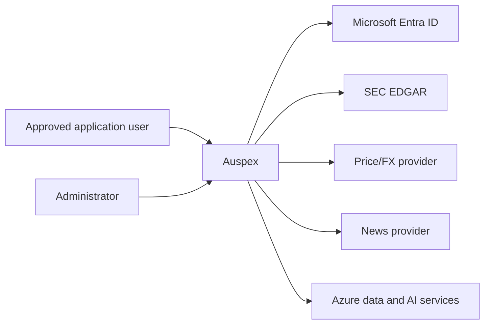

# Auspex architecture (Arc42)

**Status:** Current implementation
**Scope:** Approval-gated multi-user regulated-AI financial research MVP
**Platform:** Microsoft Azure

## 1. Introduction and goals

Auspex demonstrates how AI can be useful in financial research without making
the model the decision authority.

The system:

- ingests point-in-time market, regulatory and news evidence;
- uses constrained AI extraction to structure qualitative evidence;
- computes deterministic, reproducible scores and portfolio policy;
- explains stored facts, scores and gate traces conversationally;
- leaves every investment decision and trade outside the system.

The primary quality goals are:

1. **Auditability** — every score and suggestion is traceable to versioned data,
   configuration and policy gates.
2. **Determinism** — numeric scoring and action policy use `Decimal` arithmetic,
   not generative output.
3. **Grounding** — explanations use retrieved Auspex data and cited evidence.
4. **Security** — managed identity, least privilege, private data services and
   no broker credentials.
5. **Operability** — idempotent jobs, resumable bootstrap, health checks,
   telemetry and self-measurement.
6. **Human accountability** — Auspex is directional decision support only.

## 2. Constraints

- Python 3.12 backend and jobs.
- React/TypeScript frontend.
- One immutable image for API and jobs.
- Microsoft Entra authentication.
- Azure managed identity for workload access.
- Azure Cosmos DB for operational data.
- Azure Blob Storage for raw evidence.
- Azure OpenAI for extraction and grounded language generation.
- SEC EDGAR rate limits and identification requirements.
- A configured, bounded security universe.
- A single authenticated portfolio owner in the MVP.
- No broker integration or trade execution.

## 3. Context and scope

### 3.1 Users and external systems

Each user maintains their own transactions manually and sees only their own
portfolio, recommendations and conversations. An administrator manages who may
access the system, never what those users hold. External providers supply
research inputs only. Auspex does not submit orders.

### 3.2 Product boundary

Inside the boundary:

- evidence ingestion and retention;
- qualitative extraction;
- six-leg scoring and peer normalization;
- portfolio projection and policy;
- grounded analysis and conversation;
- recommendation disposition and performance measurement.

Outside the boundary:

- brokerage and execution;
- custody and settlement;
- suitability approval by a regulated institution;
- legal or tax advice;
- guaranteed outcomes.

## 4. Solution strategy

The governing pattern is:

> AI reads. Deterministic code decides. AI explains. A human acts.

AI is used where language understanding adds value:

- filing and news extraction;
- comparative filing digests;
- concise score narratives;
- grounded question answering.

AI is not used for:

- market prices or XBRL values;
- percentile normalization;
- six-leg arithmetic;
- policy thresholds;
- portfolio quantities;
- cash settlement;
- performance attribution.

This separation constrains model risk and makes core outcomes reproducible.

## 5. Building blocks

### 5.1 Frontend

The React SPA provides:

- Home briefing and actionable suggestions;
- Analysis for every configured ticker;
- live portfolio and append-only transaction CRUD;
- grounded Discussion with 15-day history;
- model Performance;
- investor profile, scope and acknowledgements.

MSAL configuration is loaded at runtime from `/auth-config.json`; no tenant or
client ID is compiled into the public bundle.

### 5.2 API

FastAPI:

- validates Entra issuer, audience and signature;
- gates every `/api` route on a database-backed application-user lifecycle,
  so a valid token alone grants nothing;
- scopes all data to the authenticated user, whose identity is always taken
  from the token and never from a request;
- serves the compiled SPA;
- joins score, evidence, portfolio and policy data;
- validates ledger writes and recommendation attribution;
- exposes only `/healthz` and `/auth-config.json` without authentication.

Three route groups exist under `/api`:

| Group | Requires | Purpose |
| --- | --- | --- |
| `/api/session/*` | valid token | register, poll approval status |
| `/api/onboarding/*` | approved user | guided onboarding |
| `/api/account/deletion*` | registered user | request and follow erasure |
| everything else | `ACTIVE` user | the product surface |
| `/api/admin/users/*` | `ACTIVE` + `ADMIN` | manage access, never data |

### 5.2.1 Application users

Users are records in `app_users`, partitioned by `user_id` (the stable
surrogate derived from the Entra object ID). Lifecycle:

`UNREGISTERED → PENDING_APPROVAL → APPROVED_NEEDS_ONBOARDING → ACTIVE`, with
`REJECTED`, `SUSPENDED`, `DELETION_PENDING` and `DELETED` as the exception
paths. Only `ACTIVE` reaches product data. `UNREGISTERED` is synthetic — it
describes an authenticated principal with no record yet.

Roles are `ADMIN` and `USER`. `AUSPEX_INITIAL_ADMIN_EMAIL` names the first
administrator so a new deployment has somebody who can approve everyone else;
for a trusted External ID/CIAM issuer, the sign-up email claim is the bootstrap
proof, while workforce deployments bind through the configured immutable owner
OID. It is consulted only while no administrator exists. The first administrator's
immutable Entra `oid` is then written to a singleton authority binding, and
the email setting becomes inert. The final administrator can never be
demoted, rejected, suspended or deleted.

The administrator roster lives in `app_user_index`, a small projection in one
logical partition (`registry`) holding only access-relevant attributes. This
keeps "list all users" a single-partition query instead of a cross-partition
scan of `app_users`, and keeps private user data out of the admin surface
entirely.

### 5.3 Ingestion and evidence

The nightly job collects:

- adjusted and raw daily prices;
- USD/CHF rates;
- SEC submissions and filing documents;
- US-GAAP, IFRS and DEI company facts;
- Form 4 insider transactions for domestic filers;
- licensed news.

Raw filing content is stored in Blob Storage. Section extraction normalizes
filing HTML, targets material annual/quarterly sections and rejects
table-of-contents duplicates.

### 5.4 AI extraction

Channel A emits constrained scoring labels and short evidence excerpts.
Channel B emits a comparative digest and key evidence for user explanation.

Cache keys include content hash, model, prompt, schema and taxonomy versions.
Replaying unchanged evidence does not invoke the model again.

Malformed output degrades the affected document/security; it does not silently
become numeric input.

### 5.5 Scoring

The six legs are:

1. Thesis Linkage
2. Attention Acceleration
3. Narrative Premium
4. Smart Money
5. Fundamental Health
6. Valuation Brake

Domestic filers use all six. Foreign private issuers exclude Smart Money and
redistribute its weight. Fundamental-health sub-metrics are standardized in
peer scope before equal-weight combination. Attention emits one event per
source document, with extraction materiality enriching rather than duplicating
that event.

Applicable-but-missing legs contribute neutral standardized value zero while
coverage/confidence remain separate. Structurally inapplicable legs leave both
the numerator and denominator. Native-currency valuation is converted only
using authoritative point-in-time FX at each fact period end; an unavailable
rate makes valuation structurally inapplicable rather than penalizing the
issuer.

Scores are winsorized, weighted and midpoint-percentile-ranked. Cohort,
parent, and universe statistics are continuously shrinkage-blended while the
cohort label/confidence remains auditable. Direction and weakening streaks use
observed trading sessions and reject gaps. A score is relative research
strength, not expected return.

### 5.6 Policy

The policy engine evaluates deterministic gates in priority order:

- minimum coverage;
- peer confidence;
- score percentile and direction;
- thesis and valuation thresholds;
- position target and maximum;
- minimum trade;
- estimated cost;
- CHF cash reserve.

Risk profile selects entry/exit thresholds. Horizon and objective set
portfolio turnover, position and cohort risk limits.

Policy first produces per-security candidates. A second deterministic
allocation pass applies one shared CHF cash budget, minimum executable size,
position/cohort limits and stable priority. A risk-aware shadow allocation adds
60-session volatility, daily-value participation, correlation groups, and
objective/horizon turnover limits. The shadow notional is persisted for
measurement but is not presented as executable until promotion gates pass.

Only BUY, ADD, TRIM and SELL are treated as actionable. No-action states are
not recorded as followed recommendations.

### 5.7 Portfolio ledger

`portfolio_transactions` is the source of truth. Events include:

- opening cash and positions;
- deposits and withdrawals;
- buys and sells;
- dividends and interest;
- fees and taxes;
- correction and void events.

Broker commission, stamp duty, withholding tax and other costs are child
components of the parent transaction with their own source currency.

All cash effects settle once into a CHF cash bucket using the transaction FX
rate. Source amounts and currencies remain available for audit. Corrections
preserve child costs unless explicitly replaced.

Each user's events live in their own logical partition. A ledger adapter or
write service instance is bound to exactly one partition for its lifetime and
is constructed per request from the authenticated principal — never cached
process-wide, because a cached binding would serve the first caller's ledger
to everybody afterwards. The partition is normally the user's own `user_id`;
an imported single-owner deployment may pin a legacy `owner_user_sk` on that
user's record so their pre-existing events remain readable under their own
account.

### 5.7.1 Guided onboarding

An approved user completes three resumable, idempotent steps: preferences,
the five regulatory acknowledgements, and a declared initial portfolio. The
initial portfolio must be viable — opening CHF cash above zero, or at least
one position with a positive quantity — because a projection with neither
cannot produce a meaningful recommendation. Completion writes user settings,
seeds the declared opening balances into that user's ledger under
deterministic client request ids, and transitions the account to `ACTIVE`.

Preferences and acknowledgements may also be captured at *registration*, for
clients that present the disclosures during sign-up rather than after
approval. They are stored as the corresponding onboarding steps rather than
applied as live settings — a pending user has none — so an approved user
resumes at the first step they have not yet completed instead of being asked
to repeat one. Acknowledgements are all-or-nothing wherever they are
supplied: a partial or declined set is rejected, never half-stored. The
dedicated per-step endpoints remain the resumable path.

### 5.7.2 Dispositions and decision signatures

Every recommendation carries a versioned **decision signature**: a
fingerprint over the action, quantity, bucketed notional and target weight,
readiness, the pass/fail shape of the gate cascade, and a material-evidence
fingerprint (percentile decile, coverage band, cohort confidence,
direction). Money and weights are bucketed, and percentiles banded, so
ordinary price and score noise does not present the same ask as a new one.

A user's disposition is stored durably per `(user, security)`:

- `REJECTED` suppresses that exact signature indefinitely;
- `DEFERRED` suppresses it for `AUSPEX_DEFERRED_DISPOSITION_DAYS` (7 by
  default), after which it legitimately reappears;
- `ACCEPTED` suppresses nothing.

A materially different decision has a different signature and surfaces
normally without the user clearing anything. Suppressed rows are still
written so the run stays auditable; the API withholds them unless
`include_suppressed` is requested.

### 5.7.3 Account deletion

Deletion is irreversible, idempotent and verified. The account moves to
`DELETION_PENDING` before any data is touched, so gated routes stop serving
it immediately. Before that transition, deletion acquires the same
ETag-protected per-user operation lease held by every active API request,
onboarding write and per-user nightly stage. It therefore waits for in-flight
writers and prevents new ones from starting until the purge has finished.
The holder renews this lease with ETag compare-and-swap; losing ownership or
failing to renew before the last confirmed expiry cancels the work fail-closed
before it can persist another private row.
Each private partition — ledger events, settings,
recommendations, dispositions, projections, conversations, onboarding and
the user-scoped audit trail — is then hard-deleted and re-counted; a target
only completes once it reads back empty. Only when every target verifies
empty are the authoritative user and roster records hard-deleted last.

Shared research (securities, documents, extractions, digests, market data,
fundamentals, scores, leg changes, narratives, config versions, watermarks
and run manifests) is not personal data and is retained, so global score
performance survives. The Entra identity belongs to the identity provider and
is never deleted from here.

### 5.8 Performance

The weekly job computes:

- composite information coefficient;
- per-leg information coefficient;
- leg correlation;
- recommendation outcomes;
- followed/not-followed attribution;
- cohort dispersion and sample sizes.
- IC distribution and ICIR;
- effective non-overlapping sample size;
- Newey-West and seeded moving-block-bootstrap intervals;
- per-date, available-population leg IC/correlation;
- robust and cost-adjusted top-minus-bottom spread;
- turnover and maximum drawdown;
- equal-weight, momentum, and seeded-random benchmarks;
- coverage bias and multiple-testing-adjusted results.

Population score metrics are stored in the shared `performance` container.
Suggestion hit rate and disposition outcomes are stored in
`user_performance`, partitioned by `/user_id`; the API reads only the caller's
partition. Live followed/not-followed counts are likewise derived only from the
caller's recommendations and ledger.

This measures whether Auspex is informative; it does not rewrite history or
train on owner outcomes automatically.

`auspex shadow` evaluates a fingerprinted pre-registration against immutable
stored leg z-scores and returns promotion verdicts without changing production
weights. Publishing shadow metrics is opt-in. A challenger may be promoted
only when held-out, benchmark-relative, post-cost intervals exclude zero and
the result does not depend on one ticker, cohort, or regime.

### 5.9 Grounded conversation

The planner resolves ticker/company intent and retrieves bounded facts from:

- score and leg snapshots;
- fundamentals;
- evidence and filings;
- recent relevant news;
- portfolio state;
- recommendation and gate traces.

The answer model may summarize and reason over those facts. Citation validation
rejects unsupported source references. Conversation documents expire after
15 days.

## 6. Runtime views

### 6.1 Nightly run

The run is one shared research pass plus a bounded per-user fan-out.

Shared, once per night:

1. Load versioned configuration.
2. Collect prices, point-in-time FX pairs, filings, facts, insider data and
   news. Structurally invalid price bars are quarantined at ingest.
3. Extract uncached qualitative evidence.
4. Compute raw legs.
5. Assign peer scopes and normalize.
6. Write score and leg-change snapshots.
7. Generate cached narratives.
8. Validate assertions and persist the run manifest.

Per `ACTIVE` user, against that user's own ledger binding:

9. Project the live portfolio.
10. Apply candidate policy.
11. Allocate BUY/ADD candidates jointly under one CHF budget; compute and store
    the risk-aware shadow allocation; stamp decision signatures; apply active
    suppression; write recommendations.

An operator runs `market-data-diagnose` and the idempotent
`market-data-repair` before a corrected historical replay. Raw provider fields
are immutable. Repairs rebuild only justified derived adjustments, quarantine
unexplained scale breaks, append a fingerprinted manifest, and emit targeted
recomputation ranges. `engine-baseline-export` preserves the prior score and
performance champion in Blob Storage before replay.

Steps 1–8 are identical for everyone and are the expensive parts (provider
quota, LLM tokens), so running them per user would multiply cost for no
information gain — which is also why global score performance stays a
shared, population-level measurement while recommendation attribution stays
private.

Fan-out is bounded by `AUSPEX_NIGHTLY_USER_CONCURRENCY` so a large roster
cannot exhaust request units or provider connections. One user's stage
failing is isolated: it is recorded, the run degrades rather than fails, and
every other user still receives their recommendations. Each user stage
re-reads the authoritative lifecycle record after shared research and holds
that user's durable operation lease for every private write. A deployment
with no roster yet falls back to the legacy single-owner binding.

### 6.2 Historical bootstrap

- 36 months: prices, filings, XBRL/IFRS and Form 4 raw history.
- 18 months: language extraction and chronological scoring replay.
- Acceptance: at least 85 securities scored on at least 370 sessions.
- Portfolio binding requires explicit operator confirmation.
- The run is idempotent, cache-aware and recoverable.

### 6.3 Transaction write

1. Authenticate the caller and derive their ledger partition from their own
   application-user record.
2. Validate type, ticker, values, costs and FX.
3. Replay effective ledger.
4. Check holdings and CHF cash sufficiency.
5. Append create/correction/void event.
6. Return current effective transactions and projection.

### 6.4 Registration and approval

1. A tenant principal signs in and calls `POST /api/session/register`.
2. The account is created `PENDING_APPROVAL` — unless it is the very first
   administrator, which is bootstrapped straight to onboarding.
3. An administrator approves, rejects or suspends from `/api/admin/users`.
4. An approved user completes onboarding and becomes `ACTIVE`.
5. Until then, every product route returns `403` with a machine-readable
   reason so the SPA can show the right screen.

### 6.5 Account deletion

1. The user types the confirmation phrase (``DELETE MY ACCOUNT`` or
   ``DELETE MY AUSPEX ACCOUNT``, matched case-insensitively so a user who
   types exactly what the prompt showed them is never refused) and
   acknowledges the consequences; token freshness (``auth_time``) is recorded
   when the provider supplies it.
2. Deletion waits for the user's durable operation lease, then moves the
   account to `DELETION_PENDING`; new API requests and nightly stages cannot
   enter that lease.
3. Every private partition is purged, then re-counted until it reads empty.
4. The deletion job, authoritative user record, and roster projection are
   hard-deleted last.
5. `GET /api/account/deletion` reports progress throughout; a failed purge is
   resumable and converges.

Administrator demotion, suspension, rejection and deletion additionally hold
an ETag-protected lease on the singleton admin-authority record. This
serializes final-admin checks across API replicas rather than relying on
eventually consistent roster counts.

## 7. Deployment view

The default `azd up` deployment creates:

- one resource group per AZD environment;
- virtual network and delegated Container Apps subnet;
- private endpoint subnet and private DNS zones;
- Container Apps environment;
- API/UI Container App;
- nightly and performance Container Apps Jobs;
- Azure Container Registry;
- primary Cosmos DB account;
- separate event-ledger Cosmos DB account;
- Blob Storage;
- Key Vault and provider secrets;
- Azure OpenAI account and pinned deployments;
- Log Analytics, Application Insights, alerts and budget;
- private endpoints and managed-identity RBAC.

An existing Key Vault or ledger account can be supplied through AZD environment
values. The public default contains no subscription, tenant, resource, email or
user identifiers.

The Entra tenant itself is **not** provisioned here. A tenant — particularly an
external (Microsoft Entra External ID) tenant and its sign-up/sign-in user flow
— is a directory object, not an ARM resource, so it is created once in the
Entra admin center and consumed by this deployment as parameters
(`authTenantType`, `authTenantId`, `authTenantSubdomain`, `authClientId`, plus
optional authority/issuer/JWKS overrides). See the README for the required app
registration and user-flow configuration.

## 8. Cross-cutting concepts

### 8.1 Identity and authorization

- Entra SPA/API registration, in either a **workforce** tenant
  (`login.microsoftonline.com`) or an **external** tenant — Microsoft Entra
  External ID, `<subdomain>.ciamlogin.com` — which is what allows self-service
  sign-up with personal Gmail/Outlook addresses. The tenant type is a
  deployment parameter; no code path assumes either.
- Runtime frontend auth configuration, including the `knownAuthorities` host
  MSAL requires before it will accept a `ciamlogin.com` authority.
- Token issuer, audience and signature validation. Issuer and signing keys are
  read from the tenant's own OpenID Connect metadata where available, because
  the two tenant types disagree on the issuer string and an external tenant may
  issue either the tenant-id or the `.onmicrosoft.com` authority form.
- A migration window may declare a legacy issuer/JWKS/audience tuple. Tokens
  are always verified against the keys and audience of their own issuer, and
  only the configured old owner object ID may alias to the new owner's account
  during cutover; other identities re-register in the new tenant.
- Stable per-user partition derived from the Entra object ID.
- Authentication proves identity only; authorization is a database-backed
  lifecycle decision, so an unapproved, rejected, suspended or deleting
  principal reaches nothing but their own status.
- Administrative authority binds to an immutable object ID, never to a
  mutable attribute such as an email address.
- System-assigned workload identities.
- Container-scoped ledger permissions.

### 8.2 Data integrity

- Point-in-time knowledge dates.
- Append-only ledger.
- Stable IDs and idempotent upserts.
- Versioned config and prompts.
- Continuous Cosmos backup and Blob versioning.
- No floating-point arithmetic in scoring or money.

### 8.3 Security

- Local authentication disabled on Azure data/AI services.
- Private endpoints for Cosmos, Blob, Key Vault and Azure OpenAI.
- No connection strings or API keys in application settings.
- Provider keys in Key Vault.
- Public ingress only on the API/UI.
- No broker credential or execution capability.

### 8.4 Observability

- Structured run manifests.
- Container console/system logs.
- Azure Monitor alerts for failed/degraded runs and provider error rates.
- Application Insights and Log Analytics.
- Monthly budget notifications.

## 9. Current architecture decisions

1. One image serves API, nightly, bootstrap and performance commands.
2. Cosmos DB is the operational system of record; Blob stores large evidence.
3. The ledger is separated from research data for least-privilege access.
4. Managed identity is mandatory for Azure service access.
5. Generative output is never accepted directly as a numeric score or action.
6. Prompts, model deployments and config are pinned and versioned.
7. Annual filing recaps prefer substantive 10-K/20-F digests and never arbitrary
   evidence fragments.
8. Native-currency ratios are allowed; cross-currency valuation requires an
   authoritative point-in-time FX rate and is never inferred or carried back
   from today.
9. The default deployment is tenant-local and reproducible with AZD.

## 10. Quality requirements

| Quality | Requirement |
| --- | --- |
| Security | No secret values in source, logs or images |
| Reproducibility | Stored data + config reproduce a historical score |
| Availability | API health probe and scheduled job retries |
| Performance | Bounded retrieval, cache reuse and partition-local queries |
| Explainability | Score legs, evidence and gate traces visible to the user |
| Privacy | Per-user partitioning, verified erasure and 15-day conversation TTL |
| Maintainability | Typed models, pure scoring functions and automated tests |

## 11. Known MVP limitations

- Approval-gated multi-user, not open retail self-service.
- Fixed research universe, not arbitrary instruments.
- Provider coverage and licensing constrain news history.
- Corporate-action repair is bounded by authoritative provider split/dividend
  evidence. Uncorroborated discontinuities are quarantined and reported rather
  than converted into an invented split.
- The published allocator enforces joint cash feasibility and trade costs; the
  fuller horizon/objective, volatility, liquidity, concentration, correlation
  and turnover policy remains shadow-only until promotion gates pass.
- The current scored history is too short to claim a validated predictive edge
  for a learned challenger.
- No suitability determination or broker execution.
- Single-region data plane.
- Model and provider quotas can extend bootstrap duration.
- A score is peer-relative and can be high while policy still blocks a trade.

## 12. Operations

- Use `azd up` for initial provision/deploy.
- Set `AUSPEX_INITIAL_ADMIN_EMAIL` before first sign-in; the first matching
  principal to register becomes the administrator and authority then binds to
  their object ID permanently.
- Run bootstrap once after validating the owner/ledger binding.
- Monitor Container Apps Job executions and the `runs` container; a nightly
  run that degrades with `RUN_POLICY ... failed=N` identifies which users'
  per-user stage failed.
- Use `bootstrap-recover` for interrupted extraction/replay.
- Use `bootstrap-recover --replay-all` after deterministic scoring changes.
- Rotate provider keys in Key Vault.
- Treat config, prompts and model versions as controlled changes.

## 13. Bank production and regulatory readiness

Auspex is a technical MVP, not a production-compliant banking service. A bank
would need a governed implementation program before offering it to employees or
customers.

### 13.1 Legal and conduct classification

- Determine whether each use case is research support, personal recommendation,
  investment advice or portfolio management under Swiss FinSA/FinSO.
- Define the regulated entity, service boundary, client segment and responsible
  human decision maker.
- Add suitability/appropriateness, product governance, conflicts, disclosure
  and recordkeeping controls where recommendations reach customers.
- Prevent marketing or UI language from overstating accuracy or independence.

### 13.2 FINMA governance

- Place the system in the bank's model and AI inventory.
- Assign accountable business, model, data, technology and compliance owners.
- Complete independent model validation, limitations, approval and periodic
  review.
- Establish human oversight, override, escalation and incident processes.
- Align operational risk and resilience controls with FINMA Circular 2023/1.
- Apply outsourcing and third-party risk controls to cloud, model and data
  providers, including audit rights, exit plans and concentration risk.

### 13.3 Privacy and banking secrecy

- Complete a Swiss FADP data-protection impact assessment.
- Apply purpose limitation, data minimization, retention, access and deletion.
- Keep client and portfolio data within approved locations and contractual
  boundaries.
- Assess cross-border access, support and telemetry.
- Separate tenants and clients cryptographically and operationally.

### 13.4 Technology and security

- Use bank-owned landing zones, policies, private connectivity, SIEM/SOC and
  privileged-access management.
- Add multi-region resilience, tested restore, continuity objectives and
  disaster recovery.
- Add customer-grade tenant isolation, entitlement models and segregation of
  duties.
- Operate software supply-chain controls, vulnerability management, penetration
  testing and signed artifacts/SBOMs.
- Add prompt-injection, data-exfiltration and model-abuse controls with ongoing
  red-team testing.

### 13.5 Data, model and outcome controls

- License and validate every market, news and reference dataset.
- Establish lineage, reconciliation, quality thresholds and exception handling.
- Benchmark models and deterministic policy across representative client and
  market scenarios.
- Monitor drift, hallucination, bias, stale evidence and unsuitable actions.
- Preserve immutable input, model, prompt, configuration, output, citation,
  approval and user-action records for the required retention period.

### 13.6 Customer operating model

- Start as an adviser/research copilot, not autonomous customer advice.
- Require qualified review for actionable outputs.
- Present rationale, uncertainty, limitations, fees, conflicts and source dates.
- Provide complaint, correction and redress processes.
- Roll out through controlled pilots with explicit risk appetite and stop
  criteria.

The exact obligations depend on the bank, client segment, distribution model
and legal classification. Swiss counsel, Compliance, Risk, Data Protection,
Security and FINMA supervisory engagement are required before production.
