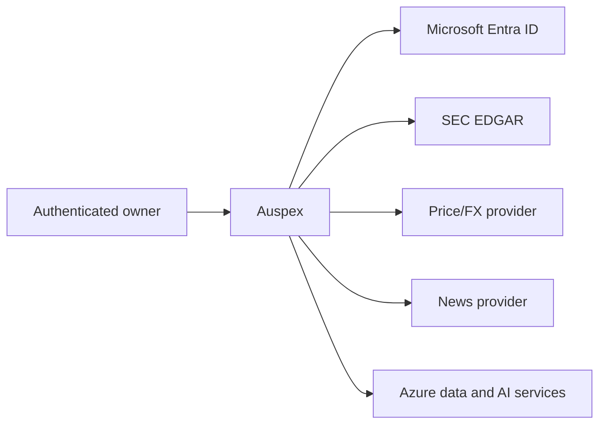

# Auspex architecture (Arc42)

**Status:** Current implementation
**Scope:** Single-owner regulated-AI financial research MVP
**Platform:** Microsoft Azure

## 1. Introduction and goals

Auspex demonstrates how AI can be useful in financial research without making
the model the decision authority.

The system:

- ingests point-in-time market, regulatory and news evidence;
- uses constrained AI extraction to structure qualitative evidence;
- computes deterministic, reproducible scores and portfolio policy;
- explains stored facts, scores and gate traces conversationally;
- leaves every investment decision and trade outside the system.

The primary quality goals are:

1. **Auditability** — every score and suggestion is traceable to versioned data,
   configuration and policy gates.
2. **Determinism** — numeric scoring and action policy use `Decimal` arithmetic,
   not generative output.
3. **Grounding** — explanations use retrieved Auspex data and cited evidence.
4. **Security** — managed identity, least privilege, private data services and
   no broker credentials.
5. **Operability** — idempotent jobs, resumable bootstrap, health checks,
   telemetry and self-measurement.
6. **Human accountability** — Auspex is directional decision support only.

## 2. Constraints

- Python 3.12 backend and jobs.
- React/TypeScript frontend.
- One immutable image for API and jobs.
- Microsoft Entra authentication.
- Azure managed identity for workload access.
- Azure Cosmos DB for operational data.
- Azure Blob Storage for raw evidence.
- Azure OpenAI for extraction and grounded language generation.
- SEC EDGAR rate limits and identification requirements.
- A configured, bounded security universe.
- A single authenticated portfolio owner in the MVP.
- No broker integration or trade execution.

## 3. Context and scope

### 3.1 Users and external systems

The user maintains transactions manually. External providers supply research
inputs only. Auspex does not submit orders.

### 3.2 Product boundary

Inside the boundary:

- evidence ingestion and retention;
- qualitative extraction;
- six-leg scoring and peer normalization;
- portfolio projection and policy;
- grounded analysis and conversation;
- recommendation disposition and performance measurement.

Outside the boundary:

- brokerage and execution;
- custody and settlement;
- suitability approval by a regulated institution;
- legal or tax advice;
- guaranteed outcomes.

## 4. Solution strategy

The governing pattern is:

> AI reads. Deterministic code decides. AI explains. A human acts.

AI is used where language understanding adds value:

- filing and news extraction;
- comparative filing digests;
- concise score narratives;
- grounded question answering.

AI is not used for:

- market prices or XBRL values;
- percentile normalization;
- six-leg arithmetic;
- policy thresholds;
- portfolio quantities;
- cash settlement;
- performance attribution.

This separation constrains model risk and makes core outcomes reproducible.

## 5. Building blocks

### 5.1 Frontend

The React SPA provides:

- Home briefing and actionable suggestions;
- Analysis for every configured ticker;
- live portfolio and append-only transaction CRUD;
- grounded Discussion with 15-day history;
- model Performance;
- investor profile, scope and acknowledgements.

MSAL configuration is loaded at runtime from `/auth-config.json`; no tenant or
client ID is compiled into the public bundle.

### 5.2 API

FastAPI:

- validates Entra issuer, audience and signature;
- scopes all data to the authenticated owner;
- serves the compiled SPA;
- joins score, evidence, portfolio and policy data;
- validates ledger writes and recommendation attribution;
- exposes only `/healthz` and `/auth-config.json` without authentication.

### 5.3 Ingestion and evidence

The nightly job collects:

- adjusted and raw daily prices;
- USD/CHF rates;
- SEC submissions and filing documents;
- US-GAAP, IFRS and DEI company facts;
- Form 4 insider transactions for domestic filers;
- licensed news.

Raw filing content is stored in Blob Storage. Section extraction normalizes
filing HTML, targets material annual/quarterly sections and rejects
table-of-contents duplicates.

### 5.4 AI extraction

Channel A emits constrained scoring labels and short evidence excerpts.
Channel B emits a comparative digest and key evidence for user explanation.

Cache keys include content hash, model, prompt, schema and taxonomy versions.
Replaying unchanged evidence does not invoke the model again.

Malformed output degrades the affected document/security; it does not silently
become numeric input.

### 5.5 Scoring

The six legs are:

1. Thesis Linkage
2. Attention Acceleration
3. Narrative Premium
4. Smart Money
5. Fundamental Health
6. Valuation Brake

Domestic filers use all six. Foreign private issuers exclude Smart Money and
redistribute its weight. Native-currency IFRS facts can produce ratio-based
fundamental health, while cross-currency valuation remains unavailable unless
the accounting currency is USD.

Scores are winsorized, weighted and percentile-ranked inside the active cohort
or fallback scope. A score is relative research strength, not expected return.

### 5.6 Policy

The policy engine evaluates deterministic gates in priority order:

- minimum coverage;
- peer confidence;
- score percentile and direction;
- thesis and valuation thresholds;
- position target and maximum;
- minimum trade;
- estimated cost;
- CHF cash reserve.

Risk profile selects policy thresholds. Horizon and objective are retained for
profile completeness and future suitability policy.

Only BUY, ADD, TRIM and SELL are treated as actionable. No-action states are
not recorded as followed recommendations.

### 5.7 Portfolio ledger

`portfolio_transactions` is the source of truth. Events include:

- opening cash and positions;
- deposits and withdrawals;
- buys and sells;
- dividends and interest;
- fees and taxes;
- correction and void events.

Broker commission, stamp duty, withholding tax and other costs are child
components of the parent transaction with their own source currency.

All cash effects settle once into a CHF cash bucket using the transaction FX
rate. Source amounts and currencies remain available for audit. Corrections
preserve child costs unless explicitly replaced.

### 5.8 Performance

The weekly job computes:

- composite information coefficient;
- per-leg information coefficient;
- leg correlation;
- recommendation outcomes;
- followed/not-followed attribution;
- cohort dispersion and sample sizes.

This measures whether Auspex is informative; it does not rewrite history or
train on owner outcomes automatically.

### 5.9 Grounded conversation

The planner resolves ticker/company intent and retrieves bounded facts from:

- score and leg snapshots;
- fundamentals;
- evidence and filings;
- recent relevant news;
- portfolio state;
- recommendation and gate traces.

The answer model may summarize and reason over those facts. Citation validation
rejects unsupported source references. Conversation documents expire after
15 days.

## 6. Runtime views

### 6.1 Nightly run

1. Load versioned configuration.
2. Resolve the portfolio owner.
3. Collect prices, FX, filings, facts, insider data and news.
4. Extract uncached qualitative evidence.
5. Compute raw legs.
6. Assign peer scopes and normalize.
7. Write score and leg-change snapshots.
8. Project the live portfolio.
9. Apply policy and write recommendations.
10. Generate cached narratives.
11. Validate assertions and persist the run manifest.

### 6.2 Historical bootstrap

- 36 months: prices, filings, XBRL/IFRS and Form 4 raw history.
- 18 months: language extraction and chronological scoring replay.
- Acceptance: at least 85 securities scored on at least 370 sessions.
- Portfolio binding requires explicit operator confirmation.
- The run is idempotent, cache-aware and recoverable.

### 6.3 Transaction write

1. Authenticate owner.
2. Validate type, ticker, values, costs and FX.
3. Replay effective ledger.
4. Check holdings and CHF cash sufficiency.
5. Append create/correction/void event.
6. Return current effective transactions and projection.

## 7. Deployment view

The default `azd up` deployment creates:

- one resource group per AZD environment;
- virtual network and delegated Container Apps subnet;
- private endpoint subnet and private DNS zones;
- Container Apps environment;
- API/UI Container App;
- nightly and performance Container Apps Jobs;
- Azure Container Registry;
- primary Cosmos DB account;
- separate event-ledger Cosmos DB account;
- Blob Storage;
- Key Vault and provider secrets;
- Azure OpenAI account and pinned deployments;
- Log Analytics, Application Insights, alerts and budget;
- private endpoints and managed-identity RBAC.

An existing Key Vault or ledger account can be supplied through AZD environment
values. The public default contains no subscription, tenant, resource, email or
user identifiers.

## 8. Cross-cutting concepts

### 8.1 Identity and authorization

- Single-tenant Entra SPA/API registration.
- Runtime frontend auth configuration.
- Token issuer, audience and signature validation.
- Stable owner partition derived from the Entra object ID.
- System-assigned workload identities.
- Container-scoped ledger permissions.

### 8.2 Data integrity

- Point-in-time knowledge dates.
- Append-only ledger.
- Stable IDs and idempotent upserts.
- Versioned config and prompts.
- Continuous Cosmos backup and Blob versioning.
- No floating-point arithmetic in scoring or money.

### 8.3 Security

- Local authentication disabled on Azure data/AI services.
- Private endpoints for Cosmos, Blob, Key Vault and Azure OpenAI.
- No connection strings or API keys in application settings.
- Provider keys in Key Vault.
- Public ingress only on the API/UI.
- No broker credential or execution capability.

### 8.4 Observability

- Structured run manifests.
- Container console/system logs.
- Azure Monitor alerts for failed/degraded runs and provider error rates.
- Application Insights and Log Analytics.
- Monthly budget notifications.

## 9. Current architecture decisions

1. One image serves API, nightly, bootstrap and performance commands.
2. Cosmos DB is the operational system of record; Blob stores large evidence.
3. The ledger is separated from research data for least-privilege access.
4. Managed identity is mandatory for Azure service access.
5. Generative output is never accepted directly as a numeric score or action.
6. Prompts, model deployments and config are pinned and versioned.
7. Annual filing recaps prefer substantive 10-K/20-F digests and never arbitrary
   evidence fragments.
8. Native-currency ratios are allowed; cross-currency valuation is not inferred.
9. The default deployment is tenant-local and reproducible with AZD.

## 10. Quality requirements

| Quality | Requirement |
| --- | --- |
| Security | No secret values in source, logs or images |
| Reproducibility | Stored data + config reproduce a historical score |
| Availability | API health probe and scheduled job retries |
| Performance | Bounded retrieval, cache reuse and partition-local queries |
| Explainability | Score legs, evidence and gate traces visible to the user |
| Privacy | Owner partitioning and 15-day conversation TTL |
| Maintainability | Typed models, pure scoring functions and automated tests |

## 11. Known MVP limitations

- Single owner, not retail multi-tenancy.
- Fixed research universe, not arbitrary instruments.
- Provider coverage and licensing constrain news history.
- No corporate-action workflow beyond provider-adjusted prices.
- No suitability determination or broker execution.
- Single-region data plane.
- Model and provider quotas can extend bootstrap duration.
- A score is peer-relative and can be high while policy still blocks a trade.

## 12. Operations

- Use `azd up` for initial provision/deploy.
- Run bootstrap once after validating the owner/ledger binding.
- Monitor Container Apps Job executions and the `runs` container.
- Use `bootstrap-recover` for interrupted extraction/replay.
- Use `bootstrap-recover --replay-all` after deterministic scoring changes.
- Rotate provider keys in Key Vault.
- Treat config, prompts and model versions as controlled changes.

## 13. Bank production and regulatory readiness

Auspex is a technical MVP, not a production-compliant banking service. A bank
would need a governed implementation program before offering it to employees or
customers.

### 13.1 Legal and conduct classification

- Determine whether each use case is research support, personal recommendation,
  investment advice or portfolio management under Swiss FinSA/FinSO.
- Define the regulated entity, service boundary, client segment and responsible
  human decision maker.
- Add suitability/appropriateness, product governance, conflicts, disclosure
  and recordkeeping controls where recommendations reach customers.
- Prevent marketing or UI language from overstating accuracy or independence.

### 13.2 FINMA governance

- Place the system in the bank's model and AI inventory.
- Assign accountable business, model, data, technology and compliance owners.
- Complete independent model validation, limitations, approval and periodic
  review.
- Establish human oversight, override, escalation and incident processes.
- Align operational risk and resilience controls with FINMA Circular 2023/1.
- Apply outsourcing and third-party risk controls to cloud, model and data
  providers, including audit rights, exit plans and concentration risk.

### 13.3 Privacy and banking secrecy

- Complete a Swiss FADP data-protection impact assessment.
- Apply purpose limitation, data minimization, retention, access and deletion.
- Keep client and portfolio data within approved locations and contractual
  boundaries.
- Assess cross-border access, support and telemetry.
- Separate tenants and clients cryptographically and operationally.

### 13.4 Technology and security

- Use bank-owned landing zones, policies, private connectivity, SIEM/SOC and
  privileged-access management.
- Add multi-region resilience, tested restore, continuity objectives and
  disaster recovery.
- Add customer-grade tenant isolation, entitlement models and segregation of
  duties.
- Operate software supply-chain controls, vulnerability management, penetration
  testing and signed artifacts/SBOMs.
- Add prompt-injection, data-exfiltration and model-abuse controls with ongoing
  red-team testing.

### 13.5 Data, model and outcome controls

- License and validate every market, news and reference dataset.
- Establish lineage, reconciliation, quality thresholds and exception handling.
- Benchmark models and deterministic policy across representative client and
  market scenarios.
- Monitor drift, hallucination, bias, stale evidence and unsuitable actions.
- Preserve immutable input, model, prompt, configuration, output, citation,
  approval and user-action records for the required retention period.

### 13.6 Customer operating model

- Start as an adviser/research copilot, not autonomous customer advice.
- Require qualified review for actionable outputs.
- Present rationale, uncertainty, limitations, fees, conflicts and source dates.
- Provide complaint, correction and redress processes.
- Roll out through controlled pilots with explicit risk appetite and stop
  criteria.

The exact obligations depend on the bank, client segment, distribution model
and legal classification. Swiss counsel, Compliance, Risk, Data Protection,
Security and FINMA supervisory engagement are required before production.
