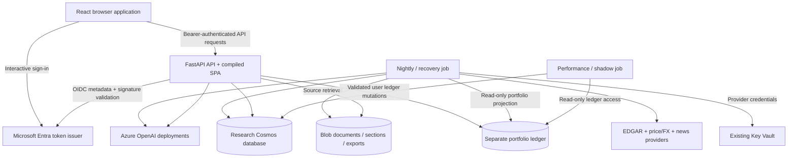
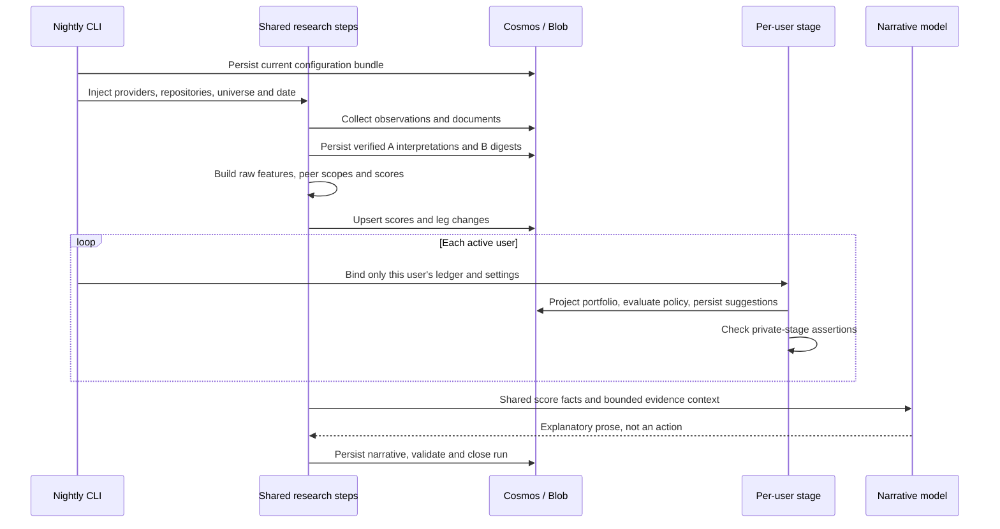

# Auspex implementation guide

**Status:** Current as-built reference; source and link audit completed 2026-09-18

**Audience:** Developers, technical reviewers, operators, and coding agents

**Scope:** The current Python/React application, not the retired Fabric/RAGS design

**Companion:** [Arc42 architecture overview](auspex-arc42.md)

## Contents

- [How to use this guide](#how-to-use-this-guide)
- [Non-negotiable boundaries](#non-negotiable-boundaries)
- [Runtime map](#runtime-map)
- [Configuration and stable identities](#configuration-and-stable-identities)
- [Data contracts and source time](#data-contracts-and-source-time)
- [Research pipeline and ingestion](#research-pipeline-and-ingestion)
- [AI extraction](#ai-extraction-text-to-constrained-evidence)
- [The six-leg engine](#the-six-leg-engine-exactly-as-implemented)
- [Publication, API and browser](#publication-api-read-models-and-the-browser)
- [Grounded conversation and SSE](#grounded-conversation-and-sse)
- [Identity, lifecycle and portfolio](#identity-account-lifecycle-and-the-portfolio-ledger)
- [Policy and measurement](#policy-recommendation-state-and-empirical-self-measurement)
- [Deployment and operations](#deployment-and-operations)
- [Tests, extension points and limits](#tests-extension-points-and-limits)
- [Supporting module reference](#supporting-module-reference)

## How to use this guide

Arc42 explains the system's purpose and architectural decisions. This document
explains the machinery: which module owns a behavior, what it receives, how it
transforms that input, what it persists, and what happens when an assumption
fails. It is not a claim of predictive performance or regulatory certification.

Read the [runtime map](#runtime-map) first. Then follow a concrete path:

- **A filing becomes a score:** ingestion, extraction, feature construction,
  normalization, snapshot publication, and explanation.
- **A score becomes a suggestion:** the shared research result enters a separate
  user-specific portfolio and policy calculation.
- **A person asks a question:** authentication, constrained retrieval planning,
  partition-aware retrieval, answer checks, persistence, and SSE delivery.
- **An operator repairs history:** source-preserving extraction recovery,
  chronological replay, measurement, and current-policy refresh.

The descriptions distinguish three things that are easy to conflate:

1. A provider's observation.
2. An AI interpretation of source text.
3. A deterministic calculation using observations and accepted labels.

Named functions, models, and paths are navigational references to the
implementation. Values in worked examples are hypothetical. Operational
commands are not instructions to delete or rebuild a live database without
reviewing their side effects.

### Documentation method

The organization follows these researched practices:

- [C4 component views](https://c4model.com/diagrams/component): move from runtime
  containers to their responsibilities and dependencies; do not draw every
  function as an architectural box.
- [Diataxis reference](https://diataxis.fr/reference/) and
  [explanation](https://diataxis.fr/explanation/): keep precise contracts and
  formulas distinguishable from the reasons behind a design.
- [Microsoft architecture design specifications](https://learn.microsoft.com/en-us/azure/well-architected/architect-role/architecture-design-specification):
  include data/API contracts, security boundaries, rollout/recovery, tests,
  operational behavior, and limitations, rather than only a service diagram.

Within each area, the recurring questions are **purpose, entry points, inputs,
processing, outputs/side effects, failures, and tests**. The final limitations
section is part of the specification, not an optional disclaimer.

## Non-negotiable boundaries

| Boundary | Implementation consequence |
| --- | --- |
| AI does not assign scores | Channel A returns enumerated qualitative labels; code supplies weights, time windows, normalization, and arithmetic |
| Shared research is not a private portfolio | Securities, documents, prices, extracted evidence, and scores are shared; positions, settings, suggestions, dispositions, conversations, and user measurement are scoped separately |
| No trade execution | A suggestion or accepted disposition is not a broker order; portfolio changes are explicit ledger events |
| Evidence has an availability date | Feature construction excludes documents/facts not known by the scoring date; transaction dates and publication dates have different jobs |
| Missing is not observed zero | An unread document, missing market capitalization, and a confidently reviewed no-match document must not collapse to the same meaning |
| Structural exclusion is not poor data | Foreign private issuers do not have a comparable Form 4 leg; unavailable authoritative cross-currency valuation can exclude that leg |
| Money is not a binary-float accumulator | Financial values are serialized as decimal strings; deterministic financial calculations use `Decimal` |
| A readable explanation cannot invent an input | Leg reasons are built from the scoring context; references carry source identifiers and dates |
| A deployed image and stored schema must agree | Persisted Pydantic models reject unknown fields; deploy readers before writing newly added fields |
| Old implementation tickets are not the current architecture | Fabric Warehouse views, RAGS, Static Web Apps auth, and a vector-search index must not be assumed to exist |

The arithmetic boundary is not a promise that every statistical helper uses
only decimal operations. Exponential decay and the attention logarithm use
Python `math` and convert their results back to `Decimal`; the measurement
subsystem also has its own numerical conventions.

## Runtime map

One [Dockerfile](../Dockerfile) builds the React bundle and the Python package.
The same image has three deployment roles:

| Runtime | Entrypoint | Responsibility | Important non-responsibility |
| --- | --- | --- | --- |
| API Container App | `auspex serve` | Serve the SPA, authenticate requests, project read models, accept explicit user mutations, answer conversations | Does not execute the nightly universe calculation on each page load |
| Pipeline Container Apps Job | `python -m auspex nightly` | Collect shared research, extract text, calculate shared scores, fan out private policy, publish/check the run | Does not buy or sell through a broker |
| Performance Container Apps Job | `python -m auspex performance` | Measure existing historical outputs and recorded user outcomes | Does not silently promote new weights |

The public application's resource group is named `rg-auspex-prod`. That naming
does not turn the MVP into a production-certified financial system. The
existing source-ledger Cosmos account and Key Vault are retained in a separate
shared resource group; their older `dev` names do not make them disposable.



### Composition roots and dependency direction

The package entrypoint is [__main__.py](../src/auspex/__main__.py), which delegates
to [cli/main.py](../src/auspex/cli/main.py). The CLI constructs providers,
repositories, configuration, and a `PipelineContext`; domain functions do not
discover Azure resources themselves.

The HTTP composition root is [api/app.py](../src/auspex/api/app.py), with
request dependencies in [api/deps.py](../src/auspex/api/deps.py), API-oriented
repositories in [api/repos.py](../src/auspex/api/repos.py), and aggregate response
contracts in [api/schemas.py](../src/auspex/api/schemas.py).

The main dependency direction is:

```text
CLI / FastAPI route / React action
    -> orchestration or application service
        -> pure domain calculation and typed models
        -> repository/provider protocol
            -> Cosmos / Blob / HTTP / Azure OpenAI SDK
```

This matters when changing behavior. A new provider belongs behind a provider
contract; a new scoring formula belongs in the scoring/feature layer; a different
screen label must not change stored arithmetic.

### Process-local state

[settings.py](../src/auspex/settings.py) uses Pydantic settings with the
`AUSPEX_` environment prefix. Cached settings/configuration/client factories are
process-local, not a distributed control plane. Updating an environment
variable requires a new process/revision to affect an already-running instance.

`PipelineContext` separates injected dependencies from transient scratch state:

- `universe`, `config`, `as_of_date`, `user_id`;
- `PipelineProviders`: optional market, FX, news, EDGAR, OpenAI, and portfolio
  ports;
- `PipelineRepos`: document, price, FX, fundamental, extraction, score,
  recommendation, run, and user-related sinks;
- `new_document_ids_by_security` and `new_accessions_by_security`;
- `degraded_securities` for inputs that can affect scoring;
- `explanation_degraded_securities` for Channel B failures that must not remove
  an otherwise valid score;
- scratch results such as `_scoring_inputs`, `_score_results`,
  `_score_evidence`, `_snapshots`, and `_packages_by_security`.

The scratch values are not automatically persisted as a resumable execution
image. `derive_for_user` shares research state and drops user-specific scratch
keys, including portfolio projections, actions, and assertion results. It also
binds the appropriate portfolio reader. See
[pipeline/context.py](../src/auspex/pipeline/context.py).

## Configuration and stable identities

[config/loader.py](../src/auspex/config/loader.py) loads YAML, creates the typed
`Universe`, validates the FPI weight relationship, and builds a `ConfigVersion`.

| Asset | What changes when it changes |
| --- | --- |
| [universe.yaml](../config/universe.yaml) | Tracked issuers, CIKs, cohorts, filer profiles, investability |
| [exchanges.yaml](../config/exchanges.yaml) | Exchange metadata used to present configured securities |
| [cohorts.yaml](../config/cohorts.yaml) | Cohort-to-parent membership tree |
| [weights.yaml](../config/weights.yaml) | Leg weights, label-to-number mappings used by these features, authority weights, decay parameter, ROIC tax assumption, winsor cap, retained valuation FX pairs |
| [taxonomy.yaml](../config/taxonomy.yaml) | Allowed theme identifiers and their display labels, risk and narrative vocabularies |
| [label_mappings.yaml](../config/label_mappings.yaml) | Additional configured qualitative mappings; do not assume every declared mapping is a live numerical feature |
| [xbrl_concepts.yaml](../config/xbrl_concepts.yaml) | Ordered concept-alias collections for financial inputs |
| [policy.yaml](../config/policy.yaml) | Eligibility/action/allocation thresholds and pipeline budget configuration |
| [fees.yaml](../config/fees.yaml) | Transaction cost and measurement assumptions |
| [portfolio_mapping.yaml](../config/portfolio_mapping.yaml) | Binding to the pre-existing source ledger |

The security id is UUID5 over `auspex.security.{ticker}` using the DNS namespace.
It is stable for the same ticker, not an SCD2 security master that automatically
preserves identity across every ticker change. CIK, ticker, exchange, and
cohort remain separate attributes.

`build_config_version` hashes a canonical JSON bundle containing weights,
policy, label mappings, cohorts, taxonomy, XBRL concepts, and fees. The id is
supplied by the caller (for example a run-date identifier); it is not itself the
hash. Universe and exchange YAML are not included in that bundle.

Snapshots retain `config_version_id` for provenance. This is different from
shipping multiple historical engine implementations. The current MVP can
recompute derived history with the current source code; a stored configuration
alone is not a complete executable reconstruction of an old application.

### FPI weight validation

For a domestic Smart Money weight `w_SM`, each retained FPI weight must equal
`w_domestic / (1 - w_SM)`, rounded at the precision written in YAML. The loader
rejects a Smart Money entry in the FPI map, mismatched leg sets, or a
non-proportional redistribution.

Current weights are:

| Leg | Domestic | FPI |
| --- | ---: | ---: |
| Thesis Linkage | 0.20 | 0.25 |
| Attention Acceleration | 0.15 | 0.1875 |
| Narrative Premium | 0.10 | 0.125 |
| Smart Money | 0.20 | Excluded |
| Fundamental Health | 0.20 | 0.25 |
| Valuation Brake | 0.15 | 0.1875 |

Changing a weight requires checking the FPI map, policy interpretation,
historical measurements, explanations, and tests. It is not merely a visual
configuration change.

## Data contracts and source time

[models/common.py](../src/auspex/models/common.py) defines `AuspexModel` with
`extra="forbid"` and field-name population enabled. UUID4 and UTC timestamp
helpers are separate from the security-id scheme. Most stored financial values
are strings; conversion happens at explicit boundaries. Do not infer that an
arbitrary string-valued field has a universal finite-number validator.

| Contract | Important fields | Meaning |
| --- | --- | --- |
| `Security` | `id`, `ticker`, `cik`, `cohort`, `filer_profile`, `investable` | A configured research identity |
| `Document` | `security_id`, `source`, `source_record_id`, `document_type`, `form_type`, `knowledge_date`, `content_hash`, `blob_path`, title/summary/source URL | A source record, not an AI interpretation |
| `FundamentalSnapshot` | `security_id`, `accn`, `form`, `fy`, `fp`, `filed`, `facts` | Companyfacts grouped by reporting accession |
| `XbrlFact` | `taxonomy`, `concept`, `unit`, `value`, `accn`, `fy`, `fp`, `form`, `start`, `end`, `filed` | A reported value with period and availability metadata |
| `ChannelAExtraction` | source ids/hash, model/prompt/taxonomy identifiers, qualitative labels, claims, input fingerprint, discarded-claim count | Scoring interpretation of a bounded source payload |
| `ChannelBDigest` | source ids/hash, headline, digest, plain summary, verified evidence, comparative changes, input fingerprint | Explanation material, not numerical scoring input |
| `ScoreSnapshot` | issuer/date/config id, legs, composite, percentile, coverage, scope, direction, evidence explanations, fingerprint, staleness/backfill flags | Published shared research result |
| `LegChange` | issuer/date/leg and prior/current values, decomposition fields | A recorded change, not an inferred business cause |
| `RunManifest` | date/type/status, step checkpoints, timings, degraded reasons, validation counters | Operational record for the shared run |

Source definitions:
[document.py](../src/auspex/models/document.py),
[fundamentals.py](../src/auspex/models/fundamentals.py),
[extraction.py](../src/auspex/models/extraction.py),
[scoring.py](../src/auspex/models/scoring.py),
[run.py](../src/auspex/models/run.py),
[enums.py](../src/auspex/models/enums.py).

### Different dates answer different questions

- `knowledge_date`: when a document can become an input to a daily assessment.
- XBRL `filed`: whether a reported fact was publicly available by the assessment
  date.
- XBRL `start`/`end`: the economic period described by the value.
- Form 4 `transaction_date`: when the insider transaction happened; the
  containing filing must also have been known by the assessment date.
- Price/FX `session_date`: the date of the market observation.
- `retrieved_at`/creation timestamps: ingestion and processing provenance, not
  a substitute for the economic or knowledge date.

A transaction that happened earlier but was filed later cannot influence a
score before its filing becomes known. A later restatement is not eligible for
an earlier `as_of_date` simply because its economic period ended earlier.
The implementation operates primarily at **date granularity**; do not claim
intraday publication-versus-execution precision.

### Storage map

The authoritative container/partition declarations are in
[cosmos_client.py](../src/auspex/persistence/cosmos_client.py).

| Container group | Partition key | Typical access |
| --- | --- | --- |
| `securities`, `documents`, `extractions`, `digests`, `market_daily`, `fundamentals`, `scores`, `leg_changes` | `/security_id` | Issuer-local evidence/history; bounded cross-issuer research where required |
| `company_overviews` | `/security_id` | One current provider-calculated overview per issuer; point reads, separate from scored history |
| `narratives` | `/cache_key` | Cached prose for an exact input identity |
| `recommendations`, `recommendation_dispositions`, `portfolio_projection`, `conversations`, `user_settings`, `user_performance` | `/user_id` | Authenticated private-user reads/writes |
| `app_users`, `onboarding`, `deletion_jobs`, `audit_events` | `/user_id` | Lifecycle and user-specific operational state |
| `app_user_index` | `/scope` | A small administrator/active-user roster partition, not a portfolio index |
| `performance` | `/metric_type` | Shared engine measurement |
| `runs` | `/run_date` | Run manifests and checkpoints |
| `config_versions` | `/config_type` | Configuration provenance and repair-manifest records |
| `watermarks` | `/scope` | Per-collector progress markers |

The source portfolio ledger is a **different Cosmos account/context**, with
its own mapped containers and partition contract. Never substitute the research
database for it because a container name looks familiar.

One physical-storage detail is important: `FxRate` has `pair` but does not
serialize a `security_id`. `CosmosFxSink` currently passes that model directly
to the generic upsert in the shared `market_daily` container. Those FX rows
therefore use the undefined physical partition-key value, not a pair partition
merely because the model exposes a `partition_key` property. FX reads use the
pair-bearing query shape. Do not assume every market row is issuer-partitioned
or use the model property as proof of its stored partition placement.

Blob stores raw provider documents, selected sections, and exports. Cosmos
metadata references those blobs. Private endpoints and managed identities do
not make source text trusted instructions for a model.

## Research pipeline and ingestion

### The nightly execution path

The production CLI builds a `PipelineContext`, persists the configuration
bundle, resolves the active-user roster, and calls the multi-user wrapper.
The functions are in [cli/main.py](../src/auspex/cli/main.py),
[pipeline/runner.py](../src/auspex/pipeline/runner.py), and
[pipeline/fanout.py](../src/auspex/pipeline/fanout.py).



The authoritative step list is
[models/run.py](../src/auspex/models/run.py). The implementation map is
`STEP_FUNCTIONS` in the runner, with orchestration in
[pipeline/steps.py](../src/auspex/pipeline/steps.py).

| Step | Reads / operation | Produces or changes |
| --- | --- | --- |
| `START_RUN` | Starts the manifest checkpoint | Start detail; this is not distributed job-lock acquisition |
| `COLLECT_PRICES` | Provider prices after each issuer watermark | Raw/adjusted bars, structural quarantine flags, price watermarks |
| `COLLECT_FX` | Configured currency pairs | Daily FX observations and per-pair watermarks |
| `COLLECT_FILINGS` | EDGAR submissions and primary filing documents | Blob content, document metadata, new document ids |
| `COLLECT_INSIDERS` | Domestic Form 4 filings | Parsed non-derivative insider transactions attached to documents |
| `COLLECT_NEWS` | Company-news provider | Headline/summary records and publication watermarks |
| `COLLECT_FUNDAMENTALS` | Companyfacts for relevant new accessions plus due current provider overviews | Separate SEC snapshots and company_overviews; current overview never feeds raw legs |
| `EXTRACT_CHANNEL_A` | Supported, relevant new documents | Grounded qualitative scoring interpretations |
| `EXTRACT_CHANNEL_B` | Same source material and prior comparable filing | Explanation digests and comparative records |
| `COMPUTE_RAW_LEGS` | Eligible interpretations, documents, facts, prices and FX | `SecurityScoringInput` and evidence contexts |
| `ASSIGN_COHORTS` | Non-stale universe membership | Per-security `CohortScope` |
| `NORMALISE` | Raw legs, peer populations and weights | `SecurityScoreResult` |
| `DIFF` | Current results and previous observed-session snapshots | Leg deltas and counterfactual decomposition |
| `WRITE_SNAPSHOT` | Results, evidence contexts, prior direction reference | `ScoreSnapshot`, `LegResult`, source reasons and package fingerprints |
| `PROJECT_PORTFOLIO` | One user's effective ledger and market data | Private projection and cached policy inputs |
| `RUN_POLICY` | Projection, shared scores, user settings | Private actions and jointly allocated suggestions |
| `ASSERT` | That user's policy outputs | Violations/health information, not a new score |
| `NARRATE` | Shared score package and selected digests | Shared explanatory text |
| `VALIDATE` | Expected rows and computed/policy-evaluable populations | Explicit consistency issues |
| `END_RUN` | Checkpoint/validation outcomes | Final status and completion metadata |

The three private steps are contiguous. Shared ingestion and inference are not
repeated for every user. `derive_for_user` removes private scratch state while
sharing the research result by reference. Per-user failures are reported
without lending another user's portfolio or settings to the failed stage.

The production whole-run/step budgets are 90/45 minutes. This includes daily
overview calls under the existing conservative provider limit; the job's
platform timeout remains a separate outer bound. Historical replay does not
perform current-overview collection.

### Checkpoints, deadlines, and what resume does not mean

`run_step_bounded` measures both the remaining whole-run budget and the
individual-step ceiling, then uses `asyncio.wait_for`. A timeout becomes a
`TIMEOUT` manifest with a failed checkpoint; an uncaught step error becomes
`FAILED`. A successful execution can still be `DEGRADED` when evidence,
assertions, or validation are incomplete.

Normal production contexts resolve their budgets from settings/configuration.
The hand-built-context default is not necessarily the deployed budget.
The multi-user stage anchors its deadline to the shared run's start time,
rather than granting a fresh whole-run budget to every user.

`PipelineRunner.run(existing_manifest=...)` can skip checkpoints already marked
successful/skipped. It does **not** reconstruct the scratch values those steps
created. The normal CLI does not automatically load and hydrate a failed
manifest. Re-running a full idempotent path, or explicit bootstrap recovery,
is different from durable continuation of an arbitrary suspended Python frame.

Likewise, `watermarks_committed` is a run-status field, not a multi-container
transaction. Collectors persist their own watermarks during ingestion. A failed
later extraction does not roll those source cursors back. Coordinate concurrent
operator/scheduled runs; `START_RUN` is not a distributed lease.

### Provider contracts and concrete wiring

[providers/base.py](../src/auspex/providers/base.py) defines immutable DTOs and
protocols:

- `PriceProvider.get_daily_prices(ticker, since) -> list[PriceBarDTO]`;
- `FxProvider.get_daily_fx(pair, since)` and its USDCHF convenience method;
- `NewsProvider.get_news(ticker, since) -> list[NewsArticleDTO]`.

`PriceBarDTO` separates raw OHLC, raw volume, adjusted close, adjustment factor,
split factor, and dividend amount. An adjusted close is not silently substituted
for all of those different observations.

The actual defaults are in
[providers/factory.py](../src/auspex/providers/factory.py):

| Module | Role and behavior |
| --- | --- |
| [alpha_vantage.py](../src/auspex/providers/alpha_vantage.py) | Default price and FX adapter; uses `TIME_SERIES_DAILY_ADJUSTED` and `FX_DAILY`; reads full provider series then filters from `since` |
| [finnhub.py](../src/auspex/providers/finnhub.py) | Default company news; UTC publication time; provider headline and summary, not a fetched full article |
| [edgar.py](../src/auspex/providers/edgar.py) | Submissions, companyfacts, specific filing documents and Form 4 XML |
| [edgar_bulk.py](../src/auspex/providers/edgar_bulk.py) | Selective HTTP Range access to SEC ZIP members; adapts cached records to the same EDGAR methods |
| [tiingo.py](../src/auspex/providers/tiingo.py) | Alternative price adapter; its presence does not make it an automatic fallback in the default factory |
| [fx_provider.py](../src/auspex/providers/fx_provider.py) | Alternative FX implementation; not the deployed default merely because it exists |
| [secrets.py](../src/auspex/providers/secrets.py) | Key Vault-backed provider-secret resolution |
| [rate_limit.py](../src/auspex/providers/rate_limit.py) | Async token bucket and backoff helper |
| [openai_provider.py](../src/auspex/providers/openai_provider.py) | Managed-identity model calls, token estimation, deployment-specific budgets and rate-limit retries |

Alpha Vantage's adapter defaults to five requests per minute and treats its
HTTP-200 `Error Message`, `Note`, or `Information` bodies as errors. EDGAR uses
an identifying User-Agent and an eight-request-per-second bucket with bounded
429 retries. Finnhub has its own request bucket and bounded 429 retries.
These are process-local controls, not a distributed quota allocator.

The factory logs unresolved secret/provider construction failures and returns
an absent optional provider. The corresponding orchestration step is marked
`SKIPPED`; that does not prove fresh data was collected. Current cached data
and staleness/coverage rules determine what can still be assessed.

### Collector responsibilities and failure boundaries

The common protocols and `CollectorResult` are in
[collectors/base.py](../src/auspex/collectors/base.py). Results distinguish seen,
written, duplicate, and quarantined rows, degradation, error text, and newly
stored document ids.

| Collector | Input cursor | Stored result and important details |
| --- | --- | --- |
| [PriceCollector](../src/auspex/collectors/price_collector.py) | `price:{security_id}` date | Reads from the day after the cursor; upserts `{security_id}:{session_date}`; structural errors quarantine rather than becoming usable observations |
| [FxCollector](../src/auspex/collectors/fx_collector.py) | `fx:{lowercase_pair}` date | Processes distinct configured pairs; pair failures are collected without discarding successful pairs; FX is also used for comparable non-USD valuation |
| [FilingCollector](../src/auspex/collectors/filing_collector.py) | `filing:{security_id}` accession | Downloads the primary document, checks issuer-local content hash, writes Blob then metadata, and advances the maximum accession |
| [InsiderCollector](../src/auspex/collectors/insider_collector.py) | `insider:{security_id}` filing date | Fetches raw Form 4 XML, parses transactions without AI, and advances the latest filing date |
| [NewsCollector](../src/auspex/collectors/news_collector.py) | `news:{security_id}` publication timestamp | Stores title, URL and at most 4,000 summary characters; can enrich an existing record that lacks its summary |
| [FundamentalCollector](../src/auspex/collectors/fundamental_collector.py) | `fundamental:{security_id}` processed accession set | Groups companyfacts by accession, persists facts and adds successfully processed accessions to the cursor |

Filing/news deduplication in these implementations is an issuer-local content
hash lookup. Document ids are opaque generated identifiers; price/fundamental
ids have their own stable schemes. Do not infer a universal `batch_id` or a
Fabric bronze envelope from an older ticket.

The filing allow-list is exactly `10-K`, `10-Q`, `8-K`, `20-F`, `6-K`, and
`S-1`. The primary-document collector does not recursively collect every
exhibit or automatically handle every `/A` amendment. An 8-K cover document
can refer to an earnings-release exhibit that is not in the extracted text.
`supersedes_id` being available in a model is not evidence of a populated
amendment-resolution workflow.

Form 4 parsing reads the first reporting-owner element and the non-derivative
table. Unknown codes or rows without transaction date/shares are skipped;
an absent price is represented as `"0"`. The Smart Money leg subsequently
uses only P/S codes and qualifying roles. Derivative activity and zero-valued
transactions must not be described as a fully measured discretionary net sale.

Watermarks are not a guaranteed retry queue. A later successful accession/date
can advance a cursor beyond an earlier failed source download, and same-date
Form 4 collection uses a date cutoff. Diagnose the missing source and its cursor
explicitly; extraction recovery cannot recreate a filing that was never stored.

### Bulk bootstrap and replay

[BootstrapRunner](../src/auspex/cli/bootstrap.py) reuses the same collectors,
feature builders, and scoring steps rather than implementing a second engine.
The named windows are implemented as fixed day counts:

```text
raw_backfill_start(today)        = today - 36 * 30 days
extraction_backfill_start(today) = today - 18 * 30 days
```

They are not calendar-month subtraction. Price/FX and Form 4 backfill use the
raw window; primary filing downloads use the extraction floor. Bulk companyfacts
contain reported history, but accession selection and stored snapshots still
govern the actual financial inputs available to replay.

`RemoteZipArchive` performs HEAD/range reads for ZIP directory structures and
only requested CIK members. Blocking ZIP access runs through `asyncio.to_thread`.
`BulkEdgarSource` serves in-memory submissions/companyfacts when present and
delegates filing/XML downloads or missing-CIK fetches. It does not download both
multi-gigabyte archives in full to local storage.

News is collected before extraction so newly stored news can enter both
channels. The extraction workset is rebuilt from persisted documents, excludes
future documents, and includes supported source types. It also refreshes
**already-interpreted** documents in the extra 180-day warm-up interval before
the scored window, because their old interpretations could affect the first
replayed dates. It does not indiscriminately start interpreting every older raw
document.

`bootstrap-recover --replay-all` reuses fingerprint-matching results, refuses to
replay if extraction failed or no extraction client exists, rebuilds the scored
window, computes measurement, and validates coverage. The source-ledger binding
requires explicit operator confirmation; recovery reads rather than rewrites
that ledger.

`replay_scoring`:

1. Preloads documents, A interpretations, fundamentals, and FX.
2. Wraps prices in `_AsOfPriceSink` and prior scores in `_ReplayScoreRepository`.
3. Creates a fresh context for each replayed weekday.
4. Executes raw-feature construction, cohort assignment, normalization, diff,
   and snapshot writing, without re-running collectors or private policy.
5. Persists backfilled research rows and accumulates coverage counts.

The loop uses weekdays, while staleness/direction use observed price sessions.
Do not claim that every stored replay date is an independently observed exchange
session. An early history window can also be text-evidence-censored when older
documents were never interpreted. Current configuration and a present-day
universe are applied retrospectively; this is not a historical constituent
database or an out-of-sample training system.

### Repository and Blob adapters

[CosmosRepository](../src/auspex/persistence/repositories.py) translates Pydantic
models into Cosmos documents and strips Cosmos system properties on reads.
It provides point reads, parameterized queries, upserts, scoped deletion,
partition enumeration, and ETag-conditional replacement. HTTP 404 for an absent
point read/delete and HTTP 412 for a lost conditional update have explicit,
operation-specific meanings; other errors are not ordinary missing rows.

Specialized sinks add domain operations: issuer-local content/cache lookups,
price history/as-of reads, FX/fundamental access, narrative cache storage,
watermarks, and integrity manifests. Quarantine-aware price reads exclude
invalid bars; integrity inspection deliberately uses an unfiltered path so
quarantined observations can be re-examined.

[repo_access.py](../src/auspex/pipeline/repo_access.py) bridges synchronous
in-memory fixtures and asynchronous production adapters. `fetch_all` accepts
`.all()` or `.query()`; a missing/unrecognized sink returns an empty list.
`read_blob_text` accepts the production text downloader or a fixture dictionary.
Its empty result is now explicitly rejected by extraction when a supported
document has no readable sections. These helpers are not a schema-validating
replacement for configuring the correct repositories.

[blob_client.py](../src/auspex/persistence/blob_client.py) owns raw/section/export
storage. [memory.py](../src/auspex/persistence/memory.py) supplies test adapters,
including quarantine-aware and unfiltered price views. Production-shaped
integration tests replace the SDK boundary, rather than relying only on a
fixture's convenient `.all()` method.

### Corporate-action integrity

Market-data repair is a distinct subsystem, not an LLM inference:

| Module | Responsibility |
| --- | --- |
| [policy.py](../src/auspex/marketdata/policy.py) | Explicit Decimal thresholds and repair policy identifier |
| [detect.py](../src/auspex/marketdata/detect.py) | Structural bar checks, ordering/deduplication, expected adjustment factors, convention selection, series and forward-window anomalies |
| [repair.py](../src/auspex/marketdata/repair.py) | Pure `plan_security_repair` result: derived-field repairs and quarantine transitions |
| [service.py](../src/auspex/marketdata/service.py) | Read issuer partitions, construct plans, apply changed rows, persist a fingerprinted manifest |
| [quarantine.py](../src/auspex/marketdata/quarantine.py) | Shared SQL/in-memory exclusion predicate |
| [recompute.py](../src/auspex/marketdata/recompute.py) | Merge affected ranges and derive downstream recomputation targets |
| [cli/market_data.py](../src/auspex/cli/market_data.py) | Read-only diagnosis and explicit repair/apply orchestration |
| [models/market_integrity.py](../src/auspex/models/market_integrity.py) | Findings, ranges, repairs, conventions and manifest contracts |

Current policy distinguishes suspicious adjusted daily moves above `0.45`,
extreme moves above `5`, and forward-return magnitudes above `10`.
Adjustment/factor tolerance is `0.002`; the convention threshold is `0.01`.
Those are detector rules, not proof that a large real price move cannot happen.

The planner preserves provider observations while repairing justified derived
fields. An unsupported split-like break is not permission to invent a split.
Whole-history validation/repair is separate from the cheap per-bar ingest check.
A successful diagnosis is not the same operation as applying a repair, and a
repair manifest's affected ranges are not proof that all downstream scores were
already recomputed.

## AI extraction: text to constrained evidence

### Source selection

[sections.py](../src/auspex/extraction/sections.py) converts filing HTML to text,
dropping `script`, `style`, `head`, and `ix:header` content. Block boundaries
become line boundaries. Target headings are anchored to lines and accept
periods, colons, ASCII hyphens and typographic dashes without rewriting the
source text. Numbered sections terminate at numbered Item boundaries rather than at their own
subtitles. The longest bounded occurrence wins over repeated table-of-contents
headings. An overlapping results section inside MD&A is not duplicated.

`document_sections` handles three cases:

- annual/quarterly/prospectus forms: targeted configured sections;
- 8-K/6-K: cleaned whole primary-document text;
- NEWS: stored title and provider summary, with no Blob/form-type requirement.

This distinction matters: the old heading selector could reduce quarterly MD&A
to its heading while selecting an accounting note that merely mentioned
"results of operations". Cache invalidation must track the processed input,
not only the unchanged raw HTML hash.

[relevance.py](../src/auspex/extraction/relevance.py) gates provider news by
issuer headline matching. Common-word symbols require explicit ticker notation
unless the actual company name matches. This is a conservative relevance
heuristic, not semantic proof that an article exclusively concerns the issuer.
Provider summaries are not advertised as complete licensed articles.

### Channel A: the numerical boundary

[channel_a.py](../src/auspex/extraction/channel_a.py) supplies the ticker, source
type, bounded sections, and allowed theme ids to Azure OpenAI. Its parser keeps
known domain fields, sanitizes enum scalars, rejects malformed claims, and then
checks retained claims against the actual bounded text.

| Output | Direct use in the current six-leg engine |
| --- | --- |
| `theme_claims[].theme_id/strength` | Theme-linkage events; source authority and recency are assigned in code |
| `materiality` | Enriches the document's attention weight |
| `narrative_claims[].strength` | Narrative-strength aggregate |
| `sentiment`, `guidance_direction`, `novelty`, `risk_claims` | Stored interpretation/context; do not assume each has a direct coefficient in the six raw formulas |
| `extraction_confidence` | Qualifies reviewed-no-match evidence; it is not a universal multiplier on every positive claim |
| `discarded_claim_count` | Records malformed/unsupported/ungrounded claim loss |
| `input_fingerprint` | Identifies the exact processed input and prompt that produced this interpretation |

An invalid enum can be coerced to a conservative default; a malformed response
does not always mean the entire model object is rejected. Empty or truncated
JSON completions fail explicitly at the provider boundary. Local validation is
still necessary because Channel A/B use JSON-object mode, unlike the planner's
strict generated JSON Schema.

[grounding.py](../src/auspex/extraction/grounding.py) normalizes source whitespace
for span checks. Channel A can retain a verified prefix where its schema
mechanically clipped a trailing excerpt, but cannot accept invented stitched
spans or unknown taxonomy ids. A quote occurring in the source proves its text,
not that an assigned theme or business interpretation is logically entailed.

### Channel B: explanation material

[channel_b.py](../src/auspex/extraction/channel_b.py) builds a headline, digest,
beginner summary, quotes, management claims, questions, and optional comparative
record. A prior same-form filing supplies comparison text; unrelated news
articles are not treated as sequential versions of a filing.

Current and prior risk-change excerpts are checked against the corresponding
source. The beginner summary is removed if no supporting verified excerpt
survives. The surrounding digest/headline prose is not an entailment proof.
Channel B never becomes a numerical leg input, and its failure is tracked
separately from scoring-evidence failure.

### Cache identity, refresh and concurrency

[cache.py](../src/auspex/extraction/cache.py) and
[models/extraction.py](../src/auspex/models/extraction.py) define the logical keys:

```text
A: security | raw-content-hash | model | prompt | schema | taxonomy
B: security | raw-content-hash | model | prompt
```

A key hit is insufficient: the stored `input_fingerprint` must also match a
SHA-256 hash of the actual system prompt and bounded user content. Corrected
section selection therefore refreshes the existing record id in place.
Unchanged inputs reuse the stored interpretation. This is not an automatic
scan of every historical document on every nightly run; operators explicitly
select old work through recovery.

Both channels use bounded async concurrency, currently sixteen document tasks.
Channel A input is bounded to 300,000 source characters; Channel B bounds current
and prior sections separately to 150,000. Filings reserve 5,000 output tokens;
NEWS reserves 1,500 for A and 2,000 for B.

The OpenAI wrapper estimates input tokens as characters divided by 3.5 plus
the output reserve. The default extraction/planner deployment has its own
450,000-TPM budget; narrative/answer calls use a 30,000-TPM budget.
The token bucket clamps an oversized single reservation to its capacity, so
callers must still bound requests. Separate processes can contend for the same
service quota; retries do not create extra quota.

If a JSON call ends with `finish_reason="length"`, the provider retries once
with a small repetition penalty (`0.2`), the identical source/prompt and the
same output ceiling. Each attempt reserves its own token budget. This breaks
the observed repetitive Unicode-escape failure without accepting truncated
JSON or invalidating completed source caches. A second truncation still fails;
refusal/content-filter/empty responses do not take this retry path. Existing
source-span validation remains authoritative after the response is complete.

## The six-leg engine, exactly as implemented

### From stored records to calculation inputs

[feature_builder.py](../src/auspex/pipeline/feature_builder.py) is the bridge
between storage and pure math in [legs.py](../src/auspex/scoring/legs.py).
The live orchestration selects only A interpretations with a fingerprint,
matching issuer/document/content hash, and current taxonomy identity.
Unverified legacy interpretations do not silently enter a newly calculated
score. Raw source records remain preserved.

The builder then constructs:

- `ThemeClaimEvent(strength, authority, age_days)`;
- `AttentionEvent(materiality_weight, authority, days_ago)`;
- `NarrativeClaimEvent(strength, age_days)`;
- `InsiderTxnEvent(code, shares, price, role flags, days_ago)`;
- `FundamentalHealthInputs` with five named ratios/trends;
- `ValuationBuildResult`, separating absent financial/market inputs from
  unavailable authoritative cross-currency conversion.

No raw LLM number is used as a price, share count, financial fact, trade amount,
or scoring coefficient. Qualitative labels still influence the result: changing
accepted claims or their enum strengths changes the deterministic inputs.

### 1. Thesis Linkage

For accepted theme claims from sources with `0 <= age <= 180`:

```text
raw_thesis = clip(sum(strength * authority * exp(-age / tau)), 0, 1)
```

`tau` is the configured `recency_half_life_days`, currently 90. Despite that
historical name it is an **e-folding constant**, not a mathematical half-life.
At age 90 the factor is about 0.368, not 0.5.

Strength values are STRONG `1`, MODERATE `0.6`, WEAK `0.25`.
Authority is `1` for 10-K/20-F, `0.9` for 10-Q, `0.8` for S-1, `0.7` for
8-K/6-K, and `0.4` for news.

An empty event list is `None` unless at least one current, sufficiently confident
review has no discarded claims and confirms no matching theme. That case is an
observed zero. Neither case proves the company has no relevant activity outside
the available/understood sources.

The value is **unsigned exposure**, not bullish sentiment. Export-control risk
can strengthen a documented connection to a tracked theme. Each accepted claim
is an event; multiple claims, including the same theme in a document, can raise
the sum. The cap can make well-documented companies indistinguishable at one.

Hypothetical example: one STRONG quarterly claim thirty days old contributes
`0.9 * exp(-30/90)`, about `0.645`. Another sufficiently strong claim can bring
the clipped raw value to one. That is not a predicted return.

### 2. Attention Acceleration

There is one event per source document, not one event per extracted claim.
A supported filing has baseline materiality one; extraction can enrich it using
`max(baseline, extracted materiality)`. News without a usable materiality
interpretation has no baseline contribution.

```text
recent = sum(materiality * authority) for 0 <= age < 30
prior  = sum(materiality * authority) for 30 <= age < 60
raw_attention = clip(ln((recent + 1) / (prior + 1)), -1.5, 1.5)
```

No observations in the sixty-day window yields `None`, not zero. An equal pace
is a genuine zero; observations only in the older window are genuine
deceleration. This is a weighted disclosure stream, not a measure of trading
volume, social-media popularity, or news sentiment.

### 3. Narrative Premium

```text
claims = clip(sum(strength * exp(-age / 90)), 0, 1)
expectation = revenue_growth_percentile / 100
raw_narrative = clip(claims - expectation, -1, 1)
```

Claims are date-bounded to the trailing 180 days. The revenue-growth percentile
is calculated in the assigned scope. Missing growth percentile makes the leg
unavailable; an empty claim list does not itself make the leg unavailable.

The helper currently uses its own ninety-day decay default; changing the thesis
configuration key alone does not change that default. This leg compares the
strength of extracted announcements with a relative growth measure. It does
not measure a market-implied premium, and its current positive weight is not
an automatic penalty for optimism. Sentiment is not multiplied into the formula.

### 4. Smart Money

Only domestic-issuer P/S transactions, with transaction age strictly below
ninety days and a filing already known by the score date, qualify.

```text
role_weight = 1   for an officer or director
            = 0.5 for a ten-percent owner who is neither
            = 0   otherwise

signed_value = shares * transaction_price * role_weight * (+1 for P, -1 for S)
raw_smart_money = sum(signed_value) / market_cap_USD
```

Market capitalization must be positive and available. No qualifying trades
with valid capitalization is zero, not missing. Grants, exercises, gifts and
tax-withholding codes are not discretionary open-market sales in this measure.
Foreign private issuers exclude the leg and redistribute its weight.

A negative raw value can still have a positive final contribution if selling
is less pronounced than among peers. Conversely, buying does not guarantee a
positive relative contribution. Explanation must describe absolute activity
and relative scoring effect separately.

### 5. Fundamental Health

The input builder selects reported facts using the configured aliases,
`filed <= as_of_date`, and a reporting-currency/unit filter. It then computes:

| Sub-metric | Formula / selection |
| --- | --- |
| Revenue growth | `(latest revenue - earliest of latest five selected period ends) / earlier revenue` |
| Gross-margin trend | OLS slope of up to four gross-profit/revenue ratios over equally spaced indices |
| FCF margin | `(cash from operations - capital expenditure) / revenue` |
| Net cash ratio | `(cash + short-term investments - debt) / assets` |
| ROIC | `operating_income * (1 - configured_tax_rate) / (equity + debt - cash)` |

Each sub-metric is independently standardized against its peer tiers before
combination. Missing/unstandardizable sub-metrics contribute neutral zero, but
remain in the fixed denominator of five. At least three standardizable
sub-metrics are required for the whole leg:

```text
raw_health = sum(available sub-metric z values) / 5
```

This is followed by the outer leg normalization used by the composite; the
inner and outer standardizations are different operations.

**Important current limitation:** selection is by distinct period end, not a
complete quarterly/TTM normalization algorithm. `start`, annual versus YTD
duration, and exact period alignment are not used to guarantee comparability.
Same-end ties keep the last encountered candidate across aliases, not an
explicit latest-filed/alias-priority rule. Gross profit and revenue series are
positionally paired. Missing investment/debt/cash-related optional inputs can
be treated as zero in particular ratios. The labels “YoY” or “quarterly trend”
must not be mistaken for proof that these accounting-period assumptions were
validated. This requires further hardening before a bank relies on the ratios.

### 6. Valuation Brake

The pipeline obtains market capitalization from the latest usable price and
reported shares. Monetary fundamentals for a non-USD reporter are converted
at their own period-end authoritative FX rate:

```text
EV = market_cap + debt - cash
EV/Sales = EV / revenue
EV/EBITDA = EV / (operating_income_proxy + depreciation_and_amortization)
FCF yield = (cash_from_operations - capex) / market_cap
```

Missing market capitalization gives missing metrics. If required non-USD
conversion cannot be made, the valuation leg is structurally excluded.
The builder has zero defaults for absent cash, debt, or D&A in particular
expressions; there is no general fully aligned trailing-twelve-month statement
reconstruction. The financial-period limitations above also matter here.

`valuation_metric_signals` standardizes each **positive** usable metric within
the same blended peer tiers. EV/Sales and EV/EBITDA z values are negated;
FCF-yield z retains its sign. Positive therefore means relatively cheaper.
Non-positive or undefined metrics are omitted, not interpreted as exceptional
cheapness. `valuation_brake` averages the available oriented metric signals.
The outer engine then normalizes this raw leg again.

### Peer scopes, standardization and published rank

[normalize.py](../src/auspex/scoring/normalize.py) defines the common rules:

```text
lambda(n) = n / (n + 12)
w_cohort   = lambda_cohort
w_parent   = (1 - lambda_cohort) * lambda_parent
w_universe = (1 - lambda_cohort) * (1 - lambda_parent)
```

The display confidence/scope ladder is HIGH at twelve cohort members, MEDIUM
at eight parent members, otherwise LOW/universe. The underlying calculation
still blends all usable tiers continuously. It does not abruptly switch the
entire distribution at those label thresholds.

Tier z-scores use population mean and standard deviation (divide variance by
N), need at least two values, and are unavailable for zero dispersion.
Unavailable tiers drop out and remaining positive weights renormalize.
The outer leg z-score is clipped to `[-2.5, 2.5]`.

The composite in [composite.py](../src/auspex/scoring/composite.py) is:

```text
contribution_i = weight_i * winsorized_z_i
composite = sum(computable contributions) / sum(all applicable weights)
```

Applicable but unavailable legs retain denominator weight and contribute zero.
Structural exclusions leave the denominator. If no leg has computable positive
weight, the composite is unavailable, not a manufactured neutral rank.

Coverage is **a count fraction**, not a weighted fraction:

```text
coverage = number_of_computable_applicable_legs / number_of_applicable_legs
```

For example, a domestic issuer with five computable legs has coverage `5/6`.
If Smart Money is missing, its weight is still in the composite denominator.
A zero-dispersion leg can have real observations but no differentiating
statistical signal; its UI explanation can be neutral while coverage still
records it as not computable.

`score_universe` in [engine.py](../src/auspex/scoring/engine.py) first calculates
all composites, then ranks each issuer against its own tier populations.
The tie-aware midpoint fraction is `(below + ties/2) / population_size`.
Tier fractions are blended and rounded half-up to an integer percent rank.
Thus three distinct values rank approximately 17, 50 and 83, not 0, 50 and 100.
The Auspex Score is this comparison, not a probability or expected return.

### Staleness, direction and attribution

[coverage.py](../src/auspex/scoring/coverage.py) excludes a price more than two
observed sessions old. Pipeline helpers reconstruct sessions from usable price
history; absent prices and certain scoring-input failures also matter.
An excluded issuer still has a status snapshot, but no valid composite/rank.
Do not equate the total number of stored score rows with the number of ranked
or policy-evaluable issuers.

[sessions.py](../src/auspex/scoring/sessions.py) supports prior-session lookup,
calendar normalization and contiguous weakening streaks. Direction compares the
composite to five observed sessions earlier: above `+0.15` is strengthening,
below `-0.15` is weakening, otherwise stable. Daily leg diff is a different
comparison against the previous observed session.

For change attribution, let `z(old_raw; current_peers)` be the counterfactual:

```text
peer_effect = z(old_raw; current_peers) - old_z
own_effect  = current_z - z(old_raw; current_peers)
delta_z     = current_z - old_z
```

`decompose_leg_delta` quantizes to twelve decimal places so the two published
effects reconcile with the published total. If necessary values or a usable
cross-section are absent, the decomposition is withheld with a reason.
This attributes numerical movement, not a causal claim that a particular news
article caused the market or the score to move.

### Score explanations: implementation reference

[score_explanations.py](../src/auspex/pipeline/score_explanations.py) is a pure
presentation layer between computed results and stored/displayed explanations.
It does not change the formulas, coverage, peer normalization, or action.

#### Trust boundary and exact contract

The caller supplies the same issuer, date, configuration, financial inputs and
peer signals used by scoring. The builder checks local issuer/source joins,
dates, numeric usability, and presentation rules. It does not independently
normalize accounting periods or prove financial truth.

```python
@dataclass(frozen=True)
class LegEvidenceContext:
    security: Security
    as_of_date: date
    documents: list[Document]
    extractions: list[ChannelAExtraction]
    fundamentals: list[FundamentalSnapshot]
    weights: WeightsConfig
    taxonomy_labels: dict[str, str]
    fundamental_inputs: FundamentalHealthInputs
    fundamental_health: FundamentalHealthResult
    valuation: ValuationBuildResult
    valuation_signals: dict[str, Decimal | None]
    growth_percentile: int | None

def build_leg_explanations(
    context: LegEvidenceContext, score: SecurityScoreResult,
) -> dict[LegName, LegExplanation]:
    ...
```

The frozen dataclass prevents field rebinding, not mutation of nested
collections. The implementation does not mutate its supplied context/results.
Mismatched context and score issuer ids raise `ValueError`.

`valuation_signals` contains already-oriented `ev_sales`, `ev_ebitda`, and
`fcf_yield` signals. The builder does not invert them a second time.
`growth_percentile` is supplied, not recalculated or independently range-checked.
Missing market capitalization is identified through `valuation.reason`.

Claim acceptance, input fingerprints, content-hash matching, taxonomy identity,
and financial input construction remain caller obligations. The pipeline's
`verified_scoring_extractions` enforces the source-selection boundary before
constructing this context. The presentation builder intentionally does not
rehash source text. `discarded_claim_count` affects uncertainty wording, but
does not identify which particular discarded claims were narrative versus theme
claims or revalidate the surviving ones.

The output contains all six `LegName` members. Each `LegExplanation` has
`summary`, `effect`, and `evidence`; each `ScoreEvidence` has an actual record id,
label, knowledge date, optional URL and optional excerpt.

#### Contribution and availability precedence

Each leg helper creates an `_Observation` containing facts, candidate citations,
a missing reason and an optional forced-unavailability flag. `_finish` then
applies these rules:

| Order | Condition | Result |
| --- | --- | --- |
| 1 | Stale excluded issuer | `unavailable`; observations cannot establish a current assessment |
| 2 | Supplied leg is structurally not applicable | `not_applicable` |
| 3 | Forced unavailability, absent/non-computable result, or missing/non-finite raw/contribution | `unavailable`, with a human reason |
| 3a | Degenerate cross-section in that branch | Explains too few observations or too little peer variation, not a weak business |
| 4 | Computable contribution is positive, negative, or zero | `supports`, `weighs`, or `neutral` |

FPI Smart Money and missing authoritative valuation FX have final structural
overrides, even when other status information is stale.

Effect follows the **final contribution**, not raw sign, sentiment, or a single
sub-metric. A missing leg's numerical zero contribution does not make its
explanation a measured neutral result. Opposing raw/contribution signs are
qualified; selling can compare better than heavier selling among peers.

#### Shared source selection

`_visible_inputs` keeps only the requested issuer, bounds knowledge/filing/
publication dates by `as_of_date`, and joins interpretations to existing
documents. It sorts by explicit dates and identifiers. Retrieval time does not
replace historical availability.

`_document_evidence` prefers an actual selected claim excerpt, otherwise the
document's supplied excerpt. `_bounded` retains candidate order, keeps the first
entry for an evidence id, and caps output at three distinct ids. It does not
deduplicate underlying claims/trades or synthesize a missing quotation.

The builder passes document URLs through; the surrounding publication path
uses [source_links.py](../src/auspex/source_links.py) to resolve valid SEC
accession-index links when a filing lacks a primary URL. This avoids inventing
filing filenames and applies to annual, quarterly, current, foreign, registration
and insider filings. News retains its valid provider URL.

`_financial_evidence` filters snapshots and facts by issuer, filing date, and
fact period end. It uses the snapshot id and a reported-financial-data label,
with the latest eligible filing date as knowledge date. A valid CIK/accession
can produce a canonical SEC filing-index URL; otherwise a valid CIK can link to
companyfacts. An unusable CIK leaves no fabricated link.

Financial citations are newest-first, capped at three, and contain no invented
excerpts. They identify supplied reported data, not proof that every displayed
ratio is attributable to just the cited accession. No network fetch validates
URL reachability inside this pure builder.

#### Leg-specific text decisions

**Thesis, `_thesis`:** keep approved labels inside the 180-day window. Rank
claims using configured strength, authority and decay; aggregate emphasis by
display label and name at most three themes. Prioritize one best claim per
label, then remaining ranked claims, before source-id deduplication. Explicitly
describe exposure, not favourable prospects. An observed raw zero with completed
review gets no-match wording. No successful review or ambiguous discarded
evidence gets unknown/unavailable wording instead.

**Attention, `_attention`:** reuse `build_attention_events` so source verbosity
does not duplicate a disclosure. Compare weighted recent versus preceding-window
totals, not counts or price changes. Name actual source types. Prioritize the
strongest recent and preceding source, then other ranked sources; no events is
unavailable and an observed equal pace is valid.

**Narrative, `_narrative`:** rank accepted claim types through the same claim
aggregate/decay helper, then break ties by date, document id, claim type and
excerpt. Describe at most three claim types. “Recent” requires a newest claim
younger than thirty days; older evidence is named as earlier, with fading
emphasis when appropriate. No retained claims must not imply business silence
when review was incomplete or claims were discarded.

`_growth_description` separately describes absolute sales change and its
supplied peer comparison. Growing sales can still lag peers. The supplied
narrative raw sign describes the story-versus-growth difference, but final
effect still comes from the contribution. Where available, one of the three
evidence slots is reserved for financial evidence.

**Smart Money, `_smart_money`:** use date-bounded Form 4 P/S trades and the
same role weighting as the engine. Multiple role flags do not multiply the
weight. `_amount` rejects invalid, negative or non-finite amounts. Describe net
buying, net selling, balance, zero disclosed value, or no qualifying trades
using usable weighted values. Excluded grants/exercises/withholding/gifts are
not renamed voluntary sales.

When useful, name the first nonblank owner on a leading-side positive-value
trade. `_trade_order` uses value, transaction date, knowledge date and stable
identifiers. Cite the leading side and, where available, both purchases and
sales. Missing market value or unusable qualifying amounts limit the explanation;
partial observations are identified as partial. Selling alone is not described
as proof of a deteriorating business outlook.

**Fundamentals, `_fundamentals`:** `_fundamental_fact` interprets the supplied
raw input before describing its relative signal:

| Input | Absolute observation vocabulary |
| --- | --- |
| Revenue growth | Growing, flat, or falling sales |
| Gross-margin slope | Widening, directionless, or narrowing gross margin |
| FCF margin | Operations leave cash after investment, cover it, or do not cover it |
| Net cash ratio | Cash/investments exceed, match, or fall short of debt |
| ROIC | Positive, zero, or negative return on invested capital |

A relative driver requires both a finite raw input and a finite supplied
sub-metric z value. The largest positive and negative relative drivers are
named; ties follow the fixed sub-metric ordering. Missing raw inputs and reported
inputs with inadequate peer comparison are different messages. These sentences
inherit the accounting-period/default assumptions of the upstream input builder.

**Valuation, `_valuation`:** visit sales, operating-earnings and cash-flow
measures in fixed order. A peer statement requires a finite positive ratio and
finite oriented signal. Positive oriented EV signals mean less rich valuation;
positive FCF yield signal means more cash after investment relative to market
value. Missing or non-positive metrics are never described as bargains.
No comparable metric or absent market value is unavailable; absent authoritative
FX is structurally not applicable.

#### Verification and limits

The dedicated
[test_score_explanations.py](../tests/unit/test_score_explanations.py) suite
covers all six outputs, contribution precedence, exact time boundaries, role/
code exclusions, FPI and FX behavior, deterministic source bounds, and
non-mutation. Examples include:

- `test_risk_only_theme_linkage_means_exposure_not_bullishness`;
- `test_effect_follows_final_contribution_not_raw_or_peer_signal`;
- `test_reviewed_empty_extraction_is_not_a_verified_absence_when_raw_is_missing`;
- `test_valuation_accepts_scoring_helpers_oriented_signals_without_reorientation`.

Presentation cannot repair an incorrect upstream scalar, accounting period,
currency conversion, or source classification. The builder is a faithful,
inspectable explanation of those inputs, not an independent audit of economic
truth.


## Publication, API read models, and the browser

### Numerical snapshots versus page packages

`WRITE_SNAPSHOT` persists one shared `{security_id}:{as_of_date}` score and its
leg results. It stores actual evidence ids and deterministic reasons, then
builds a canonical package containing issuer/date, composite/rank, company
identity, coverage, staleness, and leg explanations.

[api/schemas.py](../src/auspex/api/schemas.py) defines separate aggregate DTOs.
A `SecurityPackage` is not a Cosmos score document: the route joins a latest
score, peer display values, the authenticated user's latest recommendation,
score history, filings/news/digests, prices and fundamentals.

[routes/securities.py](../src/auspex/api/routes/securities.py) maps:

- the overall displayed score from the stored `percentile`;
- technical per-leg display scores from midpoint ranks of non-null leg z
  values among rows sharing the displayed cohort scope;
- the current/prior adjusted price and fifteen-session chart;
- a compact company recap from actual available research updates;
- separate current news, annual report and other filing records;
- persisted explanation paragraphs and sources, with human-readable
  unavailable/neutral/inapplicable states.

The per-leg technical percentile is not the same operation as the engine's
blended composite percentile. The simple view emphasizes source facts and
contribution direction rather than asking a reader to infer them from numbers.

The main route reads the latest twenty non-news documents, latest fifty news
records, and a separately selected latest annual filing. It chooses preferred
stored digests and returns three headline-relevant news items. The page is not
a complete filing archive. A dated source in a score explanation can precede
the newest cards.

### Source-link contract

[source_links.py](../src/auspex/source_links.py) centralizes valid HTTP(S) source
URLs and canonical SEC accession-index URLs. It verifies issuer association
when a `Security` is supplied, validates CIK/accession coordinates, and never
guesses a primary filing filename.

The resolver is used by:

1. Filing and insider collection when creating document metadata.
2. Analysis document projection, including legacy records missing a URL.
3. Score-evidence publication after the pure explanation builder.
4. Discussion digest and verbatim-section citations.

The September repair also filled missing `Document.url` values in place,
without changing content hashes. This matters because fixing a numeric Thesis
input alone does not repair a missing filing hyperlink.

An unavailable URL remains a plain source label; it is not converted into
`href=""`, a guessed filename, or an unsafe scheme. A canonical index points
to the accession's official document list, not directly to an invented quote
anchor. Live publisher availability and bot/region restrictions are separate
from the URL's structural correctness.

### Current provider fundamentals

The Main fundamentals panel no longer re-derives standard overview ratios from
the engine's SEC fact selection. It displays the existing Alpha Vantage
Company Overview fields, with truthful labels:

| Provider field | Display |
| --- | --- |
| `RevenueTTM`, `GrossProfitTTM` | Revenue and gross profit over trailing twelve months |
| `QuarterlyRevenueGrowthYOY` | Provider-reported latest-period revenue growth versus a year earlier; usually quarterly, sometimes semiannual |
| `OperatingMarginTTM`, `ProfitMargin` | Provider operating and net-profit margins |
| `ReturnOnEquityTTM` | Return on equity, not the custom ROIC estimate |
| `PERatio`, `EVToRevenue`, `EVToEBITDA` | Provider trailing P/E and enterprise-value multiples |

[CompanyOverviewSnapshot](../src/auspex/models/company_overview.py) is stored
under `id=security_id` in `company_overviews`. The timestamp means when Auspex
retrieved a current snapshot, not when the market first knew every field. The
snapshot includes quote currency, separately verified financial currency,
latest-quarter metadata, finite decimal-string metrics and per-field
unavailability reasons.

The API retains the provider's `latest_quarter` metadata name, while the UI calls
it the latest reported period: some issuers report semiannually. The growth
caption is likewise period-neutral; no quarterly/annual conversion is invented.

[providers/company_overview.py](../src/auspex/providers/company_overview.py)
validates issuer identity and numerical fields. It never assumes the quote
currency applies to revenue: ASML's OVERVIEW says `Currency=USD`, but its
TTM revenue/gross-profit amounts reconcile to EUR income statements. If quote
currency and explicit recent statement currencies agree, that independent
agreement establishes the units without recalculating TTM figures. There must
be an explicit reporting-currency label within the twelve-month window ending
at `LatestQuarter` (at most 366 days). Missing labels can be supplemented by
other recent quarterly or annual statements; contradictory or malformed labels
and invalid/future periods do not establish agreement. This also accommodates
semiannual issuers rather than requiring them to invent quarterly reports.

When quote and reporting currencies differ, revenue is the primary currency
anchor, with a 0.01% reconciliation tolerance against matching-period statements
in one currency. Gross profit is a fallback only when revenue is absent or
unusable; a valid but mismatched revenue amount cannot be overridden by a
matching gross-profit amount in this reconciliation path. This avoids discarding
SAP's verified EUR revenue merely because the provider's overview gross-profit
total differs from its statement classification. These checks establish units,
not the accuracy of every provider accounting total, and never replace the
provider's figures or ratio calculations. When financial period and monetary values are unchanged,
previously verified currency can be reused without another statement request.

[AlphaVantageProvider](../src/auspex/providers/alpha_vantage.py) shares its
existing credential and token bucket across price, FX and overview requests.
[company_overview_collector.py](../src/auspex/collectors/company_overview_collector.py)
skips successful snapshots younger than 24 hours, upserts current results,
retains the previous result on failure and logs issuer/error type without
leaking credential-bearing HTTP URLs. A current-date nightly includes the
refresh in `COLLECT_FUNDAMENTALS`; historical replay does not call it.

The standalone [refresh command](../src/auspex/cli/company_overviews.py),
`auspex refresh-company-overviews [--ticker ASML] [--force]`, initializes or
repairs the provider cache without scores, user portfolios or LLM work.

[api/fundamentals.py](../src/auspex/api/fundamentals.py) formats this snapshot
once for both Analysis and Discussion. `SecurityPackage.fundamentals_context`
states source, retrieval time, latest financial quarter, availability and
the distinction from scoring inputs. Each metric has its own definition or
missing-data explanation. Results older than 48 hours are shown as stale rather
than silently relabelled current. A current snapshot retrieved after a requested
historical date is not included in that answer.

Custom gross-margin trend, FCF margin, net cash and ROIC remain distinct
deterministic scoring inputs; they are not silently replaced by vendor ROE or
TTM ratios. The previously documented accounting-period limitations of the
engine still apply there. This overview integration does not backfill or
rewrite historical scores.

Regression coverage:
[provider parser](../tests/unit/test_company_overview.py),
[collection/read-model integration](../tests/unit/test_provider_fundamentals_integration.py),
and [Analysis contract](../tests/unit/test_api_securities.py).

### Shared AI narrative

[narrative/generator.py](../src/auspex/narrative/generator.py) receives the
authoritative score package, leg changes, and selected Channel B material.
It is not given the prior narrative as a source of truth.

The orchestration selects no more than eight relevant digests known by the
score date, prioritizing documents behind the actual leg references.
`build_user_content` projects each digest to its id, a bounded headline and
plain summary/digest excerpt instead of forwarding every extraction field.

The serialized user input is limited to **24,000 characters**. If necessary,
secondary comparative material and digests are omitted, with
`context_limited=true` and a log entry. The authoritative package and leg
changes are never silently shortened; an oversized authoritative package
raises an explicit error.

The cache identity hashes the package, actual source input, and system prompt,
then includes model and prompt identifiers. An unchanged rank is not a cache
hit if its underlying reasons changed. `created_at` is not treated as
publication time in the prompt.

[narrative_v2.md](../prompts/narrative_v2.md) asks for concise everyday language,
company-specific supports/counterweights, no numerical score recitation, no
invented causality, and no private portfolio action. This text is shared across
users; their action decisions are calculated separately.

The deterministic per-leg explanation is the inspectable factual baseline.
The AI-written paragraph is still generated prose, not a formal proof of
entailment or a second scoring engine.

### HTTP composition and route catalog

[api/app.py](../src/auspex/api/app.py) registers three surfaces:

- public liveness/authentication configuration and static content;
- authenticated lifecycle routes needed before/after ACTIVE status;
- product routes requiring a validated token and ACTIVE application access,
  with narrower role/ownership guards inside sensitive endpoints.

The following catalog was obtained from `create_app().openapi()`, rather than
copied from a retired endpoint plan. Public SPA/auth configuration routes that
are deliberately excluded from OpenAPI remain implemented separately.

| Methods and path | Owner module / purpose |
| --- | --- |
| `GET /healthz` | [healthz.py](../src/auspex/api/routes/healthz.py): liveness only, no downstream health proof |
| `GET /api/session`, `/api/session/status`; `POST /api/session/register` | [session.py](../src/auspex/api/routes/session.py): lifecycle discovery/registration |
| `GET /api/onboarding`; `PUT /api/onboarding/preferences`, `/acknowledgements`, `/initial-portfolio`; `POST /api/onboarding/complete` | [onboarding.py](../src/auspex/api/routes/onboarding.py): guarded setup |
| `GET`, `POST /api/account/deletion`; `POST /api/account/deletion/resume` | [account_deletion.py](../src/auspex/api/routes/account_deletion.py): account deletion workflow |
| `GET /api/health` | [health.py](../src/auspex/api/routes/health.py): protected application health/read model |
| `GET`, `PUT /api/account/settings`; `GET /api/account/settings/configuration` | [account.py](../src/auspex/api/routes/account.py): private preferences and offered configuration |
| `GET /api/admin/users`, `/api/admin/users/{user_id}`; `DELETE /api/admin/users/{user_id}` | [admin.py](../src/auspex/api/routes/admin.py): privileged roster/deletion operations |
| `POST /api/admin/users/{user_id}/approve`, `/reject`, `/suspend`, `/reinstate`; `POST` or `PUT .../role` | [admin.py](../src/auspex/api/routes/admin.py): lifecycle/role transitions |
| `GET /api/scores/{ticker}/{as_of_date}` | [scores.py](../src/auspex/api/routes/scores.py): stored research snapshot |
| `GET /api/recommendations`, `/api/recommendations/history/{security_id}`, `/api/recommendations/dispositions`; `POST /api/recommendations/{recommendation_id}/disposition` | [recommendations.py](../src/auspex/api/routes/recommendations.py): private suggestions and responses |
| `GET /api/portfolio`, `/api/portfolio/history`, `/api/portfolio/binding` | [portfolio.py](../src/auspex/api/routes/portfolio.py): private projection/history/binding |
| `GET`, `POST /api/portfolio/transactions`; `PUT`, `DELETE /api/portfolio/transactions/{transaction_id}` | [portfolio.py](../src/auspex/api/routes/portfolio.py): explicit ledger commands |
| `GET /api/performance` | [performance.py](../src/auspex/api/routes/performance.py): shared measurement plus caller attribution |
| `POST /api/chat`; `GET /api/chat/history` | [conversation.py](../src/auspex/api/routes/conversation.py): grounded conversation |
| `GET /api/briefing` | [briefing.py](../src/auspex/api/routes/briefing.py): Home aggregation |
| `GET /api/documents/{document_id}/section/{item}` | [documents.py](../src/auspex/api/routes/documents.py): a stored verbatim section |
| `GET /api/runs` | [runs.py](../src/auspex/api/routes/runs.py): bounded shared run history |
| `GET /api/securities`, `/api/securities/{security_id}`, `/history`, `/documents` | [securities.py](../src/auspex/api/routes/securities.py): research lists/details |

[api/viewmodels.py](../src/auspex/api/viewmodels.py) translates stored
recommendations into frontend-facing names, readiness, rationale and lifecycle
fields. It must not be confused with the domain policy engine.
[api/repos.py](../src/auspex/api/repos.py) and
[api/deps.py](../src/auspex/api/deps.py) bind runtime repositories/services;
the typed schemas describe the response the browser actually consumes.

### Browser behavior and module map

The SPA uses the same API origin in the deployed container. It is built by Vite
and is not hosted behind Static Web Apps built-in authentication.

| Module | Responsibility |
| --- | --- |
| [main.tsx](../web/src/main.tsx) | Browser bootstrap and root rendering |
| [App.tsx](../web/src/App.tsx) | Application shell, navigation and lifecycle-aware page composition |
| [components/common.tsx](../web/src/components/common.tsx) | Shared headings, panels, loading/error presentation, action pills and formatters |
| [lib/api.tsx](../web/src/lib/api.tsx) | `ApiProvider`, bearer request handling, API methods and process-local browser GET cache |
| [lib/types.ts](../web/src/lib/types.ts) | API contract shapes, not persisted Cosmos models |
| [lib/httpError.ts](../web/src/lib/httpError.ts) | Readable HTTP failure extraction |
| [lib/chatStream.ts](../web/src/lib/chatStream.ts) | Incremental SSE framing/error/terminal handling |
| [Home.tsx](../web/src/pages/Home.tsx) | Briefing, top four scored current issuers, movers and private suggestions |
| [Analysis.tsx](../web/src/pages/Analysis.tsx) | Price/fundamentals, latest research, six source-backed reasons, evidence, and the caller's suggestion |
| [Discussion.tsx](../web/src/pages/Discussion.tsx) | Conversation selection, question state, progress, saved history and error recovery |
| [Portfolio.tsx](../web/src/pages/Portfolio.tsx) | Private ledger and portfolio workflows described in the portfolio chapter |
| [Account.tsx](../web/src/pages/Account.tsx), [Lifecycle.tsx](../web/src/pages/Lifecycle.tsx) | Preferences, onboarding/approval and lifecycle views |
| [Performance.tsx](../web/src/pages/Performance.tsx) | Simple/technical views of the measurement DTO |
| [App.css](../web/src/App.css), [index.css](../web/src/index.css) | The shared Auspex visual language, responsive layout and design tokens |

The provider caches GET promises for sixty seconds and removes failed entries.
Mutations invalidate their explicitly listed cached surfaces; this is not a
universal real-time invalidation bus. Each user's provider lifetime matters.
The current UI is English and uses its implemented formatters; there is no
complete externalized DE/FR/IT localization system merely because an old ticket
requested one.

Analysis shows natural-language facts first, dated source details behind a
disclosure, and calculations separately. A missing assessment is not relabeled
structurally “not used”; FPI insider reporting is a real structural exception.
Source text is readable without line clamping in the new leg evidence cards.

Home's top-scored cards share content-sized grid rows on desktop and tablet,
aligning their explanation disclosures and bottom actions even when summaries
or readiness messages have different lengths. Single-column mobile cards retain
natural heights. The layout does not truncate text or use fixed card heights.

[api/static.py](../src/auspex/api/static.py) mounts the compiled assets last,
reserves API/auth/health prefixes from SPA fallback, and only serves resolved
files inside the build directory. Without a built bundle it leaves API-only
development/test behavior intact. A liveness 200 does not test sign-in, a private
repository call, or an AI answer.

## Grounded conversation and SSE

### Planning is constrained; it is not an answer

[assistant/planner.py](../src/auspex/assistant/planner.py) sends the question,
current UTC date, conversation state and configured tickers to the planner
deployment. `PlannerResponse` has strict types and forbids extra fields.
The generated JSON Schema restricts the ticker array to that universe.

The twelve supported data classes are:

```text
score_snapshot, leg_history, leg_changes, document_digest, document_section,
risk_diff, fundamentals, insider_activity, portfolio_state, recommendations,
narrative_history, performance
```

The only supported structured filter is a nullable document-section `item`.
An unspecified scope is not an invitation for the model to invent
`top_movers: true` or arbitrary query operators. Local parsing validates date
order, supported classes, structure and issuer names, and permits one
corrective retry. Invalid plans do not fall through to an unbounded SQL query.

The route also resolves explicit ticker/company mentions deterministically.
Ordinary lowercase “now”, “on” and similar words do not become tickers without
appropriate context. It supplements recognized question categories with the
required data classes: stock opinions, score changes, or portfolio actions.

### Retrieval is structured, bounded and scoped

[api/chat_grounding.py](../src/auspex/api/chat_grounding.py) implements the
data-class adapters. [assistant/retrieval.py](../src/auspex/assistant/retrieval.py)
executes them and produces `RetrievedItem` objects with a class, structured
content, optional issuer, citation id, URL, retrieval timestamp and relevance
rank.

There is no Azure AI Search/vector index in this path. Structured extracted
evidence enables bounded Cosmos queries. Examples:

- Score snapshots use latest/prior available dates; a universe-wide request
  can select the leading positive and negative movers rather than assume NOW
  means ServiceNow.
- Recommendations use the caller's partition and latest eligible date,
  including actionable rows and selected blocked candidates. The final action
  is annotated as authoritative; a failed earlier branch does not invalidate a
  final SELL/TRIM result.
- Portfolio state is the caller's latest qualifying projection.
- Financial retrieval is issuer-scoped and uses filed-date bounds.
- Digest/risk/insider adapters project stored issuer evidence.
- Performance retrieval is a particular shared measurement surface, not a
  generic permission to fetch another user's attribution.

`RetrievalFetcher` sorts by relevance, uses an approximate 20,000-token content
budget, and allows at most three verbatim sections. Oversized/extra items are
dropped with explicit `truncated` and `truncated_scope` fields. The estimate
covers item content, not every token in the complete model request.

**Current limitations:** verbatim sections depend on populated
`Document.section_blob_paths`; the retrieval adapter is not a dynamic replacement
for missing stored sections. Its current section query does not apply the same
date-range predicate as every other adapter. The presence of a date range in a
plan does not, by itself, prove that all retrieval branches enforce it identically.
Do not describe this as a universally verified historical retrieval guarantee.

### Answer checks and their limits

[assistant/answer.py](../src/auspex/assistant/answer.py) sends retrieved content,
citation identifiers, URLs, truncation state and conversation state to the
answer deployment. It yields model chunks to its caller.

[assistant/grounding.py](../src/auspex/assistant/grounding.py) implements three
specific checks:

1. At least one citation is present when retrieved items back the answer.
2. Every `[cite:...]` marker resolves to a retrieved item's identifier.
3. A truncated retrieval is disclosed using the implemented wording checks.

These are **not** general numeric-fact, action-entailment, per-sentence citation,
or truth verification. The prompt also prohibits unsupported numbers/actions
and extrapolation, but a resolving citation alone cannot prove every sentence.
This distinction is important for both bank reviewers and agents modifying the
answer layer.

On a failed check the API replaces the proposed answer with a visible request
for a narrower question. An empty model answer is an error, not a successful
empty response.

### Streaming protocol and persistence order

The HTTP endpoint returns SSE immediately, but holds generated answer chunks
until grounding checks and conversation persistence finish. This prevents an
unchecked partial answer from appearing before a later rejection.

```text
status -> keep-alive comments while preparing -> validated answer chunks
       -> conversation id -> done

failure after headers -> error {code, message, request_id} -> done
```

`_prepare_answer` reads the caller's last turn/state, plans, retrieves, generates,
checks, updates the conversation state, rechecks ACTIVE status, and persists
the turn. Only then does `_stream_answer` publish the buffered text.

The request has a 180-second preparation deadline and ten-second heartbeats.
The worker is cancelled on teardown if unfinished. Error events distinguish
timeout, changed account access, persistence failure, and generic generation
failure without exposing an internal traceback to the browser. The request id
connects the visible error to server logs.

History reads are owner-partitioned and bounded to fifteen days, with matching
conversation TTL. The state stores resolved issuers/date context; it is not an
unbounded transcript replay.

`consumeChatStream` handles fragmented UTF-8, LF/CRLF frames, multiple data
lines, status/error/done events and intentional cancellation. A premature EOF,
malformed JSON, non-SSE success body, network failure or HTTP failure is visible.
The Discussion page preserves a failed question for retry and prevents a
conversation switch from confusing an active request's state.

### Rate limits and operational interpretation

[api/rate_limit.py](../src/auspex/api/rate_limit.py) uses a locked in-memory
sliding window keyed by operation scope and authenticated user. Exceeding a
configured limit yields HTTP 429 and `Retry-After`. It is not shared across
replicas; the deployed one-replica maximum is relevant to that assumption.

A healthy `/healthz`, a valid JSON plan, a resolving citation, and an SSE `done`
event each prove different things. End-to-end validation must exercise an
authorized request, correct user isolation, meaningful retrieval, checked
content, saved history, and the browser's terminal/error handling.

## Identity, account lifecycle, and the portfolio ledger

This chapter describes the implementation inspected at commit `0a389bb`, not the earlier Fabric/Static Web Apps design. The application boundary is a FastAPI API and React SPA served by the same application, with Cosmos-backed application records and a separately configured portfolio-ledger context. Container Apps hosts that application; nothing in the flows below requires Fabric.

**Evidence convention.** Source links are relative to a final guide in `doc/`. “Tests cover” means the cited test implementations were inspected, not that a production certification was performed. The worked monetary example and the retry/historical-read limitations were additionally checked with the existing Python 3.12 environment and in-memory containers; those checks made no network or storage-service calls. Live identity-provider configuration, deployment permissions, and production data are outside this chapter's verification boundary.

### 1. Module inventory and persistence map

The useful architectural division is authentication → application authorization → user-bound services → partition-scoped persistence. Rendering and valuation are distinct from ledger mutation; a recommendation response is distinct from a recorded trade.

| Module or closely related group | Responsibility and important entry points |
| --- | --- |
| [`identity.py`](../src/auspex/identity.py) | `compatible_identity_key`, `compatible_user_id`, and the legacy/job helper `resolve_owner_user_id`; stable identifiers, not access decisions. |
| [`api/auth.py`](../src/auspex/api/auth.py), [`api/routes/public.py`](../src/auspex/api/routes/public.py), [`web/src/auth.tsx`](../web/src/auth.tsx) | Runtime MSAL configuration, redirect/token acquisition, issuer bindings, JWT validation, and `AuthenticatedUser`. |
| [`api/app.py`](../src/auspex/api/app.py), [`api/access.py`](../src/auspex/api/access.py), [`api/deps.py`](../src/auspex/api/deps.py) | Router-level gates, lifecycle dependencies, repository factories, and per-request ledger bindings. |
| [`users/service.py`](../src/auspex/users/service.py) | `AppUserService`: registration, authoritative lifecycle reads, transitions, roles, roster, user-operation leases, and administrator-removal serialization. |
| [`users/onboarding.py`](../src/auspex/users/onboarding.py) | `OnboardingService`: independently replaceable onboarding steps, settings materialization, deterministic opening-ledger events. |
| [`users/deletion.py`](../src/auspex/users/deletion.py) | `AccountDeletionService`, `PurgeTarget`, and `repository_target`: typed confirmation, resumable purge, and empty-partition verification. |
| [`models/app_user.py`](../src/auspex/models/app_user.py), [`audit.py`](../src/auspex/models/audit.py), [`deletion.py`](../src/auspex/models/deletion.py) | Lifecycle graph, user/roster/binding schemas, subject/admin audit records, and deletion progress states. |
| [`models/onboarding.py`](../src/auspex/models/onboarding.py), [`user_settings.py`](../src/auspex/models/user_settings.py) | Preferences, five acknowledgements, opening positions, completion predicates, horizon migration, and live settings. |
| [`api/routes/session.py`](../src/auspex/api/routes/session.py), [`onboarding.py`](../src/auspex/api/routes/onboarding.py), [`account.py`](../src/auspex/api/routes/account.py) | Registration/session contracts, onboarding endpoints, settings reads/replacement, and read-only account configuration. |
| [`api/routes/admin.py`](../src/auspex/api/routes/admin.py), [`account_deletion.py`](../src/auspex/api/routes/account_deletion.py), [`api/rate_limit.py`](../src/auspex/api/rate_limit.py) | Administrative access operations, self-service deletion orchestration, and process-local sliding-window limits. |
| [`portfolio/port.py`](../src/auspex/portfolio/port.py), [`mapping.py`](../src/auspex/portfolio/mapping.py) | `Holding`, `PortfolioSnapshot`, `PortfolioPort`, and configurable ledger container/partition/legacy-identity binding. |
| [`portfolio/adapter.py`](../src/auspex/portfolio/adapter.py) | Read-only `PortfolioAdapter`: owner resolution, ledger reads, snapshot replay, raw transaction/sample reads. |
| [`portfolio/event_ledger.py`](../src/auspex/portfolio/event_ledger.py) | `LedgerTransaction`, correction/cost resolution, FIFO holdings, cash reduction, and capital/dividend/expense summaries. |
| [`portfolio/ledger_service.py`](../src/auspex/portfolio/ledger_service.py) | `PortfolioLedgerService`: validate, create, correct, void, list effective transactions, and purge/count a bound ledger partition. |
| [`portfolio/projection.py`](../src/auspex/portfolio/projection.py), [`validation.py`](../src/auspex/portfolio/validation.py) | Pure `project_portfolio` valuation; `validate_portfolio_binding` returns unmapped tickers and a sample for bootstrap validation. |
| [`api/routes/portfolio.py`](../src/auspex/api/routes/portfolio.py), [`api/schemas.py`](../src/auspex/api/schemas.py), [`models/portfolio.py`](../src/auspex/models/portfolio.py) | HTTP command contracts, recommendation-attribution validation, current valuation/enrichment, history, binding status, and stored projections. |
| [`currency/money.py`](../src/auspex/currency/money.py), [`fx.py`](../src/auspex/currency/fx.py), [`ast.py`](../src/auspex/currency/ast.py), [`table.py`](../src/auspex/currency/table.py) | Decimal conversion/rounding, explicit USD/CHF arithmetic, restricted formula evaluation, and point-in-time reporting-currency conversion. |
| [`models/policy.py`](../src/auspex/models/policy.py), [`api/routes/recommendations.py`](../src/auspex/api/routes/recommendations.py), [`policy/signature.py`](../src/auspex/policy/signature.py) | Recommendation/disposition persistence, material-decision fingerprints, and suppression semantics. |
| [`web/src/App.tsx`](../web/src/App.tsx), [`pages/Lifecycle.tsx`](../web/src/pages/Lifecycle.tsx), [`pages/Account.tsx`](../web/src/pages/Account.tsx), [`pages/Portfolio.tsx`](../web/src/pages/Portfolio.tsx), [`lib/api.tsx`](../web/src/lib/api.tsx), [`lib/types.ts`](../web/src/lib/types.ts) | Identity-keyed UI lifetime, lifecycle routing, guided registration, account controls, transaction editing, typed client contracts, and request caching. |
| [`users/__init__.py`](../src/auspex/users/__init__.py), [`portfolio/__init__.py`](../src/auspex/portfolio/__init__.py), [`currency/__init__.py`](../src/auspex/currency/__init__.py) | Public package re-exports; they do not add an independent lifecycle, ledger, or FX engine. |

Storage identities must not be conflated:

| Store/container | Partition value and important document identity | Authority |
| --- | --- | --- |
| Application `app_users` | `/user_id`; both `id` and partition equal the derived user ID | Authoritative status, role, ledger binding, timestamps, and operation lease. |
| Application `app_user_index` | `/scope`, value `registry`; user summaries use `id=user_id`; singleton uses `id=admin_authority_binding` | Derived administrator roster plus the authority/administrator-mutation binding. |
| Application `user_settings`, `onboarding`, `deletion_jobs` | `/user_id`; one main document per user with `id=user_id` | Live preferences, onboarding progress, and the current deletion job respectively. |
| Application `audit_events` | `/user_id`; generated event IDs | Subject lifecycle history and separate administrator-action copies. |
| Application `portfolio_projection` | `/user_id`; `id={user_id}:{as_of_date}` | Rebuildable daily valuation, never the transaction system of record. |
| Application `recommendations` | `/user_id`; `id={user_id}:{security_id}:{as_of_date}` | Dated policy result and its current disposition/suppression flags. |
| Application `recommendation_dispositions` | `/user_id`; `id={user_id}:{security_id}` | Most recent durable answer/signature for one security, not a complete answer history. |
| Application `conversations`, `user_performance` | `/user_id`; record IDs depend on those domains | Private content/attribution included in account deletion. |
| Source-ledger `portfolio_transactions` | Normally `/owner_user_sk`; API uses the user's `ledger_partition_key` | Append-only event history, except irreversible account erasure. |

[`persistence/cosmos_client.py`](../src/auspex/persistence/cosmos_client.py) declares application partition paths and `USER_PARTITIONED_CONTAINERS`; [`persistence/repositories.py`](../src/auspex/persistence/repositories.py) implements point reads, conditional replacements, partition enumeration, count, and purge. `DefaultAzureCredential` supplies storage credentials. The two Cosmos contexts use their configured endpoints/databases: their existence does **not** prove two different physical accounts in a particular deployment.

### 2. Token validation and application identity resolution

#### Purpose

Prove which Entra principal presented a token without granting product access merely because that principal authenticated. The API does not trust the SPA's account display name, an email address in a request body, or a client-selected owner partition.

#### Entry points and inputs

- Browser: `AuthProvider` → `loadConfiguration` → MSAL `initialize`/`handleRedirectPromise`; `signIn` uses `loginRedirect`, and API requests obtain a token through `getToken`.
- Server: public `GET /auth-config.json`; protected dependencies call `get_current_user` → `EntraTokenValidator.validate` via `asyncio.to_thread`.
- Runtime configuration returns `client_id` from `entra_audience`, `authority`, `known_authorities`, `tenant_id`, and optional `api_scope`. Both audience and authority must be configured.
- The HTTP input is `Authorization: Bearer <token>`. Issuer/JWKS/audience configuration, optional OpenID metadata, optional complete legacy issuer/JWKS/audience tuple, and `jwt_clock_skew_seconds` determine validation.

#### Processing

1. If both `VITE_ENTRA_CLIENT_ID` and `VITE_ENTRA_AUTHORITY` are present, the browser constructs configuration from those two build values; otherwise it fetches `/auth-config.json` without caching. The build-value branch does not copy the runtime `known_authorities` or `api_scope`.
2. MSAL uses the page origin for redirect/logout, `navigateToLoginRequestUrl=false`, and `localStorage` for its cache. Account selection prefers the redirect result, then active account, then the first cached account.
3. `getToken` silently acquires the configured API scope and prefers its access token when a scope exists. Otherwise it requests `openid/profile/email` and prefers the ID token, falling back to the access token. An interaction-required failure starts one guarded redirect rather than returning an invented token.
4. `issuer_bindings` prefers discovered metadata and retains configured static/legacy alternatives. Discovery has a five-second timeout and a one-hour positive/negative cache; failure falls back to the previous discovered/static binding. Binding objects reuse `PyJWKClient` instances, recreated after one hour.
5. `_binding_for` decodes **only to select** the binding whose issuer exactly equals `iss`; this unverified decode is not authentication. `validate` then requests that binding's signing key and calls `jwt.decode` with `algorithms=["RS256"]`, its audience/issuer, and configured leeway, default 60 seconds.
6. Identity prefers `oid` over `sub`. A legacy binding may rewrite only the configured `owner_legacy_provider_user_id` to `owner_provider_user_id`; no general email aliasing occurs.
7. [`identity.py`](../src/auspex/identity.py) calculates `identity_key = sha256("aad" + NUL + provider_user_id)` and `user_id = uuid5(USER_NAMESPACE, identity_key)`, with fixed namespace `b7301e2f-0b55-49e4-91bd-9dfdc2ae73e7`. Changing the namespace changes partition addresses.

#### Outputs and side effects

`AuthenticatedUser` carries `user_id`, the original validated `claims`, resolved `provider_user_id`, `identity_provider="aad"`, email, email-verification flag, and display name. Email preference is `email`, `preferred_username`, `upn`, `unique_name`, then the first nonblank `emails[]`; it is trimmed/lowercased. Display name prefers `name`, then `given_name`. `email_verified` is separately interpreted as Boolean true or string `"true"`.

The validator writes no application user. `get_app_user` subsequently point-reads `app_users(user_id,user_id)` and wraps it in `CurrentUser`; a missing record produces synthetic `UNREGISTERED`. `resolve_owner_user_id` is a job/legacy helper with an `"owner"` fallback, not the normal multi-user API resolver.

#### Failure and permission boundaries

Missing bearer, untrusted issuer, invalid JWT, or absent both `oid` and `sub` produces 401. No trusted bindings, or unavailable signing keys, produces 503. A successful validation still permits only the lifecycle operations allowed by their own gates. Token roles do not override the application's stored role.

External-ID authority support is evidenced by `known_authorities` and issuer configuration, not by an implemented Google/GitHub OAuth provider. A Gmail-shaped Entra email is not evidence of Google federation. The browser development bypass requires both Vite `DEV` and `VITE_DEV_BYPASS_AUTH=true`; it returns a local token string and is not a server-side authentication bypass.

#### Tests and limitations

[`test_auth_claim_precedence.py`](../tests/unit/test_auth_claim_precedence.py), [`test_auth_tenant_compatibility.py`](../tests/unit/test_auth_tenant_compatibility.py), [`test_auth_identity_compatibility.py`](../tests/unit/test_auth_identity_compatibility.py), and [`test_api_auth_surface.py`](../tests/unit/test_api_auth_surface.py) cover stable IDs, issuer-specific key/audience selection, migration alias scope, metadata fallback/caching, public configuration, and unauthenticated API rejection. Claim/tenant tests stub JWT decoding and key fetching: they are not live Entra sign-in tests.

The decoder delegates temporal checks to PyJWT and passes no explicit required-claim list; do not rewrite this as a separately enforced mandatory-`exp` policy. The durable identity formula has no independent tenant component beyond the configured provider/subject value. Tenant-migration compatibility is narrow and configuration-dependent.

### 3. Registration, approval, suspension, and roles

#### Purpose

[`AppUserService`](../src/auspex/users/service.py) separates “can sign in” from “may use research/portfolio features.” [`create_app`](../src/auspex/api/app.py) mounts session, onboarding, and deletion under an authenticated lifecycle router; all product routers, including account settings and admin, inherit `Depends(require_active_user)`.

#### Entry points and inputs

`GET /api/session` and `/api/session/status` accept any authenticated principal. `POST /api/session/register` takes optional profile/preferences/acknowledgements, **not** identity, role, or ledger partition. `accepted_terms` defaults to true; an explicit false is rejected. `display_name` is whitespace-normalized and limited to 120 characters. Unknown registration fields are ignored rather than assigned to the account.

Administrators use `GET /api/admin/users[?status=...]`, `GET /{user_id}`, `POST /{user_id}/approve|reject|suspend|reinstate`, and `POST` or `PUT /{user_id}/role`. Reject/suspend accept an optional reason; role replacement accepts `{"role":"ADMIN"}` or `{"role":"USER"}`. These are exceptional subject-addressed routes, not general impersonation.

#### Processing

`register` derives the user ID, reads the authoritative record, and fences updates to an existing user. Existing deleting/deleted records are returned without reopening them. A rejected applicant may reapply into `PENDING_APPROVAL`; other existing records retain status/authority while mutable email/display name may refresh.

For a new account, `_claims_bootstrap_admin` checks the existing singleton first; when present, only its bound provider ID matches. Without a binding, a matching configured owner ID may bootstrap if there is no usable administrator. Otherwise the configured initial email must match and be explicitly verified **or** the configured authority must contain `.ciamlogin.com`; this latter rule is a deployment trust assumption.

A bootstrap administrator starts `APPROVED_NEEDS_ONBOARDING`, not `ACTIVE`. An ordinary account starts `PENDING_APPROVAL/USER`. The selected ledger partition defaults to its user ID; only the configured legacy owner can receive `owner_ledger_partition_key` or the legacy mapping value.

The legal graph is defined in [`ALLOWED_TRANSITIONS`](../src/auspex/models/app_user.py):

| Current state | Legal different next states |
| --- | --- |
| `PENDING_APPROVAL` | `APPROVED_NEEDS_ONBOARDING`, `REJECTED`, `DELETION_PENDING` |
| `APPROVED_NEEDS_ONBOARDING` | `ACTIVE`, `SUSPENDED`, `REJECTED`, `DELETION_PENDING` |
| `ACTIVE` | `SUSPENDED`, `DELETION_PENDING` |
| `SUSPENDED` | `ACTIVE`, `APPROVED_NEEDS_ONBOARDING`, `DELETION_PENDING` |
| `REJECTED` | `PENDING_APPROVAL`, `DELETION_PENDING` |
| `DELETION_PENDING` | `DELETED` |
| `DELETED` | None; normal completed deletion physically removes the record. |

`reinstate` chooses `ACTIVE` only if a suspended account has `onboarding_completed_at`; otherwise it restores onboarding. Reinstating rejection returns to the approval queue. Promotion to administrator requires approved/onboarding or active status. `admin_user_ids` checks authoritative records behind roster candidates and counts only administrators in those two usable states.

#### Outputs and side effects

`_persist` writes authoritative `app_users` first, then `AppUserSummary` into `registry`; `_journal` follows. Administrative actions also create an `ADMIN_ACTION` copy in the acting administrator's audit partition. These are ordered independent writes, not a cross-container transaction.

`SessionOut` includes `status`, `role`, `registered`, `can_access_product`, `is_admin`, profile attributes, onboarding-required/completed/next-step flags, deletion flags/status, and registration/approval timestamps. Admin responses use `AdminUserOut`: identifiers, profile/contact fields, status/role, and lifecycle timestamps, never balances, settings, conversations, or the ledger partition.

#### Failure and permission boundaries

Non-active product access is 403 with `detail={reason:<status>,message:...}`; an active non-admin receives `reason=NOT_ADMIN`. Unknown admin subjects yield 404; illegal transitions yield 409. Removing the final usable administrator by demotion, suspension, rejection, or deletion yields 409 with `reason=LAST_ADMIN`.

Registration invokes a per-user sliding-window limiter before writes. [`Settings`](../src/auspex/settings.py) defaults its registration limit to zero, which disables it; configured enforcement is process-local, not a distributed deployment-wide quota.

#### Tests and limitations

[`test_api_session_registration.py`](../tests/unit/test_api_session_registration.py), [`test_app_user_lifecycle.py`](../tests/unit/test_app_user_lifecycle.py), and [`test_api_admin_users.py`](../tests/unit/test_api_admin_users.py) cover ignored identity injection, acknowledgement carry-over, lifecycle gates, guided display-name persistence, approval/reinstatement, last-admin guards, and minimized admin output.

Roster staleness is possible after an interrupted second write; authorization reads the authoritative record, while roster-based discovery may lag. First-admin creation checks eligibility then upserts the user/binding; it is not an evidenced atomic compare-and-create election. Same-state `_transition` calls can refresh timestamps and journal again, so “idempotent registration” does not mean every administrative operation is audit-event-idempotent.

### 4. User-operation fences and request isolation

#### Purpose

Prevent deletion or lifecycle mutation from racing work that still writes a user's private partitions. This mechanism also serializes cooperating portfolio requests across API replicas; it is not implemented by a transaction revision counter inside the ledger.

#### Entry points and inputs

`require_active_user` and `require_onboarding_user` are yielding dependencies. They enter `AppUserService.user_operation(user_id, require_active=...)` for the request lifetime, re-read state after acquisition, and pass the resulting record to the route. Lifecycle mutators and deletion acquire the same subject fence.

#### Processing

With a repository exposing `get_with_etag` and `replace_if_match`, acquisition reads the user's `_etag`, checks lease ownership/expiry, and conditionally installs a generated owner plus a 600-second expiry. It waits in 50-millisecond intervals, with a 30-second acquisition timeout. [`CosmosRepository.replace_if_match`](../src/auspex/persistence/repositories.py) uses `MatchConditions.IfNotModified`; HTTP 412 means “lost race,” not successful acquisition.

A heartbeat normally renews every 60 seconds. It bounds read/replace calls by the last confirmed expiry, respects a shorter persisted expiry, retries Azure errors with at most five-second pauses, and cancels the owning task on lost ownership, expired/removed lease, timeout, or unexpected renewal failure. Cleanup conditionally clears only its own lease, trying five times.

Nested same-user operations in the same context are reentrant through `_HELD_USER_OPERATION_LEASES`. Repositories lacking conditional primitives use a process-local per-user `asyncio.Lock`, useful for fakes but not distributed coordination. Administrator removal additionally uses the singleton binding's mutation lease; its fallback is a local administrator lock.

#### Outputs and side effects

The fence updates lease fields and `updated_at` on the authoritative user. Even an ACTIVE product **read** holds this fence, including a live portfolio GET that may save today's projection. A queued deletion waits for existing cooperating work before setting `DELETION_PENDING`; after that transition, newly acquired ACTIVE work is refused.

[`api/deps.py`](../src/auspex/api/deps.py) may cache stateless container repositories, but deliberately does not process-cache `get_portfolio_adapter` or `get_portfolio_ledger_service`. Each resolves the caller's `app_users.ledger_partition_key` and constructs a fresh binding. `_owner` rejects an empty caller and rejects a caller different from a service's configured authenticated identity.

#### Failure and permission boundaries

Lease acquisition raises `UserLifecycleError("user operation is busy; retry")`; lifecycle dependencies translate lifecycle failures to their 403 state response, not a universal dedicated lock-busy HTTP code. Lease loss cancels work; it does not roll back completed Cosmos writes. A long-running request and another same-user request therefore contend even when both only display data.

The invariant depends on all cooperating writers entering the fence. `PortfolioLedgerService` itself has no user lease or conditional ledger revision update, and excludes the legacy `_ledger_revision` document from reads. An out-of-band importer or direct service caller cannot assume the HTTP fence protects it. The administrator mutation lease has no heartbeat equivalent in this implementation.

#### Tests and limitations

`TestDurableUserOperationFence` and `test_cross_replica_admin_removals_are_serialized_by_etag_lease` in [`test_app_user_lifecycle.py`](../tests/unit/test_app_user_lifecycle.py) use independent service instances and conditional in-memory repositories to cover waiting writers, target-user admin mutations, renewal expiry, ownership loss, and registration/deletion ordering. [`test_user_ledger_isolation.py`](../tests/unit/test_user_ledger_isolation.py) verifies fresh bindings, mismatched callers, per-user queries, and owner-only legacy overrides. These are behavioral models of Cosmos coordination, not a measured distributed-load guarantee.

### 5. Onboarding, preferences, and the account UI

#### Purpose

Materialize a usable starting portfolio and explicit decision-support acknowledgements before activating an approved account. Preferences influence subsequent policy evaluation; they are not permissions, a score override, or instructions to execute brokerage orders.

#### Entry points and inputs

[`routes/onboarding.py`](../src/auspex/api/routes/onboarding.py) exposes `GET /api/onboarding`, `PUT /preferences`, `PUT /acknowledgements`, `PUT /initial-portfolio`, and `POST /complete`, exclusively for `APPROVED_NEEDS_ONBOARDING`.

| Input | Contract |
| --- | --- |
| `OnboardingPreferences` | `risk_profile`: `CONSERVATIVE/MODERATE/AGGRESSIVE`; reserve defaults to `"3000"` and is bounded CHF 0–50,000 with at most two decimal places; objective defaults `CAPITAL_GROWTH`. |
| Horizon | `SIX_MONTHS`, `ONE_YEAR`, `ONE_TO_THREE_YEARS`, `THREE_TO_SEVEN_YEARS`, `OVER_SEVEN_YEARS`; server default is the last band. Registration/account settings also migrate legacy `SHORT_TERM/MEDIUM_TERM/LONG_TERM` to the last three corresponding bands. |
| Objectives | `CAPITAL_PRESERVATION`, `INCOME`, `BALANCED_GROWTH`, `CAPITAL_GROWTH`. |
| Acknowledgements | All five must be true: `directional_only_acknowledged`, `no_guarantee_acknowledged`, `not_financial_advice_acknowledged`, `market_loss_acknowledged`, `independent_decision_acknowledged`; version defaults `"2026-08-12"`. |
| `InitialPortfolio` | Nonnegative `opening_cash_chf`, optional portfolio `opened_on`, and at most 50 positions. Viable means positive cash **or** at least one positive-quantity position. |
| Opening position | Normalized uppercase ticker; quantity/price strings with up to six decimal places; `currency=CHF/USD`; optional positive FX with up to eight places; `opened_on` also accepts the alias `acquisition_date`. |

#### Processing

`get_state` point-reads or creates an empty user-owned `OnboardingState`. Each setter replaces its own payload and recomputes the first missing step in `PREFERENCES → ACKNOWLEDGEMENTS → INITIAL_PORTFOLIO → COMPLETE`. Setters do not require the client to visit steps in that order, but reject modifications after `completed_at` is set.

Registration may save preferences and a complete set of acknowledgements into this same document while pending/approved. It does not create live settings at registration. Supplying only some acknowledgement flags, or any false alongside a supplied set, fails request validation.

Completion call order is explicit:

1. `OnboardingService.complete` loads state and checks all three completion predicates.
2. It upserts `UserSettings`, including acknowledgement version/time.
3. `_seed_ledger` writes positive opening cash, then positive positions, through the ordinary ledger validator.
4. Deterministic request keys are `onboarding:{user_id}:opening_cash` and `onboarding:{user_id}:position:{index}:{ticker}`. Returned IDs accumulate in `seeded_transaction_ids`.
5. It persists `current_step=COMPLETE` and `completed_at`; the HTTP route then calls `AppUserService.complete_onboarding` to transition the account to `ACTIVE`.

The initial-portfolio model ignores the extra `client_request_id` sent by the SPA; seeding uses those server-defined keys, not that client UUID.

#### Outputs and side effects

The onboarding response combines progress (`current_step`, `next_step`, `completed_steps`, `complete`, saved inputs) with session fields (`status`, `role`, email/display name, onboarding completion, creation/approval/deletion state). `next_step=COMPLETE` means the inputs are sufficient; `complete=true` specifically means completion was persisted.

After activation, [`account.py`](../src/auspex/api/routes/account.py) serves `GET/PUT /api/account/settings` and `GET /configuration`. GET returns unsaved defaults if no settings row exists. PUT is a complete preference/acknowledgement replacement, stamps current acknowledgement/update times, and requires all five flags. Configuration is a read-only universe/cohort/theme projection.

In [`Lifecycle.tsx`](../web/src/pages/Lifecycle.tsx), registration collects preferences and disclosures before POST; its explicit default horizon is `ONE_TO_THREE_YEARS`, different from the backend default. The approved screen sends initial portfolio then completion. [`Account.tsx`](../web/src/pages/Account.tsx) reloads settings/configuration together; changing risk profile resets the UI reserve to CHF 5,000/3,000/1,000. That convenience default is not a server-enforced mandatory reserve for the selected profile.

#### Failure and permission boundaries

Pending/active users cannot use onboarding routes: both receive 403. Incomplete steps, missing acknowledgements, nonviable input, and ledger validation failures surface as 422; illegal activation is 409. Viability alone does not validate a ticker or a strictly positive acquisition price; ledger seeding supplies that final check.

#### Tests and limitations

[`test_onboarding_flow.py`](../tests/unit/test_onboarding_flow.py), [`test_api_session_registration.py`](../tests/unit/test_api_session_registration.py), and [`test_api_account.py`](../tests/unit/test_api_account.py) cover resumable replacement, no double seeding at service level, body-identity isolation, client field aliases, acknowledgement carry-over, activation, horizon migration, and account persistence.

Completion is several writes, not atomic rollback. Partial settings/events may exist while activation has not occurred. An omitted position FX becomes `"1"` during seeding, including USD positions; an omitted date becomes the completion date. Stable retry inputs/dates therefore matter, and editing/reordering a partially seeded declaration can conflict with deterministic request keys. The service can return an already-completed state idempotently, but a repeat HTTP completion after activation is barred by the onboarding gate.

The SPA's initial-portfolio screen does not fetch the saved onboarding draft on remount and assumes registration collected the first two steps. The backend resumable surface is richer than this screen; do not describe browser draft restoration as implemented.

### 6. Creating, correcting, and voiding transactions

#### Purpose

Record what the user says happened in a manually maintained ledger. [`PortfolioLedgerService`](../src/auspex/portfolio/ledger_service.py) owns validation and append-only mutation; neither it nor the route places an order at a broker.

#### Entry points and inputs

All routes inherit the ACTIVE user-operation fence: `GET/POST /api/portfolio/transactions`, `PUT /api/portfolio/transactions/{transaction_id}`, and `DELETE` at the same resource with query `client_request_id`.

| Request field | Important meaning |
| --- | --- |
| `client_request_id` | Required client string used with the bound owner to derive a deterministic event ID; not a broker reference or an HTTP header. |
| `transaction_type`, `event_date` | `OPENING_POSITION`, `OPENING_CASH`, `BUY`, `SELL`, `DEPOSIT`, `WITHDRAWAL`, `DIVIDEND`, `INTEREST`, `FEE`, or `TAX`; date is parsed as an ISO date. `VOID` is generated internally, not accepted as a create type. |
| `currency`, `security_code` | Quote/source currency, CHF or USD; ticker required/in-universe for opening position/buy/sell, and nonempty for dividends. |
| `quantity`, `price`, `amount` | Decimal strings; security events require positive quantity/price; cash-flow types require a nonnegative amount. The generic decimal validator allows up to eight fractional places and rejects nonfinite values. |
| `cost_components` | Optional list, at most 20 positive two-decimal-place costs, each with its own CHF/USD currency and allowed category. `[]` explicitly removes/declares no components; omission has different correction semantics. |
| Legacy flat fields | `fees`, `broker_commission`, `stamp_duty`, `taxes` are nonnegative convenience inputs. Nonzero flat fields cannot accompany explicit components. |
| `fx_rate_to_base` | CHF per USD, positive when supplied; required when the main transaction **or any cost** uses USD. One rate settles all USD amounts for that transaction. |
| `followed_auspex`, `recommendation_id`, `notes` | Optional self-reported recommendation attribution and note. The API verifies owner/security/action compatibility before creating or correcting attributed trades. |

[`PortfolioTransactionRequest`](../src/auspex/api/schemas.py) inherits extra-field rejection, so a client cannot add `owner_user_sk` to select another partition. Accepted cost categories are `BROKER_COMMISSION`, `TRANSACTION_TAX`, `WITHHOLDING_TAX`, `VAT`, `CUSTODY_FEE`, `ACCOUNT_FEE`, and `OTHER_FEE`. Service-level legacy aliases normalize `STAMP_DUTY` and `TAX`; the public component model already requires the canonical vocabulary.

#### Processing

1. The route validates attribution when `followed_auspex=true`: point-read the recommendation in the caller's partition, resolve the ticker in the universe, and require BUY ↔ BUY/ADD or SELL ↔ SELL/TRIM. A false attribution flag causes the ledger to discard any recommendation ID.
2. `create_transaction` resolves its bound owner, reads all non-sentinel events in that partition, parses them, computes effective events, and optionally excludes a correction target.
3. `_validate_payload` normalizes values/components; converts legacy taxes to withholding for dividends and transaction tax otherwise; rejects unsupported types/currencies, excessive precision, nonpositive security quantity/price, and costs on `OPENING_CASH/FEE/TAX`.
4. SELL checks its quantity against currently derived holdings. Every new normalized event checks `available_chf + cash_effect_chf >= 0`; this is not a check against the user's policy reserve.
5. It derives `transaction_id = uuid5(REQUEST_NAMESPACE, owner + NUL + client_request_id)`, with namespace `92f8d2dd-efb5-49ac-b36e-49cb53700699`. A sorted JSON hash covers normalized content plus the correction target.
6. `create_item` appends one document. On a duplicate ID, the service point-reads that ID and returns it only if `request_hash` matches; otherwise it raises a validation error.

Cash signs and stored values are deliberately separate from quote currency:

| Type | `cash_amount` before components | Other semantics |
| --- | --- | --- |
| `BUY` | Negative source gross translated to CHF | Quantity increases; components debit CHF cash separately. |
| `SELL` | Positive source gross translated to CHF | FIFO quantity decreases; costs reduce the cash received. |
| `OPENING_POSITION` | Zero | Opening stock is contributed capital, not a cash-funded new purchase; historical costs do not debit current cash. |
| `OPENING_CASH/DEPOSIT/DIVIDEND/INTEREST` | Positive translated gross | Dividend may carry withholding components; opening cash forbids separate fees. |
| `WITHDRAWAL/FEE/TAX` | Negative translated gross | Standalone fee/tax amounts are themselves expenses. |

`gross_amount` stays in `currency`; `cash_amount` has `cash_currency="CHF"`. `fees` is the sum of components converted to the **transaction currency**, not necessarily CHF. Components retain original amounts/currencies, and `cost_components_affect_cash` controls their additional cash reduction. Summing `cash_amount-fees` without observing these currencies/flags is incorrect.

Opening acquisition costs can appear in the expense summary while leaving current cash and the gross-price lot basis unchanged. These fields are not a tax-basis accounting implementation.

For PUT, `correct_transaction` requires an existing, unlinked, not-yet-corrected target in the bound partition. Omitted components inherit inline/linked/ancestor costs (falling back to legacy flat fees); explicit `[]` clears them. Missing FX inherits the target's rate. The replacement appends with `corrects_transaction_id` and validates without the original parent event. A later edit must address the replacement ID.

DELETE appends a zero-cash `VOID` event pointing at the current target; it does not delete the historical document. It refuses independent linked-cost edits/voids and already-superseded targets. Hard deletion belongs only to account erasure.

#### Outputs and side effects

POST returns 201 plus `PortfolioTransactionOut`; PUT returns the new effective row; DELETE returns 204. Output includes IDs, quote/settlement amounts, costs, FX, attribution, note, creation time, correction link, and status. The list implementation folds linked costs into parents, hides VOID/linked/superseded rows, and returns only effective rows newest first. The full audit history is retained in storage but not exposed by this list endpoint.

`TransactionEditor` creates a request UUID once per mounted editor, preserves source gross for cash-flow corrections, reconstructs original cost currencies, then invokes create/update and reloads portfolio, transactions, and briefing. UI preview arithmetic uses JavaScript `Number`, is advisory, and does not reverse the original event when previewing a correction; the server is authoritative. Pagination is client-side, five effective transactions per page.

#### Failure and permission boundaries

Validation/hash mismatch/oversell/insufficient cash produces 422, binding mismatch 403, and missing or foreign correction/void targets 404. Attribution is checked in the API helper, not established cryptographically by the ledger's Boolean flag. New events are protected by the HTTP fence, not by a database-wide atomic replay-and-append transaction.

#### Tests and limitations

[`test_portfolio_ledger_service.py`](../tests/unit/test_portfolio_ledger_service.py), [`test_api_portfolio_transactions.py`](../tests/unit/test_api_portfolio_transactions.py), and [`test_portfolio_attribution_validation.py`](../tests/unit/test_portfolio_attribution_validation.py) cover normalized CHF settlement, oversell/cash failures, correction/void append behavior, inherited/explicitly removed costs, original-currency correction amounts, legacy USD cash, and compatible recommendation actions.

**Retry qualification, directly reproduced:** validation happens before duplicate-ID lookup. With CHF 1,000 and a CHF 900-equivalent BUY, the first request succeeds but the identical retry sees CHF 100 and fails cash validation. Correction/void retries of the original target fail “transaction has already been corrected or voided” before deduplication. VOID's request hash also includes its generated creation timestamp. Stable IDs prevent duplicate document creation; they do not provide universal retry-success semantics.

Backdated creation is validated against the current effective book, not balances/holdings as of the event date. A void does not revalidate downstream events, and a correction is not a complete chronological solvency replay. Client request IDs/notes have no explicit length bound in this request model. Commands/listing read the full relevant partition into memory; there is no server-side transaction-list pagination in this surface. Describe the validation actually implemented, not a certified accounting journal.

### 7. Replay, FIFO cost basis, projection, and CHF valuation

#### Purpose

Transform ledger events into a read model without mutating the source. The adapter is typed against read-only protocols; the projection engine accepts plain data and returns dataclasses. Source events, derived lots, persisted daily projections, and frontend display rows are four different contracts.

#### Entry points and inputs

`GET /api/portfolio[?as_of_date=YYYY-MM-DD]` → `_current_projection` loads universe prices/FX → `PortfolioAdapter.read_snapshot` → `effective_transactions`, `derive_holdings`, `derive_cash_chf`, `summarize_ledger_financials` → `project_portfolio` → response enrichment and optional persistence. `GET /history?from=...&to=...` reads stored projections; `/binding` summarizes the most recently stored projection.

`Holding` requires ticker/Decimal quantity and optionally carries USD/CHF basis, open date, lot ID, and acquisition FX. `PortfolioSnapshot` adds required CHF cash, valuation date, lot-level flag, contributed capital, dividends, expenses, and withdrawals. The current event adapter always returns `lot_level=True`.

#### Processing

1. `_read_transaction_documents` queries the configured owner field with both an owner predicate and explicit partition argument, excluding `_ledger_revision`. Explicit per-user binding takes precedence over every legacy resolver.
2. `effective_transactions` suppresses corrected targets and resolves cost inheritance, retaining applicable linked children without charging superseded parents twice. It tolerates dangling/duplicate correction anomalies; this is display derivation, not a repair of inconsistent source events.
3. `derive_holdings` sorts security events by event date, buys/opening positions before sells on that date, then creation time and transaction ID. Sells consume oldest lots first. Imported oversells exhaust the book rather than raising a replay error.
4. Remaining-lot basis is remaining quantity × original price. USD lots get CHF basis at acquisition FX when available; CHF lots get USD basis by dividing by acquisition FX when available. Acquisition fees are **not capitalized into these lot bases**.
5. `derive_cash_by_currency` sums events with `affects_cash=true` in `cash_currency`, subtracting explicit components only when their flag says they affect cash. Missing legacy `cash_currency` falls back to the event's `currency`; new CHF-settled events are therefore not converted twice.
6. `derive_cash_chf` converts nonzero foreign balances using the supplied resolver. Zero foreign balances need no rate; unresolved nonzero balances raise `CashCurrencyUnresolvedError` instead of disappearing.
7. `summarize_ledger_financials` counts opening cash/deposits and opening-position value as contributed capital, subtracts withdrawals, counts gross dividends, and counts standalone or nested/legacy costs without counting a standalone cost's own components again. BUY spending is not a new contribution.

`project_portfolio` aggregates lots by ticker. Market USD value is quantity × supplied USD price, rounded to cents; CHF market value is that USD value × current USDCHF, rounded again. CHF unrealised gain is market value minus basis. When every lot has USD basis but historical CHF basis is missing, it uses current FX and marks `cost_basis_chf_current_fx`; this is an explicit approximation.

The FX-only component is the sum over lots of `USD_cost_basis × (current_rate − acquisition_rate)`, rounded per lot. It is a cost-basis FX component, excluding the price/FX cross term, not a complete attribution of the market-price gain. Holding period is quantity-weighted days since acquisition, rounded down.

Totals are `total_value_chf = priced holdings + cash`, `invested_chf = net contributed capital`, and `total_gain_chf = total_value_chf − invested_chf`. `weight` is a fraction of total portfolio value including cash, not percentage points; it is null when value cannot be computed or total value is nonpositive.

#### Outputs and side effects

[`PositionProjectionRow`](../src/auspex/models/portfolio.py) serializes quantity/money/weight as strings or null, with `source_ledger_read_at` and `degraded_fields`. The route enriches rows with company name, same-day score/recommendation, buy readiness, and up to seven raw-OHLC bars. Valuation itself uses `close_adjusted`, so chart fields and valuation price basis are not interchangeable.

The route upserts `{user_id}:{date}` only when the requested date is today. `day_change_chf` is the difference from the most recent earlier stored projection, or zero when absent; it is not a cash-flow-adjusted daily investment return. History is a stored date-range query without an explicit sorting clause.

Binding status is READY when a projection exists without `market_value` degradation; it is not a fresh end-to-end connection probe. It obtains last-read time from position rows, so a cash-only projection can be READY with no `last_successful_read_at`.

#### Failure and permission boundaries

Missing prices keep positions visible with null market values and degradation markers; the total consequently includes only priced holdings plus cash. Missing basis/open date/FX affects the corresponding enrichment, not quantity. Legacy owner resolution without explicit binding may use a configured static owner, a point identity mapping, or exactly one lowercase-`active` legacy record; ordinary request bindings bypass that potentially cross-partition legacy lookup.

#### Tests and limitations

[`test_event_ledger.py`](../tests/unit/test_event_ledger.py), [`test_portfolio_adapter.py`](../tests/unit/test_portfolio_adapter.py), [`test_portfolio_projection.py`](../tests/unit/test_portfolio_projection.py), [`test_portfolio_mapping.py`](../tests/unit/test_portfolio_mapping.py), and [`test_portfolio_validation.py`](../tests/unit/test_portfolio_validation.py) cover FIFO, cash conversion, corrections, cost inheritance, contribution semantics, no-write adapters, mapping errors, unmapped tickers, and degraded projections.

**Historical-read qualification, directly reproduced:** `read_snapshot(as_of)` stamps the supplied date but does not filter ledger events by it. The route restricts prices/FX to the requested date yet replays the current effective ledger. It is not historical-position reconstruction. Use stored `/history` rows when explaining recorded historical projections, while recognizing those rows can also be rewritten by derivation.

The live route selects the latest USDCHF row no later than the date, defaults to `Decimal(1)` if none exists, and imposes no FX staleness cutoff there. This differs from the stricter point-in-time currency utility below. Missing FX is therefore not uniformly fail-closed across every valuation path.

### 8. Worked example: hypothetical cash, purchase, and partial sale

#### Purpose, inputs, and entry points

The following values are invented illustrations, not real prices, user holdings, trading advice, or a proposed order. The same numbers were passed through `PortfolioLedgerService`, `PortfolioAdapter`, and `project_portfolio` with in-memory containers.

- January 2: opening CHF cash `"10000"`.
- January 2: BUY 10 NVDA at USD `"100"`; transaction FX `"0.90"` CHF/USD; costs USD `"2"` broker commission and CHF `"1"` transaction tax.
- January 5 valuation: hypothetical USD price `"110"` and current FX `"0.92"`.

#### Processing and outputs

| Quantity | Arithmetic | Result |
| --- | --- | --- |
| Purchase source gross | 10 × USD 100 | `gross_amount="1000"`, `currency="USD"` |
| Gross settled cash | −1,000 × 0.90 | `cash_amount="-900.00"`, `cash_currency="CHF"` |
| Costs settled in CHF | USD 2 × 0.90 + CHF 1 | CHF 2.80 |
| Cash after purchase | 10,000 − 900 − 2.80 | CHF 9,097.20 |
| Remaining lot basis | USD 1,000; at purchase FX | USD 1,000 / CHF 900.00 |
| Current market value | 10 × USD 110 × 0.92 | CHF 1,012.00 |
| CHF unrealised / FX component | 1,012 − 900; 1,000 × (0.92 − 0.90) | CHF 112.00 / CHF 20.00 |
| Portfolio total / invested / gain | 9,097.20 + 1,012; contribution 10,000 | CHF 10,109.20 / 10,000.00 / 109.20 |

The CHF 2.80 expense explains why total gain differs from CHF unrealised gain. Revaluing at 0.92 does not retranslate the purchase's already-settled CHF cash. The returned aggregate `fees` would be denominated in USD: `2 + 1/0.90`; prefer the component currencies for presentation.

Now add a hypothetical January 3 SELL of four shares at USD 120, FX 0.93, no costs. Cash rises by CHF 446.40 to CHF 9,543.60; FIFO leaves six shares with USD 600 / CHF 540 basis. At the same January 5 valuation, holdings are CHF 607.20, total value CHF 10,150.80, and total gain CHF 150.80. Invested capital stays CHF 10,000: selling is not a withdrawal.

#### Failure/permission boundaries and verification limits

The example uses a synthetic owner partition and no Azure access. It checks deterministic arithmetic, not execution at those prices. Removing the original purchase after its sale is not a supported way to infer that all remaining events still satisfy chronological solvency; see the command limitations above.

### 9. Decimal, FX, and expression utilities

#### Purpose and entry points

[`currency`](../src/auspex/currency/__init__.py) centralizes arithmetic reused by portfolio/policy work; [`PointInTimeFxTable`](../src/auspex/currency/table.py) separately supports historical reporting-currency conversion. These helpers do not infer bank settlement rates or execute currency conversions.

#### Inputs and processing

`to_decimal` passes existing Decimals through and converts floats via `str` before constructing Decimal. `quantize_money` uses `ROUND_HALF_UP` at `"0.01"` by default, not half-even “banker's rounding.” `basis_points_to_rate` multiplies by `"0.0001"`. `convert_usd_to_chf` takes an explicit CHF-per-USD rate; `fx_effect_chf` takes quantity, original USD cost/share, and old/new rates.

`ast.evaluate(expression, variables)` parses an expression with Python's AST but never invokes unrestricted `eval`. It allows integer/quoted-decimal literals, supplied variable names, `+ − × /`, unary signs, and positional `min/max`. It rejects unquoted floating literals, Boolean evaluation, arbitrary calls, attributes, keyword arguments, comparisons, and collections. For example, `min(max(notional_usd * '0.0010', 10), 100)` can express a bounded fee formula.

`PointInTimeFxTable(rates,max_staleness_days=7)` groups/sorts stored `FxRate` rows by currency pair and uses `bisect_right` to select the latest date not after the requested date. `rate_to_usd("USD",date)` is one; other currencies prefer a direct `<CCY>USD` rate, then invert `USD<CCY>`. Missing/stale rates or a zero inverse yield null; there is no multi-hop triangulation.

#### Outputs, failure boundaries, tests, and limitations

Helpers return Decimal results or, for unresolved point-in-time rates, `None`. Unsupported expressions raise `CurrencyExpressionError`; ordinary arithmetic failures such as division by zero are not a universal domain-level error translation. The AST whitelist is a narrow calculator, not a general-purpose untrusted-code runtime.

[`test_currency_ast.py`](../tests/unit/test_currency_ast.py), [`test_currency_fx.py`](../tests/unit/test_currency_fx.py), and [`test_point_in_time_fx.py`](../tests/unit/test_point_in_time_fx.py) check safe grammar, Decimal results, cost-basis FX effect, direct/inverse rates, and future/stale-rate exclusion. The live portfolio route does not call `PointInTimeFxTable`; its fallback and staleness behavior must be documented separately rather than borrowing this helper's guarantees.

### 10. Recommendation dispositions versus recorded trades

#### Purpose

Remember the user's answer to a recommendation without changing the portfolio. “Accepted a suggestion” and “recorded a transaction that followed a suggestion” are independent actions with different persistence and validation paths.

#### Entry points and inputs

[`recommendations.set_disposition`](../src/auspex/api/routes/recommendations.py) handles `POST /api/recommendations/{recommendation_id}/disposition` with exactly a `DispositionRequest` containing `ACCEPTED`, `REJECTED`, or `DEFERRED`. `GET /api/recommendations/dispositions` lists the caller's durable answers; dated recommendations optionally include suppressed rows.

#### Processing

1. Point-read the recommendation in the authenticated user's partition and verify its `user_id`; another user's ID looks absent and returns 404.
2. Set its `disposition`, `suppressed`, and `suppression_reason`; reject/defer suppress the current row, while accept clears suppression. Upsert that dated recommendation.
3. If it has a `decision_signature`, upsert the one per-user/security `RecommendationDisposition`, including source recommendation/date, `recorded_at`, and optional expiry. Deferred defaults to seven days; rejected has no expiry.
4. In the next policy evaluation, [`step_run_policy`](../src/auspex/pipeline/steps.py) computes the finalized decision signature and calls `disposition.suppresses(signature,now=...)` before persisting the new recommendation.

[`signature.py`](../src/auspex/policy/signature.py) currently produces `v2:<sha256>`. Inputs include security, action/readiness, quantity band, CHF notional rounded in CHF 50 buckets, target weight in 0.5-percentage-point buckets, sorted gate pass/fail shape, and material evidence. Quantities below ten compare exactly; larger counts are banded to two significant figures. Evidence includes percentile decile, coverage tenth, cohort confidence, and direction.

#### Outputs and side effects

Reject suppresses the **same signature** indefinitely; defer suppresses while `now < expires_at`; accepted suppresses nothing. A material signature change surfaces normally without erasing the older answer. A deferred row lacking expiry suppresses indefinitely according to the model, though the route normally supplies one.

There is no portfolio-ledger write in this endpoint. Actual manual BUY/SELL attribution requires `followed_auspex=true` on the separate transaction request and the owner/ticker/action check described earlier. Recommendation history marks “followed” by joining effective ledger attribution IDs, not by interpreting ACCEPTED as executed.

#### Failure and permission boundaries

The dated recommendation and durable disposition are separate writes; a failure between them can leave immediate suppression and next-run suppression inconsistent. A recommendation lacking a signature gets only the dated-row update, not durable signature suppression. The one-row-per-security design remembers the latest answer, not every historically rejected signature.

#### Tests and limitations

[`test_decision_signature.py`](../tests/unit/test_decision_signature.py) exercises versioning, order-independent gate hashing, material changes, insignificant price/share-count drift, exact expiry, and accepted/no-suppression behavior. Attribution tests exercise API action compatibility separately. Signature-version changes intentionally invalidate matching against older-version dispositions; suppression is not permanent ticker blacklisting.

### 11. Account deletion and the erasure boundary

#### Purpose

Stop product access, purge the subject's private partitions, verify them empty, and remove application registration. This is application erasure, not deletion of the Entra principal, brokerage records, or shared market research.

#### Entry points and inputs

Self-service uses `POST /api/account/deletion`, `GET` of that path, and `POST /resume`. `require_registered_user` permits non-active registered accounts, including `DELETION_PENDING`, but not absent/deleted records. Administrators use `DELETE /api/admin/users/{user_id}`, which binds the ledger to the subject, not the acting administrator.

The self-service body accepts `confirmation_phrase` or alias `confirmation`, and optional `acknowledged`. Supplying a nonempty phrase implies acknowledgement at request-model level. The service accepts only trimmed, case-insensitive `DELETE MY ACCOUNT` or `DELETE MY AUSPEX ACCOUNT`; a near-match is invalid.

**Authentication freshness is recorded, not required.** `verify_confirmation` returns whether `auth_time`, falling back to `iat`, is within the configured window, default 600 seconds. Missing, malformed, stale, or future values return false but do not reject an otherwise correctly confirmed deletion. This actual behavior and its explicit stale-auth test take precedence over comments suggesting mandatory recent authentication.

#### Processing

1. Verify typed intent; enter the subject's user-operation fence and call `mark_deletion_pending`, applying the last-admin guard before any purge.
2. `AccountDeletionService.start` creates/returns one user-owned job with target records and confirmation/freshness metadata.
3. `run` persists `IN_PROGRESS`, processes each target, records deleted counts, counts remaining documents, and marks a target VERIFIED only after its count is zero. A failing target is recorded; other targets still run.
4. A retry skips VERIFIED targets and retries the rest. The job reaches FAILED with per-target detail or COMPLETED after successful verification; progress is the integer percentage of targets verified, not the percentage of documents deleted.
5. On COMPLETED, `_run_and_finalize` calls `finalize` to delete the job and `purge_user_record` to delete the roster entry, rebind bootstrap authority if necessary, then delete the authoritative account. The main self-service path does not call the separate `mark_deleted` helper.

The configured targets in [`build_purge_targets`](../src/auspex/api/routes/account_deletion.py) are:

| Target | Address used |
| --- | --- |
| `portfolio_transactions` | The subject-bound source-ledger partition; purge also removes any sentinel in it. |
| `user_settings`, `recommendations`, `recommendation_dispositions` | Subject `/user_id` partitions. |
| `portfolio_projection`, `conversations`, `onboarding` | Subject `/user_id` partitions. |
| `audit_events`, `user_performance` | Subject `/user_id` partitions. |
| `deletion_jobs`, `app_user_index`, `app_users` | Removed by finalization/account cleanup, not ordinary purge targets. |

#### Outputs and side effects

The self-service POST returns 202 with `DeletionStatusOut`, but it **awaits the purge inside that request**; 202 does not imply a queue or autonomous background worker. Response fields include coarse `PENDING/RUNNING/COMPLETED/FAILED`, detailed job state, account state, timestamps, `fresh_auth_verified`, target results, counts, error, and progress.

After final cleanup, the completed response exists in memory but its job/account are no longer stored. A still-valid Entra token subsequently resolves through `/api/session` as UNREGISTERED; there is no permanent DELETED tombstone preventing re-registration. A later deletion-status request requires registration and cannot retrieve the removed completion record.

The admin deletion route performs the same purge/verify/finalize sequence and returns a minimized in-memory `AdminUserOut`, clearing email/display name in the successful response. If deleting the bound bootstrap user, cleanup moves the singleton's provider/user IDs to a remaining usable administrator rather than deleting all administrative authority.

#### Failure and permission boundaries

Wrong confirmation gives 422; deleting the final usable admin gives 409 `LAST_ADMIN`; `/resume` outside `DELETION_PENDING` gives 409. Failed purges keep the account blocked and persist progress. Source-ledger permission failures therefore cause a visible incomplete deletion rather than an assertion that private events were erased.

Shared securities, documents, extractions, digests, prices/FX, fundamentals, scores, leg changes, narratives, configurations, watermarks, run manifests, and global score-performance data are deliberately not purge targets. Administrator-action audit copies remain in the acting administrator's partition and can still reference the subject ID. The authority binding's historical `bootstrap_email/bound_at` fields are not cleared when its IDs are rebound. Do not equate subject-partition erasure with removing every cross-reference or retained administrative attribute.

Purges/counts/final cleanup are not a cross-container transaction. A final cleanup failure may happen after the job is removed; retry behavior depends on the authoritative record still being present. VERIFIED targets are not re-counted on ordinary resume, so the deletion fence and cooperating-writer discipline are part of the guarantee. Backup, diagnostic-log, and identity-provider retention are not verified by this workflow.

#### Tests and limitations

[`test_account_deletion.py`](../tests/unit/test_account_deletion.py) covers exact phrases, permitted stale authentication, target isolation, repeat purge, stubborn remaining rows, partial failure/resume, roster failure preserving the account, authority rebinding, and audit behavior. [`test_api_admin_users.py`](../tests/unit/test_api_admin_users.py) checks immediate subject erasure through the admin route.

[`test_multi_user_invariants.py`](../tests/unit/test_multi_user_invariants.py) cross-checks user-partitioned containers against deletion coverage, excludes shared research, and checks that ordinary API path/query parameters do not address arbitrary owners. It complements rather than replaces request-model validation and per-request binding tests.

The SPA Account page requires uppercase `DELETE MY ACCOUNT`, POSTs the alias `confirmation`, polls pending/running progress every two seconds, and reloads on completion. The API client exposes status/start but no resume operation; `AdminPanel` exposes approval/roles/suspension but not admin deletion. API capabilities should not be described as already having equivalent UI controls.

### 12. Browser state, evidence boundaries, and integration cautions

[`App.tsx`](../web/src/App.tsx) keys `ApiProvider` by MSAL `homeAccountId`. It obtains session on mount/window focus, routes UNREGISTERED to registration and approved users to initial portfolio, and displays a blocking status screen for other non-active states. ACTIVE with incomplete onboarding displays an error rather than entering the workspace. The server remains authoritative even if an old browser screen stays visible after an administrative status change.

[`ApiProvider`](../web/src/lib/api.tsx) adds a bearer token to requests and caches selected GET promises for 60 seconds. A failed promise is evicted; provider unmount clears the cache. Portfolio mutations invalidate portfolio/briefing entries; settings changes invalidate settings/briefing/security entries; dispositions invalidate briefing/security entries. These invalidations do not synchronously rerun policy or rewrite all derived data, and they are not an application-wide cache-consistency protocol.

The inspected frontend test script runs `web/tests/*.test.mjs`; the matching test file at this baseline is [`chatStream.test.mjs`](../web/tests/chatStream.test.mjs), not browser interaction coverage for registration, account deletion, or portfolio editing. Do not infer tested end-to-end UI behavior from TypeScript types or backend route tests.

For integration with the rest of the guide, distinguish: shared research from private policy output; a token subject from a ledger partition override; a contribution from a purchase; an accepted recommendation from a recorded trade; a stored projection from a historical replay; and an append-only correction from irreversible account erasure. Those distinctions are enforced at different layers and have different failure recovery.

Some nearby source comments still describe a single owner, a read-only ledger, mandatory fresh deletion authentication, or universal idempotency. The executable paths and qualifications above describe the inspected implementation instead. This chapter establishes no production certification, brokerage automation, Google/GitHub federation, or localization implementation.


## Policy, recommendation state, and empirical self-measurement

This chapter describes the implementation inspected at `main` commit `0a389bb`; source behavior is authoritative when a docstring, configuration comment, or historical design differs.
Links assume this chapter is incorporated into a guide in `doc/`.
The scoring chapter supplies percentiles, leg z-scores, coverage, cohort confidence, direction, and dated snapshots; this chapter starts at that boundary rather than re-deriving the six legs.
All test references below identify inspected regression coverage, not a claim that tests or production jobs were executed while writing this documentation.

### 1. Deterministic policy and allocation

#### Purpose

Policy converts shared research into an owner-specific proposed action; it does not place broker orders, mutate scoring weights, or write transactions to the source ledger.
Its two stages are distinct: first a per-security action cascade, then portfolio-wide allocation of the preliminary candidates.
The live allocator is **JOINT_CASH**; preference-sensitive volatility, liquidity, cohort, and correlation allocation is computed separately as a shadow result.
An actionable recommendation is therefore a decision-support proposal, not proof of execution, settlement, regulatory suitability, or a guaranteed portfolio outcome.

#### Entry points and complete policy-module inventory

| Module | Entry points and responsibility |
|---|---|
| [`policy/__init__.py`](../src/auspex/policy/__init__.py) | Re-exports the cascade, thresholds, context, target-weight, cost, and assertion APIs; allocation, risk, and signature APIs are imported from their own modules. |
| [`policy/engine.py`](../src/auspex/policy/engine.py) | `PolicyThresholds`, `load_policy_thresholds()`, `evaluate_action()`; configuration resolution and ordered action selection. |
| [`policy/gates.py`](../src/auspex/policy/gates.py) | Frozen `PolicyContext` and `gate_*` predicates; creates explicit pass/fail records, not exceptions for ordinary gate failures. |
| [`policy/target_weight.py`](../src/auspex/policy/target_weight.py) | `target_weight_pct()`; percentile-to-target mapping with a floor. |
| [`policy/cost.py`](../src/auspex/policy/cost.py) | `estimate_commission_usd()`, `estimate_fx_conversion_spread_usd()`, `estimate_total_cost_usd()`; evaluate configured monetary expressions. |
| [`policy/allocation.py`](../src/auspex/policy/allocation.py) | `AllocationCandidate`, `AllocationConstraints`, `AllocationDecision`, `preference_constraints()`, `allocate_candidates()`, `allocation_gate_trace()`; deterministic shared-budget allocation. |
| [`policy/risk.py`](../src/auspex/policy/risk.py) | `MarketRiskEstimate`, `estimate_market_risk()`, `correlation_groups()`; historical volatility, traded value, and connected correlation groups. |
| [`policy/signature.py`](../src/auspex/policy/signature.py) | `quantity_band()`, `gate_fingerprint()`, `evidence_fingerprint()`, `is_ready()`, `compute_decision_signature()`; material-decision identity, currently `v2`. |
| [`policy/assertions.py`](../src/auspex/policy/assertions.py) | `AssertionViolation`, `run_post_run_assertions()`; aggregate health checks, separate from individual trade eligibility. |

The integration entry point is [`step_run_policy()`](../src/auspex/pipeline/steps.py), with `step_assert()` publishing assertion status; the shared risk-panel adapter is [`prepare_market_risk_context()`](../src/auspex/pipeline/fanout.py).
Persistent contracts live in [`models/policy.py`](../src/auspex/models/policy.py) and [`models/user_settings.py`](../src/auspex/models/user_settings.py).
The authoritative settings are [`config/policy.yaml`](../config/policy.yaml), schema `5.0`, and [`config/fees.yaml`](../config/fees.yaml), schema `4.0`.

#### Inputs and units

`PolicyContext` is immutable; persisted recommendation models serialize monetary and weight values as strings. Fractions and percentage points differ:

| Input or field | Implemented meaning |
|---|---|
| `held` | The joined portfolio position exists and its quantity is strictly positive. |
| `percentile` | Integer research rank or `None`; a missing percentile fails both minimum and maximum percentile predicates. |
| `coverage` | Decimal fraction, e.g. `0.80`, not `80`; supplied by scoring. |
| `cohort_confidence` | `LOW < MEDIUM < HIGH`; policy does not recompute the cohort selection. |
| `valuation_brake_z`, `thesis_linkage_z` | Signed standardized leg values or `None`; missing values fail their respective predicates. |
| `current_weight_pct`, `target_weight_pct`, `resulting_weight_pct` | Percent-of-portfolio numbers: `15` means 15%; an ADD gap of `3` means three percentage points. |
| `cash_after_trade_chf`, `trade_notional_chf`, `estimated_cost_chf` | CHF amounts, not fractions or USD amounts. |
| `buy_max_cost_pct_of_trade` | Despite the name, a fraction: `0.01` means 1% of notional. |
| `direction`, `consecutive_weakening_sessions` | Current direction and contiguous weakening count including the current session. |
| `volatility_60d` | Annualized close-to-close volatility estimated over the configured trailing session window; `0.30` means 30% annualized. |
| `average_daily_value_chf` | Mean adjusted close × raw volume × current USDCHF conversion rate over available positive-volume bars. |

`step_run_policy()` reads the owner’s settings by `(id=user_id, partition=user_id)`.
`load_policy_thresholds()` selects the uppercased risk-profile entry, falls back to `MODERATE` for an unknown profile, and otherwise uses the base configuration fields.
An explicit `cash_reserve_chf` overrides the profile’s default reserve, including the valid string `"0"`.
The coverage field actually read by the loader is profile `buy_min_coverage`, falling back to `coverage.minimum_for_buy`; the duplicate base `buy.min_coverage` is not the fallback used here.

| Threshold | Conservative | Moderate | Aggressive |
|---|---:|---:|---:|
| BUY minimum percentile / coverage | 85 / 0.90 | 75 / 0.80 | 65 / 0.70 |
| BUY minimum cohort confidence / valuation z | HIGH / −0.5 | MEDIUM / −1.0 | MEDIUM / −1.5 |
| BUY resulting-weight maximum | 10% | 15% | 20% |
| Default reserve / minimum trade | CHF 5,000 / 2,000 | CHF 3,000 / 2,000 | CHF 1,000 / 1,000 |
| Maximum cost fraction | 0.0075 | 0.01 | 0.015 |
| ADD minimum percentile / gap | 80 / 4 pp | 70 / 3 pp | 60 / 2 pp |
| TRIM overweight boundary / weakening percentile boundary | 10% / 50 | 15% / 40 | 20% / 30 |
| SELL percentile boundary / weakening count / thesis-z boundary | 30 / 8 / −0.75 | 25 / 10 / −1.0 | 20 / 15 / −1.25 |
| Target-weight maximum coefficient / floor | 10% / 3% | 15% / 4% | 20% / 5% |

These values are configuration, not embedded financial advice. Persisted `UserSettings` defaults are `MODERATE`, CHF `3000`, `OVER_SEVEN_YEARS`, and `CAPITAL_GROWTH`.
Its reserve validator requires a decimal string between CHF 0 and CHF 50,000, with at most two decimal places.
The five horizon bands are `(0,6m]`, `(6m,1y]`, `(1y,3y]`, `(3y,7y]`, and `(7y,∞)`.
Legacy `SHORT_TERM`, `MEDIUM_TERM`, and `LONG_TERM` migrate to `ONE_TO_THREE_YEARS`, `THREE_TO_SEVEN_YEARS`, and `OVER_SEVEN_YEARS` respectively; already-valid bands are not remapped.

#### Processing: exact gate order

[`evaluate_action()`](../src/auspex/policy/engine.py) returns `(Action, list[GateResult])`.
Each `GateResult` stores `gate`, `passed`, optional string `actual_value`, optional string `threshold_value`, and optional `detail`.
It records every predicate in an evaluated branch before testing that branch’s combined outcome; later branches are absent once an action returns.
Consequently, a trace is a decision path, not a checklist that every actionable recommendation must pass in full.

1. **Trust the input first.** Append `coverage_min` and `cohort_confidence_not_low`.
   If coverage is below the profile’s BUY minimum or confidence is `LOW`, return `HOLD_INSUFFICIENT_DATA`.
   This precondition applies to held securities too: low coverage can prevent TRIM or SELL evaluation.
2. **Unheld security: BUY or hold.** Evaluate `not_held`, percentile `>= buy_min_percentile`, coverage `>= minimum`, confidence `>= configured minimum`, valuation z `>= minimum`, resulting weight `<= maximum`, cash `>= reserve`, cost/notional `<= maximum`, and notional `>= minimum trade`.
   All pass: `BUY`; otherwise: `HOLD_NO_ACTION`. No TRIM/SELL branch is evaluated for unheld securities.
3. **Held security: ADD first.** Require `held`, percentile `>= add_min_percentile`, target minus current weight `>= gap`, cash reserve, cost fraction, and minimum trade.
   ADD deliberately has no separate BUY valuation-z or BUY resulting-weight predicate; it still inherits the initial coverage/confidence precondition.
4. **Overweight TRIM.** If current weight is strictly `>` the profile’s trim maximum, return `TRIM`.
   This wins over SELL when a security is both overweight and deteriorating.
5. **SELL.** Require percentile strictly `< sell_max_percentile`, current direction `WEAKENING` and streak `>= minimum`, and thesis z strictly `< sell_max_thesis_linkage_z`.
   SELL precedes weakness TRIM because it is the narrower, more severe deterioration condition.
6. **Weakness TRIM.** Require percentile strictly `< trim_max_percentile_weakening` and direction `WEAKENING`.
7. Otherwise return `HOLD_NO_ACTION`.

`gate_cost_pct_max()` fails a zero-notional trade explicitly with detail `"zero trade notional"`.
Equality passes minimum gates and maximum cost/BUY-size gates, but equality does **not** trigger the strictly-less-than percentile/thesis gates or strictly-greater-than overweight gate.
The weakening helper checks adjacent observed market sessions when a calendar is available; a missing or non-weakening prior session ends the streak.
Its no-calendar fallback walks existing snapshots in reverse date order, so that fallback cannot establish that omitted sessions were contiguous.

#### Processing: investability, valuation, coverage, and restrictions

The current policy has no gate named `SHIP`, no tax-residency eligibility model, and no per-user restricted-security or allow/block list.
[`Security.investable`](../src/auspex/models/security.py) exists and [`load_universe()`](../src/auspex/config/loader.py) copies it from YAML, defaulting to true, but neither the loader nor the current policy loop filters on it.
The loop iterates configured universe members and skips results without a `composite_result`; the field is therefore metadata, not an enforced buy prohibition at this boundary.
There is likewise no live independent “investment bucket” budget: the implemented groupings are configured cohorts and historical-correlation components in the risk-aware shadow allocator.
Do not mistake signature rounding buckets or performance top/bottom quantiles for portfolio investment buckets.

Valuation enters policy as the already-computed `valuation_brake_z`, checked only on the new-position BUY path; it is not a revaluation model, price target, projected tax bill, or a second call to the research model.
Coverage/confidence are trust gates, not estimates of expected return; `HOLD_INSUFFICIENT_DATA` and `HOLD_NO_ACTION` remain semantically different.
User risk profile and cash reserve change live policy; investment horizon and objective currently change only the risk-aware shadow sizing.
The five decision-support acknowledgement flags are enforced when saving settings, not read by `evaluate_action()` as additional trading gates.

#### Processing: trade sizing and fees

Let `V` be total projected portfolio value in CHF, `C` cash CHF, `R` the selected reserve, `w` current weight in percent, and `p` percentile.
[`target_weight_pct()`](../src/auspex/policy/target_weight.py) implements `T = max(floor_pct, max_pct × p/100)`; `p=None` returns the floor.
`max_pct` is a coefficient, not an additional clamp inside this helper; normal scoring inputs supply the valid percentile range.
The preliminary positive-side sizing in [`step_run_policy()`](../src/auspex/pipeline/steps.py) is:

```text
gap_CHF             = max((T − w) × V / 100, 0)
available_cash_CHF  = max(C − R, 0)
N_CHF               = min(gap_CHF, available_cash_CHF)
resulting_weight    = w + 100 × N_CHF / V       (increment 0 when V <= 0)
cash_after_trade    = C − N_CHF                (fees not deducted at this preliminary gate)
N_USD               = N_CHF / f               (0 when USDCHF rate f <= 0)
```

The configured tariff is `commission_USD = min(max(0.0010 × N_USD, 10), 100)`.
The conversion-spread estimate is `0.0015 × N_USD`; total estimated CHF cost is `f × (commission_USD + spread_USD)`.
`estimate_total_cost_usd()` always adds these two components; it does not take an account-currency flag to conditionally suppress FX conversion.
[`currency/ast.py`](../src/auspex/currency/ast.py) admits Decimal arithmetic, unary signs, named variables, and `min`/`max`; quoted decimal strings and integer literals are accepted, binary-float literals and arbitrary Python expressions are not.
Disallowed expressions/unknown variables raise `CurrencyExpressionError`; missing configuration keys or arithmetic errors are not turned into passing gates.
The configured custody expression, despite its `custody_fee_annual_bps` section name, returns a USD amount (`portfolio_value_usd × 0.0015`) and is not included by `estimate_total_cost_usd()`.

BUY/ADD proposes `N_CHF`; TRIM proposes `max((w − T) × V/100, 0)`; SELL uses target weight zero.
`_suggested_trade_quantity()` floors BUY/ADD/TRIM notional divided by `(USD price × f)` to whole shares.
TRIM is capped at held quantity; SELL returns the entire positive held quantity, including a fractional remainder.
Missing/nonpositive price, FX, amount, or a non-actionable action yields no suggested quantity.
When quantity exists, the stored notional becomes `quantity × USD price × f`, rather than the pre-rounding budget.

SELL/TRIM gets a `CostOutcomeOverlay`, never an additional exit gate.
Its CHF realized-gain estimate and FX effect are the projected position’s unrealized values multiplied by the sold fraction; holding days are copied if known.
`realised_gain_usd` exists in the model but is not populated by this policy adapter.
The misleadingly named `cost_as_pct_of_position` is calculated as `100 × estimated_cost_CHF / suggested_trade_CHF`, not cost divided by the full position.
Missing cost basis/holding metadata leaves overlay fields absent without disabling the quantity/cash policy.
No after-tax realization optimizer or tax-sensitive sell gate is present.

#### Processing: joint cash allocation versus the risk-aware shadow

[`allocate_candidates()`](../src/auspex/policy/allocation.py) preserves non-BUY/ADD requested notionals, clamped at zero.
It sorts BUY/ADD candidates by descending percentile, then strengthening direction first, then BUY before ADD, then stable security ID.
The initial shared cash budget and buy-turnover budget are:

```text
B = max(C − R, 0) + Σ_SELL,TRIM max(requested_CHF − estimated_cost_CHF, 0)
U = V × max_buy_turnover_pct / 100
```

Proposed sales are credited before actual execution; this is simultaneous-plan budgeting, not settlement verification.
This only funds already-BUY/ADD candidates: preliminary cash/minimum-trade gates can have converted cashless opportunities to HOLD, and allocation never resurrects them into purchases.
For each purchase candidate let `Q=max(requested_CHF,0)`, `E=estimated_cost_CHF`, and `s` its volatility scale.
Position, cohort, and correlated-group headrooms are `V × max(cap_pct − current_pct,0)/100`; nonpositive `V` gives zero capacity.
An ungrouped candidate receives correlated-group capacity `Q×s`.
Liquidity capacity is `average_daily_value_CHF × participation`; if missing, it is zero when `enforce_liquidity` is true and otherwise `Q×s`.

```text
A_raw = min(Q×s, max(B−E,0), U, position_capacity,
            cohort_capacity, correlation_capacity, liquidity_capacity)
A     = 0 if 0 < A_raw < min_trade_CHF else A_raw
B     = B − A − E×A/Q        (scaled-cost term 0 unless Q>0 and A>0)
U     = U − A
```

Allocated purchases add `100×A/V` to their running cohort and correlation-group weights.
The allocator does not subtract proposed sales from those group exposure maps.
Limitation flags identify capacities tied for the binding minimum; a positive-but-below-minimum result clears other limitation flags so the reason is specifically minimum trade size.
`allocation_gate_trace()` publishes cash, position, cohort, correlation, liquidity, turnover, minimum-size, and volatility-scale rows.
Its `actual_value` is allocated CHF and most `threshold_value`s are requested CHF, **not** the configured cap or minimum; the gate name and detail explain the reason.

In live policy, `s=1`: no volatility/liquidity estimates are passed.
The production constraints use 100% position/cohort/correlation/turnover caps, empty starting group-weight maps, liquidity not enforced, and the profile’s minimum trade and cash reserve.
Thus the live group limits are not the more restrictive objective-specific table in YAML; this stage primarily fixes competing suggestions spending the same CHF cash.
The YAML `allocation.production_mode` and `shadow_risk_aware` values are not runtime selectors in `step_run_policy()`; that function hardcodes JOINT_CASH and computes the shadow arm unconditionally.
After allocation, zero-allocation or unpriceable BUY/ADD becomes `HOLD_NO_ACTION`; positive allocations are rounded to executable quantity again.
The final cascade is not rerun after this second rounding, so the recorded preliminary minimum-trade/cost gates are not a fresh validation of the final share-rounded notional.

The shadow obtains objective and horizon limits through `preference_constraints()`:

| Objective | Position cap | Cohort cap | Correlated-group cap | Base buy-turnover cap | Target annual volatility |
|---|---:|---:|---:|---:|---:|
| Capital preservation | 8% | 20% | 18% | 4% | 0.15 |
| Income | 10% | 25% | 20% | 5% | 0.20 |
| Balanced growth | 12.5% | 30% | 22.5% | 7.5% | 0.30 |
| Capital growth | 20% | 35% | 25% | 10% | 0.40 |

The effective position cap is the smaller of the profile cap and objective cap.
Multiply the base buy-turnover cap by `1.00/0.90/0.75/0.60/0.50` for the five ascending horizon bands.
For example, long-horizon capital preservation permits a 2%-of-portfolio buy-turnover budget.
Volatility uses population standard deviation of positive-price close-to-close returns, annualized by `sqrt(252)`, with at most 61 bars for the default 60-return window.
If `σ>0`, the scale is `clamp(min(median_candidate_σ/σ, target_σ/σ), 0.50, 1.25)` with documented internal fallbacks when reference/target is absent; missing/nonpositive `σ` gives 1.
The shadow can therefore **increase** an otherwise unconstrained request by up to 25%, despite the allocation module’s introductory “only reduces” wording.
Liquidity participation defaults to 1% of estimated daily CHF traded value and fails closed if that value is missing.
Correlation uses shared return dates, a minimum of 20 observations, and positive Pearson correlation `>=0.85`.
Groups are transitive connected components, named `corr:<smallest_security_id>`; negative correlation is not grouped, and every pair inside a component need not itself exceed the threshold.

#### Outputs, side effects, failure, and permissions

`Recommendation` IDs are `{user_id}:{security_id}:{as_of_date}` in the owner-partitioned `recommendations` container.
Rows retain target/current percentage weights, positive CHF trade magnitude, quantity, config version, action trace, allocation mode/trace, optional overlay, signature, disposition, and suppression state.
The shadow allocation is retained as `shadow_suggested_trade_chf`, not substituted into the executable suggestion; the production allocation trace is separately stored and appended to the main gate trace before signature computation.
Neither policy computation nor its nightly integration executes or records an actual trade.

`_get_portfolio_projection()` caches one ledger projection per user context; without a configured reader it uses empty holdings plus context cash for local/test operation.
`_latest_fx_rate()` chooses the latest USDCHF row on/before the date and falls back to `1` if absent.
That fallback permits proposals with provisional FX; a separate pipeline validation can flag missing FX, rather than policy raising an FX-specific exception.
Other malformed inputs/configuration or repository failures propagate to the caller; the pure gate cascade has no broad exception-to-HOLD handler.
The production code still preserves TRIM/SELL actions if sizing produces no quantity; “actionable enum” alone must not be equated with a validated executable order.

Post-run assertions return violations when: (a) there is neither any BUY/ADD/TRIM/SELL nor any eligible-no-cash count; (b) insufficient-data holds are **at least** 30% of actions; or (c) the supplied scored count is below 85.
`step_assert()` supplies `len(_snapshots)` for that count and marks its step degraded; it does not roll back published rows.
The eligible-no-cash counter is broader than its name: it includes unheld `HOLD_NO_ACTION` with a below-minimum preliminary notional, without proving that every noncash BUY gate passed, plus final allocation/quantity failures.
Therefore the assertion is operational telemetry, not a formal proof that an otherwise-qualified BUY existed.

#### Tests and limits

[`test_policy_gates.py`](../tests/unit/test_policy_gates.py) protects the two HOLD states, trust short-circuit, BUY/ADD/SELL conditions, overweight/weakness TRIM, target-weight floor, and post-run assertions including TRIM counting as actionable.
[`test_risk_profiles.py`](../tests/unit/test_risk_profiles.py), [`test_policy_suggested_quantity.py`](../tests/unit/test_policy_suggested_quantity.py), and [`test_scoring_sessions.py`](../tests/unit/test_scoring_sessions.py) cover profile ordering/reserve overrides, whole-share TRIM/fractional full SELL, and contiguous-session weakening.
[`test_joint_allocation.py`](../tests/unit/test_joint_allocation.py) covers priority, shared cash, minimum remainders, concentration, sales funding, estimated costs, volatility/liquidity, correlation caps, and configuration-driven preferences.
[`test_policy_risk.py`](../tests/unit/test_policy_risk.py) proves correlations join by date rather than array position.
[`test_currency_ast.py`](../tests/unit/test_currency_ast.py) protects the restricted monetary-expression grammar.
These unit tests do not make the allocator a broker simulator: sale execution, settlement lag, nonlinear fee re-estimation after each allocation, and final share-rounded gate revalidation are not implemented here.

### 2. Recommendation lifecycle, suppression, and attribution

#### Purpose, entry points, and inputs

Recommendations are recomputable daily proposals; dispositions are durable owner responses to an identical proposal, implemented by [`Recommendation`/`RecommendationDisposition`](../src/auspex/models/policy.py), [`signature.py`](../src/auspex/policy/signature.py), and [`api/routes/recommendations.py`](../src/auspex/api/routes/recommendations.py).
Dispositions and transaction attribution solve different problems: the former suppress repeated asks; the latter partitions measured outcomes into followed and not-followed samples.

#### Processing and outputs

`compute_decision_signature()` returns `v2:<sha256>` over newline-delimited version, security ID, action, readiness, quantity band, CHF notional band, target-weight band, gate shape, and evidence fingerprint.
Notional is rounded to CHF 50 buckets and target weight to 0.5-percentage-point buckets with `ROUND_HALF_UP`.
Quantities below magnitude 10 compare exactly after Decimal normalization; larger counts use a two-significant-figure-derived integer step.
Thus 100/101/104 share a quantity band, whereas 3 and 4 differ; another material field can still distinguish those recommendations.
Percentile is bucketed with `int(percentile)//10`; coverage with `int(coverage×10)`; direction and cohort confidence are included verbatim.
The gate fingerprint sorts `gate=0|1` entries, preserving duplicate gate entries but ignoring their numeric actual/threshold values and text details.
Date, user ID, config-version ID, generated narrative, and unbucketed score magnitude are not independent signature inputs.
Readiness means an action belongs to BUY/ADD/TRIM/SELL; it does not independently recheck quantity or settlement.

`RecommendationDisposition` has one ID `{user_id}:{security_id}` in `recommendation_dispositions`, partitioned by owner.
The latest answer overwrites that row: `REJECTED` suppresses that exact signature indefinitely; `DEFERRED` suppresses while `now < expires_at`; `ACCEPTED` suppresses nothing. Deferral defaults to seven days; missing `expires_at` suppresses indefinitely by model logic.
A changed signature surfaces again without erasing the older disposition; bumping signature version deliberately invalidates prior suppression.
Suppression is applied after allocation, not before candidate budgeting: an otherwise unchanged suppressed proposal can still consume the proposed shared budget used to size other recommendations.
Suppressed proposals remain stored and retain their action, so they are auditable and can still enter recommendation-outcome measurement.

#### API/SPA representation, failure, and permissions

`GET /api/recommendations?as_of_date=...` returns stored rows for the authenticated owner; suppressed rows are omitted unless `include_suppressed=true`.
`POST /api/recommendations/{id}/disposition` looks up that ID inside the caller’s partition, returns 404 for missing/foreign rows, updates the recommendation, and then upserts the durable disposition when a signature exists.
These are two writes, not one documented cross-container transaction; a legacy unsigned row gets its local suppression flag but no durable signature-based suppression.
`GET /api/recommendations/dispositions` lists only the caller’s durable records.
`GET /api/recommendations/history/{security_id}` is a recent-selection helper, not a full audit-history endpoint: it returns actionable rows since `today−2 calendar days`, including today.

[`build_recommendation_out()`](../src/auspex/api/viewmodels.py) enriches a row with ticker/name, score percentile, narrative-or-gate-count rationale, BUY/ADD `buy_ready`, and human-readable failed-gate reasons.
The SPA shape renames `actual_value/threshold_value/detail` to `actual/threshold/reason`, and `target_weight_pct/current_weight_pct` to `target_weight/current_weight`.
It includes the production allocation trace but not `shadow_suggested_trade_chf`, decision signature, or suppression fields.
Its `estimated_cost_chf` comes only from a SELL/TRIM overlay; BUY/ADD cost estimates are not separately exposed through this view model.
Failed earlier-branch predicates can appear among “blocking reasons” even when a later TRIM/SELL branch won; readers must interpret them as trace context.

[`GET/PUT /api/account/settings`](../src/auspex/api/routes/account.py) reads/writes `user_settings` in the caller’s partition; GET creates unsaved defaults when no row exists.
PUT requires all five acknowledgements, otherwise HTTP 422; successful writes stamp acknowledgement version `2026-08-12` and timestamps.
The configured themes/cohorts endpoint is read-only, not an interface for editing global policy.
The [`application router`](../src/auspex/api/app.py) additionally applies [`require_active_user`](../src/auspex/api/access.py) to these product routes and holds the user-operation/deletion fence.

For followed transactions, [`_validate_recommendation_attribution()`](../src/auspex/api/routes/portfolio.py) requires a recommendation ID owned by the caller, matching the transaction ticker and BUY→BUY/ADD or SELL→SELL/TRIM action.
Invalid/missing attribution is HTTP 422; matching does not require the proposed quantity, notional, or recommendation date to equal the executed transaction.
Setting disposition to ACCEPTED alone does **not** make an outcome “followed”: measurement uses effective ledger transactions with `followed_auspex=true` and `recommendation_id`.

#### Tests and limits

[`test_decision_signature.py`](../tests/unit/test_decision_signature.py) pins stable hashes, ordering-independent gate shape, material changes, price-noise buckets, and exact defer-expiry behavior.
[`test_api_recommendations.py`](../tests/unit/test_api_recommendations.py) protects owner scoping, default suppression filtering, disposition persistence, unsigned rows, and three-calendar-day actionable history.
[`test_api_account.py`](../tests/unit/test_api_account.py) and [`test_investment_horizons.py`](../tests/unit/test_investment_horizons.py) cover settings defaults, acknowledgements, owner writes, and horizon migration.
[`test_portfolio_attribution_validation.py`](../tests/unit/test_portfolio_attribution_validation.py) checks matching trade attribution and incompatible actions.
There is no current signature-based deduplication of the performance sample: repeated daily asks can each count as an observation.

### 3. Performance measurement and diagnostics

#### Purpose and entry points

Self-measurement asks whether stored research ranks and proposed actions predict subsequent USD security returns, not the owner’s money-weighted/time-weighted portfolio return, a live NAV backtest, or CHF/after-tax performance.
[`BootstrapRunner.compute_performance_metrics()`](../src/auspex/cli/bootstrap.py) constructs inputs from persisted snapshots and prices; [`performance.engine`](../src/auspex/performance/engine.py) is the pure metric builder.
The `auspex performance --date YYYY-MM-DD` command calls [`_performance_command()`](../src/auspex/cli/main.py), sharing this implementation rather than recomputing statistics in the API.
The current command reads accumulated stored history; `--date` supplies job context, not a hard upper bound on every score/price read.

#### Complete performance-module inventory

| Module | Public responsibilities |
|---|---|
| [`performance/__init__.py`](../src/auspex/performance/__init__.py) | Public exports for the original metrics, detailed statistics, and shadow studies. |
| [`engine.py`](../src/auspex/performance/engine.py) | `DateCrossSection`, `HORIZONS=(21,63,126)`, `compute_*_metrics()` families, `compute_detailed_metrics()` assembly. |
| [`ic.py`](../src/auspex/performance/ic.py) | `rank()`, `pearson()`, `spearman_ic()`; Decimal correlation primitives. |
| [`correlation.py`](../src/auspex/performance/correlation.py) | Composite/leg IC wrappers, `average_ic()`, and the legacy dense `leg_correlation_matrix()`. |
| [`matching.py`](../src/auspex/performance/matching.py) | ID intersections; matched composite/leg IC, per-date pair correlation, and aggregated population metadata. |
| [`hit_rate.py`](../src/auspex/performance/hit_rate.py) | `SuggestionOutcome`, `DispositionOutcome`, hit-rate functions, 126-session and 180-calendar-day constants. |
| [`cohort_quality.py`](../src/auspex/performance/cohort_quality.py) | `cohort_return_dispersion()`; population standard deviation of caller-supplied cohort returns. |
| [`stats.py`](../src/auspex/performance/stats.py) | Decimal moments, sample deviation, quantiles, Fisher transforms, normal approximation, ESS/autocorrelation helpers, stable seed, and SplitMix64 RNG. |
| [`distribution.py`](../src/auspex/performance/distribution.py) | `information_ratio()`, `ic_distribution()`, `ICDistribution`; IC shape and overlap-adjusted inference. |
| [`intervals.py`](../src/auspex/performance/intervals.py) | `ConfidenceInterval`, Newey–West standard error/interval, moving-block bootstrap means/interval. |
| [`spread.py`](../src/auspex/performance/spread.py) | `SpreadResult`, `top_minus_bottom()`, `turnover()`, `cost_adjusted_return()`, `max_drawdown()`. |
| [`benchmarks.py`](../src/auspex/performance/benchmarks.py) | Equal-weight return, momentum IC, random rankings/null band, and date-matched `paired_comparison()`. |
| [`coverage_bias.py`](../src/auspex/performance/coverage_bias.py) | `CoverageBiasResult`, `coverage_bias()`; coverage-score/return relationships and high/low coverage IC. |
| [`multiple_testing.py`](../src/auspex/performance/multiple_testing.py) | `TestResult`, `benjamini_hochberg()`; false-discovery-rate adjustment. |
| [`detail.py`](../src/auspex/performance/detail.py) | `DETAILED_METRICS_VERSION="2.0.0"`, fixed-decimal `decimal_str()`, flattened `detail_payload()`. |
| [`shadow.py`](../src/auspex/performance/shadow.py) | Registration, variants, matched comparisons, promotion verdict, and shadow metric serialization; detailed in §4. |

The persistent row is [`PerformanceMetric`](../src/auspex/models/performance.py).
The related surfaces are [`cli/shadow_cli.py`](../src/auspex/cli/shadow_cli.py), [`api/routes/performance.py`](../src/auspex/api/routes/performance.py), [`api/schemas.py`](../src/auspex/api/schemas.py), [`web/src/lib/types.ts`](../web/src/lib/types.ts), [`web/src/lib/api.tsx`](../web/src/lib/api.tsx), and [`Performance.tsx`](../web/src/pages/Performance.tsx).

#### Inputs and forward-return conventions

The weekly builder loads score history and excludes quarantined price bars before grouping/sorting prices by security and session date.
Omitted `scored_dates` means all distinct dates in the score repository, not the most recent week.
For each date, it takes snapshots with non-null percentile and creates a separate `DateCrossSection` for each available horizon/name intersection.
It preserves per-leg sparse maps rather than requiring every security to have every leg; it also attaches coverage and trailing returns.
`DateCrossSection` is a dataclass, not a validated vector database: direct callers must keep the ordered `security_ids`, percentiles, and return vectors aligned; mapping helpers use non-strict zips.

For security bars ordered by available date, `_forward_return_usd()` takes `i=bisect_left(dates, as_of)` and returns:

```text
r(h) = (adjusted_close[i+h] − adjusted_close[i]) / adjusted_close[i]
```

Here `h` counts that security’s stored bars, despite the field name `horizon_days`.
The start is the first bar **on or after** the score date, not necessarily a bar exactly on the date.
Missing security, no start, insufficient future bars, or a zero starting close returns `None`.
Holes/quarantined-bar removal extend the elapsed calendar span; this helper does not verify a complete common exchange calendar.
These are adjusted-close USD price returns as stored, not fill-price returns or separately reconstructed dividends/FX cashflows.

`_trailing_return_usd()` uses the last bar **on or before** the date (`bisect_right−1`), then looks backward by the configured window; it never uses a later endpoint.
The current fee configuration sets momentum to 63 sessions, spread quantile to 0.20, and synthetic round-trip cost to 0.005.
Those study parameters do not invoke the live commission/FX AST tariff.
No eligible forward-return cross-section yields an empty metric list plus a warning, not fabricated zeros.

#### Processing: correlations, populations, and statistical inference

`rank()` assigns average, one-based ranks to ties; Spearman IC is Pearson correlation of those rank vectors, using `Σ(x−x̄)(y−ȳ) / sqrt(Σ(x−x̄)² × Σ(y−ȳ)²)`.
Fewer than two observations, unequal vector lengths, or zero variance gives `None`.
Composite IC is the arithmetic mean of valid per-date rank correlations; it is not one correlation over pooled name-date rows.
Leg IC intersects each leg’s available names with horizon returns, sorted by security ID, and averages valid dates equally.
Its detail includes dates, matched observations, population bounds, candidates, and coverage fraction over the contributing dates.

Leg redundancy is per-date **Pearson** correlation of pairs of leg z-scores, then an unweighted mean over dates.
The current builder chooses the largest-population cross-section for each date before pairing, avoiding repeated counts of separate horizon-specific sections.
It does not require all six legs to be available and does not pool time-series drift into one large correlation.
The legacy dense correlation helper remains public, but the weekly detailed builder uses `compute_leg_correlation_metrics_per_date()`.
Detailed output contains distinct pairs, not diagonal self-correlations.

For a valid IC series of length `n`, `sample_std()` uses divisor `n−1`; quantiles linearly interpolate at position `q×(n−1)`.
`ic_distribution()` publishes mean, sample deviation, min/max, 10/25/50/75/90 percentiles, strict-positive fraction, and `ICIR=mean/sample_std`.
It uses overlap inflation `min(h,n)` for `h>1`, hence `ESS=n/min(h,n)`; empty samples give ESS zero and horizon one gives ESS `n`.
The statistic named `t_statistic` is `mean/(sample_std/sqrt(ESS))`.
Its p-value uses a two-sided **standard-normal approximation**, not a Student-t distribution, and is omitted unless ESS is at least 10.
Constant series have no ICIR, t-statistic, or p-value rather than claiming infinite significance.
The ESS rule assumes daily overlapping horizon observations; irregular or sparse dates are not re-timed to their actual spacing.

Newey–West computes deviations `d_i`, `L=min(max(h−1,0),n−1)`, and:

```text
γ_k = Σ_(i=0..n−k−1) d_i×d_(i+k) / n
HAC = γ_0 + 2×Σ_(k=1..L) (1−k/(L+1))×γ_k
SE(mean) = sqrt(HAC/n)
CI = mean ± z(confidence)×SE
```

Fewer than two values or nonpositive HAC variance gives no Newey–West interval. Normal critical values support 80%, 90%, 95%, and 99%; unsupported levels raise `ValueError`.
The moving-block bootstrap defaults to 1,000 replications, contiguous non-circular blocks of size `min(max(h,1),n)`, enough random blocks to reach `n`, then truncation to `n`.
It reports the linear-quantile percentile interval, default 95%, plus sample deviation of replicate means, seed, and replication count. Seeds are the first 64 bits of SHA-256 labels; local SplitMix64, rejection-sampled integers, and Fisher–Yates permutations avoid dependence on Python’s `random` implementation.
An interval excludes zero only if `low < high` and both endpoints are strictly on one side of zero.
When the block size equals the entire history, bootstrap endpoints can coincide; that is not evidence of precision and does not count as excluding zero.

Benjamini–Hochberg combines available composite and leg IC p-values across horizons, at most `(1+6)×3=21` tests.
After sorting by `(p,label)`, it computes `q_i=min(1,min_(j>=i)(m×p_j/j))` and rejects through the largest rank satisfying `p_i<=0.05×i/m`.
Underpowered/undefined tests are absent from the family; an empty family publishes no `multiple_testing` rows.
Fisher-transform and empirical-autocorrelation ESS helpers exist in `stats.py`, but the headline builders use arithmetic mean correlations and the horizon-based ESS above.

#### Processing: spread, turnover, drawdown, and benchmarks

`top_minus_bottom()` intersects scores and returns, sorts by `(score,security_id)`, and takes `k=max(1,min(floor(n×q),floor(n/2)))` names from each end.
This stable ID tie-break splits equal scores deterministically; it is not random or tie-neutral at a quantile boundary.
Gross spread is mean(top returns) minus mean(bottom returns), with each leg equally weighted by name.
The “robust” spread removes values more than **three sample standard deviations from their own basket mean** by default, then differences the retained means.
It is sigma clipping, not percentile trimming or winsorization, despite the module introduction’s “quantile-trimmed” wording.

The engine reports gross/robust spread averages across all eligible dates, but samples a separate non-overlapping path for turnover, net spread, and drawdown.
Path spacing is at least `h` positions in the sorted union of observed cross-section dates, not an independently loaded exchange calendar.
One-sided turnover is newly entering names divided by current basket size; first selection has no turnover.
Top and bottom turnover are summed, so the combined measure can reach 2; initial establishment is not assigned a turnover charge.
`cost_adjusted_spread = mean(nonoverlapping robust spreads) − mean(combined turnover) × configured cost rate`.
It is absent without turnover observations or a supplied cost rate; it is not simply the all-dates gross headline minus exact broker fees.
For at least two path returns, drawdown compounds `equity *= 1+r`, tracks running peak from initial equity 1, and reports maximum `(peak−equity)/peak` as a positive fraction.
This is a diagnostic path of spread returns, not capital-, margin-, or execution-accounting for a funded long/short portfolio.

Equal-weight benchmark return averages all matched security forward returns per date, then averages dates.
Momentum benchmark IC ranks stored trailing returns against forward returns; unavailable windows produce no momentum row.
The published `composite_minus_momentum` subtracts their separately available mean ICs, not necessarily a date-matched pair.
The module’s `paired_comparison()` supports shared-date comparison but is not used for this field. Random ranking draws 200 permutations per date by default and pools valid per-date simulated ICs.
Its `p95_absolute` is the 95th percentile of pooled absolute IC, not the null distribution of a time-averaged IC.
The `composite_clears_null` flag compares absolute composite mean with that pooled threshold; it is descriptive, not a multiple-testing-adjusted significance test.

Coverage bias intersects coverage, score, and return names; it computes Spearman coverage/score and coverage/return associations.
High coverage means `coverage>=median`, low means `<median`; ties can make the groups very unequal or leave the low group empty.
Separate high/low ICs and their mean gap are descriptive diagnostics, not causal adjustments to the score.
No mean coverage/score correlation means no emitted coverage-bias row.
`compute_cohort_quality_metrics()` exists, but neither the current weekly assembly nor `compute_detailed_metrics()` calls it: the API can display persisted cohort rows, but this job does not currently populate them.

#### Processing: action outcomes, outputs, failure, and permissions

Outcome assembly includes BUY, ADD, TRIM, and SELL, not merely BUY as the older `hit_rate.py` introduction says.
It requires the recommendation-date score, its 126-bar forward return, and available same-date peer returns whose snapshot `cohort_used` matches.
The peer median includes the recommended security itself when present; even-sized samples average their central two values.
BUY/ADD hits require the security return to be strictly greater than that median; TRIM/SELL negate both returns, so hits require subsequent underperformance.
Ties are misses; unmeasurable outcomes are skipped, not losses. Every qualifying recommendation row counts separately, including repeated/suppressed daily proposals; sample size is not independent executed trades.
“Accepted” means linked to an effective followed ledger transaction; every other measurable action enters the stored `"rejected"` scope, including ignored or deferred suggestions.

`PerformanceMetric` carries string `value`, integer `sample_size`, optional session horizon, scope, date, `detail: dict[str,str]`, optional methodology version, and optional owner.
Shared `performance` rows partition by metric type; private `user_performance` rows partition by user ID. Detailed rows stamp `2.0.0`; detail decimals have ten-place rounding, booleans become `"true"/"false"`, and absent entries are dropped.
Metric `sample_size` is family-specific: valid dates for IC/spread, matched name-date observations for correlation, recommendation rows for hit rates, simulated IC count for random ranking, and family size for FDR.
Do not label every one of these quantities “number of trades.”

The weekly CLI first publishes shared metrics with `include_recommendation_metrics=False`.
For each active user it reads effective followed transaction IDs, recomputes with owner-scoped recommendations, and writes only suggestion/disposition metrics with owner-prefixed IDs to `user_performance`.
Registered users are processed inside an active-user operation fence; legacy mode attempts to resolve one source-ledger owner.
A legacy owner-resolution failure allows shared-only measurement; one user’s private calculation failure is logged and isolated, while the command can still return zero.
Shared computation/write failures are not converted into a success by that private-user handler.
The per-user call currently repeats shared input/statistical work before discarding shared outputs; it is not a cached attribution-only fast path.
Upserts are row-by-row, not an atomic replacement of a complete report; disappearing/uncomputable metrics are not deleted, allowing an older row to remain the latest available result.

#### Tests and limits

[`test_bootstrap_pure_helpers.py`](../tests/unit/test_bootstrap_pure_helpers.py) pins forward-start/trailing-end conventions, absent endpoints, implicit date discovery, persistence, and owner-scoped attribution.
[`test_performance_matching.py`](../tests/unit/test_performance_matching.py) protects sparse leg populations and within-date rather than pooled correlations.
[`test_performance_stats.py`](../tests/unit/test_performance_stats.py), [`test_performance_intervals.py`](../tests/unit/test_performance_intervals.py), and [`test_performance_spread.py`](../tests/unit/test_performance_spread.py) cover deterministic statistics/resampling, degeneracy, overlap penalties, clipping, turnover, costs, drawdown, benchmarks, FDR, and detail serialization.
[`test_performance_engine_detail.py`](../tests/unit/test_performance_engine_detail.py) covers horizon retention, configured momentum/quantiles, largest-population correlation selection, IDs/versioning, and absent underpowered FDR rows.
[`test_performance_outcomes.py`](../tests/unit/test_performance_outcomes.py) checks outcome splits and empty mature samples; [`test_cli_performance_command.py`](../tests/unit/test_cli_performance_command.py) checks shared/private job wiring and followed-ledger attribution.
The builders do not reconstruct delisted-universe membership, trade fills, cash management, borrow costs, or tax liabilities; interpret their empirical results within the stored research/price population.

### 4. Shadow studies and promotion decisions

#### Purpose, entry points, and inputs

There are two separate “shadow” concepts: per-recommendation risk-aware allocation (§1), and the offline score-variant study in [`performance/shadow.py`](../src/auspex/performance/shadow.py).
The latter is reached through `run_shadow_study()` in [`cli/shadow_cli.py`](../src/auspex/cli/shadow_cli.py) or `auspex shadow [--date YYYY-MM-DD] [--publish]`.
It does not evaluate the risk-aware portfolio allocator and supplies no automated bridge to promote that allocator.
Inputs are stored composites, per-security leg z-scores, structural leg applicability, and forward USD returns.
Unlike the ordinary performance builder’s percentile input, the shadow champion uses the stored **composite** exactly, including zero.

#### Processing: registration, variants, and comparison

`PreRegistration` records study ID, hypothesis, primary metric, descriptive decision rule, ordered variants, registration date, horizons, seed label, confidence, minimum dates, and minimum ESS.
It validates unique variant names, a `"champion"` name, and at least one horizon. Its `sha256:` fingerprint hashes canonical JSON covering those fields and each variant’s names/descriptions/weights/denominator option.
It is a configuration fingerprint, not a hash of the underlying score/price dataset or proof of a previously timestamped registration.
Default study `shadow-v4.2-neutral-missing-v1` compares `champion` with `corrected_fixed`; primary metric is `mean_composite_ic_h126`, horizons 21/63/126, confidence 95%, minimum dates 12, minimum ESS 10.

`ShadowVariant.weights=None` means copy the stored champion-score map without re-derivation.
For a weighted variant, the numerator is `Σ(weight_l × z_l)` over available applicable legs.
The denominator is either all applicable weights or only computable weights, selected by `renormalise_on_computable`; no computable positive weight yields no score.
`corrected_fixed` retains applicable-but-missing weights in the denominator and therefore treats missing evidence neutrally.
The CLI excludes SMART_MONEY from FPI applicability; otherwise a missing applicability declaration defaults to all legs.
`assert_matches_production_weights()` guards the frozen domestic-weight snapshot against loaded live weights and aborts the CLI with exit code 1 on drift.
This guard does not verify that each historical stored champion came from the older scoring version named in the hypothesis.

`run_shadow_comparison()` uses a common security intersection across returns **and all registered variants** on each date/horizon, so variants share their comparison population.
It computes each variant’s per-date Spearman IC, distribution, and dates/matched-observation metadata.
For each challenger it forms date-matched `challenger_IC−champion_IC`, then mean, sample deviation, strict-positive win fraction, Newey–West interval, seeded bootstrap interval, and overlap-adjusted normal p-value.
Benjamini–Hochberg adjusts the available p-values across challenger×horizon comparisons.
The bootstrap seed includes registration seed label, study ID, variant name, and horizon.

**Folds are not implemented.** There is no train/test split, walk-forward schedule, purge/embargo interval, or fold metadata in these models or CLI.
The study is a registered-configuration comparison on available historical observations, not a demonstrated out-of-sample training/validation process.
Default CLI registration uses the supplied date or today at execution time, without checking it predates observations.
The descriptive `decision_rule` string is hashed but not interpreted as executable custom logic.

#### Outputs, decision rule, failure, and permissions

`promotion_verdict()` returns `not_primary` outside the horizon parsed from `primary_metric`.
For that primary horizon it requires: enough overall dates, a defined paired mean, paired ESS at least the registered minimum, positive mean improvement, a nondegenerate Newey–West interval excluding zero, and BH rejection.
Otherwise it returns `insufficient_evidence` or `no_improvement`; only the complete conjunction returns `"promote"`.
The bootstrap interval is reported but does not gate promotion.
With default 126-session overlap and ESS 10, at least 1,260 usable paired daily observations are needed; passing the separate 12-date threshold is nowhere near sufficient.
`underpowered` alone reflects overall distinct dates versus 12, not this stricter paired-horizon evidence requirement.

`shadow_metrics()` emits only `shadow_comparison` rows with variant/vs-champion scopes, provenance fingerprint, study ID, diagnostics, and verdicts.
Default execution is read-only and returns the would-be metric rows; `--publish` opts into upserts to shared `performance`.
Publishing without a supplied repository raises `ValueError`; empty/no-valid-IC history produces a valid empty report and no rows.
IDs include study/date/variant/horizon but not registration fingerprint, so reusing those IDs with a changed registration overwrites rows rather than retaining an immutable experiment ledger.
The command reads all stored snapshots and bars; `--date` does not establish a held-out cutoff. Unlike weekly performance, `_shadow_command()` does not explicitly exclude quarantined bars before computing returns.
No verdict modifies `config/weights.yaml`, score snapshots, policy settings, user holdings, or live allocation mode: promotion remains a separate human-controlled code/configuration decision.

#### Tests and limits

[`test_performance_shadow.py`](../tests/unit/test_performance_shadow.py) protects weight drift, champion identity, missing versus inapplicable legs, registration fingerprints, deterministic comparison, primary-horizon-only promotion, and no promotion from insufficient evidence.
[`test_shadow_cli.py`](../tests/unit/test_shadow_cli.py) covers zero composites, missing scores/returns, FPI applicability, explicit registration, no-write default, opt-in publication, and missing-repository refusal.
The shipped study’s v4.1-vs-v4.2 narrative is not a historical data filter: replays replacing stored scores can change what “champion” actually means.
Archive lineage, dataset immutability, chronology enforcement, and fold-based validation must not be implied by the presence of a fingerprint alone.

### 5. Performance API and SPA: what reaches the user

#### Purpose, entry points, and inputs

[`GET /api/performance`](../src/auspex/api/routes/performance.py) requires authenticated active product access, takes no report-date query parameter, and assembles [`PerformanceReport`](../src/auspex/api/schemas.py).
It queries shared metric-type partitions and the authenticated owner’s `user_performance` partition, never blending other users; it also reads owner recommendations/effective transactions for pending/mature followed counters.

#### Processing and outputs

Composite IC is selected independently for horizons `"21"`, `"63"`, and `"126"`; leg IC exposes only 126-session rows.
Correlation scopes are expanded into a symmetric labelled matrix; unavailable pairs, including ordinarily absent detailed diagonals, stay null.
Suggestion sample size and backfilled sample size come from the latest private hit-rate row; the latter defaults to zero because the current builder does not populate that detail field.
Latest rows are chosen independently per horizon/scope, not from one atomic run; global `as_of_date` is the maximum date across returned metric families or `date.today()` when empty.
It can therefore describe a mixed-vintage report and is not a reliable timestamp of the latest successful weekly job.

Per-horizon diagnostics expose ICIR, ESS, moving-block-bootstrap confidence endpoints/method/level/excludes-zero, robust/net spread, turnover, drawdown, outlier count, equal-weight return, momentum IC, and random absolute-IC threshold.
Newey–West intervals are stored but not selected for this report. Coverage-bias, FDR-adjusted multiple-testing, and shadow-comparison rows are not queried/exposed by this route.
There is no generic raw-metric/history API on this endpoint.

Pending/mature attribution status uses `today−180 calendar days`, while actual outcome measurement requires 126 future stored bars.
History DTOs similarly set `outcome_matures_on=as_of_date+180 days`; those badges are calendar estimates and can disagree with measurement availability.
The API does not infer a “followed” outcome from disposition state.
[`Performance.tsx`](../web/src/pages/Performance.tsx) fetches once on mount through [`getPerformance()`](../web/src/lib/api.tsx), with a provider-level 60-second GET cache.
It handles loading/error states, displays nulls as em dashes, converts return/hit-rate fractions to percentages, and formats IC coefficients to three decimals.
Simple mode shows hit-rate/outcome tiles, attribution counts, composite IC with uncertainty/ESS, and per-leg IC.
Technical mode additionally shows net spread/ICIR/ESS, correlation heatmap, and cohort dispersion.
Although present in the API, turnover, drawdown, outlier counts, equal-weight/momentum/random benchmarks, and several confidence fields are not individually rendered on this page.
There is no dedicated shadow-study, FDR, or coverage-bias view and no temporal chart of performance metrics here.

#### Failure, permissions, tests, and limits

Empty metric storage is a valid 200 response with null metrics, zero samples, and a dated report, not a successful-evidence assertion.
Repository or ledger-read failures can fail the request; the route does not substitute cross-user or shared attribution as a fallback.
`ApiProvider` invalidates portfolio/briefing caches after transaction mutations, not the performance/history cache; those reads may remain cached until expiry.
[`test_api_performance.py`](../tests/unit/test_api_performance.py) checks authentication, empty reports, per-horizon freshness, 126-session leg selection, symmetric correlations, diagnostic fields, and private partition isolation.
The current `web/tests` inventory contains a chat-stream test rather than a Performance-page-specific regression suite; API tests do not establish that all available diagnostics are visible in the SPA.
For an implementation review, distinguish four separate artifacts: reproducible stored research, a user-specific proposed trade, a recorded executed transaction, and the metric population actually evaluated.
None substitutes for the others, and the current omission/mismatch boundaries above are part of the implemented contract rather than features to infer from older RAGS/Fabric, SHIP, or tax-model descriptions.

## Deployment and operations

### Infrastructure responsibilities

[infra/main.bicep](../infra/main.bicep) composes the deployment at subscription
scope, including the resource group and explicit choices to create or reuse
ledger/Key Vault resources. Existing-resource names and resource groups are
parameters, not safe deletion hints.

| Module | Responsibility |
| --- | --- |
| [containerapps.bicep](../infra/modules/containerapps.bicep) | Managed environment, API, pipeline/performance jobs, common environment, identities, ingress, probes and schedules |
| [data.bicep](../infra/modules/data.bicep) | Research Cosmos database/containers, indexing/TTL, Blob containers, retention/lifecycle and diagnostics |
| [ledger.bicep](../infra/modules/ledger.bicep) | Optional source-ledger provisioning for a new environment |
| [registry.bicep](../infra/modules/registry.bicep) | Container Registry |
| [network.bicep](../infra/modules/network.bicep) | VNet and separate Container Apps/private-endpoint subnets |
| [private-endpoints.bicep](../infra/modules/private-endpoints.bicep) | Private connectivity and DNS integration for the data/AI dependencies |
| [openai.bicep](../infra/modules/openai.bicep) | OpenAI account, two model deployments, capacity and diagnostics |
| [keyvault.bicep](../infra/modules/keyvault.bicep) | Optional Key Vault provisioning |
| [keyvault-secrets.bicep](../infra/modules/keyvault-secrets.bicep) | Conditionally seed supplied provider secrets; do not commit those values |
| [rbac.bicep](../infra/modules/rbac.bicep) | Workload access to research Cosmos, Blob, OpenAI and ACR |
| [source-ledger-rbac.bicep](../infra/modules/source-ledger-rbac.bicep) | Container-scoped ledger-reader/writer separation |
| [keyvault-rbac.bicep](../infra/modules/keyvault-rbac.bicep) | Pipeline secret access and vault diagnostics |
| [observability.bicep](../infra/modules/observability.bicep) | Log Analytics, Application Insights, alert resources, action group and cost budget |

The declared research Cosmos account is serverless, session-consistent,
single-region, with public network/local-key authentication disabled and
seven-day continuous backup. It is not a multi-region failover design.
Conversation TTL is fifteen days. Other data does not become an eighteen-month
retention policy merely because eighteen months is the scoring replay window.

Storage requires OAuth/HTTPS, has no public Blob access, enables versioning and
thirty-day delete retention, and moves eligible base blobs to cool storage
after ninety days. These settings are infrastructure declarations, not evidence
that a restore drill or a particular recovery-time target has been achieved.

The OpenAI template pins both model releases to `2025-04-14` with
`NoAutoUpgrade`: `gpt-4.1-mini` for extraction/planning, `gpt-4.1` for
narrative/answers. The configured capacities are 450 and 30 thousand TPM.
Runtime model identifiers generally name these deployments; the infrastructure
pin and a stored deployment string are different pieces of provenance.

Current workload declarations include:

- API ingress on port 8080, `/healthz` liveness/readiness probes, minimum zero
  replicas and maximum one. Cold starts are possible.
- Pipeline schedule `0 2 * * *` UTC, two CPUs/four GiB, one-completion
  parallelism, six-hour platform replica timeout.
- Performance schedule `0 3 * * 0` UTC and a thirty-minute platform timeout.
- Platform replica retries are distinct from application step deadlines and
  from per-request provider retries.

Always inspect the actual resource configuration before an operational change:
the declaration can differ from a retained, explicitly modified environment.

### Identity-to-resource matrix

The API, pipeline and performance jobs have separate system-assigned identities.
The primary research database requires Cosmos data-plane roles, not merely
management-plane Contributor.

| Dependency | API | Pipeline | Performance |
| --- | --- | --- | --- |
| Research Cosmos | Data Contributor | Data Contributor | Data Contributor |
| Raw Blob evidence | Data Reader | Data Contributor | No equivalent blanket Blob writer declaration |
| Azure OpenAI | OpenAI User | OpenAI User | Not a model-calling requirement |
| ACR | AcrPull | AcrPull | AcrPull |
| Provider secrets | Not the collector identity | Key Vault Secrets User | Not the collector identity |
| Source ledger | Container-scoped transaction writer plus required user read | Reader | Reader |

This matrix describes Azure workload access. Application-level user
authorization still determines whose portfolio an API operation may read or
write. An app administrator is not automatically a broker or an Azure operator.

### Building and deploying

[azure.yaml](../azure.yaml) maps API, pipeline and performance to one Docker
context. [Dockerfile](../Dockerfile) uses a Node build stage, Python package
stage and non-root runtime stage. It copies built web assets and current
configuration/prompts into the runtime image.

[configure-azd.ps1](../scripts/configure-azd.ps1) and its
[shell counterpart](../scripts/configure-azd.sh) configure the environment;
[azd-postprovision.ps1](../scripts/azd-postprovision.ps1) and
[azd-postprovision.sh](../scripts/azd-postprovision.sh) perform the explicitly
configured post-provision work. These are not evidence that an operator should
replace retained application identities or create a second shared ledger.

For an existing deployment:

1. Establish the correct subscription/resource group and capture current
   images, identities, environment, scales and schedules.
2. Validate source, build context, manifest, IaC preview, policy and RBAC.
3. Distinguish an image-only release from actual infrastructure provisioning.
   A full template can show unrelated default/property churn.
4. Build an immutable image and use its digest for every workload.
5. Confirm the new API revision is healthy and actually receives traffic.
6. Compare settings semantically; JSON reordering is not an environment change.
7. Verify an authorized data path and the relevant job, not only `/healthz`.
8. Keep a schema-compatible rollback image; prune old artifacts only after
   acceptance and after confirming no running execution depends on them.

An image rollback does not reverse a data replay. New Pydantic fields can make
an older image unable to read current records, even when the field is optional
in the new model. Deploy compatible readers before writing new fields.
Cache/source interpretation changes and numerical history changes require
their own recovery reasoning.

### Runtime commands and their effects

The authoritative parser is [cli/main.py](../src/auspex/cli/main.py).

| Command | What it does / caution |
| --- | --- |
| `serve` | Starts the API/static host |
| `nightly --date YYYY-MM-DD` | Runs collection, research and current-user portfolio/policy publication; not a read-only backtest |
| `performance --date YYYY-MM-DD` | Computes/stores shared and private measurement |
| `bootstrap` | Cold-start collection, extraction, replay, measurement and binding validation |
| `bootstrap-recover --replay-all` | Reuses stored inputs/caches, refreshes selected interpretations and recomputes history |
| `bootstrap-audit` | Reports historical score coverage without the repair/replay writes |
| `seed-edgar-watermarks` | Seeds/advances missing EDGAR cursors; not a universal missing-filing retry queue |
| `migrate-multi-user` | Explicit legacy-owner migration/bootstrap of user administration |
| `market-data-diagnose` | Read-only market integrity inspection |
| `market-data-repair` | Repair workflow; inspect its apply/selection options before enabling writes |
| `shadow` | Registered score-variant comparison; no write by default |
| `shadow --publish` | Stores comparison metrics, never promotes live weights |
| `engine-baseline-export --label LABEL` | Exports shared engine baseline material; inspect scope before relying on it as rollback coverage |
| `derived-cleanup` | Dry-run counts/planning for a specific allowlist |
| `derived-cleanup --apply` | Destructive pre-production reset of those allowlisted derived containers |

For exact flag names and current defaults, run the relevant `--help`. Do not
assume a historical nightly invocation restores a historical private ledger,
or that live provider endpoints are bounded by the requested scoring date.
The replay path deliberately separates stored research calculations from
normal collection/private policy.

[derived_cleanup.py](../src/auspex/cli/derived_cleanup.py) clears digests,
narratives, scores, leg changes, portfolio projections, shared performance,
runs and selected configuration records. It preserves raw documents,
extractions, market data, fundamentals, users/settings/conversations, source
ledger events, recommendations/dispositions and private attribution.
Market-data repair manifests are excluded from configuration cleanup.
It validates counts/partition ids before deletion and batches within
partitions; it is not an atomic database-wide transaction.

“Rebuildable” does not mean an AI-generated digest will be byte-identical after
its cache is deleted. Do not use this command as routine cache maintenance or
run it concurrently with an ordinary nightly job.

### Diagnosing an incomplete score

Use the stored reason, not the screen's color:

1. Confirm the requested issuer and latest score date.
2. Separate stale exclusion from an unavailable individual leg.
3. Check raw source existence and knowledge/filed dates.
4. For qualitative legs, inspect document id/hash, input fingerprint, taxonomy,
   confidence and discarded-claim counts.
5. Confirm the selected section is substantive, not its heading or a table of
   contents.
6. Distinguish verified no-match, unreviewed evidence and uniform peer values.
7. For Smart Money inspect P/S codes, roles, filing visibility, transaction
   window and capitalization.
8. For financial/valuation legs inspect units, selected periods, zero defaults,
   FX availability and usable comparison populations.
9. Confirm the explanation's source ids belong to that issuer and predate the
   assessment; do not infer their validity from a persuasive paragraph.
10. Repair the missing/corrupt input, then replay the necessary calculations.
    Never fill a missing leg with an invented zero merely to populate a card.

### Observability: declarations versus working signals

The application has run manifests, step timings/details, logging and explicit
failure/degradation states. The observability template declares JSON-event
queries for `run_completed` and `provider_summary`, a no-buy-eligible rule,
and a monthly budget/action group.

At this source revision those event-name strings are not emitted by the Python
application. Creating the alert resources therefore does not prove that the
intended run/provider alerts fire. The CLI currently emits ordinary log
messages and stores manifests; close this instrumentation/query gap and test
alert delivery before calling it production monitoring.

Similarly, a budget notification is not a hard spending cap. Provider quota,
request concurrency, platform timeout, application timeout and monthly spend
are distinct controls. The source-ledger binding diagnostic can include a
mapped sample in logs, so operational-log access and retention deserve review.

## Tests, extension points and limits

### Verification layers

[pyproject.toml](../pyproject.toml) configures Python 3.12, pytest/asyncio and
Ruff. [web/package.json](../web/package.json) defines TypeScript/Vite build,
Oxlint and Node stream tests.

```powershell
.\.venv\Scripts\python.exe -m pytest -q
.\.venv\Scripts\python.exe -m ruff check src tests
npm --prefix web run build
npm --prefix web run lint
npm --prefix web test
```

These are local verification examples. Azure-backed checks still need the
appropriate environment/network/identity and must not be confused with SDK
fakes.

| Layer | What it establishes |
| --- | --- |
| Pure scoring/feature tests | Formulas, missingness, time windows, peer behavior and specific input assumptions |
| Extraction tests | Section selection, payload bounds, enum handling, cache refresh and source spans |
| Production-adapter integration tests | The orchestrator really uses Cosmos/Blob-shaped contracts, with SDK calls mocked |
| User/ledger/lifecycle tests | The specific authorization, concurrency, accounting and transition cases they cover |
| API contract tests | Response shapes, scoping, readable failures and projections |
| Browser/component checks | Actual rendering, interaction, source-link behavior and layout |
| Real private-network diagnostics | Deployed identity/data compatibility and representative actual stored evidence |
| Job/audit verification | Persisted work completed rather than merely a process starting |

[ci.yml](../.github/workflows/ci.yml) runs Python tests/Ruff, web lint/build and
production-dependency audit, Bicep build/lint, configuration existence checks,
and a container build. Its web job currently does not invoke the Node stream
test command; run that explicitly until it is wired into CI.

[deploy.yml](../.github/workflows/deploy.yml) is manually dispatched, depends
on CI, authenticates through GitHub federation, configures AZD, runs deployment,
then checks liveness and unauthenticated API rejection. It is not a live
financial-model promotion or user-isolation certification.

### Adding or replacing a leg

A bank can replace this illustrative engine, but there is no single dynamic
“add a leg” endpoint. A coherent change touches all relevant surfaces:

1. Define the business question, required sources, units, time window and
   missing/inapplicable semantics.
2. Add/update the `LegName` vocabulary and pure computation.
3. Construct point-in-time inputs in the feature/pipeline layer.
4. Define domestic/FPI applicability, weights and validation.
5. Wire inner statistics, outer normalization, coverage and change attribution.
6. Add deterministic source-backed explanation logic and evidence selection.
7. Extend API/TypeScript and simple/technical UI vocabulary.
8. Update private policy gates only where the leg actually belongs in policy.
9. Include measurement, configuration provenance and replay behavior.
10. Test missing data, zero/negative values, uniform populations, future sources,
    mixed currencies, exclusions and source integrity; then validate the new
    financial methodology independently.

Do not give the model a numeric coefficient and call that deterministic
governance. Do not silently reuse a taxonomy id with a different meaning, or
assume a cached interpretation is current just because raw HTML did not change.

### Confirmed boundaries and remaining hardening work

This guide deliberately reports implemented behavior rather than making older
acceptance checklists appear complete.

| Area | Current boundary / implication |
| --- | --- |
| Financial input periods | No complete quarterly/YTD/TTM normalization, explicit same-end filing/alias precedence, or robust common-period joining |
| Decay naming/configuration | The “half-life” key is an e-folding constant; narrative decay has its own default |
| Theme interpretation | Unsigned linkage can include risks and saturate; claim granularity remains AI-dependent |
| Quantitative validation | Current-universe retrospective measurements and shadow verdicts do not implement train/test folds or prove predictive performance |
| Source ingestion | Exact form allow-list, primary documents rather than all exhibits, and cursor-based collection leave explicit coverage/retry limitations |
| Conversation verification | Citation/truncation checks are not full numeric/action/entailment checks; section retrieval has distinct storage/date limitations |
| User history/retry | Historical-ledger projection and mutation retry details have the limits documented in the portfolio chapter |
| Allocation | Live joint cash feasibility and the richer risk-aware shadow are separate; no automatic promotion |
| Observability | Declared alert queries need matching emitted events and delivery tests |
| Localization/identity providers | Current UI/auth configuration is not proof of the retired DE/FR/IT and multi-provider checklist |
| Operations | No automatic hydrated mid-pipeline resume, distributed run lock, multi-region failover proof or tested RTO/RPO merely from resource declarations |

These are not reasons to fabricate cleaner data or suppress warnings. They are
engineering boundaries to validate or replace before using the MVP as a
production bank process.

### Regulatory interpretation

The architecture separates interpretation, calculation, private policy and
human action; uses scoped identities and evidence records; and exposes
important uncertainty. Those controls can support an institution's assessment.
They do not themselves certify FINMA compliance, suitability, outsourced-model
governance, data residency, retention, accuracy or operational resilience.

Review the actual provider/model locations, private information sent in
conversation context, access and retention controls, traceability limitations,
financial methodology, model evaluation and human approval processes with the
responsible institution. No source-code label, successful unit test, or
deployment resource named `prod` substitutes for that assessment.

## Supporting module reference

The domain chapters cover the runtime modules. These small supporting modules
complete the navigation map and clarify contracts that are easy to overlook:

| Module | Inputs, processing and output |
| --- | --- |
| [api/explanations.py](../src/auspex/api/explanations.py) | Converts persisted leg reasons into overall, top-score and mover prose. Selects actual supporting/dragging contributions; distinguishes observed neutral comparison from missing evidence. A legacy snapshot without reasons receives an explicit incomplete-explanation message rather than fabricated source facts. |
| [cli/engine_baseline.py](../src/auspex/cli/engine_baseline.py) | Validates a safe export label, excludes user-attributed score/measurement rows, orders shared data, and creates gzip JSONL plus verification metadata. The pure archive helper fixes gzip time to zero and returns a SHA-256 manifest. The command writes protected export artifacts; this is not a backup of every user/raw/configuration dependency. |
| [extraction/json_response.py](../src/auspex/extraction/json_response.py) | Parses JSON, then attempts narrowly defined repairs for invalid Unicode escape sequences. It does not replace Pydantic/domain validation or guarantee a dictionary-shaped payload merely through its annotation. |
| [models/config_version.py](../src/auspex/models/config_version.py) | `ConfigVersion` stores the loaded scoring bundle, caller-supplied id, creation time, fingerprint and `config_type` partition. It does not contain executable historical Python code or the full universe file. |
| [models/conversation.py](../src/auspex/models/conversation.py) | Defines the persisted `RetrievalPlan`, `Citation`, compact `ConversationState` and owner-partitioned `ConversationTurn`. The planner's stricter transient response schema is separate from this storage contract. |
| [models/market.py](../src/auspex/models/market.py) | Distinguishes raw OHLC/volume, adjusted close/factor, authoritative split/dividend inputs, preserved original derived values, quarantine state and repair provenance. `FxRate` carries pair/date/decimal-string rate; its physical partition caveat is described above. |
| [narrative/fingerprint.py](../src/auspex/narrative/fingerprint.py) | Hashes sorted canonical JSON with a `sha256:` prefix. It deliberately excludes prior generated prose from the score package; the generator additionally fingerprints actual evidence input and prompt. |
| [pipeline/manifest.py](../src/auspex/pipeline/manifest.py) | Creates date/type manifests, transitions checkpoints, records degradation and locates the first step not SUCCESS/SKIPPED. These operations do not acquire a distributed lease, restore context, or transactionally commit collector watermarks. |
| [pipeline/prompts.py](../src/auspex/pipeline/prompts.py) | Maps five prompt identifiers to concrete Markdown filenames, caches file content per process and rejects unknown identifiers. Actual content fingerprints, not the identifier alone, invalidate extraction/narrative cache reuse. |

Package `__init__.py` modules expose import surfaces rather than additional
business workflows. [py.typed](../src/auspex/py.typed) declares typing support.
The source-reference audit for this guide checks every non-`__init__` runtime
Python module, as well as relative-link resolution; it does not substitute for
the behavioral tests and live-data checks described above.

At publication, all 152 such runtime Python modules have an explicit source
reference and all local links resolve. The corresponding application regression
run passed 1,370 tests. Those counts describe the checked revision, not a
permanent promise that later source changes cannot make this reference stale.
